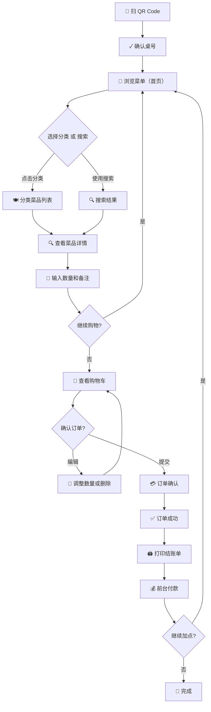
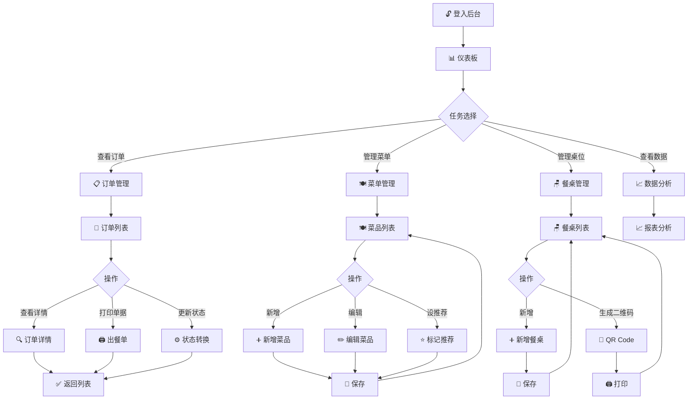

# 01-4 Easy Dine UI/UX 设计规格

> **版本**：v0.1  
> **最后更新**：2026-03-12  
> **文档状态**：易用性和视觉设计规范

---

## 目录

1. [设计理念与风格](#1-设计理念与风格)
2. [设计系统](#2-设计系统)
3. [顾客端页面清单](#3-顾客端页面清单)
4. [后台商户端页面清单](#4-后台商户端页面清单)
5. [用户流程图](#5-用户流程图)
6. [响应式设计规范](#6-响应式设计规范)
7. [组件规范](#7-组件规范)
8. [交互与微动画](#8-交互与微动画)
9. [无障碍与可用性](#9-无障碍与可用性)
10. [性能与优化](#10-性能与优化)
11. [关键页面 Wireframe](#11-关键页面-wireframe)
12. [Figma 设计建议](#12-figma-设计建议)

---

## 1. 设计理念与风格

### 1.1 品牌定位

**Easy Dine** 是面向小型餐厅的自助点餐系统，强调**便捷、亲切、温馨**的用户体验。系统应该让顾客感到：

- 🍽️ **亲切感**：像在熟悉的餐厅里一样舒适
- ⏱️ **高效**：快速完成点餐，无需等待
- 🎨 **温馨**：暖色调营造的融洽氛围

### 1.2 设计风格

**核心特征**：现代简洁 + 暖色调 + 卡片式设计

- **配色风格**：橙色、米色、棕色系组合
- **字体风格**：清晰易读，中英文搭配
- **视觉风格**：圆角卡片、柔和阴影、大量留白
- **情感表达**：友好、可信、无压力

### 1.3 应用场景

| 场景 | 用户 | 设备 | 使用时长 |
|------|------|------|--------|
| 餐厅内自助点餐 | 顾客 | 手机（Mobile Web）| 5-15 分钟 |
| 后台订单管理 | 店员 / 管理员 | 电脑 / 平板 | 全天候 |

---

## 2. 设计系统

### 2.1 色彩体系

#### 品牌色

| 名称 | 色值 | RGB | 用途 |
|------|------|-----|------|
| 主色（温暖橙） | #FF9933 | 255, 153, 51 | CTA 按钮、重点信息、强调元素 |
| 辅助色（米色） | #F5DEB3 | 245, 222, 179 | 背景、卡片背景、浅色区块 |
| 强调色（棕色） | #8B6F47 | 139, 111, 71 | 标题文字、分隔线、次级强调 |

#### 中性色

| 名称 | 色值 | RGB | 用途 |
|------|------|-----|------|
| 深灰 | #333333 | 51, 51, 51 | 主文字、标题 |
| 中灰 | #666666 | 102, 102, 102 | 次级文字、描述 |
| 浅灰 | #999999 | 153, 153, 153 | 占位符、辅助文字 |
| 极浅灰 | #F0F0F0 | 240, 240, 240 | 背景、分隔线 |
| 白色 | #FFFFFF | 255, 255, 255 | 卡片背景、主背景 |

#### 状态色

| 状态 | 色值 | 用途 |
|------|------|------|
| 成功 | #4CAF50 | ✓ 订单成功、确认状态 |
| 警告 | #FFC107 | ⚠ 售完提示、待处理 |
| 危险 | #F44336 | ✕ 取消订单、删除操作 |
| 信息 | #2196F3 | ℹ 提示消息、输入框焦点 |

#### 色彩组合示例

```
主色 #FF9933 + 辅助色 #F5DEB3 + 强调色 #8B6F47
┌─────────────────────────────────────┐
│  🔶 主色（CTA）  ☐ 辅助色（背景）  │
│  🟤 强调色（文字）  ⚪ 中性色（文字） │
└─────────────────────────────────────┘
```

### 2.2 排版规范

#### 字体选择

**中文**：推荐使用系统字体（iOS：SF Pro Display / Android：Roboto）或品质网络字体
- 首选：`-apple-system, BlinkMacSystemFont, 'Segoe UI', Roboto, 'Helvetica Neue', Arial, sans-serif`
- 备选：思源黑体（Source Han Sans）、微软雅黑

**英文**：Roboto, 'Helvetica Neue', Arial

#### 字体大小与权重

| 类型 | 大小 | 行高 | 权重 | 用途 |
|------|------|------|------|------|
| H1（页面标题） | 28px | 1.2 | 600/700 | 页面顶部大标题 |
| H2（分区标题） | 24px | 1.2 | 600 | 页面分区标题 |
| H3（小标题） | 20px | 1.4 | 600 | 卡片标题、菜品名 |
| 正文（大） | 16px | 1.5 | 400 | 菜品描述、订单明细 |
| 正文（常规） | 14px | 1.5 | 400 | 标签、按钮文字 |
| 辅助文字 | 12px | 1.4 | 400 | 价格、日期、说明 |
| 注释文字 | 11px | 1.4 | 400 | 说明提示、细节信息 |

#### 排版示例

```
H1: 28px / 600 / #333333
"Easy Dine 点餐菜单"

H3: 20px / 600 / #333333  
"红烧肉"

正文: 14px / 400 / #666666
"精选猪五花，红烧入味，肥瘦相间"

辅助: 12px / 400 / #999999
"¥29.00"
```

### 2.3 间距系统

采用 **8px 基础单位** 的模块化间距规范：

| 间距 | 像素值 | 用途 |
|------|-------|------|
| xs | 4px | 紧凑信息间隔 |
| sm | 8px | 组件内部间隔 |
| md | 16px | 卡片内部、元素间距 |
| lg | 24px | 分区间距 |
| xl | 32px | 页面主要分区 |
| xxl | 48px | 页面顶部留白 |

**应用示例**：
- 卡片内部 padding：16px（md）
- 按钮文字与边框 padding：8px 16px（sm + md）
- 菜品卡片底部 margin：16px（md）
- 分区顶部 margin：32px（xl）

### 2.4 圆角规范

| 场景 | 圆角大小 | 用途 |
|------|--------|------|
| 小圆角 | 4px | 按钮、小组件 |
| 中圆角 | 8px | 卡片、输入框 |
| 大圆角 | 12px | 模态框、大卡片 |
| 超大圆角 | 24px | 按钮（大）、品牌元素 |

### 2.5 阴影规范

采用 **层级阴影** 体现深度：

| 层级 | CSS 值 | 用途 |
|------|--------|------|
| 无阴影 | 无 | 背景、文字元素 |
| 浅阴影 | `0 2px 4px rgba(0,0,0,0.08)` | 标签、输入框 |
| 中阴影 | `0 4px 12px rgba(0,0,0,0.12)` | 卡片、浮层 |
| 深阴影 | `0 8px 24px rgba(0,0,0,0.15)` | 模态框、重要浮层 |

---

## 3. 顾客端页面清单

### 页面概览

顾客端为 **Mobile Web 优先**设计，支持响应式显示在手机、平板、电脑等所有设备。

| 页面 | 功能描述 | 优先级 | 关键元素 |
|------|--------|------|--------|
| **1. 扫码入口页面** | 显示餐桌号、确认入座 | P0 | QR Code、桌号显示、开始点餐按钮 |
| **2. 菜单首页** | 推荐菜品、分类导航 | P0 | 推荐区、分类标签导航、搜索框 |
| **3. 菜单浏览页面** | 分类菜品列表 | P0 | 菜品卡片、分类切换、搜索、加入购物车 |
| **4. 菜品详情页面** | 菜品详细信息 | P0 | 菜品大图、详情、价格、数量选择、备注、加购 |
| **5. 购物车页面** | 查看购物车、调整数量 | P0 | 购物车列表、删除项目、数量调整、小计、总价 |
| **6. 订单确认页面** | 确认订单信息、选择支付方式 | P0 | 品项汇总、总金额、提交订单按钮 |
| **7. 订单完成页面** | 显示订单编号、提示打印结帐单 | P0 | 订单号、成功提示、打印按钮、返回菜单 |
| **8. 订单追踪页面** | 实时订单状态（可选） | P1 | 订单号、状态时间线、预计出餐时间 |
| **9. 订单历史页面** | 查看历史订单（可选） | P2 | 订单列表、订单详情、重新下单 |
| **10. 个人信息页面** | 用户资料、设置（预留） | P2 | 用户名、手机、会员等级、设置入口 |

### 3.1 扫码入口页面（QR Code）

**路由**：`/table/:tableId`  
**目标**：显示桌号、确认顾客已正确入座

**页面结构**：
```
┌─────────────────────────────────────┐
│  🏪 Easy Dine                  [设置] │ ← 顶部栏
├─────────────────────────────────────┤
│                                       │
│          餐桌 A1                     │ ← 大标题 H1 / #333333
│                                       │
│   [确认入座]  [重新扫码]             │ ← 按钮
│                                       │
│  ℹ️ 确认您已在 A1 号桌                │ ← 辅助文字
│                                       │
├─────────────────────────────────────┤
│  [开始点餐]                         │ ← 主 CTA 按钮 #FF9933
└─────────────────────────────────────┘
```

**关键元素**：
- 💯 大号桌号显示（28px，#8B6F47）
- ✓ 确认按钮（绿色 #4CAF50）
- 🎯 主 CTA "开始点餐"（橙色 #FF9933）

---

### 3.2 菜单首页

**路由**：`/menu/:tableId`  
**目标**：展示推荐菜品、分类导航、搜索

**页面结构**：
```
┌─────────────────────────────────────┐
│  🏪 Easy Dine              [🛒 购物车] │ ← 顶部栏
├─────────────────────────────────────┤
│  🔍 [搜索菜品... ]                   │ ← 搜索框
├─────────────────────────────────────┤
│  🎯 推荐菜品                         │ ← H2 标题
│  ┌─────────────────────────────────┐│
│  │ [菜品卡]  [菜品卡]  [菜品卡]      ││ ← 横向滚动
│  └─────────────────────────────────┘│
├─────────────────────────────────────┤
│  📂 分类                             │ ← H2 标题
│  [主食] [小菜] [饮料] [甜点]        │ ← 分类标签
├─────────────────────────────────────┤
│  菜品卡片列表...                     │
├─────────────────────────────────────┤
│                [我的购物车] ¥0        │ ← 浮动底部栏
└─────────────────────────────────────┘
```

**关键元素**：
- 🔍 搜索框（浮顶，支持实时过滤）
- ⭐ 推荐区（横向滚动卡片）
- 🏷️ 分类标签（可切换高亮）
- 🛒 底部购物车浮动栏（显示数量和总价）

---

### 3.3 菜单浏览页面（分类菜品列表）

**路由**：`/menu/:tableId/category/:categoryId`  
**目标**：按分类展示菜品，支持搜索过滤

**页面结构**：
```
┌─────────────────────────────────────┐
│  🏪 Easy Dine              [🛒 购物车] │
├─────────────────────────────────────┤
│  🔍 [搜索菜品... ]                   │
├─────────────────────────────────────┤
│  📂 分类                             │
│  [主食] [小菜] [饮料*] [甜点]        │ ← * 表示当前选中
├─────────────────────────────────────┤
│  ┌─────────────────────────────────┐│
│  │ 🍹 冰咖啡              ¥25.00    ││
│  │ 现磨咖啡豆，冰爽口感            ││
│  │         [+ 加入购物车]          ││
│  └─────────────────────────────────┘│
│  ┌─────────────────────────────────┐│
│  │ 🧋 珍珠奶茶            ¥18.00    ││
│  │ 现冲奶茶，Q 弹珍珠              ││
│  │         [+ 加入购物车]          ││
│  └─────────────────────────────────┘│
│  ┌─────────────────────────────────┐│
│  │ 🍊 橙汁                 已售完    ││ ← 售完显示灰色
│  │ 新鲜榨取                        ││
│  │                                  ││
│  └─────────────────────────────────┘│
├─────────────────────────────────────┤
│                [我的购物车] ¥43        │
└─────────────────────────────────────┘
```

**关键元素**：
- 📷 菜品卡片（含图片、名称、描述、价格）
- ✕ 售完标识（显示为灰色，不可点击）
- ➕ "加入购物车"按钮（橙色，响应式）
- 🔢 购物车浮动栏（实时更新）

---

### 3.4 菜品详情页面

**路由**：`/menu/:tableId/detail/:menuItemId`  
**目标**：显示菜品详细信息、数量选择、备注、加入购物车

**页面结构**：
```
┌─────────────────────────────────────┐
│  🔙              菜品详情          [收藏] │ ← 顶部导航
├─────────────────────────────────────┤
│                                       │
│     [菜品大图]                       │ ← 可滑动查看
│     🔴 图 1 / 3                      │
│                                       │
├─────────────────────────────────────┤
│  红烧肉                   ⭐ 4.8     │ ← 名称 + 评分
│  ¥29.00                              │
│                                       │
│  精选猪五花，红烧入味，肥瘦相间      │ ← 详细描述
│  配菜：青菜、冬菇                    │
│                                       │
├─────────────────────────────────────┤
│  📝 特殊要求：                       │ ← 备注区
│  [输入框: 不要香菜、少辣...]        │
│                                       │
├─────────────────────────────────────┤
│  数量：  [-] 1 [+]                  │ ← 数量选择（+/- 按钮）
│                                       │
├─────────────────────────────────────┤
│  小计：¥29.00                       │
│                                       │
│  [加入购物车]   [继续浏览菜单]       │ ← 主按钮
└─────────────────────────────────────┘
```

**关键元素**：
- 📸 菜品图片（可轮播，支持 zoom）
- ⭐ 评分显示
- 💬 自由文本备注框（e.g. "不要香菜、少辣"）
- 🔢 数量 +/- 选择器
- 💰 动态小计计算
- 🛒 主 CTA "加入购物车"（橙色）

---

### 3.5 购物车页面

**路由**：`/cart/:tableId`  
**目标**：查看购物车、调整数量、删除项目、提交订单

**页面结构**：
```
┌─────────────────────────────────────┐
│  🔙              购物车             │
├─────────────────────────────────────┤
│  当前桌：A1  ✓                      │
├─────────────────────────────────────┤
│  ┌─────────────────────────────────┐│
│  │ 🍖 红烧肉            ¥29.00      ││
│  │   数量：[-] 2 [+]               ││
│  │   小计：¥58.00                  ││
│  │   备注：不要香菜                ││
│  │   [✕ 删除]                      ││
│  └─────────────────────────────────┘│
│  ┌─────────────────────────────────┐│
│  │ 🍚 米饭               ¥5.00      ││
│  │   数量：[-] 1 [+]               ││
│  │   小计：¥5.00                   ││
│  │   [✕ 删除]                      ││
│  └─────────────────────────────────┘│
├─────────────────────────────────────┤
│  ───────────────────────            │
│  小计：¥63.00                       │
│  ───────────────────────            │
│  合计：¥63.00                       │
│                                       │
│  [清空购物车]   [提交订单]           │ ← CTA
└─────────────────────────────────────┘
```

**关键元素**：
- 🛍️ 购物车项目列表（可删除、调整数量）
- 💬 备注显示
- 🧮 动态小计与总价
- ✕ 删除按钮（红色 #F44336）
- 📤 "提交订单"主按钮（橙色 #FF9933）
- 🗑️ "清空购物车"按钮（灰色背景）

---

### 3.6 订单确认页面

**路由**：`/checkout/:tableId`  
**目标**：最后确认订单、确定支付方式、提交

**页面结构**：
```
┌─────────────────────────────────────┐
│  🔙              订单确认            │
├─────────────────────────────────────┤
│  桌号：A1                           │
│  当前时间：14:32                     │
├─────────────────────────────────────┤
│  📋 订单明细                         │
│  ┌─────────────────────────────────┐│
│  │ 红烧肉 × 2           ¥58.00    ││
│  │ 米饭 × 1             ¥5.00    ││
│  └─────────────────────────────────┘│
├─────────────────────────────────────┤
│  支付方式：                         │
│  ⚪ 现金                             │
│  ⚪ 信用卡                           │
│  ⚪ 其他（预留）                    │
├─────────────────────────────────────┤
│  ───────────────────────            │
│  订单总额：¥63.00                  │
│  ───────────────────────            │
│                                       │
│  [返回修改]   [确认提交]             │ ← 主 CTA
└─────────────────────────────────────┘
```

**关键元素**：
- 🗂️ 订单明细汇总
- 💳 支付方式选择（单选按钮）
- 💰 总金额突显
- ✅ "确认提交"按钮（绿色 #4CAF50）
- 🔙 "返回修改"按钮（返回购物车）

---

### 3.7 订单完成页面

**路由**：`/success/:orderId`  
**目标**：订单成功提示、订单号显示、打印结账单

**页面结构**：
```
┌─────────────────────────────────────┐
│           订单已成功提交             │
├─────────────────────────────────────┤
│                                       │
│      ✓ (大绿色勾选)                 │
│                                       │
│  订单编号：NO.2024031201234         │
│  请凭号码至前台付款                 │
│                                       │
├─────────────────────────────────────┤
│  📋 订单明细：                      │
│  红烧肉 × 2 ............... ¥58.00  │
│  米饭 × 1 ................ ¥5.00  │
│  ─────────────────────────          │
│  合计：¥63.00                       │
│                                       │
├─────────────────────────────────────┤
│  [打印结账单]   [继续点餐]           │
│                                       │
│  ⏱️ 预计出餐时间：12 分钟            │
│                                       │
└─────────────────────────────────────┘
```

**关键元素**：
- ✓ 成功提示（绿色 #4CAF50，大号图标）
- 📌 订单编号（突显，便于记录）
- 🧾 订单明细与总价
- 🖨️ "打印结账单"按钮（浏览器列印）
- 🔄 "继续点餐"按钮（返回菜单，允许加点）
- ⏱️ 预计出餐时间提示

---

### 3.8 订单追踪页面（可选 P1）

**路由**：`/tracking/:orderId`  
**目标**：实时显示订单状态、预计时间

**页面结构**：
```
┌─────────────────────────────────────┐
│  🔙          订单追踪              │
├─────────────────────────────────────┤
│  订单号：NO.2024031201234           │
│  状态：准备中 ⏳                     │
├─────────────────────────────────────┤
│  时间线：                           │
│  ✓ 已确认        14:32             │
│  ⚙️ 准备中        14:35 ~ 14:44     │
│  ⏳ 待出餐                          │
│  ⬜ 已完成                          │
├─────────────────────────────────────┤
│  📍 预计出餐时间：14:45             │
│  还需等待：约 11 分钟               │
│                                       │
│  [刷新]                             │
└─────────────────────────────────────┘
```

**关键元素**：
- 📍 订单号与当前状态
- 📈 时间线展示（订单流转各阶段）
- ⏱️ 预计出餐时间
- 🔄 刷新按钮（支持定时自动刷新）

---

### 3.9 订单历史页面（可选 P2）

**路由**：`/history/:tableId`  
**目标**：查看历史订单、重新下单

**页面结构**：
```
┌─────────────────────────────────────┐
│  🔙          历史订单               │
├─────────────────────────────────────┤
│  ┌─────────────────────────────────┐│
│  │ NO.2024031201234                 ││
│  │ 2024-03-12 14:32  ✓ 已完成      ││
│  │ 红烧肉 × 2，米饭 × 1             ││
│  │ 合计：¥63.00                     ││
│  │ [查看详情]  [重新下单]           ││
│  └─────────────────────────────────┘│
│  ┌─────────────────────────────────┐│
│  │ NO.2024031200999                 ││
│  │ 2024-03-12 12:15  ✓ 已完成      ││
│  │ ...                              ││
│  └─────────────────────────────────┘│
└─────────────────────────────────────┘
```

**关键元素**：
- 📜 订单列表（时间倒序）
- ✓ 订单状态标签
- 📝 订单摘要（品项名称、数量、金额）
- 🔄 "重新下单"按钮（快速再次购买相同品项）

---

### 3.10 个人信息页面（可选 P2）

**路由**：`/profile/:tableId`  
**目标**：显示用户资料、设置

**页面结构**：
```
┌─────────────────────────────────────┐
│  🔙              我的信息            │
├─────────────────────────────────────┤
│  👤 用户资料                        │
│  用户名：顾客（匿名）                │
│  手机：未绑定                       │
│  会员等级：普通会员                 │
├─────────────────────────────────────┤
│  ⚙️ 设置                            │
│  🔔 推送通知设置                    │
│  🌙 深色模式                        │
│  🗣️ 语言设置                        │
│  ❓ 帮助与反馈                      │
├─────────────────────────────────────┤
│  [关于 Easy Dine]                   │
│  版本：v1.0.0                       │
└─────────────────────────────────────┘
```

---

## 4. 后台商户端页面清单

### 页面概览

后台为 **Web 应用**，主要服务店员与管理员，支持电脑、平板等大屏设备。采用 **左侧导航 + 右侧内容** 的经典后台布局。

| 页面 | 功能描述 | 优先级 | 关键元素 |
|------|--------|------|--------|
| **1. 登入页面** | 商户登入认证 | P0 | 用户名、密码、登入按钮、忘记密码 |
| **2. 仪表板首页** | 统计概览、关键指标 | P0 | 今日订单数、营收、排队时间、快捷操作 |
| **3. 订单管理页面** | 查看、处理订单、打印 | P0 | 订单列表、状态筛选、搜索、详情、打印 |
| **4. 菜单管理页面** | CRUD 菜品、上下架 | P0 | 菜品列表、新增、编辑、删除、上下架、推荐 |
| **5. 分类管理页面** | 管理菜品分类 | P0 | 分类列表、新增、编辑、删除、排序 |
| **6. 餐桌管理页面** | 管理餐桌、QR Code | P0 | 餐桌列表、新增、编辑、删除、QR Code 生成 |
| **7. 数据分析页面** | 统计报表、图表 | P1 | 订单趋势图、热销菜品、收入统计 |
| **8. 用户管理页面** | 管理店员、管理员 | P1 | 用户列表、角色权限、新增、编辑、删除 |
| **9. 系统设置页面** | 系统配置 | P1 | 餐厅信息、营业时间、通知设置、支付配置 |

### 4.1 登入页面

**路由**：`/admin/login`  
**目标**：商户认证、访问后台

**页面结构**：
```
┌─────────────────────────────────────┐
│                                       │
│     Easy Dine 商户后台               │
│     ─────────────────────            │
│                                       │
│  用户名：[____________]              │
│                                       │
│  密码：[____________]                │
│                                       │
│  ☐ 记住我            [忘记密码?]     │
│                                       │
│     [登入]                           │
│                                       │
│  © 2024 Easy Dine. All rights.       │
│                                       │
└─────────────────────────────────────┘
```

**关键元素**：
- 📧 用户名输入框
- 🔐 密码输入框（隐藏文字）
- 🔗 "忘记密码"链接
- ✓ "记住我"选项框
- 🔓 "登入"主按钮（橙色 #FF9933）

---

### 4.2 仪表板首页

**路由**：`/admin/dashboard`  
**目标**：统计概览、关键指标、快捷操作

**页面结构**：
```
┌────────────────────────────────────────────────┐
│  🔒 【后台】     🔍 [搜索]     👤 用户 [▼]     │ ← 顶栏
├─────────────┬──────────────────────────────────┤
│  📊 仪表板   │                                  │
│  📋 订单管理 │   欢迎回来，张老板！            │
│  🍽️ 菜单管理 │   今日统计：                    │
│  📂 分类管理 │   ┌──────┬──────┬──────┬──────┐│
│  🪑 餐桌管理 │   │订单数 │营收  │平均等│高峰 ││
│  📈 数据分析 │   │  24  │¥2340│待时 │14:30││
│  👥 用户管理 │   │      │     │8min │    ││
│  ⚙️ 系统设置 │   └──────┴──────┴──────┴──────┘│
│  🚪 [退出]   │   快捷操作：                    │
│             │   [查看待确认订单] [处理新订单]  │
│             │                                  │
│             │   最近订单：                    │
│             │   NO.2024031224 [待出餐]       │
│             │   NO.2024031223 [已出餐]       │
│             │   ...                          │
└─────────────┴──────────────────────────────────┘
```

**关键元素**：
- 📊 关键数据卡片（4 个大数字）：订单数、营收、平均等待、高峰时段
- 🎯 快捷操作按钮（直达高频页面）
- 📜 最近订单列表（实时更新）
- 📈 可选的趋势小图表

---

### 4.3 订单管理页面

**路由**：`/admin/orders`  
**目标**：查看所有订单、筛选、搜索、处理、打印

**页面结构**：
```
┌────────────────────────────────────────────────┐
│  🔒【后台】  🔍 [搜索]       👤 用户 [▼]      │
├─────────────┬──────────────────────────────────┤
│  📊 仪表板   │  订单管理                        │
│  📋 订单管理*│  ┌────────────────────────────┐ │
│  🍽️ 菜单管理 │  │ 搜索：[订单号/桌号 ___] 🔍  │ │
│  📂 分类管理 │  │ 状态：[全部 ▼]  日期：[__▼]  │ │
│  🪑 餐桌管理 │  └────────────────────────────┘ │
│  📈 数据分析 │                                  │
│  👥 用户管理 │  ┌──────────────────────────────┐│
│  ⚙️ 系统设置 │  │NO.2024031224│A1│红烧肉×2...││
│  🚪 [退出]   │  │14:32│待确认 │[✓] [✕] [⋯] ││
│             │  ├──────────────────────────────┤│
│             │  │NO.2024031223│A2│...         ││
│             │  │14:15│准备中 │[✓] [✕] [⋯] ││
│             │  ├──────────────────────────────┤│
│             │  │NO.2024031222│A1│...         ││
│             │  │13:56│已出餐 │[✓] [✕] [⋯] ││
│             │  └──────────────────────────────┘│
│             │  显示 1-20 / 124  [< 1 2 3 >]   │
└─────────────┴──────────────────────────────────┘
```

**关键元素**：
- 🔍 搜索框（支持订单号、桌号、顾客信息）
- 🏷️ 状态筛选（全部、待确认、准备中、已出餐、已完成、已取消）
- 📅 日期范围筛选
- 📝 订单列表（含订单号、桌号、品项预览、时间、状态）
- 💾 行操作按钮：✓（确认）、✕（取消）、⋯（详情/打印）
- 📄 分页控件

---

### 4.4 订单详情/处理弹窗

点击订单行的"⋯"按钮弹出详情窗口：

**页面结构**：
```
┌─────────────────────────────────────┐
│  订单详情 - NO.2024031224           │
├─────────────────────────────────────┤
│  桌号：A1  |  下单时间：14:32       │
│  当前状态：待确认  ← [状态下拉]    │
├─────────────────────────────────────┤
│  品项明细：                         │
│  ┌─────────────────────────────────┐│
│  │ 红烧肉 × 2                ¥58   ││
│  │ 备注：不要香菜                   ││
│  ├─────────────────────────────────┤│
│  │ 米饭 × 1                  ¥5    ││
│  └─────────────────────────────────┘│
├─────────────────────────────────────┤
│  ────────────────────               │
│  合计：¥63.00                       │
├─────────────────────────────────────┤
│  [打印出餐单]  [更新状态]  [取消订单]│
│  [关闭]                             │
└─────────────────────────────────────┘
```

**关键元素**：
- 📋 订单基本信息（号、桌、时间）
- 🎛️ 状态下拉菜单（待确认 → 准备中 → 已出餐 → 已完成）
- 📝 品项明细（含备注）
- 💰 总金额
- 🖨️ "打印出餐单"按钮
- ⚙️ "更新状态"按钮
- ✕ "取消订单"按钮（红色）

---

### 4.5 菜单管理页面

**路由**：`/admin/menu-items`  
**目标**：菜品 CRUD、上下架、推荐设置

**页面结构**：
```
┌────────────────────────────────────────────────┐
│  🔒【后台】  🔍 [搜索]       👤 用户 [▼]      │
├─────────────┬──────────────────────────────────┤
│  📊 仪表板   │  菜单管理                        │
│  📋 订单管理 │  ┌────────────────────────────┐ │
│  🍽️ 菜单管理*│  │分类：[全部 ▼] [新增菜品]   │ │
│  📂 分类管理 │  │搜索：[菜品名 ____] 🔍      │ │
│  🪑 餐桌管理 │  └────────────────────────────┘ │
│  📈 数据分析 │                                  │
│  👥 用户管理 │  ┌──────────────────────────────┐│
│  ⚙️ 系统设置 │  │名称│分类│价格│状态│推荐│操作││
│  🚪 [退出]   │  ├──────────────────────────────┤│
│             │  │红烧肉│主食│¥29│上架│⭐│[编][删]││
│             │  ├──────────────────────────────┤│
│             │  │米饭│小菜│¥5│上架│  │[编][删]││
│             │  ├──────────────────────────────┤│
│             │  │珍珠奶茶│饮料│¥18│下架│⭐│[编][删]││
│             │  └──────────────────────────────┘│
│             │  显示 1-20 / 45  [< 1 2 >]     │
└─────────────┴──────────────────────────────────┘
```

**关键元素**：
- 📂 分类筛选下拉
- 🔍 菜品搜索框
- ➕ "新增菜品"按钮（橙色）
- 📊 菜品列表：名称、分类、价格、状态（上架/下架）、推荐标记、操作
- ✏️ "编辑"按钮
- 🗑️ "删除"按钮
- ⭐ 推荐标记（点击切换）

---

### 4.6 新增/编辑菜品弹窗

**页面结构**：
```
┌─────────────────────────────────────┐
│  新增菜品                      [✕]   │
├─────────────────────────────────────┤
│  菜品名称：[红烧肉________]         │
│  分类：[主食 ▼]                     │
│  价格：¥[29.00_____]                │
│  描述：[精选猪五花，红烧入味...]    │
│  图片：[上传图片] 📷 (或 URL)       │
│  状态：⚫ 上架  ⚪ 下架             │
│  推荐：☑ 设为推荐菜品               │
├─────────────────────────────────────┤
│  [取消]  [保存]                     │
└─────────────────────────────────────┘
```

**关键元素**：
- 📝 文本输入：菜品名称、描述
- 💰 数值输入：价格
- 📂 分类下拉选择
- 📷 图片上传
- 🔘 状态单选：上架 / 下架
- ☑️ 推荐复选框
- ✅ "保存"按钮（绿色）

---

### 4.7 分类管理页面

**路由**：`/admin/categories`  
**目标**：管理菜品分类

**页面结构**：
```
┌────────────────────────────────────────────────┐
│  🔒【后台】  🔍 [搜索]       👤 用户 [▼]      │
├─────────────┬──────────────────────────────────┤
│  📊 仪表板   │  分类管理                        │
│  📋 订单管理 │                                  │
│  🍽️ 菜单管理 │  [新增分类]                     │
│  📂 分类管理*│                                  │
│  🪑 餐桌管理 │  分类列表：                     │
│  📈 数据分析 │  ┌──────────────────────────┐   │
│  👥 用户管理 │  │名称      │排序│    操作   │   │
│  ⚙️ 系统设置 │  ├──────────────────────────┤   │
│  🚪 [退出]   │  │主食      │1 │ [编辑][删除] │  │
│             │  │小菜      │2 │ [编辑][删除] │  │
│             │  │饮料      │3 │ [编辑][删除] │  │
│             │  │甜点      │4 │ [编辑][删除] │  │
│             │  │汤类      │5 │ [编辑][删除] │  │
│             │  └──────────────────────────┘   │
└─────────────┴──────────────────────────────────┘
```

**关键元素**：
- ➕ "新增分类"按钮
- 📊 分类表：名称、排序、操作
- 🔢 拖拽排序（或排序数值）
- ✏️ 编辑按钮
- 🗑️ 删除按钮

---

### 4.8 餐桌管理页面

**路由**：`/admin/tables`  
**目标**：管理餐桌、QR Code、桌位状态

**页面结构**：
```
┌────────────────────────────────────────────────┐
│  🔒【后台】  🔍 [搜索]       👤 用户 [▼]      │
├─────────────┬──────────────────────────────────┤
│  📊 仪表板   │  餐桌管理                        │
│  📋 订单管理 │                                  │
│  🍽️ 菜单管理 │  [新增餐桌]                     │
│  📂 分类管理 │                                  │
│  🪑 餐桌管理*│  餐桌列表：                     │
│  📈 数据分析 │  ┌──────────────────────────────┐│
│  👥 用户管理 │  │桌号│状态  │入座时间│用餐时长│操作││
│  ⚙️ 系统设置 │  ├──────────────────────────────┤│
│  🚪 [退出]   │  │A1 │用餐中│14:15 │32min │[⋯]││
│             │  │A2 │空桌 │─   │─   │[⋯]││
│             │  │A3 │用餐中│14:32 │15min │[⋯]││
│             │  │B1 │待清理│13:00 │已结束│[⋯]││
│             │  │B2 │空桌 │─   │─   │[⋯]││
│             │  └──────────────────────────────┘│
└─────────────┴──────────────────────────────────┘
```

**关键元素**：
- ➕ "新增餐桌"按钮
- 📊 餐桌表：桌号、状态（空桌/用餐中/待清理）、入座时间、用餐时长
- ⏱️ 实时用餐时长计算
- ⋯ 操作菜单（编辑、查看二维码、重置状态）

---

### 4.9 餐桌详情/操作弹窗

**页面结构**：
```
┌─────────────────────────────────────┐
│  餐桌 A1                        [✕]   │
├─────────────────────────────────────┤
│  餐桌号：A1                         │
│  当前状态：用餐中                   │
│  入座时间：2024-03-12 14:15       │
│  当前用餐时长：32 分钟             │
├─────────────────────────────────────┤
│  QR Code：                          │
│  ┌─────────────────┐               │
│  │   [QR Code]     │               │
│  └─────────────────┘               │
│  [下载]  [打印]  [复制链接]         │
├─────────────────────────────────────┤
│  [编辑]  [重置为空桌]  [标记待清理]  │
│  [关闭]                             │
└─────────────────────────────────────┘
```

**关键元素**：
- 🪑 餐桌基本信息
- 🕐 用餐时长实时显示
- 📱 QR Code 图片
- 🔗 下载、打印、复制链接
- ⚙️ 状态转换操作按钮

---

### 4.10 数据分析页面（可选 P1）

**路由**：`/admin/analytics`  
**目标**：业务数据统计、图表展示

**页面结构**：
```
┌────────────────────────────────────────────────┐
│  🔒【后台】  🔍 [搜索]       👤 用户 [▼]      │
├─────────────┬──────────────────────────────────┤
│  📊 仪表板   │  数据分析                        │
│  📋 订单管理 │  日期范围：[开始日期] - [结束日期] │
│  🍽️ 菜单管理 │                                  │
│  📂 分类管理 │  📈 订单趋势（折线图）           │
│  🪑 餐桌管理 │  ┌────────────────────────────┐ │
│  📈 数据分析*│  │订单数  营收    ┃              │ │
│  👥 用户管理 │  │20│     ┃ ┏━┓            │ │
│  ⚙️ 系统设置 │  │  │ ┏━┓ ┃ ┃ ┗━           │ │
│  🚪 [退出]   │  │  │ ┃ ┗━┛ ┃             │ │
│             │  └────────────────────────────┘ │
│             │  🍽️ 热销菜品 TOP 10              │
│             │  1. 红烧肉   ████████ 234       │
│             │  2. 米饭     ██████ 156         │
│             │  3. 珍珠奶茶  ████ 89           │
│             │  💰 收入统计                     │
│             │  总收入：¥12345  日均：¥1234    │
└─────────────┴──────────────────────────────────┘
```

**关键元素**：
- 📅 日期范围筛选
- 📈 订单趋势图（折线图 / 柱状图）
- 🏆 热销菜品 TOP 10（条形图）
- 💰 收入统计（总收入、日均、增长率）

---

### 4.11 用户管理页面（可选 P1）

**路由**：`/admin/users`  
**目标**：管理店员、管理员

**页面结构**：
```
┌────────────────────────────────────────────────┐
│  🔒【后台】  🔍 [搜索]       👤 用户 [▼]      │
├─────────────┬──────────────────────────────────┤
│  📊 仪表板   │  用户管理                        │
│  📋 订单管理 │  [新增用户]                     │
│  🍽️ 菜单管理 │                                  │
│  📂 分类管理 │  用户列表：                     │
│  🪑 餐桌管理 │  ┌──────────────────────────────┐│
│  📈 数据分析 │  │用户名│角色  │创建时间│操作  ││
│  👥 用户管理*│  ├──────────────────────────────┤│
│  ⚙️ 系统设置 │  │张老板│管理员│2024-01│[编][删]││
│  🚪 [退出]   │  │李店员│店员 │2024-02│[编][删]││
│             │  │王店员│店员 │2024-03│[编][删]││
│             │  └──────────────────────────────┘│
└─────────────┴──────────────────────────────────┘
```

---

### 4.12 系统设置页面（可选 P1）

**路由**：`/admin/settings`  
**目标**：系统配置

**页面结构**：
```
┌────────────────────────────────────────────────┐
│  🔒【后台】  🔍 [搜索]       👤 用户 [▼]      │
├─────────────┬──────────────────────────────────┤
│  📊 仪表板   │  系统设置                        │
│  📋 订单管理 │                                  │
│  🍽️ 菜单管理 │  🏪 餐厅信息                    │
│  📂 分类管理 │  餐厅名称：[Easy Dine________] │
│  🪑 餐桌管理 │  地址：[________________]       │
│  📈 数据分析 │                                  │
│  👥 用户管理 │  🕐 营业时间                    │
│  ⚙️ 系统设置*│  开门时间：[10:30 ▼]           │
│  🚪 [退出]   │  关门时间：[22:00 ▼]           │
│             │                                  │
│             │  💳 支付配置                    │
│             │  支付方式：☑ 现金 ☑ 信用卡     │
│             │                                  │
│             │  🔔 通知设置                    │
│             │  ☑ 新订单通知 ☑ 订单完成提醒  │
│             │                                  │
│             │  [保存设置]                     │
└─────────────┴──────────────────────────────────┘
```

---

## 5. 用户流程图

### 5.1 顾客端用户流程（User Journey）



### 5.2 店员/管理员用户流程



---

## 6. 响应式设计规范

### 6.1 断点定义

Easy Dine 采用 **Mobile First** 响应式设计策略，支持 3 个主要断点：

| 设备类型 | 屏幕宽度 | 代表设备 | 布局 |
|--------|--------|--------|------|
| **手机** | 320px - 667px | iPhone SE ~ iPhone 14 Plus | 单列、底部导航 |
| **平板** | 668px - 1024px | iPad 竖屏、大屏手机 | 双列、左侧导航 |
| **桌面** | 1025px+ | iPad Pro 横屏、电脑 | 三列/多列、左侧导航 |

### 6.2 顾客端响应式布局

#### 手机（320px - 667px）

**特点**：单列布局、全宽卡片、底部操作按钮

```
┌───────────────┐
│ 🏪 Easy Dine  │ ← 顶栏（固定）
├───────────────┤
│ 🔍 [搜索]     │ ← 搜索栏
├───────────────┤
│ 🎯 推荐菜品   │
│ ┌───────────┐│
│ │ [卡片]    ││
│ │ [卡片]    ││
│ └───────────┘│
├───────────────┤
│ 📂 分类       │
│ [主食][小菜]  │
│ [饮料][甜点]  │
├───────────────┤
│ 菜品卡片...   │
│ ┌───────────┐│
│ │ 菜品名称  ││
│ │ ¥29.00   ││
│ │[➕ 加入]  ││
│ └───────────┘│
├───────────────┤
│  [购物车] ¥43 │ ← 底部浮动栏（固定）
└───────────────┘
```

#### 平板竖屏（668px - 1024px）

**特点**：双列卡片布局，左侧导航辅助

```
┌─────────────────────────────────┐
│ 🏪 Easy Dine    🔍 [搜索] [🛒]  │
├─────────────────────────────────┤
│ 🎯 推荐菜品                      │
│ ┌────────────┬────────────┐     │
│ │  [卡片]    │  [卡片]    │     │
│ └────────────┴────────────┘     │
├─────────────────────────────────┤
│ [主食] [小菜] [饮料] [甜点]     │
├─────────────────────────────────┤
│ ┌────────────┬────────────┐     │
│ │ 菜品名称   │ 菜品名称   │     │
│ │ ¥29.00    │ ¥18.00    │     │
│ │[➕ 加入]   │[➕ 加入]   │     │
│ └────────────┴────────────┘     │
│ ┌────────────┬────────────┐     │
│ │ ...        │ ...        │     │
│ └────────────┴────────────┘     │
└─────────────────────────────────┘
```

#### 桌面（1025px+）

**特点**：三列或多列布局，大屏充分利用

```
┌───────────────────────────────────────────────┐
│ 🏪 Easy Dine   🔍 [搜索菜品...] [🛒 购物车] │
├───────────────────────────────────────────────┤
│ 分类导航：[主食] [小菜] [饮料] [甜点] [汤类]│
├───────────────────────────────────────────────┤
│ ┌──────────┬──────────┬──────────┐           │
│ │ 菜品卡   │ 菜品卡   │ 菜品卡   │           │
│ │ ¥29.00  │ ¥18.00  │ ¥15.00  │           │
│ │[➕]      │[➕]      │[➕]      │           │
│ └──────────┴──────────┴──────────┘           │
│ ┌──────────┬──────────┬──────────┐           │
│ │ ...      │ ...      │ ...      │           │
│ └──────────┴──────────┴──────────┘           │
└───────────────────────────────────────────────┘
```

### 6.3 后台响应式布局

#### 平板竖屏（668px - 1024px）

**特点**：左侧导航折叠/缩小，主区域占主要空间

```
┌──────────────────────────────────┐
│ ≡ 【后台】 🔍 [搜索] 👤 [▼]     │ ← 顶栏
├─────┬──────────────────────────┤
│ 📊  │ 仪表板                    │
│ 📋  │ ┌────────────────────┐   │
│ 🍽️  │ │ 关键数据卡片       │   │
│ 📂  │ │ ¥2340  24订单      │   │
│ 🪑  │ │                    │   │
│ 📈  │ └────────────────────┘   │
│ 👥  │                          │
│ ⚙️  │ 最近订单...             │
│ 🚪  │                          │
└─────┴──────────────────────────┘
```

#### 桌面（1025px+）

**特点**：完整左侧导航栏 + 全屏内容区域

```
┌──────────────────────────────────────────┐
│ 🔒 【后台】      🔍 [搜索] 👤 [▼]       │
├──────────┬───────────────────────────────┤
│ 📊 仪表板 │                               │
│ 📋 订单   │ 仪表板                        │
│ 🍽️ 菜单   │ ┌────────────────────────┐   │
│ 📂 分类   │ │ 关键数据    │ 关键数据 │   │
│ 🪑 餐桌   │ └────────────────────────┘   │
│ 📈 分析   │ 最近订单列表...              │
│ 👥 用户   │                               │
│ ⚙️ 设置   │                               │
│ 🚪 [退出] │                               │
└──────────┴───────────────────────────────┘
```

### 6.4 响应式设计原则

| 原则 | 说明 | 实现 |
|------|------|------|
| **流动性** | 内容自动适应容器宽度 | 使用 `max-width`、`flex`、`grid` |
| **灵活栅栏** | 不同屏幕采用不同列数 | 1 列 → 2 列 → 3 列 |
| **字体缩放** | 手机字体较小，桌面字体较大 | 基础 14px → 16px → 18px |
| **触摸友好** | 移动端按钮 >= 44×44px | 手机上按钮宽度 >= 44px |
| **性能优化** | 不同设备加载不同资源 | 懒加载、图片优化、响应式图片 |

---

## 7. 组件规范

### 7.1 按钮组件

#### 主按钮（Primary Button）

**用途**：主要 CTA（Call-to-Action），如 "开始点餐"、"提交订单"

**样式**：
```
状态          背景色        文字色      边框        阴影
正常          #FF9933      #FFFFFF    无         中阴影
悬停/按下     #E68A2D     #FFFFFF    无         深阴影
禁用          #CCCCCC     #999999    无         无
```

**尺寸**：
- 手机：宽度 100%，高度 48px，字体 16px，圆角 8px
- 桌面：宽度 120-200px，高度 44px，字体 14px，圆角 8px

**示例**：
```html
<button class="btn btn-primary">开始点餐</button>
<button class="btn btn-primary" disabled>已禁用</button>
```

#### 次按钮（Secondary Button）

**用途**：次要操作，如 "继续浏览"、"返回"

**样式**：
```
状态          背景色        文字色      边框              阴影
正常          #F0F0F0      #333333    1px #E0E0E0      浅阴影
悬停/按下     #E0E0E0     #333333    1px #D0D0D0      浅阴影
```

#### 危险按钮（Danger Button）

**用途**：删除、取消、清空等危险操作

**样式**：背景 #F44336（红色），文字 #FFFFFF

#### 文本按钮（Text Button）

**用途**：轻量级操作，如 "忘记密码"、"编辑"

**样式**：背景透明，文字 #FF9933（橙色）

### 7.2 输入框组件

**样式**：
```
属性              值
边框              1px #D0D0D0
圆角              8px
高度              44px（手机），40px（桌面）
字体              14px / #333333
占位符            #999999
焦点边框          2px #2196F3（信息蓝）
焦点背景          #F5F5F5
阴影              焦点时浅阴影
```

**示例**：
```html
<input type="text" placeholder="搜索菜品..." class="input">
<input type="password" placeholder="密码" class="input">
```

### 7.3 卡片组件

**用途**：菜品展示、订单项目、数据统计

**样式**：
```
属性              值
背景              #FFFFFF
边框              无
圆角              12px
内部间距          16px（md）
阴影              中阴影 0 4px 12px rgba(0,0,0,0.12)
转换效果          悬停时阴影加深 + 向上平移 2px
```

**示例**（菜品卡片）：
```
┌─────────────────────┐
│  [菜品图片]         │ ← 100% 宽度，高度 180px
├─────────────────────┤
│ 红烧肉              │ ← H3 / 20px / #333333
│ ¥29.00              │ ← 12px / #999999
│ 精选猪五花...       │ ← 14px / #666666 / 2 行省略
│                     │
│ [➕ 加入购物车]      │ ← 主按钮，100% 宽度
└─────────────────────┘
```

### 7.4 模态框 / 对话框组件

**特点**：半透明背景、中间悬浮、可关闭

**样式**：
```
属性              值
背景蒙层          rgba(0, 0, 0, 0.4)
模态宽度          手机 90%，桌面 480px 或 600px
圆角              12px
阴影              深阴影
内部间距          24px（xl）
关闭按钮位置      右上角
```

### 7.5 底部操作栏（Mobile 浮动栏）

**特点**：固定在屏幕底部，显示购物车摘要或主要 CTA

**样式**：
```
┌─────────────────────────┐
│ 购物车（3 件）  ¥63.00  │ ← 左侧信息
│                [提交订单]│ ← 右侧按钮
└─────────────────────────┘

背景：#FFFFFF，上边框 1px #E0E0E0
高度：60px（含安全边距）
内间距：8px 16px
阴影：向上深阴影
```

### 7.6 面包屑导航（Breadcrumb）

**用途**：后台页面导航

**示例**：
```
仪表板 > 订单管理 > NO.2024031224 详情
```

---

## 8. 交互与微动画

### 8.1 按钮反馈

**点击效果**：
- **涟漪效果**（Ripple）：点击按钮时，从点击位置向外扩散圆形涟漪
- **颜色反馈**：按钮背景变深或改变透明度
- **时长**：200ms - 300ms

**实现示例**：
```css
button {
  transition: background-color 0.2s, box-shadow 0.2s;
}

button:active {
  background-color: #E68A2D;
  box-shadow: 0 8px 24px rgba(0,0,0,0.15);
  transform: translateY(2px);
}
```

### 8.2 页面过渡

**进入动画**：
- **淡入**（Fade In）：页面加载时背景逐渐显示
- **向上滑入**（Slide Up）：内容从下向上滑入
- **时长**：300ms - 400ms

**退出动画**：
- **淡出**（Fade Out）：页面离开时背景逐渐隐藏
- **时长**：200ms

### 8.3 加载状态

**加载动画**：
```
⟳ loading... （旋转图标）
或
████░░░░░░ 50% （进度条）
```

**骨架屏**（Skeleton Screen）：
- 灰色占位符，显示内容结构
- 配合闪烁动画（pulse）
- 用于首屏加载、列表加载

**示例**：
```
┌───────────────────────┐
│ ████░░░░░░░░░░░░░░░░ │ ← 闪烁灰色
│                       │
│ ████░░░░░░░░░░░░░░░░ │
│ ████░░░░░░░░░░░░░░░░ │
└───────────────────────┘
```

### 8.4 错误与成功提示

**Toast 提示**（顶部消息条）：
```
✓ 商品已加入购物车
✕ 删除失败，请重试
! 库存不足
```

**位置**：屏幕顶部，距离顶部 16px  
**时长**：2 秒后自动消失（或手动关闭）  
**样式**：  
- 成功：绿色背景 #4CAF50，白色文字，左侧 ✓ 图标
- 错误：红色背景 #F44336，白色文字，左侧 ✕ 图标
- 警告：黄色背景 #FFC107，黑色文字，左侧 ! 图标

**弹窗确认**（模态框）：
```
┌─────────────────────────────┐
│ 确认删除？                   │
│ 确定要删除这条订单吗？       │
│ [取消]      [确认]          │
└─────────────────────────────┘
```

### 8.5 数量选择器动画

```
[-] 数量 [+]

点击 [-]：数字闪烁 → 减 1
点击 [+]：数字闪烁 → 加 1
转换时长：100ms
```

### 8.6 购物车动画

**添加到购物车**：
- 菜品卡片轻微震动（shake）
- 底部购物车栏数字变化（pulse）
- 购物车图标小幅上升动画

**删除商品**：
- 行向左滑出（slide out）
- 200ms 完成

---

## 9. 无障碍与可用性

### 9.1 色盲友好

**原则**：不仅用颜色区分信息，还要用符号、文字、图标等辅助表达

**示例**：
```
✓ 订单状态不仅用绿色表示，还加上 ✓ 符号
✕ 错误不仅用红色表示，还加上 ✕ 符号或 ! 图标
⚫ 待确认不仅用灰色表示，还用文字 "待确认"
```

### 9.2 字体大小与对比度

**最小字体**：12px（注释）  
**推荐正文**：14px - 16px  
**标题**：18px - 28px

**对比度**：
- 普通文字：背景 vs 文字对比度 >= 4.5:1（WCAG AA）
- 大文字（18px+）：对比度 >= 3:1

**示例**：
```
✓ 正确：#333333（深灰）文字 on #FFFFFF（白色）背景
✗ 错误：#999999（浅灰）文字 on #F0F0F0（更浅灰）背景
```

### 9.3 可点击区域

**最小尺寸**（移动端）：44×44px（苹果 HIG 建议）

**示例**：
```
按钮：48px 高度、100% 宽度（手机）
标签：最小 44px 高度
链接：最小 44px 点击范围
```

### 9.4 表单可用性

**标签与输入框**：
```
☐ 记住我          ← 复选框紧邻文字
[________________] ← 输入框焦点时有明显边框变化
```

**错误提示**：
```
用户名：[_______] ✕
错误：用户名至少 3 个字符

密码：[_______] ✕
错误：密码至少 6 个字符
```

### 9.5 键盘导航

**支持 Tab 键**在按钮、输入框、链接间导航  
**支持 Enter 键**提交表单、确认对话框  
**支持 Esc 键**关闭模态框、取消操作

---

## 10. 性能与优化

### 10.1 图片优化

**格式**：
- 支持 WebP（现代浏览器），备选 JPG/PNG
- 菜品图片：JPG（有损压缩）
- 图标：SVG（矢量）

**尺寸**：
- 菜品缩略图：200×150px
- 菜品大图：800×600px（或更大）
- 使用 srcset 提供多个分辨率版本

**加载**：
- 列表中图片使用 **lazy loading**（图片进入视口时加载）
- 首屏菜品全部加载，下方内容懒加载

### 10.2 首屏加载时间

**目标**：< 3 秒可交互（Interaction to Paint）

**优化策略**：
- 关键资源内联（CSS、小型 JS）
- 非关键资源异步加载
- 预加载关键字体
- 页面骨架屏提示加载中
- 菜单数据缓存（LocalStorage）

### 10.3 缓存策略

**菜单数据缓存**：
```
第一次加载 → 从服务器获取菜单 → 保存到 LocalStorage
后续加载 → 优先显示缓存 → 后台静默更新
```

**过期时间**：30 分钟 - 1 小时

**购物车本地存储**：
```
加入购物车 → 保存到 LocalStorage
页面刷新 → 购物车数据恢复
清空购物车 → 清除 LocalStorage 数据
```

### 10.4 离线支持（可选）

**使用 Service Worker**：
- 缓存首页、菜单列表
- 支持离线浏览已加载的菜品
- 网络恢复时自动同步

---

## 11. 关键页面 Wireframe

### 11.1 菜品详情页 Wireframe（详细）

```
手机竖屏 (320px):

┌───────────────────────────────┐
│ [◀]      菜品详情      [❤️]   │ ← 顶栏：返回 + 标题 + 收藏
├───────────────────────────────┤
│                               │
│        ┌─────────────┐        │
│        │   [图片]    │        │ ← 菜品大图，可滑动
│        │  1 / 3  ○●○ │        │ ← 分页指示
│        └─────────────┘        │
│                               │
├───────────────────────────────┤
│ 红烧肉                    ⭐4.8  │ ← 名称 + 评分
│ ¥29.00                        │ ← 价格
│                               │
│ 精选猪五花肉，红烧入味，      │ ← 详细描述（可滚动）
│ 肥瘦相间，配青菜、冬菇        │
│ 增加素食搭配，低脂健康。      │
│                               │
├───────────────────────────────┤
│ 📝 特殊要求：                │ ← 备注区
│ [输入备注：不要香菜、少辣...]│
│                               │
├───────────────────────────────┤
│ 数量：  [-] 1 [+]            │ ← 数量选择
│                               │
├───────────────────────────────┤
│ ─────────────────────         │
│ 小计：¥29.00                 │
│ ─────────────────────         │
│                               │
│ [继续浏览]  [加入购物车]      │ ← 操作按钮
└───────────────────────────────┘
```

### 11.2 购物车页面 Wireframe

```
┌───────────────────────────────┐
│ [◀]      购物车       [✕]     │ ← 返回 + 清空
├───────────────────────────────┤
│ 当前桌：A1  ✓                │
├───────────────────────────────┤
│ ┌─────────────────────────────┐│
│ │ 🍖 红烧肉                    ││
│ │ ¥29.00 × 2 = ¥58.00        ││
│ │ 数量：[-] 2 [+]            ││
│ │ 备注：不要香菜              ││
│ │              [✕ 删除]       ││
│ └─────────────────────────────┘│
│ ┌─────────────────────────────┐│
│ │ 🍚 米饭                      ││
│ │ ¥5.00 × 1 = ¥5.00          ││
│ │ 数量：[-] 1 [+]            ││
│ │              [✕ 删除]       ││
│ └─────────────────────────────┘│
│ ┌─────────────────────────────┐│
│ │ 🥢 筷子                      ││
│ │ ¥0.00 × 1 = ¥0.00（赠送）  ││
│ │              [✕ 删除]       ││
│ └─────────────────────────────┘│
├───────────────────────────────┤
│ ─────────────────────         │
│ 小计：¥63.00                 │
│ 配送：¥0.00                  │
│ ─────────────────────         │
│ 总计：¥63.00                 │
│ ─────────────────────         │
│                               │
│ [继续浏览]  [提交订单]        │
└───────────────────────────────┘
```

### 11.3 订单确认页 Wireframe

```
┌───────────────────────────────┐
│ [◀]      订单确认      [?]    │
├───────────────────────────────┤
│ 桌号：A1  |  时间：14:32      │
├───────────────────────────────┤
│ 📋 订单明细：                │
│ ┌─────────────────────────────┐│
│ │ 红烧肉 × 2     ¥58.00      ││
│ │ 米饭 × 1       ¥5.00       ││
│ │ 筷子 × 1       ¥0.00(赠送)  ││
│ └─────────────────────────────┘│
├───────────────────────────────┤
│ 💳 支付方式：                │
│ ◉ 现金付款                    │
│ ○ 信用卡付款                  │
│ ○ 其他（预留）                │
├───────────────────────────────┤
│ ─────────────────────         │
│ 订单总额：¥63.00             │
│ ─────────────────────         │
│                               │
│ 📋 备注汇总：                │
│ • 红烧肉：不要香菜             │
│                               │
│ [返回修改]  [确认提交]        │
└───────────────────────────────┘
```

### 11.4 后台订单列表 Wireframe（桌面）

```
┌────────────────────────────────────────────────┐
│ 🔒 【后台】  🔍 [搜索订单号/桌号]  👤 [▼]     │
├─────────────┬──────────────────────────────────┤
│ 📊 仪表板*  │  订单管理                         │
│ 📋 订单     │  ┌──────────────────────────────┐│
│ 🍽️ 菜单     │  │ [搜索][状态筛选▼][日期▼]   │ │
│ 📂 分类     │  ├──────────────────────────────┤│
│ 🪑 餐桌     │  │NO.       │桌│品项│时间│状态│操作││
│ 📈 分析     │  ├──────────────────────────────┤│
│ 👥 用户     │  │20240312  │A1│红烧肉×2│14:32│待确认│[⋯]││
│ ⚙️ 设置     │  │24       │  │    │    │    │   ││
│ 🚪 [退出]  │  ├──────────────────────────────┤│
│             │  │20240312  │A2│珍珠奶...│14:15│准备中│[⋯]││
│             │  │23       │  │    │    │    │   ││
│             │  ├──────────────────────────────┤│
│             │  │20240312  │A1│米饭×1 │13:56│已出餐│[⋯]││
│             │  │22       │  │    │    │    │   ││
│             │  └──────────────────────────────┘│
│             │  [< 1 2 3 >]  显示 1-20/124    │
└─────────────┴──────────────────────────────────┘
```

---

## 12. Figma 设计建议

### 12.1 设计文件组织

建议在 Figma 中创建以下结构：

```
Easy Dine Design System
├── 1️⃣ Colors（色彩库）
│   ├── Brand Colors（品牌色）
│   ├── Neutral Colors（中性色）
│   └── Status Colors（状态色）
├── 2️⃣ Typography（排版）
│   ├── H1 / H2 / H3
│   ├── Body / Caption
│   └── Fonts（字体导入）
├── 3️⃣ Components（组件库）
│   ├── Buttons（按钮）
│   ├── Inputs（输入框）
│   ├── Cards（卡片）
│   ├── Modals（模态框）
│   └── Navigation（导航）
├── 4️⃣ Screens - Mobile（手机端页面）
│   ├── QR Code Entry
│   ├── Menu List
│   ├── Item Detail
│   ├── Cart
│   ├── Checkout
│   └── Order Success
└── 5️⃣ Screens - Desktop（后台页面）
    ├── Login
    ├── Dashboard
    ├── Order Management
    ├── Menu Management
    └── Table Management
```

### 12.2 使用组件库

**自动化设计和代码一致性**：
- 创建可复用组件（Button、Input、Card）
- 使用 Figma 的 Component 和 Variants 功能
- 为组件添加 Auto-layout，支持自适应
- 导出设计令牌（design tokens）供开发使用

### 12.3 创建交互原型

使用 Figma Prototype 功能：
- 连接页面之间的流程
- 模拟按钮点击、表单提交
- 演示微动画（过渡效果）
- 分享给利益相关者进行审查

### 12.4 设计文件导出

**常见导出内容**：
- 组件库（以 Figma 链接分享给开发）
- 交互原型（Figma 链接或 InVision 链接）
- 设计规范文档（PDF 或 Confluence）
- 资源文件（SVG 图标、PNG 按钮等）

### 12.5 协作流程

1. **设计评审**：邀请产品、开发参与 Figma 评论
2. **实时共享**：Figma 链接便于同步讨论
3. **版本控制**：使用 Figma 的版本历史功能
4. **移交开发**：生成 Figma 检查清单，导出资源

---

## 附录：色彩预览

### 品牌色彩组合示例

```
┌─────────────────────────────────────────┐
│  主色 #FF9933                           │
│  ╔═════════════════════════════════╗   │
│  ║                                 ║   │
│  ║         温暖橙色                 ║   │
│  ║     适用：CTA 按钮、强调         ║   │
│  ║                                 ║   │
│  ╚═════════════════════════════════╝   │
└─────────────────────────────────────────┘

┌─────────────────────────────────────────┐
│  辅助色 #F5DEB3                         │
│  ╔═════════════════════════════════╗   │
│  ║                                 ║   │
│  ║         温和米色                 ║   │
│  ║     适用：背景、卡片背景         ║   │
│  ║                                 ║   │
│  ╚═════════════════════════════════╝   │
└─────────────────────────────────────────┘

┌─────────────────────────────────────────┐
│  强调色 #8B6F47                         │
│  ╔═════════════════════════════════╗   │
│  ║                                 ║   │
│  ║         温沉棕色                 ║   │
│  ║     适用：标题文字、分隔线       ║   │
│  ║                                 ║   │
│  ╚═════════════════════════════════╝   │
└─────────────────────────────────────────┘
```

---

## 文档变更日志

| 版本 | 日期 | 变更内容 |
|------|------|--------|
| v0.1 | 2026-03-12 | 初版发布，包含完整的 UI/UX 设计规格 |

---

**文档维护者**：Easy Dine 产品团队  
**最后更新**：2026-03-12  
**联系**：[support@easydine.com]
