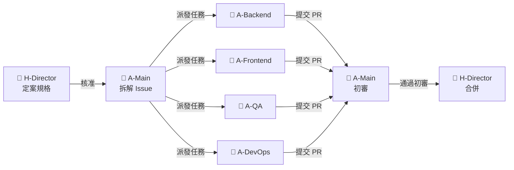
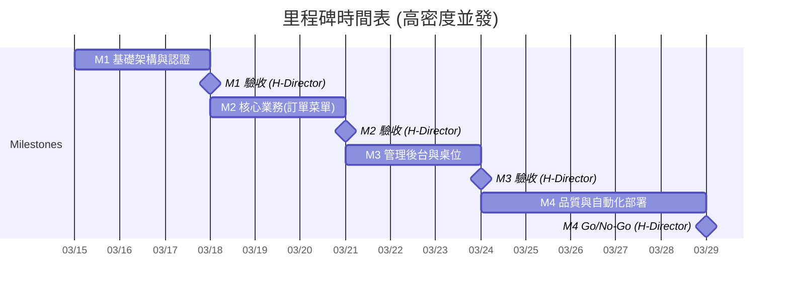
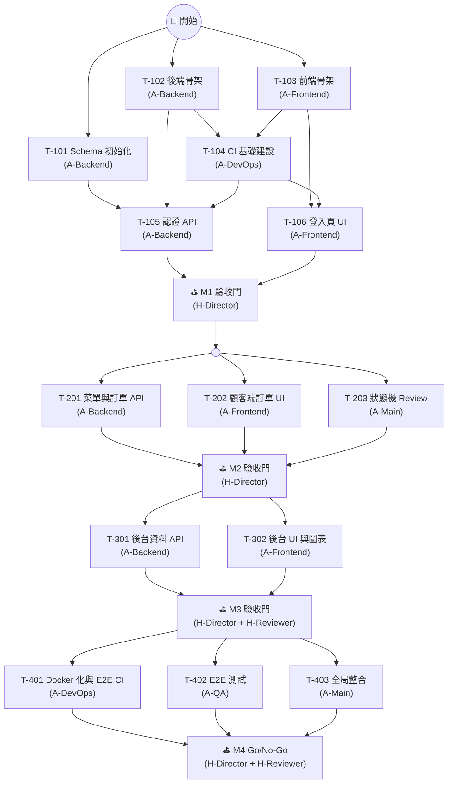
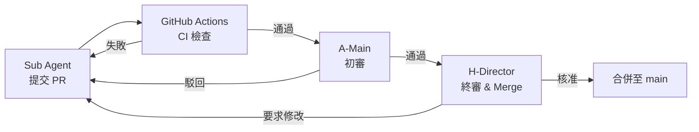

# 02 開發計畫 (AI Agentic Coding 版)

> **項目名稱**：Easy Dine — 小型餐廳點餐系統
> **版本**：v2.0 (Vibe-Coding / 基於 AI Agentic 架構)
> **開發周期**：1-2 周 (原人類評估需 8-10 周)
> **開發模式**：Main Agent 統籌 + 跨模塊並行開發 (Sub Agents)
> **最後更新**：2026-03-15

---

## 目錄

1. [角色定義 (Role Registry)](#1-角色定義-role-registry)
2. [項目概況與時間表](#2-項目概況與時間表)
3. [里程碑定義](#3-里程碑定義)
4. [任務清單 (Sub Agents 協作)](#4-任務清單-sub-agents-協作)
5. [技術實施方案](#5-技術實施方案)
6. [風險識別與應對 (AI 開發視角)](#6-風險識別與應對-ai-開發視角)
7. [質量保證計畫 (Vibe Check)](#7-質量保證計畫-vibe-check)
8. [溝通與協作](#8-溝通與協作)

---

## 1. 角色定義 (Role Registry)

> **本節為全文唯一角色定義來源。** 後續所有章節引用角色時，必須使用下表中的 **角色代號** 或 **角色名稱**，不得自行新增或變體。

### 1.1 角色一覽

| 角色代號 | 角色名稱 | 類別 | 說明 |
|---------|---------|------|------|
| **H-Director** | 導演 (Director) | 🧑 人類 | 專案最高決策者。負責規格審查、PR 合併、Milestone 驗收、方向調整。 |
| **H-Reviewer** | 審查員 (Reviewer) | 🧑 人類 | 協助 Director 進行特定領域審查（如 UX 驗收、安全審計），可由 Director 兼任。 |
| **A-Main** | 主代理 (Main Agent) | 🤖 AI | 統籌全局的 AI 代理。負責拆解任務、建立 Issue、協調 Sub Agents、執行最終整合與 Vibe Check。 |
| **A-Backend** | 後端子代理 (Sub-Backend) | 🤖 AI | 專注 `/backend` 目錄。負責 API 開發、DB 操作邏輯、ORM 模型、快取策略、後端單元測試。 |
| **A-Frontend** | 前端子代理 (Sub-Frontend) | 🤖 AI | 專注 `/frontend` 目錄。負責 UI 組件、頁面開發、狀態管理、API Client 串接。 |
| **A-QA** | 測試子代理 (Sub-QA) | 🤖 AI | 專注 `/tests` 目錄。負責 E2E 測試腳本撰寫、測試覆蓋率分析、邊界案例驗證。 |
| **A-DevOps** | 部署子代理 (Sub-DevOps) | 🤖 AI | 專注 `.github/workflows`、Docker 配置。負責 CI/CD Pipeline、容器化、監控配置。 |
| **H-UxReviewer** | UX 審查員 (UX Reviewer) | 🧑 人類 | UX 相關審查（視覺效果、互動體驗、裝置相容性），可由 Director 兼任或由具備 UX 能力的 AI Agent 代理執行。 |

### 1.2 人類角色職責詳述

| 階段 | H-Director 職責 | H-Reviewer 職責 | H-UxReviewer 職責 |
|------|-----------------|-----------------|-------------------|
| **規格定義** | 撰寫/定案 PRD、SRD、API Spec | 交叉審查規格一致性 | 審查 UI/UX 規格與互動設計 |
| **任務分派** | 核准 A-Main 產出的 Issue 清單與優先級 | — | — |
| **開發進行中** | 監控進度、處理 AI 無法解決的環境/依賴問題 | Review 特定領域 PR (如安全性) | Review UI/UX 相關 PR（視覺效果、互動體驗） |
| **Milestone 驗收** | **唯一有權決定是否進入下一個 Milestone** | 協助驗收 UX/安全/性能 | 驗收 UX 設計、裝置相容性 |
| **上線決策** | 最終 Go/No-Go 決策 | 確認上線檢查清單 | 確認 UX 檢查清單 |

### 1.3 AI 角色職責詳述

| 角色代號 | 操作範圍 | 輸入依據 | 產出物 |
|---------|---------|---------|--------|
| **A-Main** | 全專案讀寫 | `/docs` 規格文件全集 | GitHub Issues、PR 初審結果、整合報告 |
| **A-Backend** | `/backend/**` | `API_Spec.yaml` + `01-2-SRD.md` | API 端點、DB Migrations、Seed Data、單元測試 |
| **A-Frontend** | `/frontend/**` | `API_Spec.yaml` + `01-1-PRD.md` | UI 頁面、組件、狀態管理、API Client |
| **A-QA** | `/tests/**` | 全部規格 + 已完成程式碼 | E2E 測試腳本、測試報告、覆蓋率報告 |
| **A-DevOps** | `.github/**`, `docker/**` | 專案結構 + 部署需求 | Dockerfile, docker-compose, CI/CD Workflows |

### 1.4 任務分發流程



---

## 2. 項目概況與時間表

### 2.1 項目基本信息

| 項目信息 | 說明 |
|---------|------|
| **項目名稱** | Easy Dine（小型餐廳點餐系統） |
| **版本** | v2.0 (全自動化/半自動化生成) |
| **開發周期** | 1-2 周 (由 AI 高度自動化並行開發) |
| **總工作量估算** | H-Director ~30-40 小時 / AI Agents ~150-200 任務 Session |
| **核心團隊規模** | 2 人類角色 + 5 AI 角色 (見 §1 角色定義) |
| **開發範式** | API First 契約驅動，藉助 Mock 實現前後端 100% 並行開發 |

### 2.2 四個里程碑及時間表 (高密度並發)

由於引入 Sub Agents（子代理），前後端與基礎設施配置模塊可以高度並行，里程碑時間大幅壓縮至由人類審查與系統整合速度決定。



| 里程碑 | 名稱 | 周期 | 主要交付物 | 執行角色 | 驗收者 |
|--------|------|------|---------|---------|--------|
| **M1** | 基礎架構與認證 | 3 天 | DB Schema、前後端骨架、CI 基礎建設、認證 API 與頁面 | A-Main, A-Backend, A-Frontend, A-DevOps | H-Director |
| **M2** | 核心業務(訂單菜單) | 3 天 | 菜單 API、購物車、訂單 API、訂單狀態機與對應頁面 | A-Backend, A-Frontend | H-Director |
| **M3** | 管理後台與桌位 | 3 天 | 桌位/QR Code、管理 CRUD、分析儀表板 | A-Backend, A-Frontend | H-Director, H-Reviewer |
| **M4** | 品質與自動化部署 | 5 天 | E2E 測試、Docker 化、E2E CI 擴展 | A-Main, A-QA, A-DevOps | H-Director, H-Reviewer |

### 2.3 總工作量估算 (Agentic 開發模式)

傳統「人月/人時」不再適用，改以 **AI Session 消耗** 與 **人類決策/審查時間 (Human Review Hour, HRH)** 進行資源規劃。

| 角色代號 | 工作量估算 | 說明 |
|---------|-----------|------|
| **H-Director** | ~30-40 HRH | 撰寫 Prompt、審核規格、Review PR、排除衝突、Milestone 驗收決策 |
| **H-Reviewer** | ~5-10 HRH | 協助特定領域審查 (UX/安全)，可由 Director 兼任 |
| **A-Main** | ~50 AI Sessions | 拆解 Issue、建立任務依賴矩陣、派發任務、全局整合與 CI 修復 |
| **A-Backend** | ~60 AI Sessions | 並發執行 API 開發、DB 操作邏輯與單元測試 |
| **A-Frontend** | ~60 AI Sessions | 並發執行 UI 組件開發、API 串接 (由 Spec 自動生成 API Client) |
| **A-QA** | ~20 AI Sessions | 撰寫 E2E 測試框架 (Playwright)、邊界案例驗證 |
| **A-DevOps** | ~10 AI Sessions | 配置 GitHub Actions、Docker |

---

## 3. 里程碑定義

核心原則：**所有 Milestone 以完成 CI 檢查，並由 A-Main 提交 PR 給 H-Director 審查驗收作為結束點。H-Director 驗收通過後方可進入下一個 Milestone。**

### 3.1 Milestone 1：基礎架構與認證（Day 1-3）

**目標**：快速產出基礎框架，確保前後端連通，完成 Auth 機制，為後續並行打下基礎。

**AI 執行策略與並行任務**：
- **A-Backend**：依據 SRD 生成 Schema/Prisma Models 與 Seed Data，初始化框架骨架，設定全局中間件，並實作 Auth API (JWT/Bcrypt)。
- **A-Frontend**：初始化 React/Vite 架構，設定 Tailwind，實作 Login UI。
- **A-DevOps**：在前後端骨架完成後，建立基礎 CI Workflow (GitHub Actions)，確保後續所有 PR 皆受 CI 保護。
- A-Backend 與 A-Frontend 的骨架任務無依賴，可 **完全並行**；CI 建設在骨架完成後進行；Auth 任務在 CI 就緒後進行。

**交付物**：
- 完整 DB Schema 及遷移檔案。
- 基礎 CI Pipeline (Lint → Type Check → Test → Build)。
- 前後端可獨立啟動 (`npm run dev`)，前端可成功發送 Mock 登入請求或連接本地測試 DB 登入。

**人類決策點 (Human Gate)**：
- **H-Director**：驗收架構目錄結構、中間件實作是否符合預期。核准後進入 M2。

---

### 3.2 Milestone 2：核心業務 - 訂單與菜單（Day 4-6）

**目標**：基於已定案的 `API_Spec.yaml`，進行前後端 **完全平行分工**，實作核心點餐流程。

**AI 執行策略**：
- **A-Frontend**：使用 API 模擬 (Mocking) 工具先行開發購物車互動、菜單分類切換 UI 與狀態管理 (Zustand)。
- **A-Backend**：同時開發菜單與訂單 RESTful API、訂單狀態機 (Pending → Preparing → Ready) 邏輯。
- **A-Main**：負責核心狀態機模組的 Code Review，確保邏輯正確性。

**交付物**：
- Frontend：購物車互動、菜單分類切換與訂單狀態 UI。
- Backend：菜單與訂單相關的全套 RESTful API。

**人類決策點 (Human Gate)**：
- **H-Director**：驗收核心訂單流程 (掃碼 → 點餐 → 提交)。核准後進入 M3。

---

### 3.3 Milestone 3：管理後台與桌位（Day 7-9）

**目標**：實現菜單和訂單的完整管理功能，提供分析儀表板，以及桌位 QR Code 生成。

**AI 執行策略**：
- **A-Backend**：實作統計聚合查詢 (Aggregation API)、軟刪除機制、桌位 QR Code 生成庫封裝。
- **A-Frontend**：引入 Chart.js/Recharts 實作儀表板，開發管理後台表格(Table)和表單(Form)。

**人類決策點 (Human Gate)**：
- **H-Director**：驗收後台管理功能完整性。
- **H-Reviewer**：驗收 UX 設計是否符合 PRD 描述。核准後進入 M4。

---

### 3.4 Milestone 4：優化與部署（Day 10-14）

**目標**：基礎設施(IaC)配置、自動化測試完善、以及生產環境部署設定。

**AI 執行策略**：
- **A-QA**：依據前端路由與 API 契約，撰寫 Playwright E2E 測試腳本，涵蓋 P0 路徑 (登入 → 點餐 → 結帳)。
- **A-DevOps**：基於 M1 已建立的基礎 CI，擴展 Docker 化部署配置 (Dockerfile, `docker-compose.yml`) 與 E2E 測試 CI Job。
- **A-Main**：運行全套驗證 (Vibe Check)，修復相容性錯誤與 Linter/Type 錯誤。

**人類決策點 (Human Gate)**：
- **H-Director**：最終 Go/No-Go 上線決策。
- **H-Reviewer**：確認安全審計與上線檢查清單。

---

## 4. 任務清單 (Sub Agents 協作)

> **並行規則**：透過 API Spec 提前定案實現解耦。同一「並行群組 (G)」內的任務可同時執行，不同群組間依序進行。

### 4.1 任務總覽

| ID | 任務名稱 | 優先權 | 負責角色 | 前置任務 | 預估耗時 |
|----|---------|-------|---------|---------|----------|
| T-101 | Schema 與 DB 初始化 | P0 | A-Backend | — | ~2 AI Sessions |
| T-102 | 後端骨架與中介軟體 | P0 | A-Backend | — | ~3 AI Sessions |
| T-103 | 前端骨架與路由 | P0 | A-Frontend | — | ~3 AI Sessions |
| T-104 | CI 基礎建設 (GitHub Actions) | P0 | A-DevOps | T-102, T-103 | ~2 AI Sessions |
| T-105 | 認證 API 開發 | P0 | A-Backend | T-101, T-102, T-104 | ~4 AI Sessions |
| T-106 | 登入頁與前端 Auth | P0 | A-Frontend | T-103, T-104 | ~3 AI Sessions |
| ⛳ M1 | M1 驗收門 | P0 | H-Director | T-105, T-106 | ~2 HRH |
| T-201 | 菜單與訂單 API | P0 | A-Backend | T-105 | ~8 AI Sessions |
| T-202 | 顧客端訂單 UI | P0 | A-Frontend | T-106 | ~10 AI Sessions |
| T-203 | 訂單狀態機 Review | P1 | A-Main | T-201 | ~2 AI Sessions |
| ⛳ M2 | M2 驗收門 | P0 | H-Director | T-201, T-202, T-203 | ~3 HRH |
| T-301 | 後台資料與分析 API | P1 | A-Backend | T-201 | ~6 AI Sessions |
| T-302 | 管理後台 UI 與圖表 | P1 | A-Frontend | T-106 | ~8 AI Sessions |
| ⛳ M3 | M3 驗收門 | P0 | H-Director, H-Reviewer | T-301, T-302 | ~3 HRH |
| T-401 | Docker 化與 E2E CI 擴展 | P0 | A-DevOps | T-104, 所有開發任務 (T-101~T-302) | ~4 AI Sessions |
| T-402 | E2E 測試與覆蓋率 | P0 | A-QA | 所有開發任務 (T-101~T-302) | ~5 AI Sessions |
| T-403 | 全局整合與 Vibe Check | P0 | A-Main | T-401, T-402 | ~5 AI Sessions |
| ⛳ M4 | M4 驗收門 (Go/No-Go) | P0 | H-Director, H-Reviewer | T-401, T-402, T-403 | ~4 HRH |

> **預估耗時說明**：AI 角色以 AI Session 數估算（一個 Session ≈ 一次完整的 Agent 對話執行）；人類角色以 HRH (Human Review Hours) 估算。

---

### 4.2 任務詳細描述

#### Milestone 1：基礎架構與認證 (G1 + G2)

**T-101：Schema 與 DB 初始化** `P0`
- **任務描述**：依據 SRD 設計完整的資料庫 Schema。建立所有核心資料表 (Users, Restaurants, Categories, MenuItems, Tables, Orders, OrderItems, ActivityLogs)、關聯關係、索引，並撰寫 Seed Script 以初始化測試資料。
- **前置任務**：(無)
- **輸入**：`01-2-SRD.md` (資料實體定義)
- **產出**：Prisma Schema 檔案 (`schema.prisma`)、Migration 檔案、Seed Script (`seed.ts`)
- **驗證**：✅ 自動：`npx prisma migrate dev` 成功執行無錯誤；✅ 自動：Seed 資料可正確寫入且可查詢。

**T-102：後端骨架與中介軟體** `P0`
- **任務描述**：初始化後端框架 (Express/Fastify + TypeScript)。配置全局中介軟體：錯誤處理 (Error Handler)、CORS、Request Logger、Rate Limiter，並建立路由目錄結構與健康檢查端點。
- **前置任務**：(無)
- **輸入**：`01-2-SRD.md` (架構設計)、`API_Spec.yaml` (路由規劃)
- **產出**：後端專案骨架 (`/backend` 完整目錄結構)、`GET /health` 端點
- **驗證**：✅ 自動：`npm run dev` 啟動成功；✅ 自動：`curl localhost:PORT/health` 回傳 200。

**T-103：前端骨架與路由** `P0`
- **任務描述**：初始化前端框架 (Vite + React + TypeScript)。配置 Tailwind CSS、React Router (顧客端與後台路由)、狀態管理 (Zustand Store 骨架)，並建立頁面目錄結構與 Layout 組件。
- **前置任務**：(無)
- **輸入**：`01-1-PRD.md` (頁面與導航規劃)
- **產出**：前端專案骨架 (`/frontend` 完整目錄結構)、基礎 Layout 組件
- **驗證**：✅ 自動：`npm run dev` 啟動成功；👁️ 手動：瀏覽器可訪問各空白路由頁面無錯誤。

**T-104：CI 基礎建設 (GitHub Actions)** `P0`
- **任務描述**：建立基礎 CI Workflow (GitHub Actions)：Lint → Type Check → Unit Test → Build。確保後續所有 PR 皆受 CI 自動檢查保護。
- **前置任務**：T-102, T-103
- **輸入**：後端與前端專案骨架 (`package.json`、TypeScript 配置)
- **產出**：`.github/workflows/ci.yml`、CI 狀態徽章
- **驗證**：✅ 自動：GitHub Actions CI Pipeline 觸發並全部 Green；PR 自動執行 Lint + Type Check + Test + Build。

**T-105：認證 API 開發** `P0`
- **任務描述**：實作完整的認證模組：管理員註冊/登入端點、JWT Token 生成與驗證中介軟體、密碼 bcrypt 加密、Token 刷新機制。撰寫對應的單元測試。
- **前置任務**：T-101, T-102, T-104
- **輸入**：`API_Spec.yaml` (Auth 相關端點定義)
- **產出**：Auth API 源碼 (`authController.ts`, `authService.ts`, `authMiddleware.ts`)、單元測試
- **驗證**：✅ 自動：所有 Auth 相關單元測試通過；可透過 API 取得有效 JWT Token。

**T-106：登入頁與前端 Auth** `P0`
- **任務描述**：實作管理員登入頁面 UI、Auth Context (全局認證狀態管理)、Token 存儲邏輯 (LocalStorage)、受保護路由 (Protected Route) 封裝。
- **前置任務**：T-103, T-104
- **輸入**：`01-1-PRD.md` (登入流程)、`API_Spec.yaml` (Auth API 規格，用於 Mock)
- **產出**：登入頁組件、Auth Context、Protected Route HOC、API Client Auth 模組
- **驗證**：👁️ 手動：登入頁可正常渲染；✅ 自動：使用 Mock API 可模擬登入/登出流程；👁️ 手動：未登入時自動導向登入頁。

**⛳ M1 驗收門**
- **任務描述**：審查前後端專案架構、目錄結構、中介軟體實作、CI Pipeline 是否符合規格預期。確認前後端可獨立啟動，CI 全部 Green。
- **前置任務**：T-105, T-106
- **輸入**：T-101~T-106 的產出物
- **產出**：(無，決定是否進入 M2)
- **驗證**：👁️ 手動：H-Director 核准後方可進入下一階段。

#### Milestone 2：核心業務 - 訂單與菜單 (G3)

**T-201：菜單與訂單 API** `P0`
- **任務描述**：實作菜單模組 (分類查詢、菜品列表、菜品詳情、推薦菜品) 與訂單模組 (訂單建立、查詢、狀態機轉換 Pending→Preparing→Ready→Completed)。包含訂單編號自動生成 (YYYYMMDD-序號)、購物車到訂單的事務處理。撰寫對應的單元測試。
- **前置任務**：T-105
- **輸入**：`API_Spec.yaml` (Menu & Order 端點)、`01-2-SRD.md` (商業邏輯)
- **產出**：菜單與訂單相關 Controller/Service/Repository 源碼、單元測試
- **驗證**：✅ 自動：所有菜單與訂單 API 單元測試通過；✅ 自動：訂單狀態轉換符合狀態機定義；✅ 自動：非法狀態轉換被正確拒絕。

**T-202：顧客端訂單 UI** `P0`
- **任務描述**：實作顧客端完整點餐流程 UI：菜單瀏覽 (分類切換、搜索)、購物車 (加入/移除/數量調整/備註，LocalStorage 持久化)、訂單確認與提交頁、訂單狀態即時顯示、結帳單列印 (CSS Print)。
- **前置任務**：T-106
- **輸入**：`01-1-PRD.md` (顧客端流程)、`API_Spec.yaml` (用於 Mock 串接)
- **產出**：菜單瀏覽頁、購物車頁、訂單確認頁、訂單詳情頁、結帳單列印組件
- **驗證**：👁️ 手動：完整顧客端流程可操作 (使用 Mock API)；✅ 自動：購物車狀態刷新後仍保留；👁️ 手動：結帳單列印樣式正確。

**T-203：訂單狀態機 Review** `P1`
- **任務描述**：由 A-Main 對 T-201 產出的訂單狀態機核心邏輯進行 Code Review，確認狀態轉換的完整性、邊界案例處理、事務原子性。
- **前置任務**：T-201
- **輸入**：T-201 產出的狀態機源碼
- **產出**：Review 結果報告 (Issue Comments)，若有問題則要求 A-Backend 修正
- **驗證**：👁️ 手動：Review 通過，無遺留問題。

**⛳ M2 驗收門**
- **任務描述**：驗收核心訂單流程 (掃碼 → 瀏覽菜單 → 加入購物車 → 提交訂單 → 後台接收)。前後端實際串接測試。
- **前置任務**：T-201, T-202, T-203
- **輸入**：T-201~T-203 的產出物
- **產出**：(無，決定是否進入 M3)
- **驗證**：👁️ 手動：H-Director 實際操作完整訂單流程無錯誤後核准。

#### Milestone 3：管理後台與桌位 (G4)

**T-301：後台資料與分析 API** `P1`
- **任務描述**：實作菜品管理 CRUD (含軟刪除)、分類管理、桌位管理 (CRUD + 狀態管理 + 用餐時長計算)、QR Code 生成 API、統計分析聚合查詢 (訂單統計、菜品銷售排行、桌位使用率)。
- **前置任務**：T-201
- **輸入**：`API_Spec.yaml` (Admin 端點)、`01-2-SRD.md` (管理邏輯)
- **產出**：菜品/分類/桌位管理 API 源碼、分析查詢 API 源碼、QR Code 生成工具、單元測試
- **驗證**：✅ 自動：所有管理 API 單元測試通過；✅ 自動：軟刪除後歷史訂單引用不受影響；✅ 自動：聚合查詢結果正確。

**T-302：管理後台 UI 與圖表** `P1`
- **任務描述**：實作管理後台完整頁面：菜品管理 (列表/新增/編輯/刪除/圖片上傳)、訂單管理 (列表/篩選/詳情/狀態更新/出餐單列印)、桌位管理 (配置/QR Code 生成下載/狀態管理)、分析儀表板 (圖表展示 Chart.js/Recharts)。
- **前置任務**：T-106
- **輸入**：`01-1-PRD.md` (後台功能)、`API_Spec.yaml` (Admin API，用於 Mock 串接)
- **產出**：菜品管理頁、訂單管理頁、桌位管理頁、分析儀表板頁
- **驗證**：👁️ 手動：所有 CRUD 操作 UI 可正常執行 (使用 Mock API)；✅ 自動：圖表可正確渲染測試資料；👁️ 手動：QR Code 可生成並下載。

**⛳ M3 驗收門**
- **任務描述**：驗收後台管理功能完整性與 UX 設計。前後端實際串接測試。
- **前置任務**：T-301, T-302
- **輸入**：T-301~T-302 的產出物
- **產出**：(無，決定是否進入 M4)
- **驗證**：👁️ 手動：H-Director 驗收功能完整性；👁️ 手動：H-Reviewer 驗收 UX 設計是否符合 PRD。核准後進入 M4。

#### Milestone 4：品質與自動化部署 (G5)

**T-401：Docker 化與 E2E CI 擴展** `P0`
- **任務描述**：基於 M1 已建立的基礎 CI (T-104)，擴展完整的容器化與進階 CI/CD 配置：多階段 Dockerfile (前端 + 後端)、`docker-compose.yml` (含 PostgreSQL + Redis)、E2E 測試 CI Job、DB Migration 自動化腳本。基礎 Lint/Type Check/Unit Test/Build 已由 T-104 建立，本任務聚焦於 Docker 化部署與 E2E 測試整合。
- **前置任務**：T-104, 所有開發任務 (T-101 ~ T-302)
- **輸入**：專案結構、`package.json` 依賴清單、T-104 產出的基礎 CI Workflow
- **產出**：`Dockerfile`、`docker-compose.yml`、`.github/workflows/e2e.yml`、部署說明文件
- **驗證**：✅ 自動：`docker-compose up` 可啟動完整服務棧；✅ 自動：GitHub Actions Pipeline 全部 Green（含 E2E Job）。

**T-402：E2E 測試與覆蓋率** `P0`
- **任務描述**：使用 Playwright 撰寫 E2E 測試腳本，涵蓋 P0 關鍵路徑：顧客端 (掃碼 → 瀏覽菜單 → 提交訂單 → 結帳列印)、後台 (登入 → 管理菜單 → 查看訂單 → 更新狀態)。補充單元測試覆蓋率至目標水平。
- **前置任務**：所有開發任務 (T-101 ~ T-302)
- **輸入**：`01-1-PRD.md` (使用者流程)、`API_Spec.yaml`、已完成的前後端源碼
- **產出**：Playwright 測試腳本 (`/tests/e2e/*.spec.ts`)、測試覆蓋率報告
- **驗證**：✅ 自動：所有 E2E 測試通過；✅ 自動：單元測試覆蓋率 ≥ 80%。

**T-403：全局整合與 Vibe Check** `P0`
- **任務描述**：由 A-Main 執行全專案品質驗證：跨模組相容性檢查、TypeScript 型別錯誤修復、ESLint 警告清除、前後端 API 串接一致性驗證、Build 成功確認。
- **前置任務**：T-401, T-402
- **輸入**：全專案源碼、CI 報告
- **產出**：Vibe Check 報告 (通過/未通過項目清單)、修復 Commits
- **驗證**：✅ 自動：`tsc --noEmit` 零錯誤；✅ 自動：`npm run build` 前後端皆成功；✅ 自動：所有 CI Gates 通過。

**⛳ M4 驗收門 (Go/No-Go)**
- **任務描述**：最終上線決策。確認所有功能驗收、性能驗收、安全審計與上線檢查清單。
- **前置任務**：T-401, T-402, T-403
- **輸入**：Vibe Check 報告、測試覆蓋率報告、CI 狀態
- **產出**：(無，Go/No-Go 決策)
- **驗證**：👁️ 手動：H-Director 確認所有檢查清單項通過；👁️ 手動：H-Reviewer 確認安全審計無高危問題。Go 則上線。

### 4.3 並行群組視覺化



---

## 5. 技術實施方案

*(此部分維持現代化主流框架，適合 AI Agent 生成與理解的技術棧)*

### 5.1 適合 AI 生成的前端架構

- **框架**：React 18+ (推薦 Next.js 或 Vite + React) + TypeScript
- **約定優於配置**：要求 Agent 使用嚴格的 ESLint + Prettier，依賴 TypeScript 檢查減少執行期錯誤。
- **組件庫**：Tailwind CSS + shadcn/ui (極為利於 AI 單文件生成與修改，減少 CSS 衝突)。
- **狀態管理**：Zustand (輕量、樣板程式碼少，利於 AI 一次性寫出)。
- **API Client**：由 `API_Spec.yaml` 自動生成 Swagger Client 或直接交由 A-Frontend 封裝 Axios 模組。

### 5.2 適合 AI 生成的後端架構

- **語言與框架**：Node.js (Express / Fastify) + TypeScript 或 Python (FastAPI)。此處強烈推薦 TypeScript 確保前後端型別(Types)共用。
- **ORM**：Prisma (其 Schema 非常具備聲明式特徵，極度適合 AI 分析與操作關聯式資料庫)。
- **驗證**：Zod (與 TypeScript 整合完美，提示 AI 推理資料流)。

### 5.3 數據庫與部署配置

- **數據庫**：PostgreSQL
- **快取**：Redis (由 A-Backend 自動生成對應的中介軟體與失效策略)
- **部署配置**：由 A-DevOps 直接輸出符合最佳實踐的 Docker 部署清單與 Kubernetes Deployment YAML。

---

## 6. 風險識別與應對 (AI 開發視角)

Vibe-Coding (AI Agent) 模式下的風險與人類開發不同，主要在於「幻覺」、「上下文丟失」與「無窮迴圈」。

| 風險 ID | 風險描述 | 發生概率 | 應對措施 | 負責處理 |
|--------|--------|---------|---------|---------|
| **VIBR-01** | AI 破壞已完成功能 (Regression) | 高 | 每次 Milestone 新增完整單元測試，配置 CI 強制攔截錯誤 PR | A-Main 監控, H-Director 最終判斷 |
| **VIBR-02** | Sub Agents 上下文不同步 | 中 | 以 `/docs` 規格作為唯一真理，所有子代理操作前強制讀取 | A-Main 協調 |
| **VIBR-03** | 複雜邏輯進入無窮除錯迴圈 | 中 | 設定偵錯嘗試上限 (三次)，失敗則交還控制權 | A-Main 監控, H-Director 介入重寫 |
| **VIBR-04** | 外部套件版本衝突 (幻覺) | 中 | 固定 Package 版本 (嚴格使用 lock file)，限制 AI 隨意更改依賴 | A-Main 把關 |
| **VIBR-05** | API 介面串接不符 | 低 | 嚴格執行 API First，不允許未經 H-Director 核准的 API 修改 | H-Director 核准 |

---

## 7. 質量保證計畫 (Vibe Check)

AI Agent 寫扣速度極快，必須依賴嚴格的自動化關卡確保質量。這就是所謂的 **Vibe Check**。

### 7.1 強制性 CI/CD 閘口 (Gates)

| Gate | 檢查項目 | 執行者 | 觸發時機 |
|------|---------|--------|---------|
| **Gate 1** | Linter & Type Check (`tsc --noEmit`) | A-Main (整合) | 每次 PR |
| **Gate 2** | Unit Testing (Jest/Vitest) | A-Backend / A-Frontend | 每次 PR |
| **Gate 3** | Build Check (`npm run build`) | A-Main | 每次 PR |
| **Gate 4** | E2E Test (Playwright) | A-QA | Milestone 驗收前 |

### 7.2 Human-in-the-Loop 審查

| 審查項目 | 負責角色 | 時機 |
|---------|---------|------|
| 架構是否過度複雜 (Over-engineering) | **H-Director** | PR Review |
| UI 是否偏離 PRD 指定的產品直覺 | **H-Reviewer** | Milestone 驗收 |
| 安全性審計 | **H-Reviewer** | M4 上線前 |
| 最終 Go/No-Go 上線決策 | **H-Director** | M4 驗收門 |

---

## 8. 溝通與協作

全 AI 團隊中無需會議，協作透過系統狀態進行。

### 8.1 狀態同步中心

| 紀錄來源 | 維護者 | 說明 |
|---------|--------|------|
| **GitHub Projects 看板** | **A-Main** | 自動將 Issue 移動到 Todo / In Progress / Review / Done |
| **`/docs/02-Dev_Plan.md`** | **A-Main** | 每個 Milestone 完成時，自動更新檢查清單 |
| **PR Comments** | **H-Director** & AI Agents | 開發細節與邏輯探討的溝通主要渠道 |

### 8.2 文件存取約定 (唯一真相來源 Single Source of Truth)

AI Agents 缺乏人類常識，**文件的一致性絕對不容妥協**。

| 文件 | 主要消費者 | 用途 |
|------|-----------|------|
| `01-1-PRD.md` | **A-Frontend** | 定義產品行為、跳轉邏輯 |
| `01-2-SRD.md` | **A-Backend** | 定義系統架構、資料實體、Schema 生成依據 |
| `API_Spec.yaml` | **A-Backend**, **A-Frontend** | 絕對的 API 契約，不允許任何角色擅自修改 |
| `02-Dev_Plan.md` | **A-Main** | 任務拆解與進度追蹤依據 |

### 8.3 規格變更流程

```text
任何角色發現規格問題 → A-Main 提報 → H-Director 審查 → 核准後更新 /docs → 通知所有相關 Sub Agents
```

**禁止事項**：任何 AI 角色不得在未經 H-Director 核准的情況下修改 `/docs` 下的規格文件。

### 8.4 Git 協作策略 (Multi Sub Agent)

多個 Sub Agent 並行開發時，必須遵守以下 Git 協作規範以避免衝突。

#### Worktree 配置

每個 Sub Agent 使用獨立的 Git Worktree，避免分支切換干擾：

```bash
# A-Main 在主 Worktree (專案根目錄)
# Sub Agents 各自建立 Worktree
git worktree add ../worktree-backend feat/backend/issue-12-auth-api
git worktree add ../worktree-frontend feat/frontend/issue-15-login-ui
git worktree add ../worktree-devops feat/devops/issue-20-docker
```

#### 分支命名規範

```
feat/<agent>/<issue-N>-<簡述>
```

| Agent | 分支範例 |
|-------|---------|
| A-Backend | `feat/backend/issue-12-auth-api` |
| A-Frontend | `feat/frontend/issue-15-login-ui` |
| A-QA | `feat/qa/issue-30-e2e-tests` |
| A-DevOps | `feat/devops/issue-20-docker` |
| A-Main | `feat/main/issue-40-integration` |

#### PR 審查流程 (雙層審查)



| 審查層 | 審查者 | 檢查重點 |
|--------|--------|---------|
| **CI 自動檢查** | GitHub Actions | Lint、Type Check、Unit Test、Build |
| **初審** | A-Main | PR 範圍是否僅限負責目錄、無跨域修改、邏輯正確性 |
| **終審** | H-Director | 架構合理性、商業邏輯正確性、最終 Merge 決策 |

#### PR 範圍限制

| Agent 角色 | 允許修改的路徑 | 禁止修改 |
|-----------|-------------|---------|
| **A-Backend** | `/backend/**` | `/frontend/**`, `.github/**` |
| **A-Frontend** | `/frontend/**` | `/backend/**`, `.github/**` |
| **A-QA** | `/tests/**` | `/backend/**`, `/frontend/**` |
| **A-DevOps** | `.github/**`, `docker/**`, `Dockerfile`, `docker-compose.yml` | `/backend/**`, `/frontend/**` |
| **A-Main** | 全專案 | (無限制，用於整合與修復) |

#### 合併順序與衝突處理

- 同一並行群組內的 PR **無強制合併順序**，依完成先後合併。
- 合併後若導致其他 PR 產生衝突，由 **A-Main** 負責 rebase 並解決。
- Sub Agent **禁止**自行解決涉及其他 Agent 負責範圍的衝突。
- 若衝突涉及架構性變更，由 **H-Director** 裁決解決方案。

---

### 8.5 Sub Agent Session 隔離

#### 核心原則

> **每個 Sub Agent = 一個獨立的 Claude Code terminal session（獨立 context window）。**
>
> Sub Agents 之間不直接共享 context，跨代理的溝通媒介為 **GitHub Issues 與 PR Comments**，而非 session 內的對話記憶。

**理由**：
- 避免不同角色的程式碼知識互相污染（A-Frontend 不需要知道 A-Backend 的內部實作）
- 各 session 的 context token 消耗彼此獨立，不互相搶佔
- 與 Worktree 一一對應，概念清晰、邊界明確

#### Session 與 Worktree 對應表

| Agent 角色 | Claude Code Session | Git Worktree 路徑 |
|-----------|--------------------|--------------------|
| **A-Main** | 主 session（專案根目錄） | `./`（主 worktree） |
| **A-Backend** | 獨立 session | `../worktree-backend` |
| **A-Frontend** | 獨立 session | `../worktree-frontend` |
| **A-QA** | 獨立 session | `../worktree-qa` |
| **A-DevOps** | 獨立 session | `../worktree-devops` |

#### Sub Agent 啟動規範（Context 初始化）

每個 Sub Agent session 啟動時，**必須**依序執行以下初始化，確保 context 正確載入：

```
1. 進入對應的 Worktree 目錄
2. 讀取角色對應的規格文件（見下表）
3. 讀取 H-Director 指派的 GitHub Issue
4. 確認理解任務範圍後，開始實作
```

| Agent 角色 | 必讀規格文件 | 不需讀取 |
|-----------|------------|---------|
| **A-Backend** | `01-2-SRD.md`、`API_Spec.yaml` | `/frontend/**` 程式碼 |
| **A-Frontend** | `01-1-PRD.md`、`API_Spec.yaml` | `/backend/**` 程式碼 |
| **A-QA** | 全部規格文件 + 已完成程式碼 | — |
| **A-DevOps** | `01-2-SRD.md`（部署需求章節） | `/frontend/**`、`/backend/**` 程式碼 |
| **A-Main** | 全部規格文件 + `02-Dev_Plan.md` | — |

> **原則**：Sub Agent 只需載入「完成自身任務所需的最小 context」。讀取無關的大量程式碼只會消耗 context 且引入雜訊。

#### A-Main 的協調機制

A-Main 不直接存取或「注入」Sub Agent 的 session context，而是透過以下方式協調：

```
派發任務：A-Main 建立/更新 GitHub Issue → Sub Agent 讀取 Issue 開始工作
收集成果：Sub Agent 提交 PR → A-Main 讀取 PR diff 進行初審
問題回報：Sub Agent 在 PR Comments 提問 → A-Main 回覆 → Sub Agent 讀取回覆繼續工作
```

#### Session 終止與清理

- 任務完成、PR 合併後，Sub Agent session 可關閉（context 無需保留）。
- 若同一 Agent 需執行下一個 Issue，**建議開啟新的 session**（而非在舊 context 上繼續），以避免前次任務的程式碼細節干擾新任務的判斷。
- A-Main session 可跨里程碑持續使用，因其需要全局視角。

---

## 附錄：自動化任務執行狀態追蹤

### Milestone 1：基礎與認證

- [ ] T-101 (A-Backend) 完成 DB Schema 初始化
- [ ] T-102 (A-Backend) 完成框架初始化
- [ ] T-103 (A-Frontend) 完成 Vite 專案初始化
- [ ] T-104 (A-DevOps) CI 基礎建設 (GitHub Actions)
- [ ] T-105 (A-Backend) 認證 API 開發與單元測試
- [ ] T-106 (A-Frontend) 實作 Login UI 與 API 串接
- [ ] ⛳ M1 驗收門 (H-Director)

### Milestone 2：核心業務

- [ ] T-201 (A-Backend) 菜單與訂單 API
- [ ] T-202 (A-Frontend) 顧客端訂單 UI
- [ ] T-203 (A-Main) 訂單狀態機 Review
- [ ] ⛳ M2 驗收門 (H-Director)

### Milestone 3：管理後台

- [ ] T-301 (A-Backend) 後台資料與分析 API
- [ ] T-302 (A-Frontend) 管理後台 UI 與圖表
- [ ] ⛳ M3 驗收門 (H-Director, H-Reviewer)

### Milestone 4：品質與部署

- [ ] T-401 (A-DevOps) Docker 化與 E2E CI 擴展
- [ ] T-402 (A-QA) E2E 測試與覆蓋率
- [ ] T-403 (A-Main) 全局整合與 Vibe Check
- [ ] ⛳ M4 驗收門 Go/No-Go (H-Director, H-Reviewer)

---

**修訂與維護者**：A-Main 代 H-Director 修訂
**開發範式**：Vibe-SDLC / Agentic Coding
**下次計畫重估**：Milestone 2 結束時。
