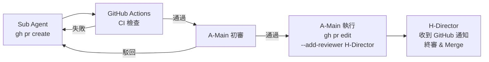

# Phase 1：定義規格文件與計畫

## 目的

建立專案的完整真相來源（Single Source of Truth）。此階段應充分與開發者討論，生成高品質規格文件與計畫，所有後續工作皆以此為依據。

## 你的角色

你是 AI 助手（執行者）。在此階段你的職責是：
- 協助開發者撰寫與完善規格文件
- 交叉比對四份規格文件，找出不一致或遺漏
- 產出完整性審查報告

**你不應該**：在需求定義階段自行決定商業需求或技術選型，這些應該在需求完成後與開發者討論後進行決策。

## 前置條件

- GitHub 倉庫已建立
- 專案目錄結構已初始化（含 `/docs` 目錄）

## 交付物

| 文件 | 檔名 | 存放路徑 | 說明 |
|------|------|----------|------|
| 產品需求文件 (PRD) | `01-1-PRD.md` | `/docs/01-1-PRD.md` | 偏重產品面或客戶的需求及要求，可能衍生 UI/UX 需求 |
| 系統需求文件 (SRD) | `01-2-SRD.md` | `/docs/01-2-SRD.md` | 偏重技術棧、框架以及系統在安全及性能上的要求 |
| API 介面規格 | `01-3-API_Spec.md` | `/docs/01-3-API_Spec.md` | API 規格說明 |
| API 介面合約 | `API_Spec.yaml` | `/docs/API_Spec.yaml` | OpenAPI 規格 |
| 開發執行計畫 | `02-Dev_Plan.md` | `/docs/02-Dev_Plan.md` | 里程碑、任務拆解、依賴關係 |
| 規格審查報告 | `03-Docs_Review_Report.md` | `/docs/03-Docs_Review_Report.md` | 交叉比對結果、不一致與遺漏項目 |
| CI/CD 規格文件（選用） | `04-CI_CD_Spec.md` | `/docs/04-CI_CD_Spec.md` | CI Workflow 定義、品質閘門、Docker 部署配置（複雜專案建議獨立，Dev Plan 以連結引用） |

**重要**：
- 每項規格都應賦予**規格編號**以利後續追蹤與討論。
- 每個任務都應賦予**任務編號**以利後續追蹤與討論。

### 參考範例

請參考 examples/docs/ 目錄下的文件。

## 操作步驟

| 步驟 | 執行者 | 操作 | 產出 |
|------|--------|------|------|
| 1 | **開發者** | 撰寫 PRD：定義功能清單、使用者故事、資料欄位，並與開發者討論並優化PRD。 | `01-1-PRD.md` |
| 2 | **開發者** | 撰寫 SRD：當PRD定義完成後，可以開始定義系統架構、技術棧、安全性要求、效能指標，並與開發者討論並優化SRD。 | `01-2-SRD.md` |
| 3 | **開發者** | 定義 API Spec：以 OpenAPI 格式定義所有端點、請求/回應結構 | `01-3-API_Spec.md`, `API_Spec.yaml` |
| 4 | **開發者** | 撰寫 Dev Plan：當 PRD、SRD、API Spec 定義完成後，可以開始拆解里程碑、任務清單、任務間依賴關係，並與開發者討論並優化Dev Plan。 | `02-Dev_Plan.md` |
| 5 | **開發者** | 確認以上文件均已提交至 `/docs` 目錄並推送至倉庫 | Git commit & push to Github (or Gitlab) |
| 6 | **AI 助手** | 交叉比對 `/docs` 下規格文件，產出完整性審查報告 | 審查報告 |
| 7 | **開發者** | 審閱報告，修正規格缺漏後重新提交 | 最終版規格 |

## Dev Plan 格式規範

可依需求規格相關文件(包含PRD、SRD、API Spec、...等)生成 Dev Plan(開發計畫)，然後與開發者討論並優化。

> 範例文件：[02-Dev_Plan.md](./examples/docs/02-Dev_Plan.md)

### 核心設計原則

1. **面向 AI Agentic Coding**：計畫以 Main Agent + Sub Agents (子代理) 為執行單位，非傳統人類團隊。
2. **API First 契約驅動**：前後端透過 `API_Spec.yaml` 解耦，Sub Agents 可高度並行開發。
3. **Human Gate 機制**：每個 Milestone 設有人類驗收門，由人類導演決定是否進入下一階段。

### 文件結構 (必須包含以下章節)

1. **角色定義 (Role Registry)**：全文唯一角色定義來源
2. **項目概況與時間表**：里程碑 Gantt 圖 (Mermaid)、工作量估算
3. **里程碑定義**：每個 Milestone 的目標、AI 執行策略、交付物、人類決策點
4. **任務清單**：任務總覽表格 + 任務詳細描述 + 並行群組視覺化 (Mermaid)
5. **技術實施方案**：前後端技術棧、數據庫與部署配置
6. **風險識別與應對**：AI 開發視角的風險 (如 Regression、上下文不同步、除錯迴圈)
7. **質量保證計畫 (Vibe Check)**：CI/CD 閘口、Human-in-the-Loop 審查
8. **溝通與協作**：狀態同步中心、文件存取約定 (Single Source of Truth)

### 角色定義格式

必須在文件最開頭以表格定義所有角色，包含：角色代號、角色名稱、類別 (🧑 人類 / 🤖 AI)、說明。後續全文引用角色時必須使用此處定義的代號，**禁止前後不一致**。

建議角色配置：

| 類別 | 建議角色 | 說明 |
|------|---------|------|
| 🧑 人類 | H-Director (導演) | 最高決策、規格審查、Milestone 驗收、PR 合併 |
| 🧑 人類 | H-Reviewer (審查員) | 特定領域審查（安全/合規性），可由 Director 兼任 |
| 🧑 人類 | H-UxReviewer (UX 審查員) | UX 相關審查（視覺效果、互動體驗、裝置相容性），可由 Director 兼任或由具備 UX 能力的 AI Agent 代理執行 |
| 🤖 AI | A-Main (主代理) | 統籌拆解 Issue、協調 Sub Agents、整合驗證 |
| 🤖 AI | A-Backend (後端子代理) | 專注後端 API、DB、ORM |
| 🤖 AI | A-Frontend (前端子代理) | 專注 UI 組件、頁面、狀態管理 |
| 🤖 AI | A-QA (測試子代理) | E2E 測試、覆蓋率 |
| 🤖 AI | A-DevOps (部署子代理) | CI/CD、Docker、監控 |

### 任務總覽表格格式

```markdown
| ID | 任務名稱 | 優先級 | 負責角色 | 前置任務 | PR 策略 | 預估耗時 |
|----|---------|-------|---------|---------|--------|----------|
| T-101 | [任務名稱] | P0 | A-Backend | — | 與 T-102 合併 | ~N AI Sessions |
| T-102 | [任務名稱] | P0 | A-Backend | — | 與 T-101 合併 | ~N AI Sessions |
| T-103 | [任務名稱] | P0 | A-Frontend | — | 獨立 PR | ~N AI Sessions |
| T-104 | [任務名稱] | P0 | A-DevOps | T-102, T-103 | 獨立 PR | ~N AI Sessions |
| ⛳ M1 | M1 驗收門 | P0 | H-Director | T-103, T-104 | — | ~N HRH |
```

- **前置任務**：直接在總覽表中列出依賴關係，使依賴鏈一目了然，無需翻閱詳細描述。若無前置任務填 `—`。
- **PR 策略**：標記任務的 PR 提交方式。同一 Agent 的多個無依賴任務應合併為一個 PR（如「與 T-102 合併」），其餘填「獨立 PR」。驗收門填 `—`。
- **預估耗時**：AI 角色用 `AI Sessions` (一次完整 Agent 對話執行)；人類角色用 `HRH` (Human Review Hours)。
- **優先級**：`P0` 為關鍵路徑必須完成、`P1` 為重要但非阻塞、`P2`可選任務但建議完成(時間允許時應該完成此任務)、`P3`可選任務(可做可不做，但若完成對專案可能有加分效果)。

### 任務詳細描述格式

每個任務以下列結構描述：

```markdown
**T-{ID}：{任務名稱}**
- **任務描述**：概述該任務的目標
- **主要步驟**：
  1. 步驟一：具體操作描述
  2. 步驟二：具體操作描述
  3. ...
- **前置任務**：前置任務 ID，若無填 `（無）`
- **輸入**：依賴或參考的文件，若無填 `（無）`
- **產出**：此任務的輸出/產出文件或源碼，若無填 `（無）`
- **驗證**：
  - ✅ 自動：可在 CI 中自動執行的驗證（單元測試、lint、type check、build）
  - 👁️ 手動：需人工操作的驗證（視覺效果、裝置測試、外部 API 整合）
- **優先級**：任務的優先等級
```

> **主要步驟**：以 numbered list 條列該任務的具體執行步驟，便於 Sub Agent 逐步對照執行。步驟應具體到可操作的程度（如「安裝依賴 X」、「實作 Y 端點」），而非抽象描述。
>
> **驗證分類**：每個驗證條件必須標記為 `✅ 自動` 或 `👁️ 手動`，明確區分 CI 可執行與需人工操作的項目。

### 並行與依賴規則

- 使用「**並行群組 (G)**」標記可同時執行的任務
- 同一群組內的任務可由不同 Sub Agents 同時開發
- 群組之間依序進行，以 ⛳ **驗收門 (Human Gate)** 作為分界
- 使用 Mermaid `flowchart` 的 fork/join 語法視覺化並行關係

#### 同 Agent 並行任務處理

- 當同一並行群組內有多個任務分配給**同一 Agent**（如 T-101、T-102 都是 A-Backend），這些任務在該 Agent 內部為**依序執行**（單一 Worktree 限制），但與其他 Agent 的任務仍為跨 Agent 並行。
- 同一 Agent 的多個無依賴任務，應**合併為一個 PR** 提交，避免同目錄多次 PR 造成合併衝突。
- Mermaid 並行圖中，應使用 `subgraph` 標示同 Agent 的依序執行關係，與跨 Agent 並行區分。

### Dev Plan 常見錯誤防範

#### CI/CD 時序原則

- **CI Workflow 必須在 M1 建立**，不可延遲到最後的 Milestone。CI 是所有 PR 品質閘門的基礎，若 CI 只在最後才建立，前面所有 Milestone 的 PR 都沒有自動檢查保護，與「每次 PR 觸發 CI Gate」的品質保證計畫自相矛盾。
- CI 任務依賴前後端骨架（需要 `package.json` 和 npm scripts），但**所有功能開發任務必須依賴 CI 就緒**，確保功能 PR 提交時已有自動品質閘門。
- 正確的依賴鏈：`骨架任務 → CI 任務 → 功能開發任務`。
- 任務編號應反映此順序：CI 任務排在骨架之後、功能開發之前（例如骨架為 T-101~T-103、CI 為 T-104、功能開發為 T-105 起）。
- 當 CI/CD 配置較複雜（多 Job、E2E、Service Container 等），應獨立為 `04-CI_CD_Spec.md`，Dev Plan 以連結引用，避免 Dev Plan 過於冗長。

#### 驗證條件設計原則

- 每個任務的驗證條件必須區分 `✅ 自動`（CI 可執行）與 `👁️ 手動`（需人工操作），不可混為一談。
- **禁止**將以下項目列為自動驗證條件：
  - 依賴外部 API Key 的測試（LLM、第三方服務）→ 單元測試必須使用 Mock Provider
  - 視覺效果驗證（動畫、顏色漸變、佈局）→ 自動驗證僅確認 CSS class 正確套用，視覺效果標記為手動驗證
  - 裝置特定功能（手機安裝 PWA、語音辨識、特定瀏覽器行為）→ 標記為手動驗證
  - 外部 API 回應時間（不可控因素）→ 改為驗證已配置 timeout 與重試機制，實際延遲在 staging 環境手動觀測

#### 任務拆分原則

- 功能性質不同的工作不應合併為同一任務。例如「CI/CD + Docker + PWA」包含三種不同性質的工作，應拆為獨立任務並放到合理的 Milestone。
- 判斷標準：若一個任務的子項目屬於不同 Milestone 的時間點，則應拆分。

#### Bootstrap 階段 PR 規則

- M1 中 CI 任務（如 T-104）就緒前的初始化任務，其 PR 無法通過 CI 閘門。Dev Plan 應明確標注這些任務為「Bootstrap PR」，由 H-Director 直接審查合併，不經過 A-Main 初審與 CI 檢查。
- CI 就緒的分界點（通常是 CI 任務合併之後）必須在 Dev Plan 的 M1 里程碑說明中明確標示。

#### 同 Agent 多任務合併原則

- 當同一並行群組中有多個任務分配給同一 Agent（如 T-101 + T-102 都是 A-Backend），由於單一 Agent 只有一個 Worktree，這些任務實際上為**依序執行**。
- 應在任務總覽表的「PR 策略」欄位中標注「與 T-XXX 合併為一個 PR」，並在 Mermaid 並行圖中使用 `subgraph` 標示 Agent 內部的依序關係。

#### 手動驗證任務原則

- 當任務的驗證條件中包含 `👁️ 手動` 項目時，**每個手動驗證項應建立獨立的 Issue**，指派給對應的人類審查角色。
- 手動驗證 Issue 的前置任務為其對應的功能開發 Issue（功能完成後才能驗證）。
- 手動驗證 Issue 必須在 ⛳ 驗收門之前完成。

**指派原則**：

| 驗證類型 | 指派角色 | 範例 |
|---------|---------|------|
| 視覺效果、互動體驗、UI 佈局、動畫、裝置相容性 | **H-UxReviewer** | 預算血條顏色漸變、PWA 安裝體驗、語音按鈕手動測試 |
| 安全性、合規性、API 整合、資料正確性 | **H-Reviewer** | LLM 引擎整合測試（需真實 API Key）、權限驗證 |
| 端到端業務流程、功能驗收 | **H-Director** | 完整記帳流程操作驗證 |

**命名規範**：手動驗證 Issue 標題格式為 `[驗證] T-{ID} {驗證項目簡述}`，例如：
- `[驗證] T-201 Gemini/OpenAI 引擎整合測試`
- `[驗證] T-203 語音辨識瀏覽器相容性測試`
- `[驗證] T-302 預算血條視覺效果驗收`

### 繪圖規範

文件中所有流程圖、時間表、依賴關係圖，**一律使用 Mermaid 語法**，禁止使用 ASCII Art。建議圖表：
- 里程碑時間表：`gantt`
- 任務分發流程：`flowchart LR`
- 並行群組視覺化：`flowchart TB` (fork/join 模式)

### Git 協作策略 (Multi Sub Agent)

當多個 Sub Agents 並行開發時，Dev Plan 應包含以下 Git 協作規範：

#### Worktree 使用

- 每個 Sub Agent 應使用獨立的 **Git Worktree** 在各自的分支上開發，避免 `checkout` 切換衝突。
- Worktree 建立命令：`git worktree add ../worktree-<agent> <branch>`
- 主 Worktree 保留給 A-Main 執行整合工作。

#### 分支命名規範

```
feat/<agent>/<issue-N>-<簡述>
```

範例：
- `feat/backend/issue-12-auth-api`
- `feat/frontend/issue-15-login-ui`
- `feat/devops/issue-20-docker-setup`

#### Bootstrap 階段（CI 建立前的 PR 處理）

M1 中，CI Pipeline 本身就是開發任務之一（如 T-104），在 CI 就緒前提交的初始化 PR 無法經過 CI 閘門檢查：

- **Bootstrap PR**（CI 建立前的任務）直接由 H-Director 審查合併，不經過 CI 閘門與 A-Main 初審。
- Sub Agent 建立 PR 時直接指定 reviewer：`gh pr create --reviewer <H-Director-username>`
- **CI 就緒後**（如 T-104 合併後），所有後續 PR 必須通過 CI 檢查，恢復標準雙層審查流程。

#### H-Director 通知機制

| 場景 | 通知方式 |
|------|---------|
| **Bootstrap 階段** | `gh pr create --reviewer <H-Director-username>`，GitHub 自動發送 Review Request 通知 |
| **標準流程** | A-Main 初審通過後執行 `gh pr edit --add-reviewer <H-Director-username>`，GitHub 自動通知 |
| **Milestone 驗收** | A-Main 在 GitHub Issue 中 `@H-Director` 並附上驗收檢查清單 |

#### PR 審查流程（標準流程，CI 就緒後適用）



1. **Sub Agent** 完成開發後提交 PR，目標分支為 `main`（或指定的整合分支）。
2. **A-Main** 進行初審：確認 PR 範圍僅限該 Agent 負責的目錄、CI 通過、無型別錯誤。
3. A-Main 初審通過後，執行 `gh pr edit --add-reviewer <H-Director-username>` 通知 H-Director。
4. **H-Director** 進行終審：Code Review 後決定 Merge 或要求修改。

#### 合併順序與衝突處理

- 同一並行群組內的 PR，**無依賴關係者** 可依完成先後合併。
- 若合併後產生衝突，由 **A-Main** 負責 rebase 並解決衝突。
- 禁止 Sub Agent 直接修改其他 Agent 負責範圍內的檔案。

#### PR 範圍限制

| Sub Agent 角色 | 允許修改的路徑 |
|---------------|-------------|
| A-Backend | `/backend/**` |
| A-Frontend | `/frontend/**` |
| A-QA | `/tests/**` |
| A-DevOps | `.github/**`, `docker/**`, `Dockerfile`, `docker-compose.yml` |
| A-Main | 全專案 (整合與修復用) |

## 審查報告格式

當執行步驟「交叉比對規格文件」時，按以下格式產出報告至 `/docs/03-Docs_Review_Report.md`：


```markdown
# 規格完整性審查報告

## 審查範圍
- 比對文件：01-1-PRD.md, 01-2-SRD.md, 01-3-API_Spec.md, 02-Dev_Plan.md, ...

## 不一致項目
| 編號 | 文件   | 不一致描述 | 建議修正 |
|------|------|------------|----------|

> 註： 「文件」可以列出多個文件，若包含多個文件之間存在不一致，請將所有不一致項目列於此表格中。

## 遺漏項目
| 編號 | 文件 | 遺漏描述 | 應補充至 |
|------|------|----------|----------|

## 結論
- 不一致項目：N 項
- 遺漏項目：N 項
- 建議：[通過 / 需修正後重新審查]
```

## 完成條件

- [ ] 規格文件皆已提交至 `/docs`
- [ ] AI 審查報告無未解決的遺漏項目
- [ ] 開發者確認規格定稿
- [ ] 開發計畫合理可行

## 行為指引

當使用者呼叫此 skill 時：

1. 先檢查 `/docs` 目錄是否存在，以及已有哪些規格文件
2. 若規格文件尚未建立：詢問開發者想從哪份文件開始，協助撰寫
3. 若規格文件已存在：詢問開發者是要修改規格還是進行交叉比對審查
4. 執行審查時，逐一讀取所有規格文件，系統性比對後產出報告
5. 檢查規格文件間的交互參考是否完整：
   - PRD 各功能需求是否標注對應的 UI/UX 設計章節參考（如有 UI/UX 設計文件）
   - SRD 前端技術棧是否參考 UI/UX 的 Design Tokens
   - UI/UX 設計文件是否反向參考 PRD、SRD、API Spec
6. 審查完成且無遺漏後，提示開發者可進入 Phase 2（`/vibe-sdlc-p2-issues`）
