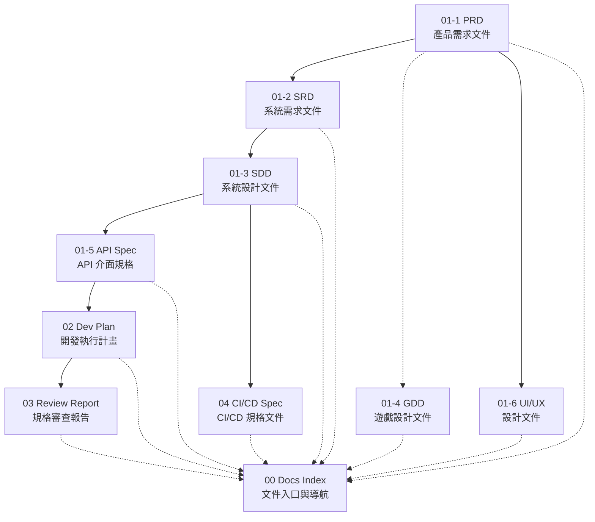

# 00 文件入口與導航 (Docs Index)

> **專案名稱**：Vibe Money Book — 語音記帳應用
> **版本**：v1.0
> **最後更新**：2026-03-16

---

## 1. 文件總覽

| 編號 | 文件 | 檔名 | 類型 | 說明 |
|------|------|------|------|------|
| 00 | 文件入口與導航 | `00-Docs_Index.md` | 必要 | 本文件，規格文件導航與索引 |
| 01-1 | 產品需求文件 (PRD) | [`01-1-PRD.md`](./01-1-PRD.md) | 必要 | 產品面需求：核心功能、使用者故事、驗收條件 |
| 01-2 | 系統需求文件 (SRD) | [`01-2-SRD.md`](./01-2-SRD.md) | 必要 | 非功能性需求、技術約束、部署環境 |
| 01-3 | 系統設計文件 (SDD) | [`01-3-SDD.md`](./01-3-SDD.md) | 必要 | 系統架構、元件設計、技術決策 |
| 01-4 | 遊戲設計文件 (GDD) | [`01-4-GDD.md`](./01-4-GDD.md) | 領域選用 | 遊戲專案專用：核心機制、數值設計 |
| 01-5 | API 介面規格 | [`01-5-API_Spec.md`](./01-5-API_Spec.md) + [`API_Spec.yaml`](./API_Spec.yaml) | 必要 | API 端點定義、請求回應格式、OpenAPI 合約 |
| 01-6 | UI/UX 設計文件 | [`01-6-UI_UX_Design.md`](./01-6-UI_UX_Design.md) | 選用 | UI/UX 設計規格、Wireframe、互動流程 |
| 02 | 開發執行計畫 | [`02-Dev_Plan.md`](./02-Dev_Plan.md) | 必要 | 里程碑規劃、任務拆解、角色分工、Git 協作策略 |
| 03 | 規格審查報告 | [`03-Docs_Review_Report.md`](./03-Docs_Review_Report.md) | 必要 | 文件交叉比對審查、一致性驗證 |
| 04 | CI/CD 規格文件 | [`04-CI_CD_Spec.md`](./04-CI_CD_Spec.md) | 選用 | CI Workflow 定義、部署流程、品質關卡 |

---

## 2. 建立時機與更新時機

| 編號 | 文件 | 建立時機 | 更新時機 |
|------|------|---------|---------|
| 00 | Docs Index | Phase 1 啟動時首先建立 | 任何文件新增或移除時 |
| 01-1 | PRD | Phase 1 初期 | 需求變更時 |
| 01-2 | SRD | Phase 1，PRD 完成之後 | 非功能性需求 (NFR) 變更時 |
| 01-3 | SDD | Phase 1，SRD 完成之後 | 架構調整、技術決策變更時 |
| 01-4 | GDD | Phase 1（僅遊戲專案） | 遊戲機制或數值調整時 |
| 01-5 | API Spec | Phase 1，SDD 完成之後 | 端點新增或修改時 |
| 01-6 | UI/UX | Phase 1，PRD 完成之後 | 介面調整時 |
| 02 | Dev Plan | Phase 1 尾聲，所有規格文件定稿後 | Issue 變更、里程碑調整時 |
| 03 | Review Report | Phase 1 完成前 | 複審時 |
| 04 | CI/CD Spec | Phase 1 完成前 | Pipeline 變更時 |

---

## 3. 文件依賴關係

> **實線箭頭**：表示文件產出的先後依賴（上游文件需先完成）
> **虛線箭頭**：表示所有文件都應登錄至 Docs Index

---

## 4. 文件分類說明

### 4.1 必要文件

所有專案都**必須**建立的文件，缺少任何一份將無法通過 Phase 1 完成條件檢查。

| 文件 | 說明 |
|------|------|
| Docs Index | 文件導航入口，確保所有規格文件可被追蹤 |
| PRD | 定義產品做什麼、為誰做、驗收標準 |
| SRD | 定義非功能性需求與技術約束 |
| API Spec | 定義系統對外介面合約 |
| SDD | 定義系統架構與關鍵技術決策 |
| Dev Plan | 將規格轉化為可執行的開發任務 |
| Review Report | 確保所有文件的一致性與完整性 |

### 4.2 選用文件

視專案需求決定是否建立，不影響 Phase 1 完成條件。

| 文件 | 適用情境 |
|------|---------|
| UI/UX 設計文件 | 有前端介面的專案建議建立 |
| CI/CD 規格文件 | 需要自動化建置與部署流程的專案建議建立 |

### 4.3 領域專用文件

僅特定領域的專案需要建立。

| 文件 | 適用領域 |
|------|---------|
| GDD (遊戲設計文件) | 遊戲專案專用，定義核心機制、數值平衡、關卡設計 |

---

## 5. 使用指引

1. **新專案啟動**：從本文件（Docs Index）開始，依照「§3 文件依賴關係」的順序，逐份建立各規格文件
2. **版本管理**：每份文件修改時，須同步更新該文件的**版本號**、**最後更新日期**，並在文件末尾的**版本修訂說明表格**中新增記錄
3. **規格審查**：審查時以本文件為起點，確認所有「必要」類型文件均已建立，再逐份檢視內容一致性
4. **臨時變更**：開發過程中若有需求異動或 Bug 修正導致規格變更，應即時回溯修改對應文件，而非等到迭代結束才統一更新

---

## 版本修訂說明

| 版本 | 日期 | 修訂者 | 說明 |
|------|------|--------|------|
| v1.0 | 2026-03-16 | Robin | 初版建立，定義文件總覽、依賴關係與使用指引 |
