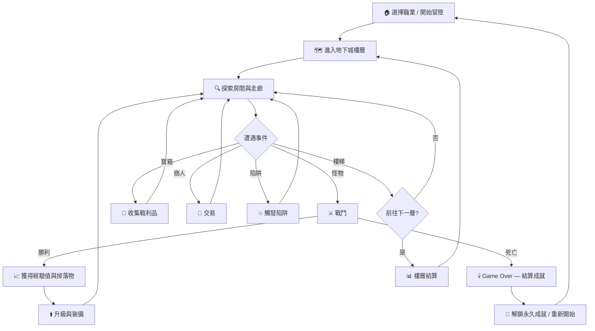

# 01-4 遊戲設計文件 (GDD — Game Design Document)

> **專案名稱**：Pixel Dungeon Quest — 像素風 Roguelike 地下城探索遊戲
> **版本**：v1.0
> **最後更新**：2026-03-22

---

> ⚠️ **範例說明**：本文件為 GDD（遊戲設計文件）範例，使用虛構遊戲專案「Pixel Dungeon Quest」展示文件結構。GDD 為領域選用文件，僅遊戲類專案需要建立。非遊戲專案可跳過此文件。

---

## 目錄

1. [遊戲概述](#1-遊戲概述)
2. [核心遊戲機制](#2-核心遊戲機制)
3. [角色與成長系統](#3-角色與成長系統)
4. [數值設計與平衡](#4-數值設計與平衡)
5. [關卡設計](#5-關卡設計)
6. [UI/UX 設計指引](#6-uiux-設計指引)
7. [音效與視覺風格](#7-音效與視覺風格)
8. [技術需求摘要](#8-技術需求摘要)

---

## 關聯文件

| 文件 | 關係 |
|------|------|
| [`01-1-PRD.md`](./01-1-PRD.md) | 產品需求文件（功能清單與優先級） |
| [`01-2-SRD.md`](./01-2-SRD.md) | 系統需求文件（技術架構與實作細節） |
| [`01-6-UI_UX_Design.md`](./01-6-UI_UX_Design.md) | UI/UX 設計規格（詳細介面設計） |
| [`02-Dev_Plan.md`](./02-Dev_Plan.md) | 開發計畫（任務拆解與排程） |

---

## 1. 遊戲概述

### 1.1 遊戲簡介

Pixel Dungeon Quest 是一款像素風格的 2D Roguelike 地下城探索遊戲。玩家扮演一名冒險者，深入隨機生成的地下城，與各式怪物戰鬥、收集寶物與裝備、提升角色能力，挑戰每一層越來越強大的敵人與 Boss。每次死亡將失去所有進度重新開始，但解鎖的知識與成就會永久保留，鼓勵玩家在一次次嘗試中學習並精進策略。

### 1.2 核心玩法概念（Elevator Pitch）

> 「在隨機生成的像素地下城中，用策略與運氣活下去。每一局都是全新的冒險，每一次死亡都讓你更強。」

### 1.3 目標平台與受眾

| 項目 | 說明 |
|------|------|
| **平台** | Web（HTML5 Canvas / WebGL），支援桌面瀏覽器與行動裝置瀏覽器 |
| **目標解析度** | 基準 960×540，支援自適應縮放至 1920×1080 |
| **目標受眾** | 喜愛 Roguelike、像素風、輕度 RPG 的休閒至中核玩家（18–35 歲） |
| **遊玩時長** | 單局 15–45 分鐘，適合碎片化遊玩 |
| **語言** | 繁體中文、英文 |

### 1.4 開發規模與團隊

| 角色 | 人數 | 職責 |
|------|------|------|
| 遊戲設計師 | 1 | 關卡設計、數值平衡、玩法規劃 |
| 前端工程師 | 2 | 遊戲引擎、渲染系統、UI 實作 |
| 美術設計師 | 1 | 像素角色、地圖 Tileset、UI 素材 |
| 音效設計師 | 1（外包） | BGM、SFX 製作 |
| QA 測試 | 1 | 遊玩測試、數值驗證、Bug 回報 |

---

## 2. 核心遊戲機制

### 2.1 主要遊戲循環



### 2.2 移動與互動系統

- **移動方式**：四方向格子移動（上下左右），每次移動佔一格，觸發一回合
- **鍵盤操作**：方向鍵 / WASD 移動，空白鍵互動，I 開啟背包，M 開啟地圖
- **觸控操作**：滑動移動，點擊目標格自動尋路，雙擊互動
- **互動物件**：門（開啟/關閉）、寶箱（開啟）、樓梯（上下樓層）、NPC（對話/交易）
- **視野系統**：以玩家為中心的迷霧系統（Fog of War），視野半徑 5 格，已探索區域以半透明顯示

### 2.3 戰鬥系統

採用 **回合制** 戰鬥，玩家與怪物交替行動：

| 要素 | 說明 |
|------|------|
| **觸發條件** | 玩家與怪物相鄰時，攻擊方向上的怪物自動交戰 |
| **行動順序** | 依 SPD 屬性決定，SPD 高者先行動；相同時玩家優先 |
| **基本攻擊** | 消耗 1 回合，造成物理傷害 |
| **技能攻擊** | 消耗 MP，造成特殊效果（見 §3.3 技能樹） |
| **道具使用** | 消耗 1 回合，使用藥水、卷軸等消耗品 |
| **逃跑** | 向反方向移動，成功率 = 50% + (玩家SPD − 怪物SPD) × 5% |
| **狀態異常** | 中毒（每回合損失 HP）、燃燒（持續傷害+降低 DEF）、冰凍（跳過 1 回合）、失明（視野降為 1 格） |

### 2.4 地下城程序生成規則

地下城採用 **BSP（Binary Space Partitioning）** 演算法搭配手工調校的模板：

1. **樓層大小**：隨深度遞增，第 1 層 30×30 格，每 5 層增加 10×10
2. **房間生成**：BSP 遞歸分割至最小 5×5 格房間，每層 6–12 個房間
3. **走廊連接**：L 型或直線走廊連接相鄰房間，寬度 1–2 格
4. **特殊房間**：每層保證至少 1 個寶物房、1 個怪物房；每 5 層出現 1 個 Boss 房
5. **裝飾與陷阱**：依樓層主題隨機放置裝飾物（柱子、骨堆、蜘蛛網）與陷阱（地刺、落石、毒氣）
6. **種子系統**：支援指定 Seed 重現相同地圖，方便除錯與競速挑戰

---

## 3. 角色與成長系統

### 3.1 玩家角色屬性

| 屬性 | 縮寫 | 說明 | 初始值範圍 |
|------|------|------|-----------|
| 生命值 | HP | 歸零則死亡 | 80–120 |
| 魔力值 | MP | 使用技能消耗 | 30–60 |
| 攻擊力 | ATK | 物理傷害基礎值 | 8–15 |
| 防禦力 | DEF | 減少受到的物理傷害 | 3–8 |
| 速度 | SPD | 影響行動順序與逃跑成功率 | 5–12 |
| 幸運 | LCK | 影響暴擊率、掉落率、陷阱迴避率 | 1–5 |

### 3.2 職業系統

| 職業 | 特色 | HP | MP | ATK | DEF | SPD | LCK | 專屬被動 |
|------|------|----|----|-----|-----|-----|-----|---------|
| ⚔️ 戰士 | 高血量、高防禦、近戰為主 | 120 | 30 | 12 | 8 | 5 | 2 | **鋼鐵意志**：HP 低於 20% 時 DEF +50% |
| 🔮 法師 | 高魔力、遠程魔法攻擊 | 80 | 60 | 8 | 3 | 7 | 3 | **魔力湧泉**：每擊殺 1 隻怪物回復 5 MP |
| 🗡️ 盜賊 | 高速度、高暴擊、擅長迴避 | 90 | 40 | 10 | 4 | 12 | 5 | **暗影步**：首次攻擊必定暴擊（每層重置） |

### 3.3 升級與技能樹

- **升級機制**：累積經驗值達到門檻後升級，每次升級獲得 3 點屬性點數自由分配
- **技能樹**：每個職業有 3 條分支，每條分支 4 個技能，共 12 個技能

**戰士技能樹範例**：

| 分支 | 技能 1（Lv3） | 技能 2（Lv5） | 技能 3（Lv8） | 技能 4（Lv12） |
|------|-------------|-------------|-------------|--------------|
| 🛡️ 堅守 | 格擋姿態（DEF+30%, 1回合） | 嘲諷（吸引 3 格內怪物攻擊自己） | 堅不可摧（免疫 1 次致命傷害） | 鐵壁（3 回合內受到傷害 -50%） |
| ⚔️ 狂戰 | 猛力一擊（ATK×1.5） | 旋風斬（攻擊周圍 8 格） | 狂暴（ATK+50%, DEF-30%, 5回合） | 處刑者之刃（對 HP<30% 的敵人傷害 ×3） |
| ❤️ 生命 | 自我治療（回復 20% HP） | 生命汲取（傷害的 20% 轉為回復） | 再生光環（每回合回復 3% HP） | 不死鳥（死亡時以 50% HP 復活，每局 1 次） |

### 3.4 裝備系統

**裝備欄位**：武器、護甲、飾品 ×2、消耗品 ×3

**裝備品質**：

| 品質 | 顏色 | 掉落權重 | 屬性加成倍率 |
|------|------|---------|------------|
| 普通 (Common) | ⬜ 白色 | 50% | ×1.0 |
| 精良 (Uncommon) | 🟢 綠色 | 30% | ×1.3 |
| 稀有 (Rare) | 🔵 藍色 | 15% | ×1.7 |
| 史詩 (Epic) | 🟣 紫色 | 4% | ×2.2 |
| 傳說 (Legendary) | 🟠 橙色 | 1% | ×3.0 |

**裝備詞綴系統**：裝備可隨機附加 0–2 個詞綴（如「燃燒的」+火焰傷害、「堅固的」+DEF 加成、「迅捷的」+SPD 加成），增加裝備多樣性與 Build 策略深度。

---

## 4. 數值設計與平衡

### 4.1 傷害公式

```
基礎傷害 = ATK × 武器倍率 − DEF × 0.5
最終傷害 = 基礎傷害 × (1 + 暴擊加成) × 屬性相剋倍率
最低傷害 = 1（保底，確保任何攻擊至少造成 1 點傷害）
```

- **暴擊率** = 5% + LCK × 2%
- **暴擊加成** = +50%（暴擊時）
- **屬性相剋**：火剋冰 ×1.5、冰剋電 ×1.5、電剋火 ×1.5

### 4.2 怪物難度曲線

| 樓層 | 怪物 HP | 怪物 ATK | 怪物 DEF | 怪物 SPD | 經驗值 | 金幣掉落 |
|------|---------|---------|---------|---------|--------|---------|
| 1–5 | 15–40 | 5–10 | 2–4 | 3–5 | 5–15 | 3–10 |
| 6–10 | 40–80 | 10–18 | 4–8 | 5–7 | 15–35 | 10–25 |
| 11–15 | 80–150 | 18–30 | 8–14 | 7–9 | 35–70 | 25–50 |
| 16–20 | 150–280 | 30–50 | 14–22 | 9–11 | 70–130 | 50–100 |
| 21–25 | 280–500 | 50–80 | 22–35 | 11–14 | 130–250 | 100–200 |

### 4.3 經驗值與升級曲線

採用遞增公式，越高等級所需經驗值越多：

```
所需經驗值(Lv) = 50 × Lv × (1 + Lv × 0.15)
```

| 等級 | 累計所需 EXP | 該級所需 EXP | 預計到達樓層 |
|------|------------|------------|------------|
| 1 → 2 | 58 | 58 | 1F |
| 2 → 3 | 188 | 130 | 2F |
| 3 → 4 | 406 | 218 | 3–4F |
| 5 → 6 | 1,098 | 345 | 6–7F |
| 8 → 9 | 2,870 | 558 | 11–12F |
| 10 → 11 | 4,508 | 715 | 14–15F |
| 14 → 15 | 10,568 | 1,163 | 20–21F |

### 4.4 物品掉落率表

| 物品類型 | 一般怪物 | 精英怪物 | Boss |
|---------|---------|---------|------|
| 金幣 | 100% | 100% | 100% |
| 藥水 | 15% | 30% | 80% |
| 裝備（普通） | 8% | 20% | — |
| 裝備（精良） | 3% | 12% | 50% |
| 裝備（稀有） | 0.5% | 5% | 30% |
| 裝備（史詩） | — | 1% | 15% |
| 裝備（傳說） | — | — | 5% |
| 技能書 | 1% | 5% | 40% |

### 4.5 數值平衡原則

1. **可預測死亡**：玩家死亡應源於「策略失誤」而非「數值碾壓」，確保每次死亡都有可檢討的操作空間
2. **風險收益對等**：高風險行為（挑戰強敵、進入隱藏房間）應給予對等的高回報
3. **局內漸強感**：玩家應在每 3–5 層明顯感受到角色變強，維持成長正回饋
4. **職業差異化**：三個職業在同一樓層的通關策略應有本質差異，而非僅數值差異
5. **每週調整**：正式上線後依據玩家數據每週微調數值，單次調整幅度不超過 ±10%

---

## 5. 關卡設計

### 5.1 地下城樓層結構

| 區域 | 樓層 | 主題 | 環境特色 | 常見怪物 | Boss |
|------|------|------|---------|---------|------|
| 🏚️ 廢棄礦坑 | 1–5F | 陰暗潮濕的礦洞 | 塌方路障、礦車軌道、積水地面 | 史萊姆、蝙蝠、巨鼠 | 礦坑守衛者（巨型石傀儡） |
| 🕸️ 蟲穴巢窟 | 6–10F | 蛛網密佈的有機洞穴 | 蛛網減速區、毒氣噴口、卵囊障礙物 | 毒蜘蛛、甲蟲戰士、寄生蟲 | 蟲后（召喚小蟲 + 毒液噴射） |
| 🏛️ 遺忘神殿 | 11–15F | 古代文明的廢墟神殿 | 機關陷阱、傳送法陣、可推動石像 | 骷髏兵、幽靈法師、石像怪 | 墮落祭司（暗屬性魔法 + 召喚亡靈） |
| 🔥 熔岩深淵 | 16–20F | 高溫的地底熔岩區 | 岩漿地形（踩到持續扣血）、噴火口、熱浪減益 | 火焰元素、熔岩犬、紅龍幼體 | 炎魔領主（全場 AOE 火焰風暴） |
| 👑 黑暗王座 | 21–25F | 最終魔王的領地 | 黑暗迷霧（視野 -2）、詛咒地面、傳送陷阱 | 暗影刺客、惡魔騎士、墮天使 | 地下城之王（三階段變身） |

### 5.2 Boss 戰設計

每個 Boss 擁有獨特的戰鬥機制，避免單純的「站樁互砍」：

**範例 — 地下城之王（最終 Boss，25F）**：

| 階段 | 觸發條件 | 行為模式 | 玩家策略 |
|------|---------|---------|---------|
| 第一階段 | HP 100%–60% | 近戰連擊 + 偶爾衝刺 | 拉距離，利用柱子阻擋衝刺 |
| 第二階段 | HP 60%–30% | 召喚 2 隻精英怪 + 範圍暗影爆破 | 優先清小怪，暗影爆破前有 1 回合警告（地面閃光） |
| 第三階段 | HP 30%–0% | 狂暴模式：攻擊×2、速度×1.5，每 3 回合全場詛咒 | 善用藥水與技能爆發輸出，詛咒期間以防禦優先 |

### 5.3 隱藏房間與特殊事件

- **隱藏房間**：每層 10% 機率出現，需在特定牆壁互動才能發現，內含高品質寶物或特殊 NPC
- **祭壇**：獻祭一件裝備可隨機獲得更高品質的裝備（風險收益機制）
- **流浪商人**：隨機出現在安全房間，販售稀有道具，價格較高但物品質量有保證
- **詛咒寶箱**：外觀與普通寶箱相同，開啟後可能觸發怪物伏擊或詛咒效果
- **泉水**：完全回復 HP 與 MP，每層最多出現 1 個，找到即用或保留是策略抉擇

### 5.4 難度遞進設計

1. **引導層（1–3F）**：怪物弱、陷阱少、教學提示多，讓新手熟悉操作
2. **成長層（4–10F）**：逐步引入新怪物種類、陷阱機關、裝備系統
3. **挑戰層（11–20F）**：怪物開始擁有特殊技能、地形變得複雜、資源逐漸稀缺
4. **終局層（21–25F）**：高壓環境，要求玩家充分運用所有系統（技能、裝備、道具）才能通關

---

## 6. UI/UX 設計指引

> 💡 本節提供 UI 設計大方向，詳細的 UI 元件規格、Design Tokens、互動狀態等請參考 [`01-6-UI_UX_Design.md`](./01-6-UI_UX_Design.md)。

### 6.1 HUD 佈局

```
┌─────────────────────────────────────────┐
│ [HP ██████░░░░] [MP ████░░░░░░]  Lv.8  │  ← 頂部狀態列
│                                         │
│                                         │
│            遊 戲 畫 面                    │  ← 中央遊戲區域
│          （地下城視角）                    │
│                                         │
│                                         │
│ [🗡️12] [🛡️6] [💰324]      [F5 深度]    │  ← 底部資訊列
│ [藥水×3] [卷軸×1]     [⚙️] [📦] [🗺️]  │  ← 快捷列 + 功能鍵
└─────────────────────────────────────────┘
```

- **頂部狀態列**：HP/MP 血條 + 等級，戰鬥中額外顯示敵人 HP
- **底部資訊列**：核心數值（ATK/DEF/金幣/樓層）+ 快捷消耗品
- **功能鍵**：設定（⚙️）、背包（📦）、地圖（🗺️）

### 6.2 背包介面

- 格狀排列（4×5 共 20 格），物品以像素圖示顯示
- 長按/右鍵顯示物品詳情（名稱、屬性、稀有度、說明文字）
- 拖放操作裝備穿脫，或點擊使用消耗品
- 背包滿時拾取新物品會彈出「替換選擇」介面

### 6.3 地圖系統

- 按 M 鍵開啟全樓層小地圖，覆蓋在遊戲畫面上方
- 已探索區域正常顯示，未探索區域灰色遮罩
- 標示關鍵地標：樓梯（⬆️/⬇️）、商人（💰）、Boss 房（💀）
- 玩家位置以閃爍圖標標示

---

## 7. 音效與視覺風格

### 7.1 像素風格定義

| 項目 | 規格 |
|------|------|
| 角色 Sprite | 16×16 像素，4 方向各 4 幀行走動畫 |
| 怪物 Sprite | 16×16 ~ 32×32 像素（Boss 為 32×32 或 48×48） |
| 地圖 Tileset | 16×16 像素，每區域一組主題 Tileset |
| UI 圖示 | 16×16 像素，描邊風格 |
| 渲染倍率 | 遊戲內以 3× 或 4× 整數倍放大，保持像素銳利邊緣 |

### 7.2 調色板參考

每個區域使用限定調色板，強化視覺主題：

| 區域 | 主色調 | 色票範例 |
|------|--------|---------|
| 廢棄礦坑 | 土褐 + 暗灰 | `#5C4033` `#8B7355` `#3A3A3A` `#6B6B6B` |
| 蟲穴巢窟 | 墨綠 + 紫褐 | `#2D4A22` `#5E3D6B` `#8B6F47` `#A8C256` |
| 遺忘神殿 | 石灰 + 金黃 | `#A0A0A0` `#C8B560` `#4A4A6A` `#D4AF37` |
| 熔岩深淵 | 橙紅 + 黑灰 | `#FF4500` `#FF6B35` `#2B1B17` `#8B0000` |
| 黑暗王座 | 深紫 + 暗紅 | `#1A0A2E` `#4B0082` `#8B0000` `#C0C0C0` |

### 7.3 音效清單

**BGM（背景音樂）**：

| 編號 | 場景 | 風格 | 時長 | 循環 |
|------|------|------|------|------|
| BGM-001 | 主選單 | 神秘奇幻，帶弦樂 | 90s | ✅ |
| BGM-002 | 廢棄礦坑 | 低沉環境音，水滴回聲 | 120s | ✅ |
| BGM-003 | 蟲穴巢窟 | 詭異不安，蟲鳴點綴 | 120s | ✅ |
| BGM-004 | 遺忘神殿 | 莊嚴空靈，合唱感 | 120s | ✅ |
| BGM-005 | 熔岩深淵 | 激昂鼓點，緊張節奏 | 120s | ✅ |
| BGM-006 | 黑暗王座 | 壓迫感重，管風琴 | 120s | ✅ |
| BGM-007 | Boss 戰 | 快節奏戰鬥曲 | 90s | ✅ |
| BGM-008 | Game Over | 悲傷短曲 | 15s | ❌ |
| BGM-009 | 通關結局 | 壯闘凱旋曲 | 30s | ❌ |

**SFX（音效）**：

| 類別 | 音效名稱 | 觸發時機 |
|------|---------|---------|
| 戰鬥 | sword_slash | 近戰攻擊 |
| 戰鬥 | magic_cast | 施放魔法 |
| 戰鬥 | arrow_hit | 遠程攻擊命中 |
| 戰鬥 | critical_hit | 暴擊命中 |
| 戰鬥 | enemy_death | 怪物死亡 |
| 互動 | chest_open | 開啟寶箱 |
| 互動 | door_open | 開啟門 |
| 互動 | item_pickup | 拾取物品 |
| 互動 | level_up | 角色升級 |
| 環境 | footstep_stone | 石板上行走 |
| 環境 | footstep_water | 涉水行走 |
| 環境 | trap_trigger | 觸發陷阱 |
| UI | menu_select | 選單選擇 |
| UI | menu_confirm | 選單確認 |
| UI | inventory_equip | 裝備穿戴 |

---

## 8. 技術需求摘要

### 8.1 與 SRD / SDD 的關係

本文件（GDD）專注於**遊戲設計層面**的定義，包含玩法機制、數值規劃、關卡設計與美術風格。具體的**技術實作方案**（如程序生成演算法的實現、渲染管線架構、網路同步機制等）應記錄於以下文件：

| 文件 | 負責範圍 |
|------|---------|
| `01-2-SRD.md`（系統需求文件） | 技術架構、資料庫設計、API 設計、部署架構 |
| SDD（系統設計文件，如需要） | 模組詳細設計、類別圖、序列圖 |

GDD 中的設計需求將作為 SRD/SDD 的輸入，確保技術方案能正確支撐遊戲設計。

### 8.2 關鍵技術挑戰

| 挑戰 | 說明 | GDD 相關章節 |
|------|------|-------------|
| **程序生成** | BSP 演算法實現地下城隨機生成，需確保每局地圖可玩且平衡 | §2.4、§5.1 |
| **碰撞偵測** | 格子系統碰撞判定、視野計算（Fog of War 演算法） | §2.2 |
| **數值引擎** | 傷害公式計算、狀態異常堆疊、裝備屬性加成的正確運算 | §4.1、§2.3 |
| **存檔機制** | Roguelike 的存檔需防止 Save Scumming（讀檔作弊），採用離開時自動存檔、讀取後刪檔策略 | — |
| **效能優化** | 大量怪物同時存在時的 AI 尋路效能、Canvas 渲染效能 | §5.1 |
| **跨平台輸入** | 同時支援鍵盤/滑鼠與觸控操作，UI 需自適應 | §2.2、§6.1 |

---

## 版本修訂說明

| 版本 | 日期 | 修訂內容 | 作者 |
|------|------|---------|------|
| v1.0 | 2026-03-22 | 初版建立，包含遊戲概述、核心機制、角色系統、數值設計、關卡設計、UI/UX 指引、音效視覺風格、技術摘要 | 遊戲設計師 |
