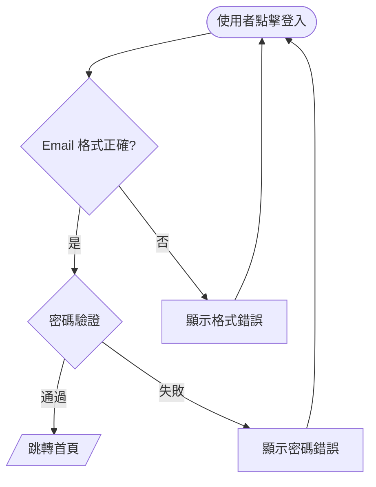

# UI/UX 規格文件撰寫指引（給 AI 閱讀）

> **目的**：定義撰寫 `01-6-UI_UX_Design.md` 與搭配 `/docs/ui/*.html` wireframe 時必須遵循的格式準則，確保產出的規格文件能被 AI 助手正確解析與執行。
>
> **主要讀者**：AI 助手（Claude Code、Gemini、Cursor 等）。次要讀者：開發者審閱。

---

## 來源說明

本指引由 Vibe-SDLC 維護者與多個 AI 助手（Claude、Gemini 等）對話討論
「如何撰寫對 AI 友善的 UI/UX 規格文件」後，萃取實用觀點整理而成。
非單一文獻出處，屬於 Vibe-SDLC 內部經驗累積文件，會隨實務驗證持續迭代。

---

## 關鍵字慣例

本指引使用 **MUST / MUST NOT / SHOULD / SHOULD NOT / MAY**（參考 RFC 2119 語意）：

| 關鍵字 | 語意 |
|--------|------|
| **MUST** | 絕對要求。違反代表規格文件不合格，審查會列為阻擋項 |
| **MUST NOT** | 絕對禁止 |
| **SHOULD** | 強烈建議。若違反必須在規格文件中寫明理由 |
| **SHOULD NOT** | 強烈反對 |
| **MAY** | 可選項，依專案需要決定 |

---

## 適用範圍

| 情境 | 是否適用 |
|------|---------|
| 撰寫 `/docs/01-6-UI_UX_Design.md` | **MUST** 遵循全部準則 |
| 撰寫 `/docs/ui/*.html` wireframe | **MUST** 遵循準則 9 與 HTML 模板 |
| Phase 1 規格交叉審查 | **MUST** 逐條對照本指引產出審查報告 |
| 既有 UI/UX 規格文件重構 | **SHOULD** 逐步遷移至本指引格式 |

---

## 格式分工矩陣

AI 撰寫 UI/UX 規格時，**MUST** 依照以下表格選擇正確格式：

| 要傳達的內容 | 正確格式 | 對應準則 |
|------|---------|---------|
| 全局結構與層級 | Markdown 標題 + 表格 | §1 |
| 流程 / 狀態轉換 / 頁面跳轉 | **Mermaid flowchart** | §2 |
| 元件語意與屬性 | Markdown 表格（名稱 / 樣式 / 行為） | §3、§4 |
| 表單欄位契約 | Markdown 結構化表格 | §5 |
| 條件渲染邏輯 | Markdown 獨立小節 | §6 |
| 元件庫指名 | Markdown 直接寫出函式庫與元件名稱 | §8 |
| **視覺空間感 / 佈局比例** | **HTML + Tailwind 獨立檔** | **§9** |

**核心原則**：Markdown 負責「說清楚」，Mermaid 負責「畫清楚流程」，HTML 負責「看清楚空間」。三者互補，AI 讀到哪一種都能正確處理。

---

## 9 條準則

### 準則 1：結構分層由大到小

**規則**：AI 撰寫 UI/UX 規格 **MUST** 依照「整體目標 → 頁面清單 → 單頁佈局 → 元件細節」順序組織內容。**MUST NOT** 在尚未建立全局觀前就跳進按鈕顏色等細節。

**理由**：AI 需要先建立全局心智模型才能正確處理細節，直接跳進細節會導致元件與頁面脫節。

**❌ 錯誤範例**：
```markdown
## 按鈕樣式
主按鈕顏色 #00C896、radius 8px。
## 頁面清單
首頁、設定頁...
```
（先講元件再講頁面，層級倒置）

**✅ 正確範例**：
```markdown
## 1. 設計原則
Mobile-first、低摩擦互動...

## 2. 頁面清單
| 路由 | 頁面 | 說明 |
| `/` | 首頁 | ... |

## 3. 單頁佈局
### 3.1 首頁 `/`
#### 3.1.1 Header
#### 3.1.2 預算卡片
```

**🔍 自檢方法**：檢查文件目錄，前三層標題必須依序出現「設計原則 → 頁面清單 → 單頁佈局」類的結構。若按鈕、元件細節標題出現在頁面清單之前，規則違反。

---

### 準則 2：用 Mermaid 描述流程，不用圖片

**規則**：頁面跳轉邏輯、對話流、狀態機、操作流程 **MUST** 使用 Mermaid flowchart 文字圖。**MUST NOT** 使用圖片（.png / .jpg / .svg）、ASCII 箭頭藝術、或純文字描述。

**理由**：AI 能直接解析 Mermaid 節點與關係；圖片需要 OCR 無法保證準確；ASCII 箭頭無法表達分支與狀態。

**❌ 錯誤範例**：
```
使用者點擊 [登入]
  ↓
驗證 email 格式
  ↓
成功 → 跳轉首頁
失敗 → 顯示錯誤訊息
```

**✅ 正確範例**：
````markdown

````

**🔍 自檢方法**：`grep -c "mermaid" 01-6-UI_UX_Design.md` 的結果必須 ≥ 頁面跳轉與對話流章節數量。若文件中出現 `↓`、`→` 等箭頭字元作為流程描述，規則違反。

---

### 準則 3：元件描述用語意，不用位置

**規則**：描述元件時 **MUST** 使用語意（角色、功能、互動結果），**MUST NOT** 使用純空間座標（左上角、右側、下方）。

**理由**：位置描述在響應式設計中會改變，語意描述才能跨螢幕尺寸穩定。AI 根據語意生成的程式碼更接近設計意圖。

**❌ 錯誤範例**：
```
右上角藍色按鈕：文字「登入」
```

**✅ 正確範例**：
```markdown
| 元件 | 角色 | 樣式 | 行為 |
|------|------|------|------|
| `[登入按鈕]` | Header primary action | `primary` 樣式、`--color-primary` 背景 | 點擊跳轉 `/login` |
```

**例外**：描述佈局結構時（如「Header 採用 flex justify-between」）**MAY** 使用方向詞，但必須搭配語意角色（Header、Sidebar、Footer）而非純方位。

**🔍 自檢方法**：搜尋「左上角 / 右上角 / 左側 / 右側 / 左對齊 / 右對齊」等純方位詞。若這些詞彙出現在元件描述段落（而非佈局結構說明），規則違反。

---

### 準則 4：狀態要完整列出

**規則**：每個互動元件 **MUST** 列出所有可能狀態。互動元件的狀態清單 **MUST** 至少包含 `default`、`hover`、`active`、`disabled`、`loading`、`error` 六種（若該元件會觸發該狀態）。

**理由**：AI 生成條件渲染邏輯時需要知道所有分支。遺漏狀態會導致實作缺少必要的 UI 反饋。

**❌ 錯誤範例**：
```
送出按鈕：點擊後提交表單
```

**✅ 正確範例**：
```markdown
| 狀態 | 視覺 | 互動 |
|------|------|------|
| `default` | `--color-primary` 背景、白色文字 | 可點擊 |
| `hover` | `--color-primary-dark` 背景 | 游標指標 |
| `active` | `--color-primary-dark` 背景 + scale(0.98) | — |
| `disabled` | `--color-text-tertiary` 背景、無 shadow | 無互動 |
| `loading` | 顯示 spinner 取代文字 | 禁止重複點擊 |
| `error` | border `--color-danger`、右側顯示錯誤 icon | 顯示錯誤訊息 toast |
```

**🔍 自檢方法**：每個「按鈕 / 輸入框 / 表單」元件段落必須包含 state 表格，且行數 ≥ 3（至少 default + 一個非預設狀態 + error 或 disabled）。

---

### 準則 5：欄位用結構化描述

**規則**：表單欄位 **MUST** 使用結構化表格描述，表格欄位 **MUST** 至少包含：`名稱`、`類型`、`必填`、`驗證規則`、`錯誤訊息`、`說明`。**MUST NOT** 用自然語言模糊描述。

**理由**：AI 生成表單驗證邏輯需要明確的 schema。自然語言描述會導致驗證規則解析歧義。

**❌ 錯誤範例**：
```
登入頁有 email 和密碼欄位，email 要是有效格式，密碼不能太短。
```

**✅ 正確範例**：
```markdown
| 欄位名稱 | 類型 | 必填 | 驗證規則 | 錯誤訊息 | 說明 |
|---------|------|------|----------|---------|------|
| `email` | `email` | ✅ | RFC 5322 格式 / 最大 254 字元 | 「請輸入有效的 Email 格式」 | 作為帳號識別 |
| `password` | `password` | ✅ | 長度 8–64 / 需包含英文字母與數字 | 「密碼需 8 碼以上並包含英文字母與數字」 | 提交前不明文顯示 |
| `remember_me` | `checkbox` | ❌ | — | — | 勾選後 30 天內自動登入 |
```

**🔍 自檢方法**：每個包含表單的頁面章節 **MUST** 有一個欄位表格，表格欄位 **MUST** 包含「類型、必填、驗證規則」三個核心欄位。

---

### 準則 6：分離「呈現」與「邏輯」

**規則**：元件的視覺呈現（樣式、顏色、尺寸）與顯示邏輯（在什麼條件下出現、隱藏、變形）**MUST** 分開描述。**SHOULD** 使用兩個獨立小節或兩張獨立表格。

**理由**：AI 生成條件渲染程式碼（`{condition && <Component />}`、`v-if`、`*ngIf`）時，需要明確區分「長什麼樣」與「什麼時候顯示」。混在一起會導致 AI 把樣式條件寫進 render logic，或把 render 條件寫進 style。

**❌ 錯誤範例**：
```
AI 回饋卡片：綠色背景、圓角 16px、當預算剩餘 < 20% 時背景變紅、使用者未登入時隱藏、padding 16px
```

**✅ 正確範例**：
```markdown
#### AI 回饋卡片

**呈現（樣式）**：
| 屬性 | 值 |
|------|---|
| 背景 | `--color-primary-light` |
| radius | `--radius-lg` |
| padding | `--space-lg` |

**呈現變體（根據資料）**：
| 條件 | 樣式變化 |
|------|---------|
| `budget_remaining < 20%` | 背景改為 `--color-danger-light`、border 1px `--color-danger` |

**顯示邏輯（何時出現）**：
- `user.logged_in === true` **且**
- `transactions.length > 0` **且**
- `ai_feedback !== null`
```

**🔍 自檢方法**：元件段落必須有「呈現」和「顯示邏輯」兩個子標題（或兩張獨立表格）。若單一段落同時描述「在什麼條件下」與「長什麼樣」，規則違反。

---

### 準則 7：避免「如圖所示」

**規則**：所有規格說明 **MUST** 自足（self-contained），**MUST NOT** 依賴外部截圖、設計稿連結、Figma 嵌入才能理解。若有 Figma 圖作為視覺參考，**MUST** 額外補充完整文字說明。

**理由**：AI 無法可靠地讀取 Figma 連結或截圖內容。規格文件必須僅靠文字就能被 AI 理解並生成程式碼。

**❌ 錯誤範例**：
```
首頁佈局如圖所示（見 Figma）。
```

**✅ 正確範例**：
```markdown
首頁採用垂直堆疊佈局，由上至下：

1. Header（高度 56px）
2. 預算卡片（margin-top `--space-lg`）
3. AI 回饋卡片（margin-top `--space-md`）
4. 最近帳目列表（可滾動區域，flex: 1）
5. 輸入區（固定於 Tab Bar 上方）
6. Tab Bar（固定底部，高度 56px + safe-area）

> 視覺參考：[ui/home.html](./ui/home.html)
```

**🔍 自檢方法**：搜尋「如圖所示 / 見圖 / 詳見 Figma / 見附圖」等詞彙。若出現且未搭配完整文字說明，規則違反。

**例外**：**MAY** 在規格書中 link 到 `/docs/ui/*.html` wireframe 作為視覺參考（見準則 9），但 markdown 規格書本身必須自足——移除 link 後 AI 仍能獨立理解。

---

### 準則 8：指名元件庫

**規則**：若專案使用 UI 元件庫（shadcn/ui、Radix、MUI、Ant Design、Chakra UI 等），**MUST** 在元件描述中直接指名元件庫與元件名稱。**SHOULD NOT** 只描述視覺樣式而不指明元件庫。

**理由**：指名元件庫比視覺描述更精確——AI 能直接套用元件庫的 API 與 props，而不需要自行造輪。

**❌ 錯誤範例**：
```
彈出對話框，背景半透明遮罩，中央白色圓角容器，包含標題、內容與兩個按鈕。
```

**✅ 正確範例**：
```markdown
**元件庫**：使用 shadcn/ui `Dialog` 元件

**組成**：
| slot | 元件 | 內容 |
|------|------|------|
| `DialogTrigger` | `Button variant="outline"` | 觸發按鈕 |
| `DialogHeader` + `DialogTitle` | — | 「確認刪除」 |
| `DialogDescription` | — | 「此操作無法復原」 |
| `DialogFooter` | `Button variant="destructive"` + `Button variant="ghost"` | 確認 / 取消 |
```

**🔍 自檢方法**：若規格文件所屬專案 `package.json` 中有 `@radix-ui`、`shadcn`、`@mui`、`antd`、`@chakra-ui` 等依賴，則元件描述段落必須至少出現一次該元件庫名稱。

**例外**：若專案使用純 Tailwind 或自建元件，**MUST** 在文件頂部聲明「本專案未使用外部 UI 元件庫」並提供自建元件清單。

---

### 準則 9：視覺空間感用 HTML + Tailwind

**規則**：Wireframe / Mockup（視覺空間參考）**MUST** 採用單檔 HTML + Tailwind CDN 格式，**MUST NOT** 使用 Figma 截圖、.png 圖片或 ASCII 框圖作為主要視覺參考來源。HTML 檔 **MUST** 放置於 `/docs/ui/` 目錄，並由 markdown 規格書以 relative link 引用。

**理由**：
- AI 能直接生成 HTML + Tailwind，無需中間工具
- 瀏覽器直接預覽，零建置依賴
- Tailwind utility class 本身即為語意層描述（`flex justify-between p-4`），對齊準則 3
- 可版本控制，diff 可讀
- 與 markdown 規格書分離，職責清楚

**HTML 是視覺參考，markdown 規格書才是實作權威**。AI 實作時若兩者有衝突，**MUST** 以 markdown 規格書為準。

#### 9.1 檔案放置

| 項目 | 規則 |
|------|------|
| 目錄 | `/docs/ui/` |
| 檔名 | 與 markdown 規格書 §3.x 頁面一對一，例如 `home.html`、`stats.html`、`settings.html` |
| 引用方式 | markdown 規格書每個 §3.x 開頭 **MUST** 加一行：`> 視覺參考：[ui/{page}.html](./ui/{page}.html)（當前保真度：wireframe\|mockup）` |

#### 9.2 HTML 檔案結構模板

每個 wireframe HTML 檔 **MUST** 遵循以下模板：

```html
<!DOCTYPE html>
<html lang="zh-Hant">
<head>
  <meta charset="UTF-8">
  <meta name="viewport" content="width=device-width, initial-scale=1.0">
  <meta name="fidelity" content="wireframe">
  <meta name="spec-ref" content="../01-6-UI_UX_Design.md#3-1-首頁">
  <title>{頁面名稱} - Wireframe</title>
  <script src="https://cdn.tailwindcss.com"></script>
  <script>
    tailwind.config = {
      theme: {
        extend: {
          colors: {
            // 從 01-6-UI_UX_Design.md §2 Design Tokens 同步
            primary: '#00C896',
            'primary-light': '#E6FAF3',
            'primary-dark': '#00A67A',
            danger: '#FF4757',
            // ...
          },
          borderRadius: {
            'sm': '8px',
            'md': '12px',
            'lg': '16px',
            'xl': '20px',
          },
          spacing: {
            'xs': '4px',
            'sm': '8px',
            'md': '12px',
            'lg': '16px',
          }
        }
      }
    }
  </script>
</head>
<body class="bg-gray-100 font-sans">
  <!-- Wireframe 內容 -->
</body>
</html>
```

#### 9.3 保真度分層

| 保真度 | 說明 | Palette 約束 | meta 值 |
|--------|------|-------------|---------|
| **wireframe** | 低保真線框，只傳達佈局與層級 | **MUST** 使用 `gray-*` 灰階，**MUST NOT** 使用彩色（除了單一主色作為 CTA 標示） | `<meta name="fidelity" content="wireframe">` |
| **mockup** | 中/高保真模型，展示真實配色與字體 | **MAY** 使用完整 Design Tokens palette | `<meta name="fidelity" content="mockup">` |

**目錄不分層**：一律放 `/docs/ui/`，保真度由 meta tag 與 markdown 規格書標注決定。從 wireframe 升級到 mockup 時，原地修改同一份 HTML 並更新 meta。

#### 9.4 HTML 最小化原則

**MUST NOT** 在 wireframe HTML 中：
- 加入與佈局無關的 JavaScript 互動邏輯
- 使用複雜動畫或 transition
- 引入外部圖片資源（使用 emoji 或 `bg-gray-300` 佔位方塊取代）
- 過度巢狀 div 結構

**SHOULD** 保持：
- 每個元件對應 markdown 規格書一個段落
- Class 最小化，只用傳達佈局必要的 utility
- Semantic HTML（`<header>`、`<main>`、`<nav>` 等）

#### 9.5 自檢方法

1. `grep -c 'fidelity' /docs/ui/*.html` — 每個檔案都 **MUST** 有 meta fidelity
2. `grep -c 'spec-ref' /docs/ui/*.html` — 每個檔案都 **MUST** 有 meta spec-ref 指回 markdown
3. 在 markdown 規格書中 `grep '視覺參考：\[ui/'` — 每個 §3.x 頁面章節都 **MUST** 有引用
4. wireframe 階段：`grep -E 'bg-(red|blue|green|yellow|purple|pink)-' *.html` 結果應為空（或僅少量 CTA）

#### 9.6 元件層級 anchor 規範

若 markdown 規格書 §3.x 頁面章節下有子元件（§3.x.y），則對應 HTML wireframe 中每個結構性 `<section>` / `<header>` / `<footer>` / `<nav>` **MUST** 具備 `id` 屬性，且 markdown 子元件章節 **MUST** 以 `ui/{page}.html#{anchor}` 形式 link 引用。

**理由**：規格書的粒度是元件（§3.1.2 Budget Card），HTML 的粒度是整頁。若不提供 anchor，AI 實作某個子元件時只能讀整頁 HTML 然後「猜」哪一段對應——這是不保證的。Anchor 讓兩邊粒度對齊，AI 可直接定位視覺參考。

**命名規則**：

| 規則 | 說明 |
|------|------|
| 使用語意 kebab-case | `budget-card`、`ai-feedback`、`recent-transactions` |
| 不使用章節編號 | **MUST NOT** 用 `3-1-2-budget-card`，避免章節重編時失效 |
| 檔案作為 namespace | 允許不同頁面使用相同 id（`home.html#footer` 與 `login.html#footer` 並不衝突） |
| 一對一對應 | 每個結構性 `<section>` 對應 markdown 一個子元件章節 |

**例外（不需要 anchor 的子章節）**：

| 類型 | 說明 |
|------|------|
| Design Tokens | `§2` 的色彩、字體、間距、圓角、陰影等純數值對照表 |
| 資料對照表 | 類別色彩表、錯誤碼對照、API 狀態碼等數據 |
| 說明性章節 | 響應式設計斷點、無障礙規範、國際化策略等規範類文字 |

**理由**：這些章節是「規則／資料」而非「視覺元件」，硬湊視覺 anchor 反而誤導 AI。

**✅ 正確範例**：

```markdown
#### 3.1.2 預算卡片 (Budget Card)

> 視覺參考：[ui/home.html#budget-card](./ui/home.html#budget-card)

| 元素 | 規格 |
|------|------|
| ...
```

對應的 HTML：

```html
<!-- §3.1.2 預算卡片 -->
<section id="budget-card" class="bg-white rounded-lg shadow-sm p-lg" aria-label="預算卡片">
  ...
</section>
```

**❌ 錯誤範例**：

```markdown
#### 3.1.2 預算卡片 (Budget Card)

（直接寫元件規格，未提供視覺參考 anchor）
```

此時 AI 實作 Budget Card 必須整份 `home.html` 讀完再猜，或乾脆忽略視覺參考只靠文字規格實作——違反本準則。

**自檢方法**：

1. 列出所有有 §3.x.y 子元件的頁面：`grep -E '^#### 3\.[0-9]+\.[0-9]+' 01-6-UI_UX_Design.md`
2. 列出所有 HTML 的 id：`grep -oE 'id="[a-z-]+"' ui/*.html | sort -u`
3. 兩邊一一對應：每個視覺型子元件章節都應能在對應 HTML 中找到 id
4. markdown 中 `grep '視覺參考：\[ui/.*#'` 的結果數量應 ≥ 視覺型子元件數量

---

## HTML Wireframe 快速樣板

AI 首次產生 wireframe 時 **MUST** 以此樣板為起點：

```html
<!DOCTYPE html>
<html lang="zh-Hant">
<head>
  <meta charset="UTF-8">
  <meta name="viewport" content="width=device-width, initial-scale=1.0, viewport-fit=cover">
  <meta name="fidelity" content="wireframe">
  <meta name="spec-ref" content="../01-6-UI_UX_Design.md#{anchor}">
  <title>{頁面名稱} - Wireframe</title>
  <script src="https://cdn.tailwindcss.com"></script>
</head>
<body class="bg-gray-100 min-h-screen font-sans text-gray-700">
  <div class="max-w-md mx-auto bg-white min-h-screen shadow-sm">
    <!-- Header -->
    <header class="h-14 border-b border-gray-200 flex items-center justify-between px-4">
      <div class="flex items-center gap-2">
        <div class="w-8 h-8 bg-gray-300 rounded"></div>
        <span class="text-sm font-medium text-gray-700">{標題}</span>
      </div>
    </header>

    <!-- Main content -->
    <main class="p-4 space-y-4">
      <!-- 每個區塊對應規格書一個 §3.x.y 元件 -->
    </main>

    <!-- Bottom Tab Bar -->
    <nav class="fixed bottom-0 left-0 right-0 max-w-md mx-auto h-14 bg-white border-t border-gray-200 flex">
      <!-- tabs -->
    </nav>
  </div>
</body>
</html>
```

---

## 自檢 Checklist（AI 產出規格後必跑）

AI 完成 UI/UX 規格撰寫後，**MUST** 對照以下 checklist 自檢，並在回覆中明確回報每一項的通過與否：

```markdown
- [ ] §1 結構分層：設計原則 → 頁面清單 → 單頁佈局 順序正確
- [ ] §2 Mermaid：所有流程/對話流/頁面跳轉使用 mermaid flowchart（無 ASCII 箭頭藝術）
- [ ] §3 語意描述：元件描述無「左上角 / 右側」等純方位詞
- [ ] §4 狀態完整：每個互動元件有 state 表格（default + 非預設狀態 + error/disabled）
- [ ] §5 欄位結構化：每個表單頁面有欄位表格（名稱/類型/必填/驗證/錯誤訊息/說明）
- [ ] §6 呈現邏輯分離：元件有「呈現」與「顯示邏輯」兩個子標題或表格
- [ ] §7 自足：文件無「如圖所示 / 見 Figma」類外部依賴描述
- [ ] §8 元件庫指名：若專案用元件庫已明確指名元件庫與元件名
- [ ] §9 HTML wireframe：每個 §3.x 頁面有對應 `/docs/ui/*.html` 且 markdown 已 link
- [ ] HTML wireframe 有 meta fidelity 與 spec-ref
- [ ] §9.6 元件 anchor：每個視覺型 §3.x.y 子元件章節有對應 `ui/{page}.html#{anchor}` link；HTML 對應 section 有 `id` 屬性
```

---

## 對 skill.md 審查階段的要求

Phase 1 規格交叉審查階段（`vibe-sdlc-spec/skill.md` §8）**MUST** 將本指引的 9 條準則加入審查清單，並在 `03-Docs_Review_Report.md` 中逐條回報符合度。

---

## 版本紀錄

| 版本 | 日期 | 變更 |
|------|------|------|
| v1.0 | 2026-04-09 | 初版，定義 9 條準則與 HTML wireframe 模板 |
