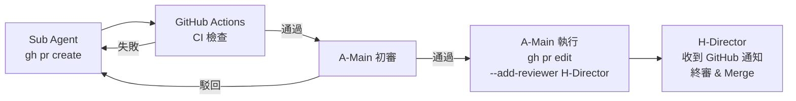

# Phase 1：定義規格文件與計畫

## 目的

建立專案的完整真相來源（Single Source of Truth）。此階段應充分與開發者討論，生成高品質規格文件與計畫，所有後續工作皆以此為依據。

## 你的角色

你是 AI 助手（執行者）。在此階段你的職責是：
- 協助開發者撰寫與完善規格文件
- 交叉比對四份規格文件，找出不一致或遺漏
- 產出完整性審查報告

**你不應該**：在需求定義階段自行決定商業需求或技術選型，這些應該在需求完成後與開發者討論後進行決策。

## 前置條件

- 工作目錄已確立（可為空目錄；若本地 git 倉庫、`CLAUDE.md`、`/docs` 目錄皆不存在，skill 會自動進入「空專案初始化」流程）
- GitHub 倉庫可選（若缺，會在初始化面板中提示由使用者手動建立）

## 交付物

| 文件 | 檔名 | 存放路徑 | 類型 | 說明 |
|------|------|----------|------|------|
| 文件入口與導航 | `00-Docs_Index.md` | `/docs/00-Docs_Index.md` | 必要 | 規格文件導航索引，列出所有文件清單、建立/更新時機、依賴關係 |
| 產品需求文件 (PRD) | `01-1-PRD.md` | `/docs/01-1-PRD.md` | 必要 | 偏重產品面或客戶的需求及要求，可能衍生 UI/UX 需求 |
| 系統需求文件 (SRD) | `01-2-SRD.md` | `/docs/01-2-SRD.md` | 必要 | 非功能性需求（NFR）、部署要求、約束與安全合規 |
| 系統設計文件 (SDD) | `01-3-SDD.md` | `/docs/01-3-SDD.md` | 必要 | 系統架構、元件設計、數據模型、技術決策記錄（ADR） |
| 遊戲設計文件 (GDD) | `01-4-GDD.md` | `/docs/01-4-GDD.md` | 領域選用 | 遊戲專案專用：核心機制、數值設計、關卡設計。僅遊戲類專案需要 |
| API 介面規格 | `01-5-API_Spec.md` | `/docs/01-5-API_Spec.md` | 必要 | API 規格說明 |
| API 介面合約 | `API_Spec.yaml` | `/docs/API_Spec.yaml` | 必要 | OpenAPI 規格 |
| UI/UX 設計文件 | `01-6-UI_UX_Design.md` | `/docs/01-6-UI_UX_Design.md` | 選用 | UI/UX 設計規格（視覺風格、互動流程、Design Tokens），若 PRD 衍生 UI/UX 需求時建立。撰寫前 **必須** 先讀 [`references/UI_UX_Writing_Guidelines.md`](./references/UI_UX_Writing_Guidelines.md) |
| UI Wireframe | `ui/{page}.html` | `/docs/ui/*.html` | 選用 | 每個頁面一檔的 HTML + Tailwind CDN 視覺參考，由 `01-6-UI_UX_Design.md` 以 link 引用（規則詳見 UI_UX_Writing_Guidelines.md §9） |
| 開發執行計畫 | `02-Dev_Plan.md` | `/docs/02-Dev_Plan.md` | 必要 | 里程碑、任務拆解、依賴關係 |
| 規格審查報告 | `03-Docs_Review_Report.md` | `/docs/03-Docs_Review_Report.md` | 必要 | 交叉比對結果、不一致與遺漏項目 |
| CI/CD 規格文件 | `04-CI_CD_Spec.md` | `/docs/04-CI_CD_Spec.md` | 選用 | CI Workflow 定義、品質閘門、Docker 部署配置（複雜專案建議獨立，Dev Plan 以連結引用） |

**重要**：
- 每項規格都應賦予**規格編號**以利後續追蹤與討論。
- 每個任務都應賦予**任務編號**以利後續追蹤與討論。

### UI/UX 設計文件撰寫準則

若需建立 `01-6-UI_UX_Design.md`，AI 助手**必須**先讀取 [`references/UI_UX_Writing_Guidelines.md`](./references/UI_UX_Writing_Guidelines.md) 並遵循該指引的 9 條準則撰寫。指引重點：

1. **結構、狀態、欄位、呈現邏輯、元件庫指名**：以 markdown 表格結構化描述（準則 1–8）
2. **流程圖**：頁面跳轉、對話流、狀態機一律使用 Mermaid flowchart，**不使用** ASCII 箭頭或圖片（準則 2）
3. **視覺空間感**：使用 **HTML + Tailwind CDN** 獨立檔案，放置於 `/docs/ui/`，由 markdown 規格書以 relative link 引用（準則 9）
4. 每條準則均附自檢方法，AI 產出後必須對照指引末段 checklist 自檢

**UI/UX 產出物結構**：
- `/docs/01-6-UI_UX_Design.md` — 規格權威（markdown，AI 實作時以此為準）
- `/docs/ui/{page}.html` — 視覺參考（每個 §3.x 頁面對應一檔，低保真 wireframe 使用灰階 palette）

**核心原則**：markdown 規格書是實作權威，HTML wireframe 是視覺輔助。兩者衝突時以 markdown 為準。

### 版本修訂記錄格式規範

所有 `/docs` 規格文件皆須包含版本管理資訊，格式如下：

#### 文件開頭（必要）

```markdown
> **版本**：v{major}.{minor}
> **最後更新**：{YYYY-MM-DD}
```

#### 文件結尾 — 版本修訂說明表格（必要）

```markdown
---

## 版本修訂說明

| 版本 | 日期 | 修訂內容 |
|------|------|---------|
| v1.0 | 2026-03-16 | 初版定稿 |
| v1.1 | 2026-03-21 | {修訂摘要，列出新增/修改的章節與內容} |
```

#### 版本號規則

| 變更類型 | 版本遞進 | 範例 |
|---------|---------|------|
| 新增功能需求（如新增 PRD-F-XXX） | minor +1 | v1.0 → v1.1 |
| 修正錯誤、補充遺漏、格式調整 | minor +1 | v1.1 → v1.2 |
| 重大架構變更、破壞性修改 | major +1 | v1.2 → v2.0 |

#### 修改規格文件時的必要動作

每次修改 `/docs` 下的規格文件時，**必須同步更新以下三處**：

1. 文件開頭的 **版本號**（遞進）
2. 文件開頭的 **最後更新日期**（改為當天）
3. 文件結尾的 **版本修訂說明表格**（新增一行，摘要說明本次修訂內容）

> **注意**：OpenAPI YAML 檔（如 `API_Spec.yaml`）的版本號寫在 `info.version` 欄位，修訂說明寫在 `info.description` 欄位中。

### 參考範例

請參考 examples/docs/ 目錄下的文件。

## 操作步驟

| 步驟 | 執行者 | 操作 | 產出 |
|------|--------|------|------|
| 0 | **開發者** | 建立文件入口：初始化 Docs Index，登錄預計建立的文件清單 | `00-Docs_Index.md` |
| 1 | **開發者** | 撰寫 PRD：定義功能清單、使用者故事、資料欄位，並與開發者討論並優化 PRD | `01-1-PRD.md` |
| 2 | **開發者** | 撰寫 SRD：當 PRD 定義完成後，定義非功能性需求（NFR）、部署要求、約束與安全合規 | `01-2-SRD.md` |
| 3 | **開發者** | 撰寫 SDD：當 SRD 定義完成後，定義系統架構、技術棧選型、數據模型、設計決策記錄（ADR） | `01-3-SDD.md` |
| 4 | **開發者** | 定義 API Spec：以 OpenAPI 格式定義所有端點、請求/回應結構 | `01-5-API_Spec.md`, `API_Spec.yaml` |
| 5 | **開發者** | 撰寫 Dev Plan：當 PRD、SRD、SDD、API Spec 定義完成後，拆解里程碑、任務清單、任務間依賴關係 | `02-Dev_Plan.md` |
| 6 | **開發者** | 確認以上文件均已提交至 `/docs` 目錄並推送至倉庫 | Git commit & push to Github (or Gitlab) |
| 7 | **AI 助手** | 交叉比對 `/docs` 下規格文件，產出完整性審查報告 | 審查報告 |
| 8 | **開發者** | 審閱報告，修正規格缺漏後重新提交 | 最終版規格 |

> **SRD 與 SDD 的分工**：SRD 定義「系統應該達到的需求與約束」（如性能目標、安全要求），SDD 負責描述「如何設計系統來滿足這些需求」（如架構選型、元件設計）。
>
> **領域專用文件**：遊戲類專案應在步驟 1 之後額外建立 `01-4-GDD.md`（遊戲設計文件），定義核心機制、數值設計與關卡設計。其他領域專用文件（如資料設計文件）可視需求於適當步驟加入。

## Dev Plan 格式規範

可依需求規格相關文件(包含PRD、SRD、API Spec、...等)生成 Dev Plan(開發計畫)，然後與開發者討論並優化。

> 範例文件：[02-Dev_Plan.md](./examples/docs/02-Dev_Plan.md)

### 核心設計原則

1. **面向 AI Agentic Coding**：計畫以 Main Agent + Sub Agents (子代理) 為執行單位，非傳統人類團隊。
2. **API First 契約驅動**：前後端透過 `API_Spec.yaml` 解耦，Sub Agents 可高度並行開發。
3. **Human Gate 機制**：每個 Milestone 設有人類驗收門，由人類導演決定是否進入下一階段。

### 文件結構 (必須包含以下章節)

1. **角色定義 (Role Registry)**：全文唯一角色定義來源（含 GitHub 帳號與認證配置）
2. **項目概況與時間表**：里程碑 Gantt 圖 (Mermaid)、工作量估算
3. **里程碑定義**：每個 Milestone 的目標、AI 執行策略、交付物、人類決策點
4. **任務清單**：任務總覽表格 + 任務詳細描述 + 並行群組視覺化 (Mermaid)
5. **技術實施方案**：前後端技術棧、數據庫與部署配置
6. **風險識別與應對**：AI 開發視角的風險 (如 Regression、上下文不同步、除錯迴圈)
7. **質量保證計畫 (Vibe Check)**：CI/CD 閘口、Human-in-the-Loop 審查
8. **溝通與協作**：狀態同步中心、文件存取約定 (Single Source of Truth)

### 角色定義格式

必須在文件最開頭以表格定義所有角色，包含：角色代號、角色名稱、類別 (🧑 人類 / 🤖 AI)、**GitHub 帳號**、**Git Author**、說明。後續全文引用角色時必須使用此處定義的代號，**禁止前後不一致**。

建議角色配置：

| 類別 | 建議角色 | GitHub 帳號 | 說明 |
|------|---------|------------|------|
| 🧑 人類 | H-Director (導演) | `@owner` | 最高決策、規格審查、Milestone 驗收、PR 合併 |
| 🧑 人類 | H-Reviewer (審查員) | *(同 Director 或獨立帳號)* | 特定領域審查（安全/合規性），可由 Director 兼任 |
| 🧑 人類 | H-UxReviewer (UX 審查員) | *(同 Director 或獨立帳號)* | UX 相關審查，可由 Director 兼任或由 AI Agent 代理 |
| 🤖 AI | A-Main (主代理) | *(同 Director 或獨立帳號)* | 統籌拆解 Issue、協調 Sub Agents、整合驗證 |
| 🤖 AI | A-Backend (後端子代理) | `@ext-dev 或 @owner` | 專注後端 API、DB、ORM |
| 🤖 AI | A-Frontend (前端子代理) | `@ext-dev 或 @owner` | 專注 UI 組件、頁面、狀態管理 |
| 🤖 AI | A-QA (測試子代理) | *(同 Director 或獨立帳號)* | E2E 測試、覆蓋率 |
| 🤖 AI | A-DevOps (部署子代理) | *(同 Director 或獨立帳號)* | CI/CD、Docker、監控 |

> **多帳號協作**：多個角色可共用同一 GitHub 帳號（單人專案），也可每個角色使用獨立帳號（多人或外部成員協作）。角色表中需填寫 `GitHub 帳號` 與 `Git Author`，並在 §1.5 中配置認證方式與 Repo 權限。詳細配置步驟請參考 [帳號配置指南](./references/multi-account-setup.md)。

### 任務總覽表格格式

```markdown
| ID | 任務名稱 | 優先級 | 負責角色 | 前置任務 | PR 策略 | 預估耗時 |
|----|---------|-------|---------|---------|--------|----------|
| T-101 | [任務名稱] | P0 | A-Backend | — | 與 T-102 合併 | ~N AI Sessions |
| T-102 | [任務名稱] | P0 | A-Backend | — | 與 T-101 合併 | ~N AI Sessions |
| T-103 | [任務名稱] | P0 | A-Frontend | — | 獨立 PR | ~N AI Sessions |
| T-104 | [任務名稱] | P0 | A-DevOps | T-102, T-103 | 獨立 PR | ~N AI Sessions |
| ⛳ M1 | M1 驗收門 | P0 | H-Director | T-103, T-104 | — | ~N HRH |
```

- **前置任務**：直接在總覽表中列出依賴關係，使依賴鏈一目了然，無需翻閱詳細描述。若無前置任務填 `—`。
- **PR 策略**：標記任務的 PR 提交方式。同一 Agent 的多個無依賴任務應合併為一個 PR（如「與 T-102 合併」），其餘填「獨立 PR」。驗收門填 `—`。
- **預估耗時**：AI 角色用 `AI Sessions` (一次完整 Agent 對話執行)；人類角色用 `HRH` (Human Review Hours)。
- **優先級**：`P0` 為關鍵路徑必須完成、`P1` 為重要但非阻塞、`P2`可選任務但建議完成(時間允許時應該完成此任務)、`P3`可選任務(可做可不做，但若完成對專案可能有加分效果)。

### 任務詳細描述格式

每個任務以下列結構描述：

```markdown
**T-{ID}：{任務名稱}**
- **任務描述**：概述該任務的目標
- **主要步驟**：
  1. 步驟一：具體操作描述
  2. 步驟二：具體操作描述
  3. ...
- **前置任務**：前置任務 ID，若無填 `（無）`
- **輸入**：依賴或參考的文件，若無填 `（無）`
- **產出**：此任務的輸出/產出文件或源碼，若無填 `（無）`
- **驗證**：
  - ✅ 自動：可在 CI 中自動執行的驗證（單元測試、lint、type check、build）
  - 👁️ 手動：需人工操作的驗證（視覺效果、裝置測試、外部 API 整合）
- **優先級**：任務的優先等級
```

> **主要步驟**：以 numbered list 條列該任務的具體執行步驟，便於 Sub Agent 逐步對照執行。步驟應具體到可操作的程度（如「安裝依賴 X」、「實作 Y 端點」），而非抽象描述。
>
> **驗證分類**：每個驗證條件必須標記為 `✅ 自動` 或 `👁️ 手動`，明確區分 CI 可執行與需人工操作的項目。

### 並行與依賴規則

- 使用「**並行群組 (G)**」標記可同時執行的任務
- 同一群組內的任務可由不同 Sub Agents 同時開發
- 群組之間依序進行，以 ⛳ **驗收門 (Human Gate)** 作為分界
- 使用 Mermaid `flowchart` 的 fork/join 語法視覺化並行關係

#### 同 Agent 並行任務處理

- 當同一並行群組內有多個任務分配給**同一 Agent**（如 T-101、T-102 都是 A-Backend），這些任務在該 Agent 內部為**依序執行**（單一 Worktree 限制），但與其他 Agent 的任務仍為跨 Agent 並行。
- 同一 Agent 的多個無依賴任務，應**合併為一個 PR** 提交，避免同目錄多次 PR 造成合併衝突。
- Mermaid 並行圖中，應使用 `subgraph` 標示同 Agent 的依序執行關係，與跨 Agent 並行區分。

### Dev Plan 常見錯誤防範

#### CI/CD 時序原則

- **CI Workflow 必須在 M1 建立**，不可延遲到最後的 Milestone。CI 是所有 PR 品質閘門的基礎，若 CI 只在最後才建立，前面所有 Milestone 的 PR 都沒有自動檢查保護，與「每次 PR 觸發 CI Gate」的品質保證計畫自相矛盾。
- CI 任務依賴前後端骨架（需要 `package.json` 和 npm scripts），但**所有功能開發任務必須依賴 CI 就緒**，確保功能 PR 提交時已有自動品質閘門。
- 正確的依賴鏈：`骨架任務 → CI 任務 → 功能開發任務`。
- 任務編號應反映此順序：CI 任務排在骨架之後、功能開發之前（例如骨架為 T-101~T-103、CI 為 T-104、功能開發為 T-105 起）。
- 當 CI/CD 配置較複雜（多 Job、E2E、Service Container 等），應獨立為 `04-CI_CD_Spec.md`，Dev Plan 以連結引用，避免 Dev Plan 過於冗長。

#### 驗證條件設計原則

- 每個任務的驗證條件必須區分 `✅ 自動`（CI 可執行）與 `👁️ 手動`（需人工操作），不可混為一談。
- **禁止**將以下項目列為自動驗證條件：
  - 依賴外部 API Key 的測試（LLM、第三方服務）→ 單元測試必須使用 Mock Provider
  - 視覺效果驗證（動畫、顏色漸變、佈局）→ 自動驗證僅確認 CSS class 正確套用，視覺效果標記為手動驗證
  - 裝置特定功能（手機安裝 PWA、語音辨識、特定瀏覽器行為）→ 標記為手動驗證
  - 外部 API 回應時間（不可控因素）→ 改為驗證已配置 timeout 與重試機制，實際延遲在 staging 環境手動觀測

#### 任務拆分原則

- 功能性質不同的工作不應合併為同一任務。例如「CI/CD + Docker + PWA」包含三種不同性質的工作，應拆為獨立任務並放到合理的 Milestone。
- 判斷標準：若一個任務的子項目屬於不同 Milestone 的時間點，則應拆分。

#### Bootstrap 階段 PR 規則

- M1 中 CI 任務（如 T-104）就緒前的初始化任務，其 PR 無法通過 CI 閘門。Dev Plan 應明確標注這些任務為「Bootstrap PR」，由 H-Director 直接審查合併，不經過 A-Main 初審與 CI 檢查。
- CI 就緒的分界點（通常是 CI 任務合併之後）必須在 Dev Plan 的 M1 里程碑說明中明確標示。

#### 同 Agent 多任務合併原則

- 當同一並行群組中有多個任務分配給同一 Agent（如 T-101 + T-102 都是 A-Backend），由於單一 Agent 只有一個 Worktree，這些任務實際上為**依序執行**。
- 應在任務總覽表的「PR 策略」欄位中標注「與 T-XXX 合併為一個 PR」，並在 Mermaid 並行圖中使用 `subgraph` 標示 Agent 內部的依序關係。

#### 手動驗證任務原則

- 當任務的驗證條件中包含 `👁️ 手動` 項目時，**每個手動驗證項應建立獨立的 Issue**，指派給對應的人類審查角色。
- 手動驗證 Issue 的前置任務為其對應的功能開發 Issue（功能完成後才能驗證）。
- 手動驗證 Issue 必須在 ⛳ 驗收門之前完成。

**指派原則**：

| 驗證類型 | 指派角色 | 範例 |
|---------|---------|------|
| 視覺效果、互動體驗、UI 佈局、動畫、裝置相容性 | **H-UxReviewer** | 預算血條顏色漸變、PWA 安裝體驗、語音按鈕手動測試 |
| 安全性、合規性、API 整合、資料正確性 | **H-Reviewer** | LLM 引擎整合測試（需真實 API Key）、權限驗證 |
| 端到端業務流程、功能驗收 | **H-Director** | 完整記帳流程操作驗證 |

**命名規範**：手動驗證 Issue 標題格式為 `[驗證] T-{ID} {驗證項目簡述}`，例如：
- `[驗證] T-201 Gemini/OpenAI 引擎整合測試`
- `[驗證] T-203 語音辨識瀏覽器相容性測試`
- `[驗證] T-302 預算血條視覺效果驗收`

### 繪圖規範

文件中所有流程圖、時間表、依賴關係圖，**一律使用 Mermaid 語法**，禁止使用 ASCII Art。建議圖表：
- 里程碑時間表：`gantt`
- 任務分發流程：`flowchart LR`
- 並行群組視覺化：`flowchart TB` (fork/join 模式)

### Git 協作策略 (Multi Sub Agent)

當多個 Sub Agents 並行開發時，Dev Plan 應包含以下 Git 協作規範：

#### Worktree 使用

- 每個 Sub Agent 應使用獨立的 **Git Worktree** 在各自的分支上開發，避免 `checkout` 切換衝突。
- Worktree 建立命令：`git worktree add ../worktree-<agent> <branch>`
- 主 Worktree 保留給 A-Main 執行整合工作。

#### 分支命名規範

**⛔ 嚴格禁止直接 push 至 main**，所有變更一律透過分支 + PR 流程。`main` 為唯讀基準分支，`dev/main-agent` 為 A-Main 的快照分支（不承接任何工作 commit）。

| 條件 | 分支命名 | 生命週期 | 說明 |
|------|---------|---------|------|
| **有 Issue** | `feat/<agent>/issue-N-簡述` | 短期 | 所有 Issue-based 開發，PR 合併後刪除 |
| **無 Issue（小修）** | `chore/main-agent/<YYYYMMDD>-<簡述>` | 短期 | typo、文案、聯調連續小修；從 `origin/main` 建出，PR 合併後刪除 |
| **A-Main 快照** | `dev/main-agent` | 永久（允許 force-update） | 由 `/vibe-sdlc-status` 管理，僅承載 STATUS / dashboard 快照 commit。**嚴禁**承接工作 commit 或從其分出新分支 |

Per-issue 分支範例：
- `feat/backend/issue-12-auth-api`
- `feat/frontend/issue-15-login-ui`
- `feat/devops/issue-20-docker-setup`

Chore 分支範例：
- `chore/main-agent/20260410-typo-readme`
- `chore/main-agent/20260410-integration-fixes`

**`dev/main-agent` 快照分支生命週期**：
- 首次建立：`git checkout -b dev/main-agent origin/main && git push -u origin dev/main-agent`
- 後續維護：由 `/vibe-sdlc-status` 在彙整 STATUS 時 `git reset --hard origin/main` + 重新 commit + `git push --force-with-lease`
- **永遠不刪除**，但**不保證歷史線性**（這是設計上的合約）
- 詳細規則見 `/vibe-sdlc-status` 的「A-Main 快照分支」章節與 `/vibe-sdlc-dev` 的「分支策略」

#### Bootstrap 階段（CI 建立前的 PR 處理）

M1 中，CI Pipeline 本身就是開發任務之一（如 T-104），在 CI 就緒前提交的初始化 PR 無法經過 CI 閘門檢查：

- **Bootstrap PR**（CI 建立前的任務）直接由 H-Director 審查合併，不經過 CI 閘門與 A-Main 初審。
- Sub Agent 建立 PR 時直接指定 reviewer：`gh pr create --reviewer <H-Director-username>`
- **CI 就緒後**（如 T-104 合併後），所有後續 PR 必須通過 CI 檢查，恢復標準雙層審查流程。

#### H-Director 通知機制

| 場景 | 通知方式 |
|------|---------|
| **Bootstrap 階段** | `gh pr create --reviewer <H-Director-username>`，GitHub 自動發送 Review Request 通知 |
| **標準流程** | A-Main 初審通過後執行 `gh pr edit --add-reviewer <H-Director-username>`，GitHub 自動通知 |
| **Milestone 驗收** | A-Main 在 GitHub Issue 中 `@H-Director` 並附上驗收檢查清單 |

#### PR 審查流程（標準流程，CI 就緒後適用）



1. **Sub Agent** 完成開發後提交 PR，目標分支為 `main`（或指定的整合分支）。
2. **A-Main** 進行初審：確認 PR 範圍僅限該 Agent 負責的目錄、CI 通過、無型別錯誤。
3. A-Main 初審通過後，執行 `gh pr edit --add-reviewer <H-Director-username>` 通知 H-Director。
4. **H-Director** 進行終審：Code Review 後決定 Merge 或要求修改。

#### 合併順序與衝突處理

- 同一並行群組內的 PR，**無依賴關係者** 可依完成先後合併。
- 若合併後產生衝突，由 **A-Main** 負責 rebase 並解決衝突。
- 禁止 Sub Agent 直接修改其他 Agent 負責範圍內的檔案。

#### PR 範圍限制

| Sub Agent 角色 | 允許修改的路徑 |
|---------------|-------------|
| A-Backend | `/backend/**` |
| A-Frontend | `/frontend/**` |
| A-QA | `/tests/**` |
| A-DevOps | `.github/**`, `docker/**`, `Dockerfile`, `docker-compose.yml` |
| A-Main | 全專案 (整合與修復用) |

## 審查報告格式

當執行步驟「交叉比對規格文件」時，按以下格式產出報告至 `/docs/03-Docs_Review_Report.md`：


```markdown
# 規格完整性審查報告

## 審查範圍
- 比對文件：00-Docs_Index.md, 01-1-PRD.md, 01-2-SRD.md, 01-3-SDD.md, 01-5-API_Spec.md, 02-Dev_Plan.md, ...

## 不一致項目
| 編號 | 文件   | 不一致描述 | 建議修正 |
|------|------|------------|----------|

> 註： 「文件」可以列出多個文件，若包含多個文件之間存在不一致，請將所有不一致項目列於此表格中。

## 遺漏項目
| 編號 | 文件 | 遺漏描述 | 應補充至 |
|------|------|----------|----------|

## 結論
- 不一致項目：N 項
- 遺漏項目：N 項
- 建議：[通過 / 需修正後重新審查]
```

## 完成條件

- [ ] `/docs/00-Docs_Index.md` 已建立，且所有文件皆已登錄
- [ ] 所有「必要」類型規格文件皆已提交至 `/docs`
- [ ] SRD 與 SDD 職責分離：SRD 僅含需求與約束，SDD 含架構設計與技術決策
- [ ] 所有規格文件皆包含版本修訂記錄（版本號 + 最後更新日期 + 修訂說明表格）
- [ ] AI 審查報告無未解決的遺漏項目
- [ ] 開發者確認規格定稿
- [ ] 開發計畫合理可行

## 空專案初始化（Bootstrap）

當使用者呼叫此 skill 時，**必須先偵測專案是否為空**，依下列層次判定並引導：

### 偵測層次

| 層次 | 偵測指令 | 缺什麼 |
|------|---------|--------|
| L1 | `test -d .git` | 本地 git 倉庫 |
| L2 | `git remote -v` 輸出為空 | GitHub / GitLab 遠端 |
| L3 | `test -f README.md && test -f .gitignore` | 專案基礎檔 |
| L3.5 | `test -f CLAUDE.md`（且檔案非空） | Claude Code 專案指引 |
| L4 | `test -d docs` | `/docs` 目錄 |
| L5 | `test -f docs/00-Docs_Index.md` | Docs Index 與規格文件 |

### 觸發條件

**僅在 L4 與 L5 皆缺失**（即 `/docs` 目錄不存在或完全沒有規格文件）時觸發初始化面板。若使用者已有 `/docs` 內容，直接進入「行為指引」既有流程，不打擾。

### 初始化面板

偵測到空專案時，輸出下列面板並**等待使用者選擇**，禁止自動執行：

```
🌱 偵測到這是新專案，Vibe-SDLC 可協助初始化以下項目：
──────────────────────────────────────────────────
  {✅/❌} L1  git init（本地倉庫）
  {✅/❌} L2  GitHub remote 設定
  {✅/❌} L3  .gitignore / README.md
  {✅/❌} L3.5 CLAUDE.md（專案指引）
  {✅/❌} L4  /docs 目錄
  {✅/❌} L5  /docs/00-Docs_Index.md 骨架
  {✅/❌} A-Main 快照分支 dev/main-agent

請選擇：
  1️⃣  全部執行（推薦，新專案一鍵 bootstrap）
  2️⃣  只建立 /docs 骨架 + Docs Index（已有 git 時）
  3️⃣  我想逐項確認
  4️⃣  跳過初始化，直接進入規格撰寫流程

請選擇（1/2/3/4）：
```

`{✅/❌}` 依實際偵測結果填入（已存在為 ✅，缺失為 ❌）。

### 各選項行為

**選項 1 — 全部執行**：依下列順序執行，每一步執行前以一句話備註用途，執行失敗則停下報告：

1. **L1 git init**：若 `.git/` 不存在，執行 `git init` 並建立初始 commit 佔位（空 commit 或含 README）
2. **L3 基礎檔**：若缺 `.gitignore` 或 `README.md`，建立最小骨架：
   - `.gitignore`：至少包含 `.env`, `.env.*`, `node_modules/`, `dist/`, `build/`, `*.log`, `.DS_Store`, `docs/status/`（若採用 STATUS 模式 B/C）
   - `README.md`：含專案名稱 + 一句話描述 + Vibe-SDLC 連結
3. **L3.5 CLAUDE.md**：呼叫下方「CLAUDE.md 初始化」流程
4. **L4/L5 docs 骨架**：建立 `/docs/` 目錄，並從 `examples/docs/00-Docs_Index.md` 複製一份作為 `/docs/00-Docs_Index.md`，將「專案名稱」與文件清單改為占位符待使用者填寫
5. **快照分支**：`git checkout -b dev/main-agent`（A-Main 快照分支，從 main 分出；若尚無 commit，先完成 step 1 的初始 commit）。建立後不立即在其上做任何 commit；後續由 `/vibe-sdlc-status` 管理
6. **L2 GitHub remote**：呼叫下方「GitHub Remote 建立流程」，讓使用者選擇由 AI 代為建立或自行手動

完成後輸出下一步建議：「初始化完成，接下來會協助你撰寫 PRD，請先告訴我專案要解決什麼問題。」

**選項 2 — 只建 docs 骨架**：只執行上方步驟 3、4（CLAUDE.md + docs 骨架），跳過 git 與基礎檔相關動作。適合已有 git repo 但剛從別的 SDLC 切換過來的專案。

**選項 3 — 逐項確認**：依序對每個 ❌ 項目詢問「是否執行？(y/N)」，使用者答 y 才執行該項。

**選項 4 — 跳過**：不做任何初始化動作，直接進入既有的「行為指引」流程（由使用者自行決定從哪份規格開始）。

### CLAUDE.md 初始化流程

本 skill 提供骨架模板：`templates/CLAUDE.md.template`（含 `{PROJECT_NAME}`、`{PROJECT_DESCRIPTION}`、`{BACKEND_STACK}` 等占位符）。

**情境 A：CLAUDE.md 不存在**

1. 互動詢問三個最小必要資訊（其餘占位符保留，由使用者後續自行補）：
   - 「這個專案叫什麼名字？」→ 填入 `{PROJECT_NAME}`
   - 「一句話描述專案做什麼？」→ 填入 `{PROJECT_DESCRIPTION}`
   - （技術棧、STATUS 模式為選填，若使用者當下想好就填，否則保留占位符）
2. 從 `templates/CLAUDE.md.template` 讀取內容，置換占位符
3. 寫入 `<project_root>/CLAUDE.md`
4. 提示使用者「技術棧與 STATUS 版控策略的占位符請後續補上」

**情境 B：CLAUDE.md 已存在但缺少 Vibe-SDLC 區塊**

偵測方式：grep CLAUDE.md 是否包含 `/vibe-sdlc` 字串。若不包含：

1. 提示：「偵測到 CLAUDE.md 未引用 Vibe-SDLC 流程，是否要 append 相關區塊？(y/N)」
2. 使用者同意後，從 `templates/CLAUDE.md.template` 擷取「## Vibe-SDLC 流程」整段（包含核心原則），以 append 方式寫入既有 CLAUDE.md 末尾
3. **不覆蓋既有內容**，只附加

**情境 C：CLAUDE.md 已存在且已含 Vibe-SDLC 區塊**

跳過，不動它。

### GitHub Remote 建立流程

**前置檢查**：先執行 `git remote -v`，若已有 `origin` 指向有效遠端（非占位），則直接跳過整段流程。

若本地 git 有 commit 但無 remote，輸出下列選擇面板並**等待使用者選擇**：

```
🔗 GitHub Remote 尚未設定
──────────────────────────
選擇建立方式：
  A 由 AI 代為建立（執行 gh repo create，需要 gh 已登入）
  B 我要自己手動建立
  C 先跳過，稍後再設定

請選擇（A/B/C）：
```

**選項 A — AI 代為建立**：

1. **先檢查 gh 是否可用**：
   - `gh auth status` 若失敗，提示使用者先執行 `gh auth login`，然後改選 B 或 C
   - 若 gh 未安裝，直接改選 B
2. **互動確認四個資訊**：
   - Repo 名稱（預設為 `basename $(pwd)`，可覆寫）
   - Owner：帳號 or organization（預設為 `gh api user --jq .login` 取得的當前使用者，可覆寫）
   - 可見性：`private` / `public` / `internal`（預設 `private`）
   - 是否立即推送 main 與 dev/main-agent（預設 y）
3. **顯示即將執行的指令並請使用者最終確認**，例如：
   ```
   即將執行：
     gh repo create <owner>/<name> --private --source=. --remote=origin --push
     git push -u origin dev/main-agent

   執行？(y/N)：
   ```
4. **使用者答 y 後執行**；答 N 則改走選項 B（輸出手動指令）
5. 執行失敗（名稱衝突、權限不足等）時停下報告錯誤，並提供修正建議（改名稱 / 換 owner / 檢查 gh 權限）

**選項 B — 使用者手動建立**：

輸出完整指令清單供使用者複製：

```
請依序執行以下指令（可依需求調整參數）：

# 1. 建立 GitHub repo（擇一）
#   方式 A：使用 gh CLI
gh repo create <name> --private --source=. --remote=origin --push

#   方式 B：在 GitHub 網頁建立空 repo 後手動加 remote
git remote add origin git@github.com:<owner>/<name>.git
git branch -M main
git push -u origin main

# 2. 將常駐分支推上遠端
git push -u origin dev/main-agent

設定完成後告訴我一聲，我會繼續後續流程。
```

輸出後**暫停流程等待使用者回報**，不進入後續 PRD 撰寫。

**選項 C — 先跳過**：

記錄「稍後再設定 remote」，繼續後續流程（進入 PRD 撰寫）。提醒使用者：「Phase 2 建立 Issues 時必須要有 remote，請在那之前完成 remote 設定。」

## 行為指引

**初始化完成後**（或偵測到非空專案時），依下列流程協助使用者：

1. 先檢查 `/docs` 目錄是否存在，以及已有哪些規格文件
2. 若 `/docs/00-Docs_Index.md` 不存在：建議先建立文件入口，作為後續文件的導航索引
3. 若規格文件尚未建立：詢問開發者想從哪份文件開始，協助撰寫
4. 若規格文件已存在：詢問開發者是要修改規格還是進行交叉比對審查
5. **修改既有規格文件時**，必須同步更新該文件的版本號、最後更新日期與版本修訂說明表格（詳見「版本修訂記錄格式規範」）
6. 執行審查時，逐一讀取所有規格文件，系統性比對後產出報告
7. 檢查規格文件間的交互參考是否完整：
   - Docs Index 是否已登錄所有已建立的文件
   - PRD 各功能需求是否標注對應的 UI/UX 設計章節參考（如有 UI/UX 設計文件）
   - SRD 與 SDD 是否職責分離（SRD 僅含需求，SDD 含設計）
   - SDD 的架構設計是否與 API Spec 的端點定義一致
   - UI/UX 設計文件是否反向參考 PRD、SRD、API Spec
   - UI/UX 設計文件是否遵循 [`references/UI_UX_Writing_Guidelines.md`](./references/UI_UX_Writing_Guidelines.md) 的 9 條準則（逐條列出符合/違反，違反項必須寫入審查報告）：
     - [ ] §1 結構分層正確（設計原則 → 頁面清單 → 單頁佈局）
     - [ ] §2 頁面跳轉／對話流／狀態機使用 Mermaid flowchart（無 ASCII 箭頭藝術或圖片）
     - [ ] §3 元件描述使用語意，無純方位詞（左上角／右側／下方等）
     - [ ] §4 互動元件列出完整狀態（default / hover / disabled / loading / error 等）
     - [ ] §5 表單欄位使用結構化表格（名稱 / 類型 / 必填 / 驗證規則 / 錯誤訊息 / 說明）
     - [ ] §6 呈現（樣式）與顯示邏輯（條件渲染）分開描述
     - [ ] §7 文件自足，無「如圖所示」類外部依賴描述
     - [ ] §8 已指名使用的 UI 元件庫與元件名稱（若專案使用元件庫）
     - [ ] §9 每個 §3.x 頁面有對應 `/docs/ui/*.html` wireframe 且 markdown 已 link 引用
     - [ ] §9.6 每個視覺型 §3.x.y 子元件章節有對應 `ui/{page}.html#{anchor}` link；HTML 對應 `<section>` 有 `id` 屬性
   - `/docs/ui/*.html` wireframe 是否包含 `<meta name="fidelity">` 與 `<meta name="spec-ref">` 標籤
   - UI/UX 規格書與 HTML wireframe 是否保持一致（Design Tokens、欄位、狀態描述無衝突）
8. 若為遊戲類專案，提醒開發者是否需要建立 GDD（`01-4-GDD.md`）
9. 審查完成且無遺漏後，提示開發者可進入 Phase 2（`/vibe-sdlc-issues`）
