<p align="center">
  <a href="README_en.md">English</a> |
  <a href="README.md">繁體中文</a> |
  <a href="README_zh-CN.md"><strong>简体中文</strong></a> |
  <a href="README_vi.md">Tiếng Việt</a>
</p>

<h1 align="center">Vibe Money Book</h1>

<p align="center">
  <strong>一句话记账</strong> — 用语音或文字，轻松搞定每一笔消费。<br/>
  AI 不只帮你记账，还会用毒舌 🔥、温柔 💖、情勒 🥺 三种人设即时点评你的消费！
</p>

<p align="center">
  
  
  
  
  
  
</p>

<p align="center">
  <a href="#-live-demo"><strong>Live Demo</strong></a> ·
  <a href="#-功能特色">功能特色</a> ·
  <a href="#-快速开始">快速开始</a> ·
  <a href="#-截图展示">截图展示</a>
</p>

<p align="center">
  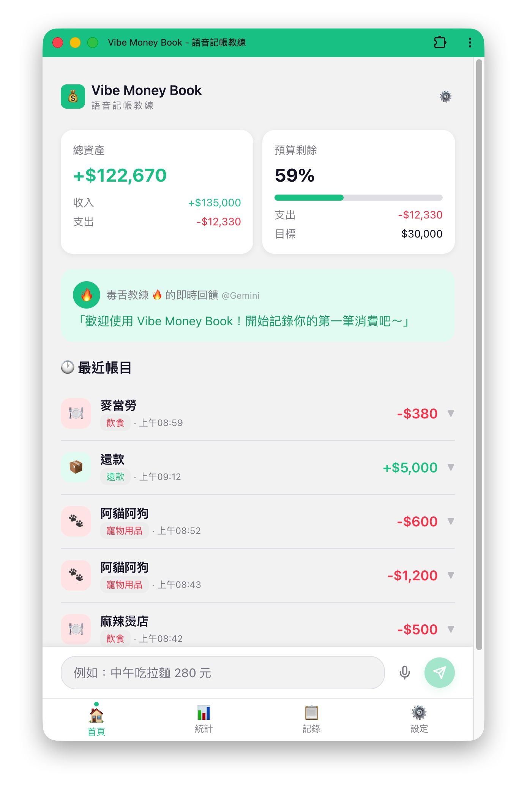
</p>

---

## 目录

- [功能特色](#-功能特色)
- [Live Demo](#-live-demo)
- [截图展示](#-截图展示)
- [技术栈](#️-技术栈)
- [快速开始](#-快速开始)
- [项目结构](#-项目结构)
- [环境变量](#-环境变量)
- [API 概览](#-api-概览)
- [部署](#-部署)
- [开发指南](#-开发指南)
- [开发流程](#-开发流程)
- [License](#-license)
- [致谢](#-致谢)

---

## ✨ 功能特色

### 语音与文字记账

- 整合 Web Speech API，支持「按住说话」(Push-to-Talk)
- 自然语言输入，例如：「午餐吃拉面 180 元」、「在阿猫阿狗帮狗子买狗粮 1500」
- LLM 自动萃取金额、类别、商家、日期，解析结果以卡片呈现
- 自动侦测新消费类别，交互式询问是否新增

### 个性化 AI 教练

| 人设 | 风格 | 范例 |
|------|------|------|
| 🔥 毒舌模式 | 尖锐犀利 | 「650 元买寿司？你准备靠光合作用过活吗？」 |
| 💖 温柔模式 | 温暖鼓励 | 「辛苦了～偶尔犒赏自己也很重要呢」 |
| 🥺 情勒模式 | 善意愧疚 | 「这个月已经超支了...我好担心你啊...」 |

### AI 指示 — 自定义分类规则

通过「AI 指示」功能，你可以教 AI 按照你的习惯分类，让记账更合意：

> **示例指示：**
> - 还钱给他人，应归类在：支出 / 还款
> - 收到他人的还款，应归类在：收入 / 还款
> - 借钱给他人，应归类在：支出 / 借款
> - 向他人借款，应归类在：收入 / 借款

搭配「自定义类别」功能，即可建立专属的分类体系，AI 会优先遵循你的指示进行分类。

### AI 语义查询

用自然语言查账，不需记住分类名称，AI 自动匹配并总结：

> 「阿猫阿狗这家店花了多少」「最近一个月毛小孩的开销」「吃的方面花了多少」

- 两阶段 AI 处理：时间范围解析 → 交易匹配分析
- AI 依人设风格生成总结评语，并筛选出匹配账目
- 手动筛选器（日期／类别）与 AI 查询互斥，「清除筛选」一次清除所有

### 🌍 多语系支持 (i18n)

| 语言 | 支持范围 |
|------|---------|
| 🇹🇼 繁體中文 | 完整支持（默认语言） |
| 🇺🇸 English | 完整支持 |
| 🇨🇳 简体中文 | 完整支持 |
| 🇻🇳 Tiếng Việt | 完整支持 |

- 前端 UI、后端错误消息、AI 反馈均跟随语言设置
- 登录／注册页面即可切换语言，无需登录
- 语言偏好三层持久化：DB（已登录）→ localStorage → 浏览器侦测
- AI Prompt 多语化：人设反馈、聊天回复、语义查询总结依用户语言生成
- 语音识别语言自动跟随 UI 语言设置

### 更多功能

| 功能 | 说明 |
|------|------|
| 📊 预算血条 | 可视化本月预算消耗，超支自动警示 |
| 🥧 消费分析 | 饼图一览各类别消费占比（收入／支出分开统计） |
| 🔄 双 AI 引擎 | 支持 Gemini / OpenAI，自由切换 |
| 📱 PWA 支持 | 加入手机桌面，随时随地记账 |
| 🏷️ 自定义类别 | 预设 + 自定义消费类别（上限 50 个），各类别独立预算 |
| 📅 智慧日期 | 自动识别「上周五」「白色情人节」「38 节」等语义日期 |

---

## 🌐 Live Demo

<table>
  <tr>
    <td><strong>演示地址</strong></td>
    <td><a href="https://moneybook.smart-codings.com/" target="_blank">https://moneybook.smart-codings.com</a></td>
  </tr>
  <tr>
    <td><strong>演示账号</strong></td>
    <td>Email: <code>test@a.b.com</code> ／ 密码: <code>Aaa@123456</code></td>
  </tr>
  <tr>
    <td><strong>注册新账号</strong></td>
    <td><a href="https://moneybook.smart-codings.com/register">前往注册</a></td>
  </tr>
</table>

---

## 📸 截图展示

<details>
<summary><strong>首页 — 语音记账与 AI 反馈</strong></summary>

**语音／自然语言记账**

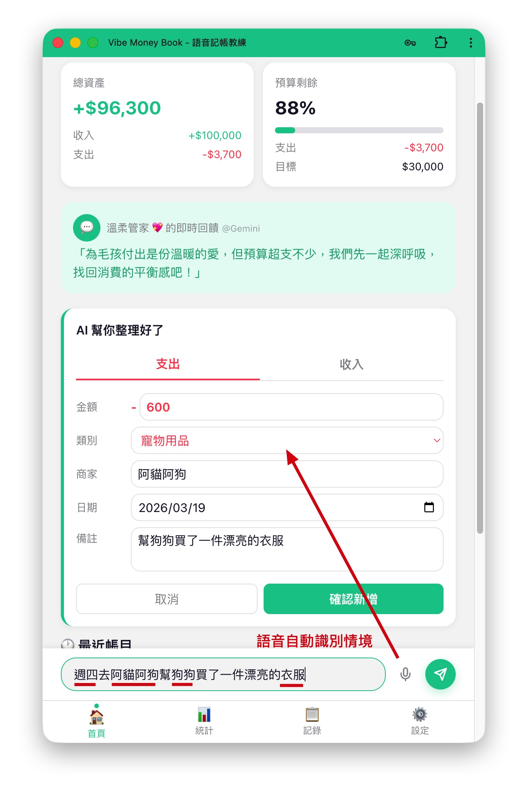

**毒舌教练帮你省钱**

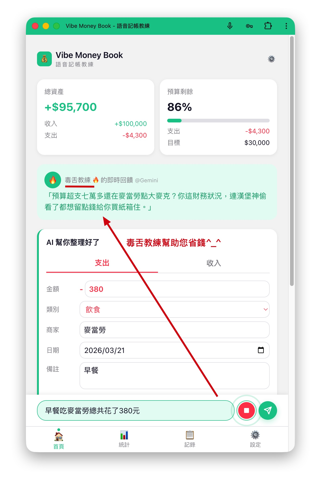

**直接询问花钱状况**

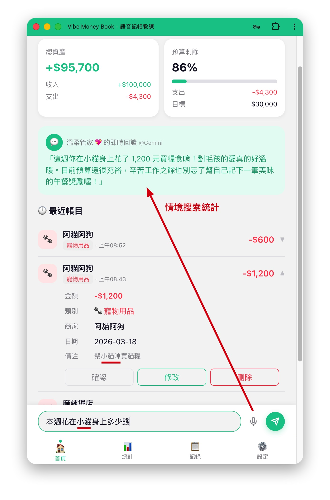

</details>

<details>
<summary><strong>智慧解析 — 自动分类与日期识别</strong></summary>

**自动分类** — 没有合适的分类时自动提供建议

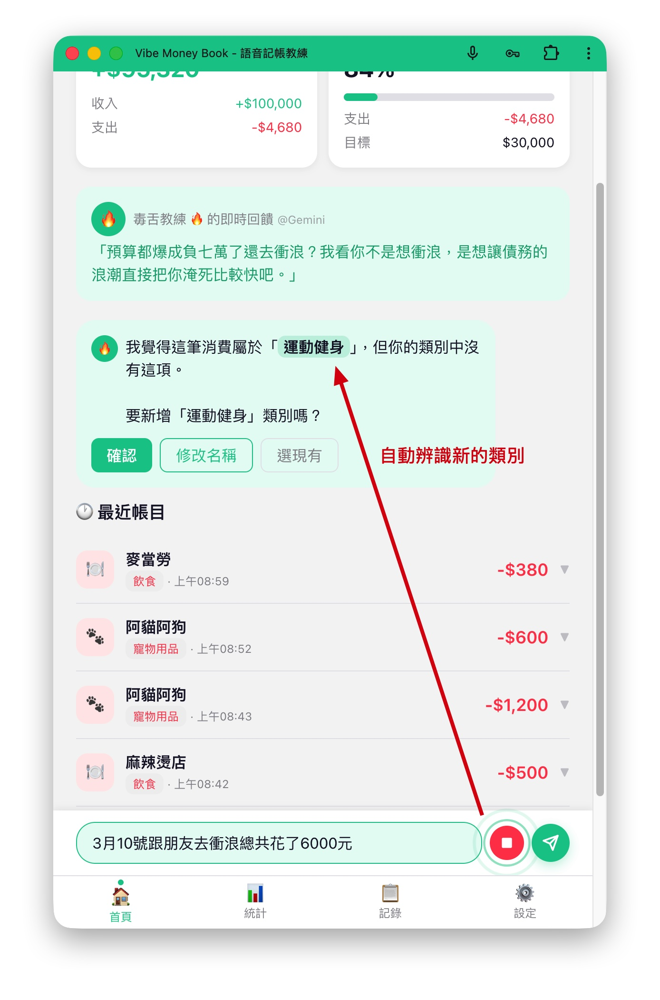


**智慧日期** — 自动识别「上周五」「10 日时」

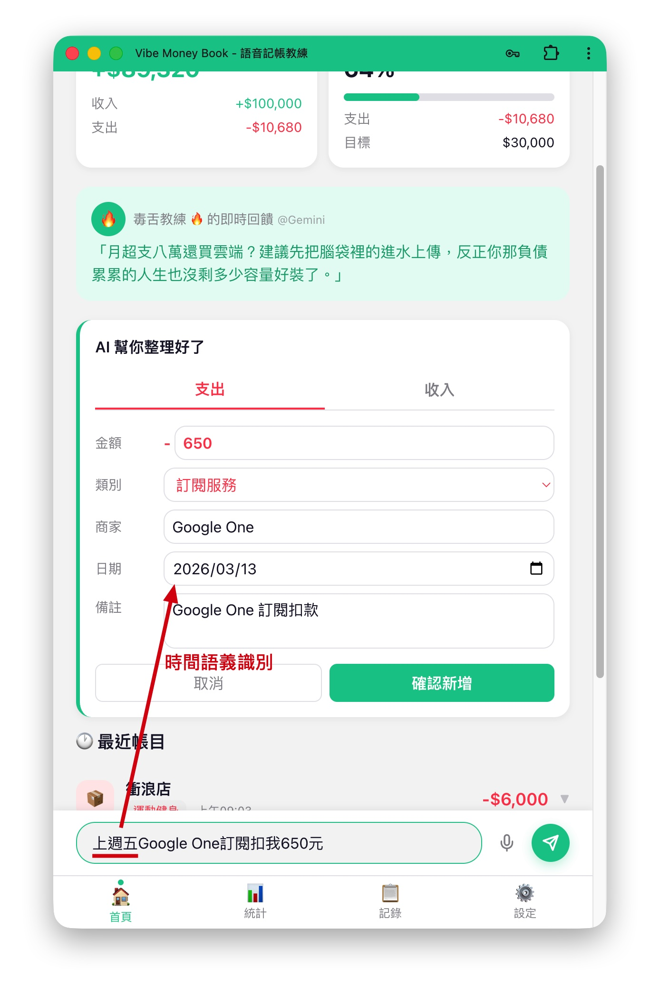

**节日识别** — 自动识别「白色情人节」「38 节」

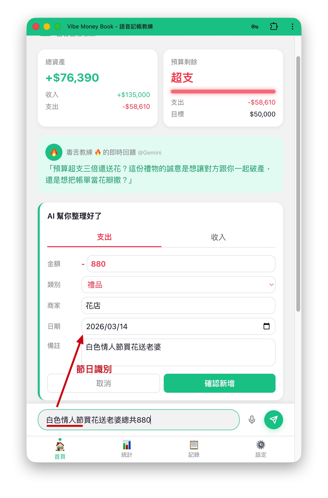

</details>

<details>
<summary><strong>统计与记录 — 消费分析与语义查询</strong></summary>

**统计页面** — 依收入／支出分别加总与统计

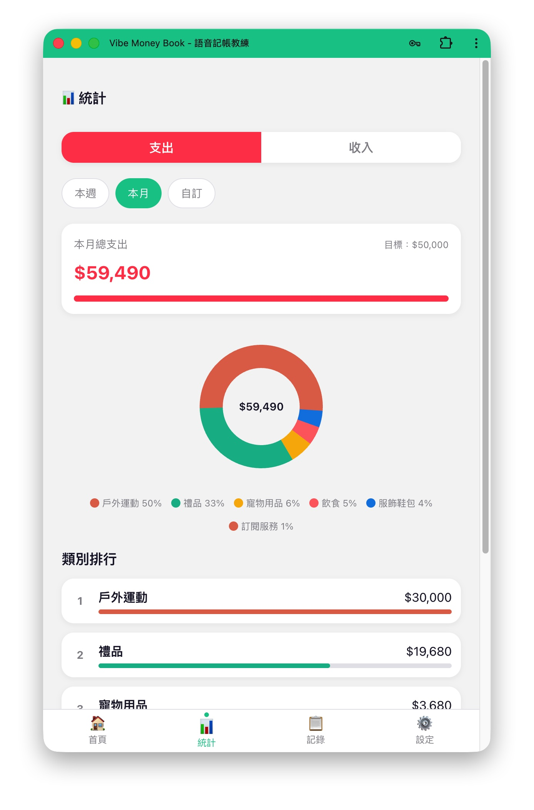

**记录页面** — 支持筛选与 AI 语义查询

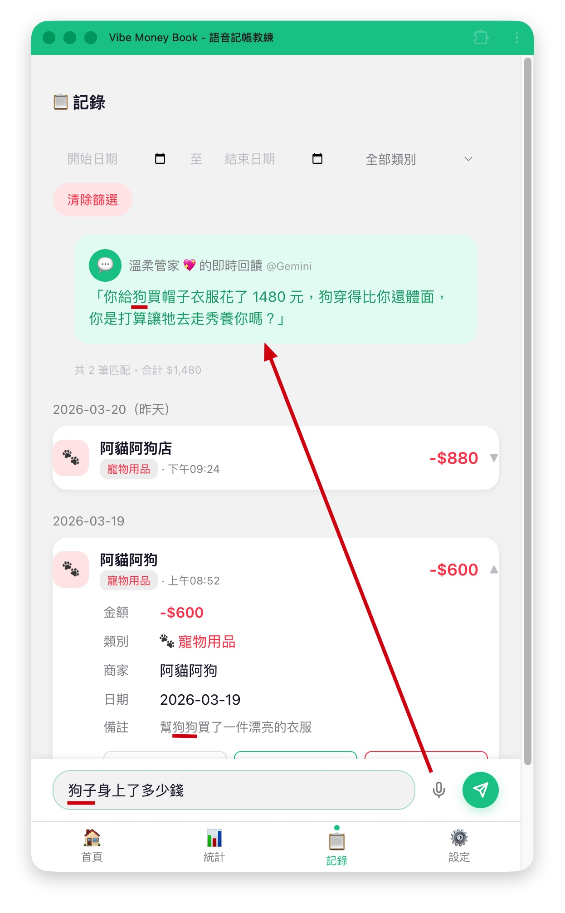

**语义查询** — 例如「花在老婆大人身上多少钱」

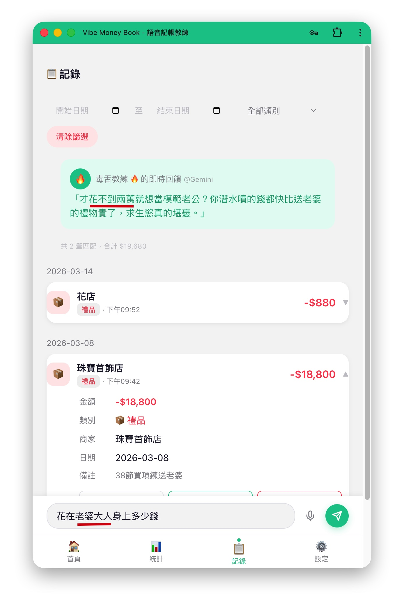

</details>

<details>
<summary><strong>设置页面 — AI 人设与预算管理</strong></summary>

**AI 人设与指示设置**

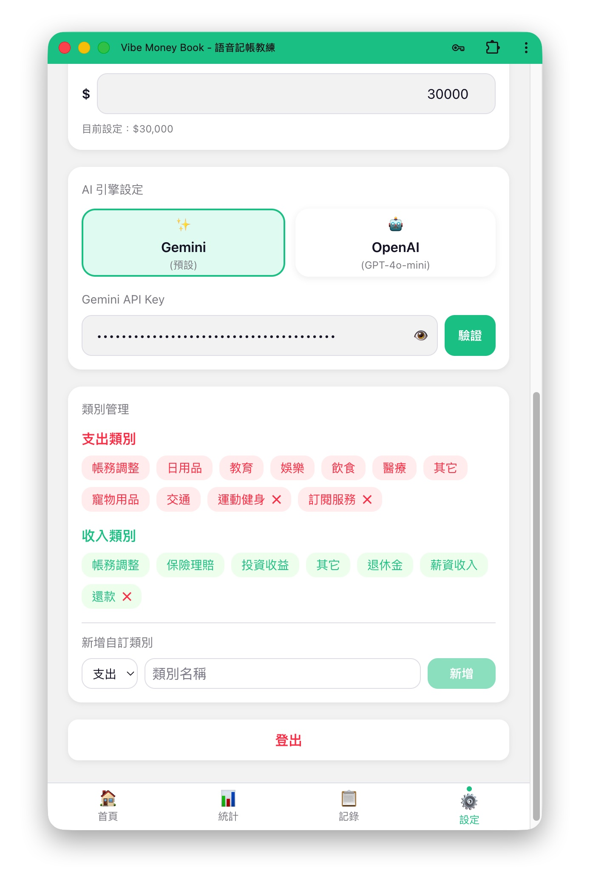

**预算、API Key、类别管理**


</details>

---

## 🛠️ 技术栈

| 层级 | 技术 |
|------|------|
| **前端** | React 19 · TypeScript · Vite 8 · Tailwind CSS 4 · Zustand · React Router 7 · Recharts · Web Speech API · PWA · react-i18next |
| **后端** | Node.js · Express 5 · TypeScript · Prisma 6 · Zod 4 · JWT · bcrypt · express-rate-limit · i18next |
| **AI / LLM** | Google Gemini（预设）· OpenAI — 双引擎自由切换 |
| **测试** | Vitest · Testing Library · Supertest · Playwright |
| **部署** | Docker · Docker Compose · Cloudflare Tunnel · PostgreSQL / SQLite |

<details>
<summary><strong>可用 AI 模型列表</strong></summary>

#### Google Gemini

| 模型 | 特点 | 价格 (per 1M tokens) |
|------|------|---------------------|
| `gemini-3-flash-preview` ⭐ | 比 2.5 Pro 更强、3x 更快（推荐） | $0.50 / $3.00 |
| `gemini-3.1-flash-lite-preview` | 最快最便宜 | $0.25 / $1.50 |
| `gemini-2.5-flash` | 稳定、有推理能力 | — |
| `gemini-2.5-pro` | 最强推理 | — |
| `gemini-2.0-flash` | 快速、稳定 | — |

#### OpenAI

| 模型 | 特点 | 价格 (per 1M tokens) |
|------|------|---------------------|
| `gpt-5.4-mini` ⭐ | 比 GPT-5 mini 更强、2x 更快、400k context（推荐） | $0.75 / $4.50 |
| `gpt-5.4-nano` | 最低成本 | $0.20 / $1.25 |
| `gpt-5.4` | 旗舰模型，复杂推理 | — |
| `gpt-5.4-pro` | 最高品质 | — |
| `gpt-4.1` | 上一代，支持 fine-tuning | — |
| `gpt-4.1-mini` | 上一代快速版 | — |

</details>

---

## ⚡ 快速开始

### 环境需求

- **Node.js** >= 22 ／ **npm** >= 10
- **Docker** + **Docker Compose**（选用，用于容器化部署）

### 方式一：Docker 一键启动

```bash
git clone https://github.com/robin-li/vibe-money-book.git
cd vibe-money-book
cp backend/.env.example backend/.env   # 编辑 .env 填入必要设置
docker compose up -d --build
```

启动后：前端 `http://localhost:80` ／ 后端 API `http://localhost:3000`

### 方式二：本地开发

```bash
git clone https://github.com/robin-li/vibe-money-book.git
cd vibe-money-book

# 后端
cd backend
npm install
cp .env.example .env                   # 编辑 .env 填入必要设置
npx prisma migrate dev
npx prisma db seed
npm run dev                            # http://localhost:3000

# 前端（另开终端）
cd frontend
npm install
npm run dev                            # http://localhost:5173
```

---

## 📁 项目结构

```
vibe-money-book/
├── backend/                 # 后端 API
│   ├── src/
│   │   ├── controllers/     # 控制层
│   │   ├── services/        # 业务逻辑（含 LLM 集成）
│   │   ├── routes/          # API 路由定义
│   │   ├── middlewares/     # 中间件（认证、限流、错误处理）
│   │   ├── validators/      # Zod 验证 Schema
│   │   ├── prompts/         # LLM Prompt 模板
│   │   ├── config/          # 配置文件
│   │   ├── types/           # TypeScript 类型
│   │   ├── app.ts           # Express App
│   │   └── server.ts        # 启动入口
│   ├── prisma/              # Prisma Schema & Migrations
│   └── Dockerfile
├── frontend/                # 前端 SPA
│   ├── src/
│   │   ├── pages/           # 页面组件
│   │   ├── components/      # 可复用组件
│   │   ├── hooks/           # 自定义 Hooks
│   │   ├── stores/          # Zustand Store
│   │   ├── lib/             # 工具函数 / API 调用
│   │   ├── types/           # TypeScript 类型
│   │   ├── App.tsx          # 根组件
│   │   └── main.tsx         # 入口
│   └── Dockerfile
├── tests/                   # E2E 测试（Playwright）
├── docs/                    # 规格文件（PRD、SRD、Dev Plan 等）
├── scripts/
│   ├── start.sh             # 一键启动（Docker + Cloudflare Tunnel）
│   └── stop.sh              # 一键停止
├── docker-compose.yml
└── playwright.config.ts
```

---

## 🔐 环境变量

在 `backend/.env` 中设置（可从 `.env.example` 复制）：

| 变量 | 说明 | 预设值 |
|------|------|--------|
| `DATABASE_URL` | 数据库连接字符串 | `file:./data/dev.db` (SQLite) |
| `JWT_SECRET` | JWT 签名密钥 | — (必填) |
| `JWT_EXPIRE` | Token 过期时间 | `7d` |
| `GEMINI_MODEL` | Gemini 模型名称 | `gemini-3-flash-preview` |
| `OPENAI_MODEL` | OpenAI 模型名称 | `gpt-5.4-mini` |
| `LLM_TIMEOUT_MS` | LLM 请求超时 | `30000` |
| `PORT` | 服务器端口 | `3000` |
| `NODE_ENV` | 运行环境 | `development` |
| `CORS_ORIGIN` | CORS 允许来源 | — |
| `VITE_API_BASE_URL` | 前端 API Base URL | — |
| `RATE_LIMIT_LLM_PER_MIN` | LLM API 限流 | `20` |
| `RATE_LIMIT_API_PER_MIN` | 一般 API 限流 | `100` |
| `RATE_LIMIT_AUTH_PER_MIN` | 认证 API 限流 | `10` |

> **注意**：`.env` 文件包含敏感信息，**严禁** commit 至版本控制。用户的 LLM API Key 仅保存于前端 localStorage，通过 `X-LLM-API-Key` Header 传递，后端用后即弃。

---

## 📡 API 概览

所有 API 皆以 `/api/v1` 为前缀，响应格式统一为 JSON。

| 模块 | 方法 | 端点 | 说明 |
|------|------|------|------|
| **Auth** | POST | `/auth/register` | 用户注册 |
| | POST | `/auth/login` | 用户登录 |
| **User** | GET | `/users/me` | 获取个人资料 |
| | PUT | `/users/me` | 更新设置（人设、预算、AI 引擎） |
| **Transactions** | GET | `/transactions` | 查询交易列表（支持分页、筛选） |
| | POST | `/transactions` | 新增交易记录 |
| | DELETE | `/transactions/:id` | 删除交易记录 |
| **Budget** | GET | `/budgets` | 查询类别预算 |
| | PUT | `/budgets` | 更新类别预算 |
| **Stats** | GET | `/stats/summary` | 月度消费摘要 |
| | GET | `/stats/categories` | 各类别消费统计 |
| **AI** | POST | `/ai/parse` | 自然语言解析（萃取 + 反馈） |
| | POST | `/ai/query` | 语义查询交易记录 |

---

## 🐳 部署

### 方案一：本地部署 + Cloudflare Tunnel（推荐）

通过 Docker Compose 在本地运行，搭配 Cloudflare Tunnel 对外提供 HTTPS 访问，零成本、完全掌控。

```
用户 → Cloudflare Edge (HTTPS + CDN)
            ↓ Cloudflare Tunnel
       本地主机
       ├─ frontend (:80)  → moneybook.smart-codings.com
       └─ backend  (:3000) → moneybook-api.smart-codings.com
```

```bash
# 一键启动（Docker 容器 + Cloudflare Tunnel）
./scripts/start.sh

# 一键停止
./scripts/stop.sh
```

| 服务 | 本地地址 | 公开网址 |
|------|---------|---------|
| 前端 | `http://localhost:80` | `https://moneybook.smart-codings.com` |
| 后端 API | `http://localhost:3000` | `https://moneybook-api.smart-codings.com` |

<details>
<summary><strong>Cloudflare Tunnel 首次设置</strong></summary>

**前置需求**：[Docker](https://docs.docker.com/get-docker/) + Docker Compose、[cloudflared](https://developers.cloudflare.com/cloudflare-one/connections/connect-networks/get-started/) (`brew install cloudflared`)、已在 Cloudflare 管理的域名

```bash
# 1. 登录 Cloudflare
cloudflared tunnel login

# 2. 创建 Tunnel
cloudflared tunnel create vibe-money-book

# 3. 创建配置文件 (~/.cloudflared/config-moneybook.yml)
# tunnel: <TUNNEL_ID>
# credentials-file: ~/.cloudflared/<TUNNEL_ID>.json
# ingress:
#   - hostname: moneybook.your-domain.com
#     service: http://localhost:80
#   - hostname: moneybook-api.your-domain.com
#     service: http://localhost:3000
#   - service: http_status:404

# 4. 设置 DNS 路由
cloudflared tunnel --config ~/.cloudflared/config-moneybook.yml route dns vibe-money-book moneybook.your-domain.com
cloudflared tunnel --config ~/.cloudflared/config-moneybook.yml route dns vibe-money-book moneybook-api.your-domain.com
```

</details>

### 方案二：云端部署

| 层级 | 推荐服务 |
|------|---------|
| 全端 (Docker) | Railway / Render / Fly.io |
| 前端 | Vercel / Netlify |
| 后端 | Railway / Render / Fly.io |
| 数据库 | Supabase PostgreSQL / Railway PostgreSQL |

---

## 🧑‍💻 开发指南

<details>
<summary><strong>常用指令</strong></summary>

```bash
# 后端
cd backend
npm run dev              # 启动开发服务器（hot reload）
npm run build            # 编译 TypeScript
npm run lint             # ESLint 检查
npm run test             # 执行单元测试
npm run test:watch       # 测试 watch 模式
npm run prisma:migrate   # 执行数据库迁移
npm run prisma:seed      # 植入种子数据
npm run prisma:generate  # 生成 Prisma Client

# 前端
cd frontend
npm run dev              # 启动 Vite 开发服务器
npm run build            # 构建生产版本
npm run lint             # ESLint 检查
npm run test             # 执行单元测试
npm run preview          # 预览生产版本

# E2E 测试（根目录）
npm run test:e2e         # 执行 Playwright E2E 测试
npm run test:e2e:headed  # 有浏览器画面的 E2E 测试
npm run test:e2e:ui      # Playwright UI 模式
```

</details>

### 页面路由

| 路由 | 页面 | 说明 |
|------|------|------|
| `/` | DashboardPage | 首页仪表盘，含记账输入 |
| `/stats` | StatsPage | 消费统计图表 |
| `/history` | HistoryPage | 交易记录列表 + AI 语义查询 |
| `/settings` | SettingsPage | 人设 / 预算 / AI 引擎设置 |
| `/login` | LoginPage | 用户登录 |
| `/register` | RegisterPage | 用户注册 |

---

## 🤖 开发流程

本项目采用 [**Vibe-SDLC**](https://github.com/robin-li/Vibe-SDLC) 软件开发流程，由 AI 辅助完成规格撰写、任务拆分与开发循环。

详细开发过程请参考：
- [开发日志 1](docs/worklog/Vibe-Money-Book-Worklog-1.md)
- [开发日志 2](docs/worklog/Vibe-Money-Book-Worklog-2.md)
- [开发日志 3](docs/worklog/Vibe-Money-Book-Worklog-3.md)

---

## 📄 License

本项目采用 [MIT License](LICENSE) 授权。

---

## 🙏 致谢

- [**Vibe-SDLC**](https://github.com/robin-li/Vibe-SDLC) — AI 辅助软件开发流程
- [**Claude Code**](https://claude.ai/code) — 开发过程中的 AI 协作伙伴
- UI 设计遵循 **Mobile-First** 原则，以手机使用场景为优先考量
