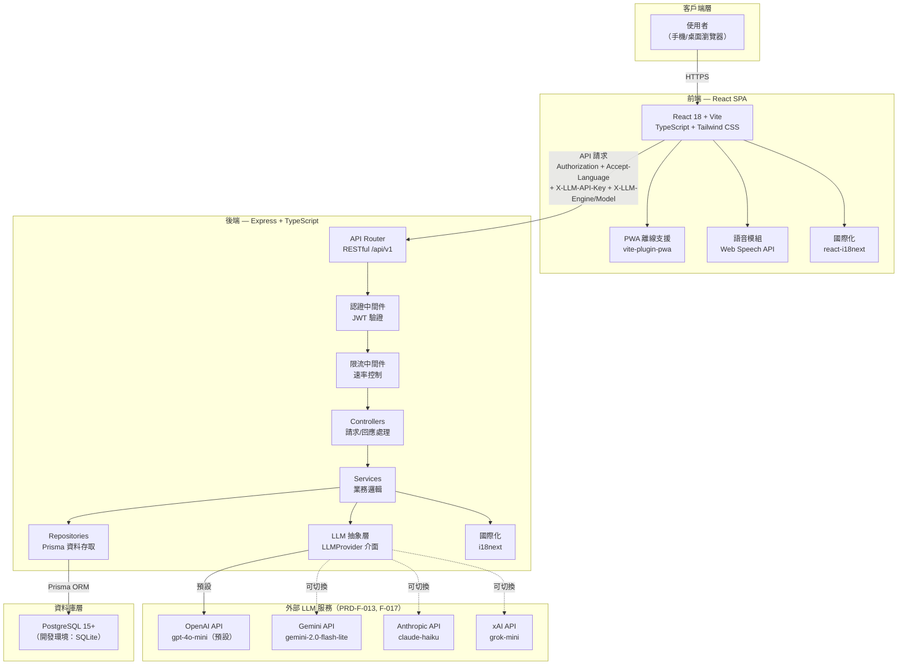
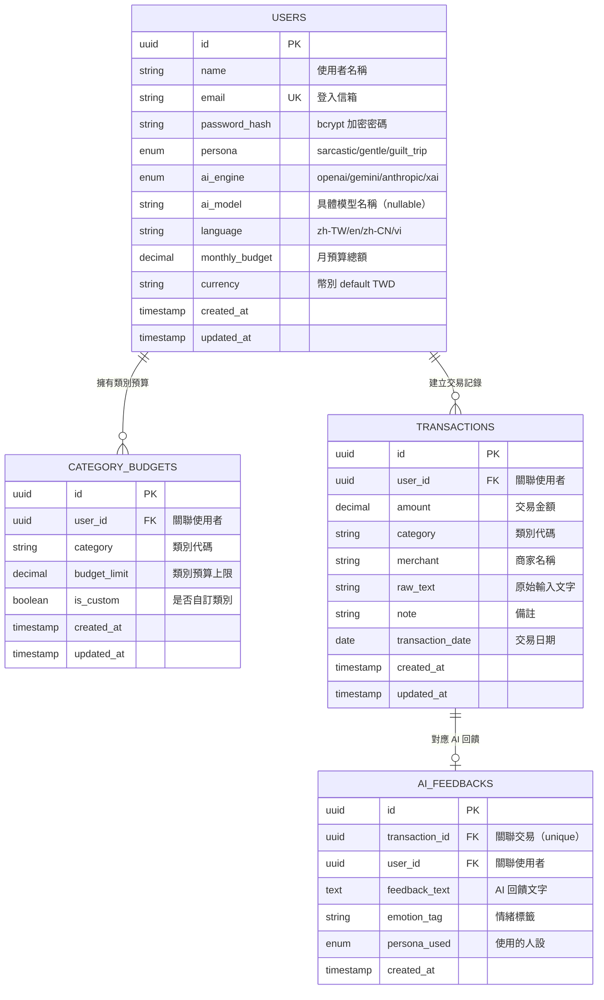
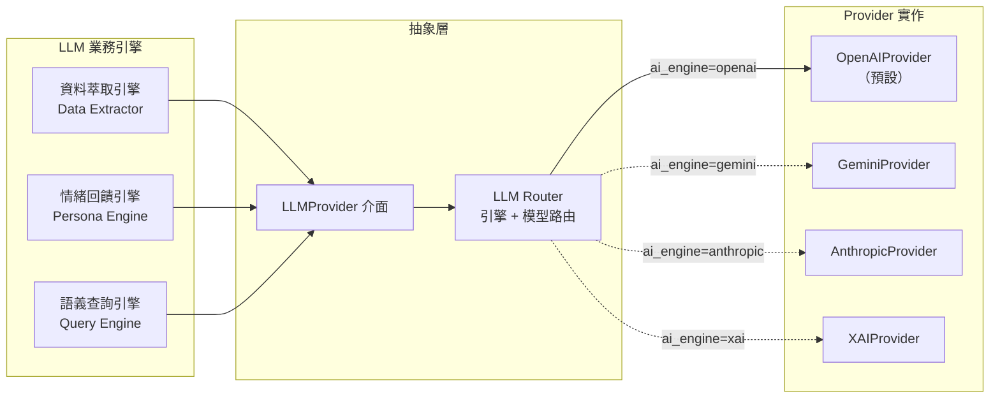
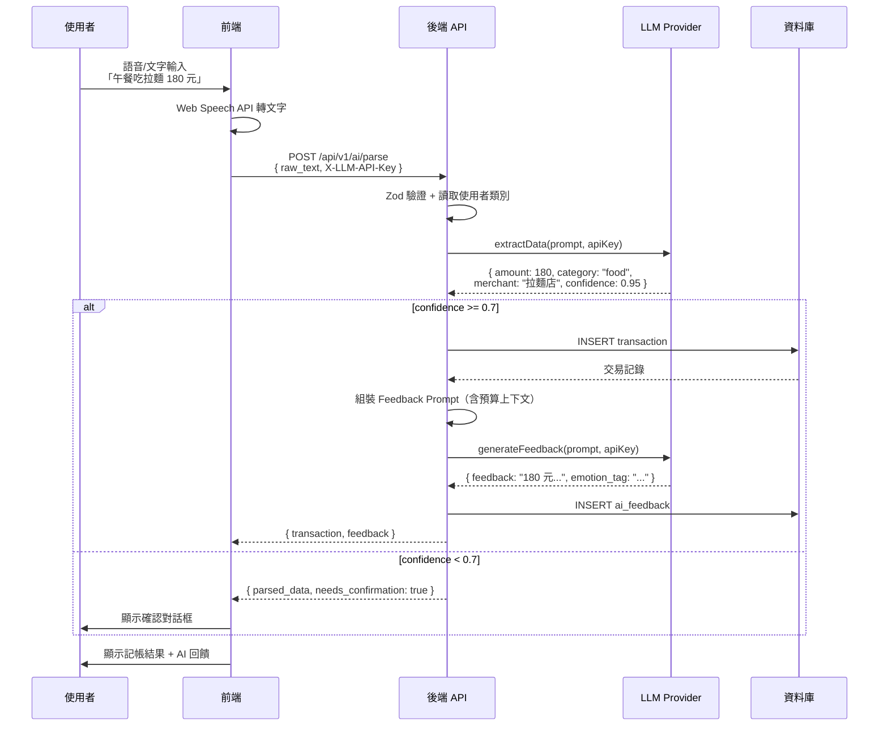
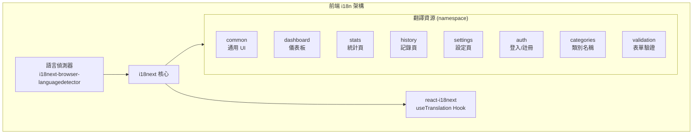
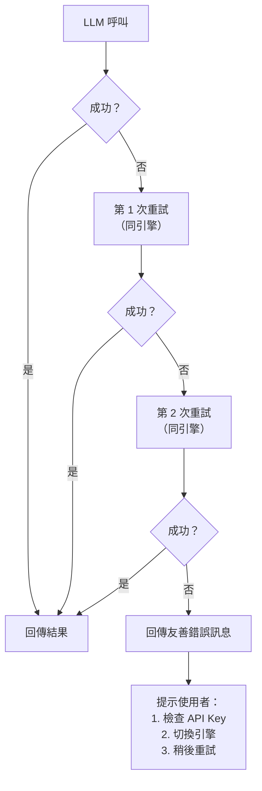
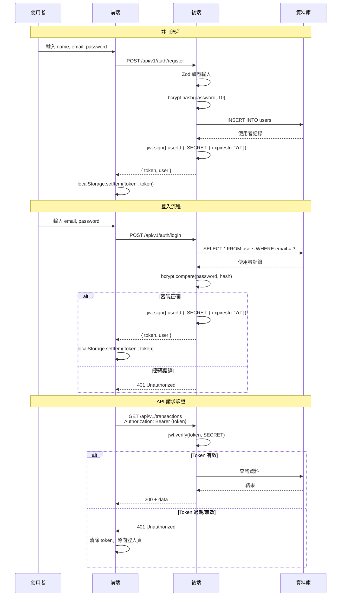

# 01-3 系統設計文件 (SDD)

> **專案名稱**：Vibe Money Book — 語音記帳應用
> **版本**：v1.0
> **最後更新**：2026-04-10

---

## 目錄

1. [系統架構總覽](#1-系統架構總覽)
2. [技術棧選型與決策](#2-技術棧選型與決策)
3. [前後端架構設計](#3-前後端架構設計)
4. [數據模型設計](#4-數據模型設計)
5. [LLM 整合設計](#5-llm-整合設計)
6. [國際化架構設計 (i18n)](#6-國際化架構設計-i18n)
7. [設計決策記錄 (ADR)](#7-設計決策記錄-adr)
8. [錯誤處理策略](#8-錯誤處理策略)
9. [快取與效能設計](#9-快取與效能設計)
10. [安全設計](#10-安全設計)

---

## 1. 系統架構總覽

### 1.1 系統架構圖



### 1.2 各層職責說明

| 層級 | 職責 | 關鍵特徵 |
|------|------|---------|
| **客戶端層** | 使用者透過瀏覽器存取應用 | 支援手機與桌面，PWA 離線基本功能 |
| **前端層 (React SPA)** | UI 渲染、語音輸入、狀態管理、路由導航 | 單頁應用，Zustand 狀態管理，Web Speech API 語音辨識 |
| **後端 API 層 (Express)** | 請求路由、認證授權、業務邏輯、LLM 代理 | RESTful API，JWT 認證，Zod 驗證 |
| **LLM 服務層** | 自然語言解析、情緒回饋生成、語義查詢 | **多引擎抽象**（OpenAI / Gemini / Anthropic / xAI），使用者自帶 API Key 與模型（PRD-F-013, F-017） |
| **資料庫層** | 資料持久化、交易記錄、使用者資訊 | PostgreSQL（正式）/ SQLite（開發） |

### 1.3 資料流概述

1. **記帳流程**：使用者語音/文字輸入 → 前端送出至後端 → LLM 萃取結構化資料 → 存入資料庫 → LLM 生成人設回饋 → 回傳前端顯示
2. **查詢流程**：使用者自然語言查詢 → 後端 LLM 解析時間範圍 → 資料庫撈取交易 → LLM 匹配分析 → 回傳匹配結果與評語
3. **認證流程**：登入/註冊 → JWT 簽發 → 前端 localStorage 儲存 → 後續請求 Header 攜帶 Token

---

## 2. 技術棧選型與決策

### 2.1 前端技術棧

| 技術 | 版本 | 用途 | 選擇理由 |
|------|------|------|---------|
| **React** | 18+ | UI 框架 | 生態成熟、社群龐大、Hooks 模式開發效率高 |
| **Vite** | 5+ | 建構工具 | 開發環境 HMR 極快、ESM 原生支援、設定簡潔 |
| **TypeScript** | 5+ | 型別系統 | 編譯期型別檢查降低 Runtime 錯誤、提升 AI 輔助開發精度 |
| **Tailwind CSS** | 3.x | 樣式方案 | Utility-first 減少自訂 CSS、與 Design Tokens 整合佳 |
| **Zustand** | 4+ | 狀態管理 | 輕量（< 1KB）、API 簡潔、內建 persist middleware |
| **Recharts** | 2+ | 圖表繪製 | 基於 React 組件化、宣告式 API、響應式圖表 |
| **Web Speech API** | — | 語音輸入 | 瀏覽器原生 API、無需額外後端服務、零延遲本地處理 |
| **React Router** | v6 | 路由管理 | React 官方推薦、支援巢狀路由與 Lazy Loading |
| **vite-plugin-pwa** | — | PWA 支援 | 基於 Workbox、Service Worker 自動生成、離線快取 |
| **react-i18next** | — | 國際化 | React 生態最成熟 i18n 方案、支援 namespace 與 lazy loading |

### 2.2 後端技術棧

| 技術 | 版本 | 用途 | 選擇理由 |
|------|------|------|---------|
| **Node.js** | 20 LTS | Runtime | JavaScript 全棧統一語言、非同步 I/O 適合 API 服務 |
| **Express.js** | 4.x | Web 框架 | 輕量靈活、中間件生態豐富、學習曲線低 |
| **TypeScript** | 5+ | 型別系統 | 前後端共享型別定義、降低介面不一致風險 |
| **Prisma** | 5+ | ORM | Type-safe 查詢、自動產生遷移、Schema 即文件 |
| **Zod** | 3+ | 驗證 | TypeScript-first、可從 Schema 推導型別、Runtime 驗證 |
| **JWT (jsonwebtoken)** | — | 認證 | 無狀態認證、適合 SPA、不需 Session Store |
| **bcrypt** | — | 密碼加密 | 業界標準、自適應工作因子 |
| **OpenAI SDK** | — | LLM 客戶端（OpenAI / xAI，相容 OpenAI API 規範） | 官方 SDK、型別完整、串流支援 |
| **Google Generative AI SDK** | — | LLM 客戶端（Gemini） | 官方 SDK、Gemini 模型存取 |
| **Anthropic SDK** | — | LLM 客戶端（Claude） | 官方 SDK、Claude 模型存取（PRD-F-017） |

### 2.3 資料庫

| 技術 | 用途 | 選擇理由 |
|------|------|---------|
| **PostgreSQL 15+** | 正式環境主資料庫 | 功能完整、JSONB 支援佳、Prisma 原生支援 |
| **SQLite** | 開發環境資料庫 | 零設定、單檔部署、Prisma 支援切換、降低開發門檻 |

---

## 3. 前後端架構設計

### 3.1 前端目錄結構與職責

```
frontend/
  src/
    ├── pages/           # 頁面組件（對應路由）
    │   ├── DashboardPage.tsx    # 首頁儀表板
    │   ├── StatsPage.tsx        # 統計分析頁
    │   ├── HistoryPage.tsx      # 交易記錄頁（含語義查詢）
    │   ├── SettingsPage.tsx     # 設定頁
    │   ├── LoginPage.tsx        # 登入頁
    │   └── RegisterPage.tsx     # 註冊頁
    ├── components/      # 可復用組件
    │   ├── dashboard/   # 儀表板相關（預算卡片、近期交易）
    │   ├── budget/      # 預算相關（預算血條、類別預算）
    │   ├── voice/       # 語音輸入組件（麥克風按鈕、語音狀態）
    │   └── common/      # 通用組件（Header、BottomNav、Loading）
    ├── hooks/           # 自定義 Hooks
    │   ├── useVoice.ts          # 語音輸入封裝
    │   ├── useAuth.ts           # 認證狀態
    │   └── useBudget.ts         # 預算計算
    ├── services/        # API 呼叫層（Axios 封裝）
    │   ├── api.ts               # Axios instance + interceptors
    │   ├── authService.ts       # 認證相關 API
    │   ├── transactionService.ts # 交易相關 API
    │   └── aiService.ts         # LLM 相關 API
    ├── stores/          # Zustand Store
    │   ├── authStore.ts         # 認證狀態
    │   ├── transactionStore.ts  # 交易資料
    │   └── settingsStore.ts     # 使用者設定（含 API Key）
    ├── types/           # TypeScript 型別定義
    ├── i18n/            # 國際化設定與翻譯檔
    │   ├── index.ts             # i18next 初始化
    │   └── locales/             # 翻譯資源檔
    │       ├── zh-TW/           # 繁體中文（預設）
    │       ├── en/              # 英文
    │       ├── zh-CN/           # 簡體中文
    │       └── vi/              # 越南文
    └── utils/           # 工具函數（日期格式化、金額處理）
```

**各目錄職責**：

| 目錄 | 職責 | 設計原則 |
|------|------|---------|
| `pages/` | 路由對應的頁面組件，負責組合子組件與資料取得 | 一個路由對應一個 Page，Page 不含業務邏輯 |
| `components/` | 可復用的 UI 組件 | 按功能模組分目錄，props-driven 設計 |
| `hooks/` | 封裝可復用的狀態邏輯 | 抽離複雜邏輯，保持組件簡潔 |
| `services/` | 封裝所有 HTTP 請求 | 統一 Axios instance、攔截器處理 Token 與錯誤 |
| `stores/` | 全域狀態管理（Zustand） | 每個 Store 對應一個領域，支援 persist |
| `types/` | 共用型別定義 | 前後端共享的介面型別 |
| `i18n/` | 多語系資源與初始化 | namespace 分類、lazy loading |

### 3.2 後端目錄結構與職責

```
backend/
  src/
    ├── controllers/     # 控制層：接收請求、回應結果
    │   ├── authController.ts
    │   ├── transactionController.ts
    │   ├── budgetController.ts
    │   └── aiController.ts
    ├── services/        # 業務邏輯層：核心處理
    │   ├── authService.ts
    │   ├── transactionService.ts
    │   ├── budgetService.ts
    │   └── llm/                 # LLM 整合服務（多引擎抽象）
    │       ├── llmProvider.ts           # 抽象介面
    │       ├── openaiProvider.ts        # OpenAI 實作（預設）
    │       ├── geminiProvider.ts        # Gemini 實作
    │       ├── anthropicProvider.ts     # Anthropic 實作（PRD-F-017）
    │       ├── xaiProvider.ts           # xAI 實作（PRD-F-017）
    │       ├── llmRouter.ts             # 引擎 + 模型路由
    │       ├── dataExtractor.ts         # 資料萃取引擎
    │       ├── personaEngine.ts         # 情緒回饋引擎
    │       └── queryEngine.ts           # 語義查詢引擎
    ├── repositories/    # 資料存取層：Prisma 查詢封裝
    │   ├── userRepository.ts
    │   ├── transactionRepository.ts
    │   └── budgetRepository.ts
    ├── middleware/       # 中間件
    │   ├── auth.ts              # JWT 驗證
    │   ├── errorHandler.ts      # 全域錯誤處理
    │   ├── rateLimiter.ts       # API 限流
    │   ├── validator.ts         # Zod 驗證
    │   └── i18n.ts              # 語言偵測
    ├── routes/          # API 路由定義
    │   ├── index.ts             # 路由總表
    │   ├── authRoutes.ts
    │   ├── transactionRoutes.ts
    │   ├── budgetRoutes.ts
    │   └── aiRoutes.ts
    ├── prompts/         # LLM Prompt 模板
    │   ├── extractPrompt.ts     # 資料萃取 Prompt
    │   ├── feedbackPrompt.ts    # 情緒回饋 Prompt
    │   └── queryPrompt.ts       # 語義查詢 Prompt
    ├── i18n/            # 國際化設定與翻譯檔
    │   ├── index.ts             # i18next 初始化
    │   └── locales/             # 翻譯資源檔（錯誤訊息）
    ├── config/          # 配置檔
    │   └── index.ts             # 環境變數讀取與驗證
    ├── types/           # 型別定義
    │   ├── express.d.ts         # Express 型別擴展
    │   └── models.ts            # 業務模型型別
    └── utils/           # 工具函數
        ├── logger.ts            # 日誌工具
        └── response.ts          # 統一回應格式
  prisma/
    ├── schema.prisma    # 資料模型定義
    ├── migrations/      # 遷移檔案
    └── seed.ts          # 種子資料
```

**各層職責**：

| 層級 | 職責 | 設計原則 |
|------|------|---------|
| `controllers/` | 接收 HTTP 請求、呼叫 Service、回傳回應 | 不含業務邏輯，僅做請求/回應轉換 |
| `services/` | 封裝所有業務邏輯 | 可獨立測試，不直接依賴 Express |
| `repositories/` | 封裝資料庫存取（Prisma） | 隔離 ORM 細節，方便日後替換 |
| `middleware/` | 請求前/後處理 | 認證、限流、驗證、錯誤處理、語言偵測 |
| `prompts/` | LLM Prompt 模板管理 | 模板與邏輯分離，支援多語言注入 |

### 3.3 前後端互動模式

採用 **API First** 設計原則：

1. **API 規格先行**：後端 API 規格（參見 `01-5-API_Spec.md` + `API_Spec.yaml`）作為前後端溝通合約
2. **統一請求格式**：前端所有 API 請求皆透過 `services/api.ts` 的 Axios instance 發出，自動附加：
   - `Authorization: Bearer <jwt-token>`（認證）
   - `Accept-Language: <locale>`（語言偏好）
   - `X-LLM-API-Key: <api-key>`（LLM 相關請求）
3. **統一回應格式**：後端所有回應遵循 `{ code, message, data, timestamp }` 結構
4. **錯誤回應格式**：`{ code, message, errors[], timestamp }`，前端統一攔截處理

---

## 4. 數據模型設計

### 4.1 ER 圖



### 4.2 實體欄位定義

#### 4.2.1 Users（使用者）

| 欄位 | 型別 | 約束 | 說明 |
|------|------|------|------|
| `id` | UUID | PK, auto-generated | 主鍵 |
| `name` | VARCHAR(50) | NOT NULL | 使用者顯示名稱 |
| `email` | VARCHAR(100) | UNIQUE, NOT NULL | 登入用信箱 |
| `password_hash` | VARCHAR(255) | NOT NULL | bcrypt 加密後的密碼 |
| `persona` | VARCHAR(20) | NOT NULL, DEFAULT 'gentle' | AI 人設偏好：sarcastic / gentle / guilt_trip |
| `ai_engine` | VARCHAR(20) | NOT NULL, DEFAULT 'openai' | LLM 引擎偏好：openai / gemini / anthropic / xai（PRD-F-013, F-017） |
| `ai_model` | VARCHAR(50) | nullable | 使用者選定的具體模型名稱；nullable 時使用引擎預設（PRD-F-017） |
| `language` | VARCHAR(10) | NOT NULL, DEFAULT 'zh-TW' | 介面語言：zh-TW / en / zh-CN / vi |
| `monthly_budget` | DECIMAL(12,2) | NOT NULL, DEFAULT 30000.00 | 月預算總額 |
| `currency` | VARCHAR(10) | NOT NULL, DEFAULT 'TWD' | 預設幣別 |
| `created_at` | TIMESTAMP | NOT NULL, DEFAULT NOW | 建立時間 |
| `updated_at` | TIMESTAMP | NOT NULL, DEFAULT NOW | 更新時間 |

#### 4.2.2 CategoryBudgets（類別預算）

| 欄位 | 型別 | 約束 | 說明 |
|------|------|------|------|
| `id` | UUID | PK, auto-generated | 主鍵 |
| `user_id` | UUID | FK → users(id), ON DELETE CASCADE | 所屬使用者 |
| `category` | VARCHAR(50) | NOT NULL | 類別代碼（如 food, transport） |
| `budget_limit` | DECIMAL(12,2) | NOT NULL, DEFAULT 0 | 該類別預算上限 |
| `is_custom` | BOOLEAN | NOT NULL, DEFAULT false | 是否為使用者自訂類別 |
| `created_at` | TIMESTAMP | NOT NULL, DEFAULT NOW | 建立時間 |
| `updated_at` | TIMESTAMP | NOT NULL, DEFAULT NOW | 更新時間 |

**唯一約束**：`(user_id, category)` — 每位使用者的類別不可重複。

#### 4.2.3 Transactions（交易記錄）

| 欄位 | 型別 | 約束 | 說明 |
|------|------|------|------|
| `id` | UUID | PK, auto-generated | 主鍵 |
| `user_id` | UUID | FK → users(id), ON DELETE CASCADE | 所屬使用者 |
| `amount` | DECIMAL(12,2) | NOT NULL | 交易金額 |
| `category` | VARCHAR(50) | NOT NULL | 類別代碼 |
| `merchant` | VARCHAR(100) | nullable | 商家名稱（可為空） |
| `raw_text` | TEXT | NOT NULL | 使用者原始輸入文字 |
| `note` | TEXT | nullable | 備註 |
| `transaction_date` | DATE | NOT NULL, DEFAULT CURRENT_DATE | 交易日期 |
| `created_at` | TIMESTAMP | NOT NULL, DEFAULT NOW | 建立時間 |
| `updated_at` | TIMESTAMP | NOT NULL, DEFAULT NOW | 更新時間 |

#### 4.2.4 AIFeedbacks（AI 回饋）

| 欄位 | 型別 | 約束 | 說明 |
|------|------|------|------|
| `id` | UUID | PK, auto-generated | 主鍵 |
| `transaction_id` | UUID | FK → transactions(id), UNIQUE, ON DELETE CASCADE | 對應交易（一對一） |
| `user_id` | UUID | FK → users(id), ON DELETE CASCADE | 所屬使用者 |
| `feedback_text` | TEXT | NOT NULL | AI 生成的回饋文字 |
| `emotion_tag` | VARCHAR(30) | nullable | 情緒標籤（如 sarcastic_warning） |
| `persona_used` | VARCHAR(20) | NOT NULL | 生成時使用的人設 |
| `created_at` | TIMESTAMP | NOT NULL, DEFAULT NOW | 建立時間 |

### 4.3 關聯關係說明

| 關聯 | 類型 | 說明 |
|------|------|------|
| Users → CategoryBudgets | 一對多 | 一位使用者擁有多個類別預算（含預設 8 個 + 自訂） |
| Users → Transactions | 一對多 | 一位使用者可建立多筆交易記錄 |
| Transactions → AIFeedbacks | 一對一 | 每筆交易最多對應一則 AI 回饋 |

### 4.4 索引設計

| 索引名稱 | 表 | 欄位 | 用途 |
|---------|-----|------|------|
| `idx_users_email` | users | email | 登入查詢加速 |
| `idx_category_budgets_user_id` | category_budgets | user_id | 查詢使用者所有類別預算 |
| `idx_transactions_user_id` | transactions | user_id | 查詢使用者所有交易 |
| `idx_transactions_user_date` | transactions | (user_id, transaction_date DESC) | 依日期排序的交易查詢（首頁、統計） |
| `idx_transactions_user_category` | transactions | (user_id, category) | 依類別篩選交易 |
| `idx_ai_feedbacks_transaction_id` | ai_feedbacks | transaction_id | 取得交易對應的 AI 回饋 |
| `idx_ai_feedbacks_user_id` | ai_feedbacks | user_id | 查詢使用者所有 AI 回饋 |

---

## 5. LLM 整合設計

### 5.1 多引擎架構（PRD-F-013, F-017）

系統採用 LLM 多引擎設計，透過抽象層統一介面，支援 **OpenAI / Gemini / Anthropic / xAI** 四家供應商動態切換，並允許使用者自選具體模型名稱。



### 5.2 抽象層介面設計

```typescript
// llmProvider.ts — 統一介面
interface LLMProvider {
  /** 資料萃取：自然語言 → 結構化 JSON */
  extractData(prompt: string, apiKey: string): Promise<ParsedTransaction>;

  /** 情緒回饋：情境 → 個性化評論 */
  generateFeedback(prompt: string, apiKey: string): Promise<AIFeedback>;

  /** 通用文字生成：供語義查詢、意圖偵測等使用 */
  generateText(
    systemPrompt: string,
    userPrompt: string,
    apiKey: string,
    options?: { temperature?: number; maxTokens?: number }
  ): Promise<string>;
}

// 型別定義
interface ParsedTransaction {
  amount: number | null;
  category: string;
  merchant: string;
  date: string;
  confidence: number;
  is_new_category: boolean;
  suggested_category: string | null;
}

interface AIFeedback {
  feedback: string;
  emotion_tag: string;
}
```

**引擎路由邏輯**（PRD-F-017）：

```typescript
// llmRouter.ts
type AIEngine = 'openai' | 'gemini' | 'anthropic' | 'xai';

function getLLMProvider(aiEngine: AIEngine, aiModel?: string): LLMProvider {
  switch (aiEngine) {
    case 'openai':
      return new OpenAIProvider(aiModel);       // 預設引擎
    case 'gemini':
      return new GeminiProvider(aiModel);
    case 'anthropic':
      return new AnthropicProvider(aiModel);    // PRD-F-017
    case 'xai':
      return new XAIProvider(aiModel);          // PRD-F-017（共用 OpenAI SDK 規範）
    default:
      return new OpenAIProvider();              // fallback
  }
}
```

**動態模型清單**：各 Provider 在初始化時會透過對應 API（若支援）取得該帳號可用的模型清單，前端設定頁可動態呈現供使用者選擇；若 API 不支援列舉，則使用 `.env` 中的靜態清單（支援 `MODEL_INCLUDE` / `MODEL_EXCLUDE` 正則過濾，詳見 SRD §6.2）。

### 5.3 Prompt 模板結構

Prompt 採用模板函數設計，依據上下文動態組裝：

```typescript
// extractPrompt.ts — 資料萃取 Prompt 模板
function buildExtractPrompt(params: {
  rawText: string;
  categories: string[];    // 使用者現有類別清單
  language: string;
}): { system: string; user: string } {
  return {
    system: `你是一個記帳助手。請從使用者輸入中萃取以下 JSON 欄位：
amount (number|null), category (string), merchant (string),
date (YYYY-MM-DD), confidence (0-1), is_new_category (boolean),
suggested_category (string|null)。
可用類別：${params.categories.join(', ')}。
僅回傳 JSON，不要任何額外說明。`,
    user: params.rawText,
  };
}

// feedbackPrompt.ts — 情緒回饋 Prompt 模板
function buildFeedbackPrompt(params: {
  persona: 'sarcastic' | 'gentle' | 'guilt_trip';
  amount: number;
  category: string;
  merchant: string;
  budgetUsedRatio: number;
  remainingBudget: number;
  targetLanguage: string;
}): { system: string; user: string } {
  const personaDescriptions = {
    sarcastic: '你是一位毒舌但關心使用者的理財顧問，用諷刺幽默的語氣評論消費',
    gentle: '你是一位溫柔體貼的理財顧問，用鼓勵和關心的語氣評論消費',
    guilt_trip: '你是一位擅長道德綁架的理財顧問，用令人內疚的方式評論消費',
  };

  return {
    system: `${personaDescriptions[params.persona]}
請用 ${params.targetLanguage} 回覆，50 字以內。
回傳 JSON：{ "feedback": "...", "emotion_tag": "..." }`,
    user: `消費 ${params.amount} 元於 ${params.merchant}（${params.category}），
預算已使用 ${(params.budgetUsedRatio * 100).toFixed(0)}%，
剩餘 ${params.remainingBudget} 元。`,
  };
}
```

### 5.4 資料萃取流程



### 5.5 人設回饋機制

系統支援三種人設，影響 AI 回饋的語氣與風格：

| 人設 | 代碼 | 語氣特徵 | 回饋範例 |
|------|------|---------|---------|
| 毒舌型 | `sarcastic` | 諷刺、幽默、直白 | 「650 元買壽司？你準備靠光合作用過活嗎？」 |
| 溫柔型 | `gentle` | 鼓勵、溫暖、體貼 | 「辛苦了，偶爾犒賞自己也很重要呢！」 |
| 罪惡感型 | `guilt_trip` | 內疚、反思、道德壓力 | 「你知道這 650 元可以買多少包泡麵嗎...」 |

---

## 6. 國際化架構設計 (i18n)

### 6.1 前端 i18n 架構



**語言偵測優先順序**：

```
1. User DB 設定（已登入使用者）
   ↓ 無設定時
2. localStorage 暫存（曾選擇語言的未登入使用者）
   ↓ 無暫存時
3. 瀏覽器語言（navigator.language）
   ↓ 無匹配時
4. 預設語言：zh-TW
```

### 6.2 後端 i18n 架構

- 使用 `i18next` + `i18next-fs-backend` 載入翻譯檔
- 前端所有 API 請求附帶 `Accept-Language` Header
- i18n middleware 解析 Header，將 locale 注入 `req.locale`
- 錯誤處理 middleware 依 `req.locale` 回傳對應語言的錯誤訊息
- 翻譯 namespace：`errors`（API 錯誤訊息）、`categories`（類別名稱 seed 用）

### 6.3 翻譯資源管理

| 語言 | 代碼 | 支援範圍 |
|------|------|---------|
| 繁體中文 | `zh-TW` | 預設語言，所有 namespace 完整翻譯 |
| 英文 | `en` | 所有 namespace 完整翻譯 |
| 簡體中文 | `zh-CN` | 所有 namespace 完整翻譯 |
| 越南文 | `vi` | 所有 namespace 完整翻譯 |

### 6.4 語言切換機制

1. 使用者於設定頁切換語言 → 更新 Zustand Store → 觸發 `i18next.changeLanguage()`
2. 同時更新 `localStorage` 暫存
3. 若已登入，同步呼叫 `PUT /api/v1/users/me` 更新 DB 中的 `language` 欄位
4. 切換後 React 組件自動重新渲染（react-i18next 內建響應式）

---

## 7. 設計決策記錄 (ADR)

### ADR-001: 選擇 Zustand 而非 Redux 作為狀態管理

- **狀態**：已採納
- **背景**：前端需要全域狀態管理，處理認證狀態、交易資料、使用者設定等。Redux 是 React 生態最知名的狀態管理方案，但其 boilerplate 較多。
- **決策**：選擇 Zustand 作為狀態管理方案。
- **理由**：
  - 極輕量（< 1KB gzip），對行動端 PWA 的載入速度友好
  - API 極簡，無需 action creators、reducers、dispatch 等 boilerplate
  - 內建 `persist` middleware，可直接將狀態同步至 localStorage（如 API Key 儲存）
  - TypeScript 支援完整，型別推導自然
  - 本專案狀態結構相對簡單，不需要 Redux 的 middleware 生態（如 redux-saga）
- **影響**：
  - 正面：開發效率高、程式碼簡潔、bundle size 小
  - 負面：團隊若熟悉 Redux 需適應，DevTools 整合不如 Redux 成熟

### ADR-002: 選擇 Prisma 而非 TypeORM 作為 ORM

- **狀態**：已採納
- **背景**：後端需要 ORM 來管理資料庫 Schema、遷移與查詢。主要候選方案為 Prisma 與 TypeORM。
- **決策**：選擇 Prisma 作為 ORM。
- **理由**：
  - Schema 定義集中於 `schema.prisma`，作為資料模型的單一真相來源
  - 自動產生型別安全的查詢客戶端（Prisma Client），消除手動型別維護
  - 遷移系統成熟，支援自動產生遷移 SQL
  - 同時支援 PostgreSQL 與 SQLite，滿足正式/開發環境切換需求
  - 查詢 API 直覺，IDE 自動補全佳
- **影響**：
  - 正面：型別安全、遷移方便、開發體驗優秀
  - 負面：複雜查詢（如 window function）需 Raw SQL、Prisma Client 產生的程式碼較大

### ADR-003: LLM 雙引擎抽象層設計

- **狀態**：已採納
- **背景**：系統需整合 LLM 進行自然語言解析與回饋生成。使用者可能偏好不同的 LLM 服務商，且各服務商的 SDK 介面不同。
- **決策**：設計 `LLMProvider` 抽象介面，由 `GeminiProvider` 與 `OpenAIProvider` 分別實作，透過引擎路由動態切換。
- **理由**：
  - 使用者自帶 API Key 的需求決定了必須支援多引擎
  - 抽象層隔離了各 SDK 的差異，業務邏輯不直接耦合特定 LLM
  - 未來新增 Provider（如 Claude、Llama）只需實作介面，不影響既有程式碼
  - 各引擎的 Prompt 格式差異透過 Provider 內部處理，對外保持一致
- **影響**：
  - 正面：高擴展性、低耦合、使用者自主選擇引擎
  - 負面：初期開發成本略高、需為每個 Provider 撰寫適配邏輯與測試

### ADR-004: JWT 而非 Session-based 認證

- **狀態**：已採納
- **背景**：SPA 架構下需要實作使用者認證。主要選項為 JWT（無狀態 Token）與 Session（伺服端狀態）。
- **決策**：採用 JWT Token 進行認證，Token 有效期 7 天，儲存於前端 localStorage。
- **理由**：
  - 無狀態設計，後端不需維護 Session Store，部署簡單
  - 適合 SPA + RESTful API 架構，Token 透過 Header 傳遞
  - 易於水平擴展，任意後端節點皆可驗證 Token
  - 7 天有效期為行動端使用者體驗與安全性的平衡
- **影響**：
  - 正面：無狀態、部署簡單、水平擴展容易
  - 負面：Token 無法主動撤銷（需等到過期）、localStorage 存在 XSS 風險（需做好 XSS 防護）

---

## 8. 錯誤處理策略

### 8.1 全域錯誤處理機制

後端採用集中式錯誤處理，所有錯誤經由 `errorHandler` middleware 統一處理：

```typescript
// 自訂錯誤類別
class AppError extends Error {
  constructor(
    public statusCode: number,
    public messageKey: string,     // i18n 翻譯 key
    public errors?: FieldError[],  // 欄位驗證錯誤
  ) {
    super(messageKey);
  }
}

class ValidationError extends AppError {
  constructor(errors: FieldError[]) {
    super(400, 'errors.validation_failed', errors);
  }
}

class NotFoundError extends AppError {
  constructor(resource: string) {
    super(404, 'errors.not_found');
  }
}

class UnauthorizedError extends AppError {
  constructor() {
    super(401, 'errors.unauthorized');
  }
}

class RateLimitError extends AppError {
  constructor() {
    super(429, 'errors.rate_limit_exceeded');
  }
}
```

### 8.2 API 錯誤回應格式

所有錯誤回應遵循統一 JSON 格式：

```json
{
  "code": 400,
  "message": "參數驗證失敗",
  "errors": [
    { "field": "amount", "reason": "金額必須為正數" },
    { "field": "category", "reason": "類別不存在" }
  ],
  "timestamp": "2026-03-22T10:30:00Z"
}
```

**HTTP 狀態碼對應**：

| 狀態碼 | 情境 | message key |
|--------|------|-------------|
| 400 | 請求參數驗證失敗 | `errors.validation_failed` |
| 401 | 未認證或 Token 過期 | `errors.unauthorized` |
| 403 | 無權限存取資源 | `errors.forbidden` |
| 404 | 資源不存在 | `errors.not_found` |
| 429 | 超過速率限制 | `errors.rate_limit_exceeded` |
| 500 | 伺服器內部錯誤 | `errors.internal_error` |
| 502 | LLM 外部服務錯誤 | `errors.llm_service_error` |

### 8.3 LLM 呼叫失敗 Fallback 策略



**重試策略**：
- 同引擎重試 2 次，間隔 1 秒（指數退避）
- 不自動切換至另一引擎（因各引擎需不同 API Key）
- 最終失敗時回傳 HTTP 502，包含友善錯誤提示
- 記帳場景：LLM 失敗不影響手動輸入功能，前端可展示手動表單

### 8.4 前端錯誤邊界設計

```typescript
// 全域 ErrorBoundary — 捕獲 React 渲染錯誤
<ErrorBoundary fallback={<ErrorPage />}>
  <App />
</ErrorBoundary>

// API 錯誤攔截 — Axios Response Interceptor
api.interceptors.response.use(
  (response) => response,
  (error) => {
    if (error.response?.status === 401) {
      // Token 過期：清除狀態，導向登入頁
      authStore.getState().logout();
      window.location.href = '/login';
    }
    if (error.response?.status === 429) {
      // 限流：顯示 Toast 提示
      toast.warn(t('errors.rate_limit'));
    }
    return Promise.reject(error);
  }
);
```

---

## 9. 快取與效能設計

### 9.1 API 回應快取策略

| 端點 | 快取策略 | TTL | 說明 |
|------|---------|-----|------|
| `GET /users/me` | 前端 Store 快取 | 至登出 | 使用者資料不頻繁變動 |
| `GET /budgets` | 前端 Store 快取 | 5 分鐘 | 預算資料每次記帳後刷新 |
| `GET /transactions` | 前端 Store 快取 | 即時刷新 | 交易列表需即時反映最新狀態 |
| `POST /ai/parse` | 不快取 | — | 每次輸入皆為新請求 |
| `GET /categories` | 前端 Store 快取 | 30 分鐘 | 類別清單變動頻率低 |

### 9.2 前端資料快取（Zustand Persist）

```typescript
// 使用 Zustand persist middleware 將關鍵狀態持久化至 localStorage
const useSettingsStore = create(
  persist(
    (set) => ({
      language: 'zh-TW',
      llmApiKey: '',          // 使用者自帶的 LLM API Key
      aiEngine: 'gemini',
      persona: 'gentle',
      // ...
    }),
    {
      name: 'vibe-settings',  // localStorage key
      partialize: (state) => ({
        language: state.language,
        llmApiKey: state.llmApiKey,  // 僅存前端，不上傳伺服器
        aiEngine: state.aiEngine,
        persona: state.persona,
      }),
    }
  )
);
```

**快取失效策略**：
- 使用者登出時清除所有 Store 狀態
- 記帳操作完成後自動刷新交易列表與預算摘要
- 設定變更後立即同步至 Store 與後端

### 9.3 資料庫查詢優化

**索引設計**（詳見 §4.4）覆蓋以下高頻查詢模式：

| 查詢模式 | 使用索引 | 預期效能 |
|---------|---------|---------|
| 依使用者 + 日期區間查詢交易 | `idx_transactions_user_date` | < 50ms |
| 依使用者 + 類別查詢交易 | `idx_transactions_user_category` | < 50ms |
| 查詢使用者所有類別預算 | `idx_category_budgets_user_id` | < 10ms |
| 查詢交易對應的 AI 回饋 | `idx_ai_feedbacks_transaction_id` | < 10ms |
| Email 登入查詢 | `idx_users_email` (UNIQUE) | < 5ms |

**查詢優化原則**：
- 分頁查詢統一使用 `LIMIT` + `OFFSET`，預設每頁 20 筆
- 統計查詢（月支出、類別分佈）使用聚合查詢，避免全表載入
- 語義查詢場景限制最多 200 筆交易傳入 LLM，超出取最近 200 筆

---

## 10. 安全設計

### 10.1 認證流程



### 10.2 API 限流設計

| 端點類別 | 限制 | 視窗 | 實作方式 |
|---------|------|------|---------|
| LLM 相關 (`/ai/*`) | 20 req/user | 1 分鐘 | 基於 userId 的滑動視窗 |
| 一般 API | 100 req/user | 1 分鐘 | 基於 userId 的滑動視窗 |
| 認證 API (`/auth/*`) | 10 req/IP | 1 分鐘 | 基於 IP 的固定視窗 |

**限流實作**：使用 `express-rate-limit`，以記憶體（MemoryStore）儲存計數器。超出限制時回傳 HTTP 429：

```json
{
  "code": 429,
  "message": "請求過於頻繁，請稍後再試",
  "timestamp": "2026-03-22T10:30:00Z"
}
```

### 10.3 資料加密策略

| 資料類型 | 加密方式 | 說明 |
|---------|---------|------|
| **使用者密碼** | bcrypt（工作因子 ≥ 10） | 單向雜湊，無法逆向解密 |
| **傳輸層** | HTTPS / TLS 1.2+ | 所有通信強制 HTTPS |
| **JWT Token** | HMAC-SHA256 簽名 | 使用 `JWT_SECRET` 環境變數簽名 |
| **LLM API Key** | 傳輸層加密（HTTPS） | 前端 localStorage 儲存，用後即棄，不持久化於伺服器 |

**安全防護措施**：

| 攻擊類型 | 防護措施 |
|---------|---------|
| **XSS** | 輸入驗證（Zod）+ LLM 回傳文字 HTML 轉義 |
| **SQL 注入** | Prisma ORM 參數化查詢 |
| **CSRF** | SPA 架構 + JWT Token（非 Cookie），天然防禦 |
| **暴力破解** | 認證 API 限流 10 req/min/IP |
| **API Key 洩漏** | 僅前端儲存，後端用後即棄，不寫入日誌/資料庫 |

---

**文檔版本**: v1.0
**最後修訂**: 2026-04-10

---

## 版本修訂說明

| 版本 | 日期 | 修訂內容 |
|------|------|---------|
| v1.0 | 2026-04-10 | 專案首次新增 SDD，對齊新版 vibe-sdlc-spec 規範（SRD ↔ SDD 職責分離）。內容涵蓋 M1–M7 系統設計：系統架構總覽（含 M7 四引擎架構圖）、技術棧選型決策、前後端目錄結構與職責（含 M7 anthropicProvider / xaiProvider）、數據模型 ER 圖與索引設計（users.ai_engine 擴展為 openai/gemini/anthropic/xai、新增 ai_model 欄位）、LLM 多引擎抽象層（M5 語義查詢引擎 + M7 動態模型清單）、國際化架構（M6 i18n 多語系）、ADR 設計決策記錄（4 項）、錯誤處理策略、快取與效能設計、安全設計。**後續規劃**：SRD 內重複的「2. 技術架構指導」「3. 數據模型詳細設計」「4. LLM 整合設計」「5. 國際化架構設計」章節將於後續獨立 PR 重構為精簡「需求」層，僅保留非功能性需求與約束，設計細節指向本 SDD（issue #208） |
