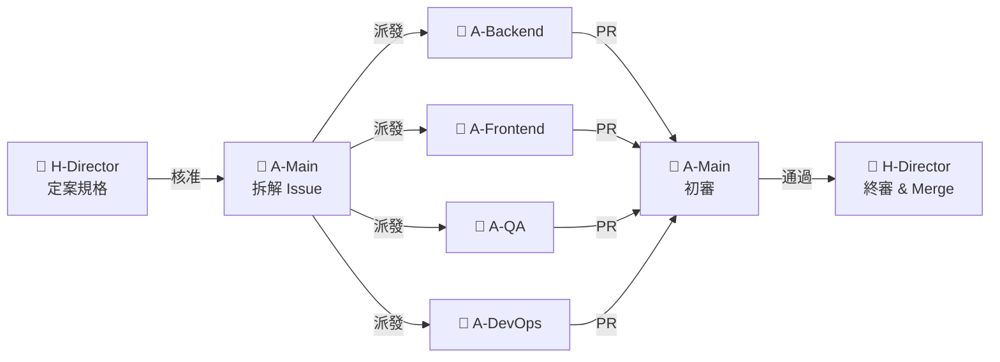
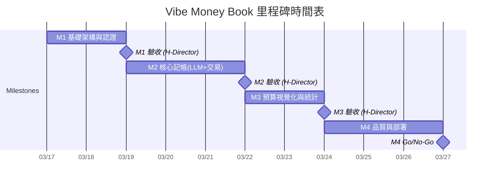
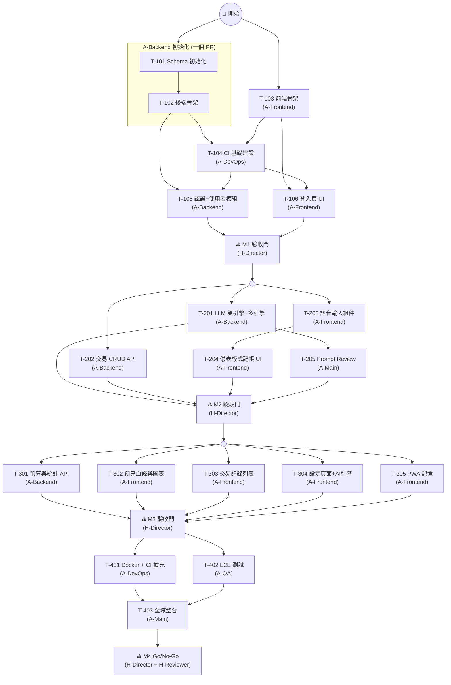
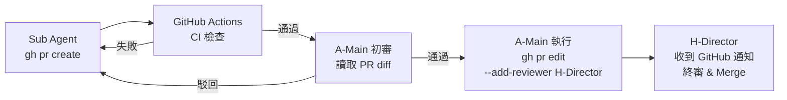
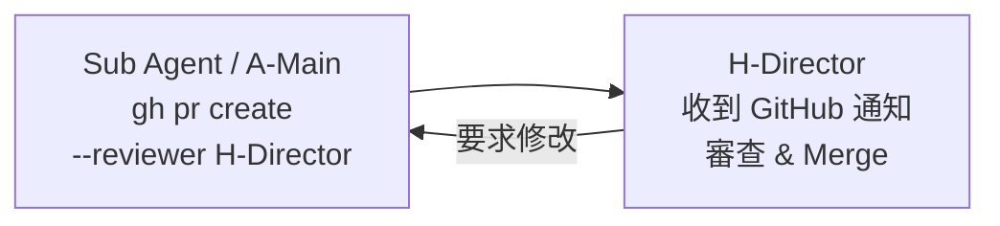

# 02 開發計畫 (AI Agentic Coding 版)

> **專案名稱**：Vibe Money Book — 語音記帳應用
> **版本**：v1.0 (Vibe-Coding / 基於 AI Agentic 架構)
> **開發周期**：1-2 周
> **開發模式**：Main Agent 統籌 + Sub Agents 並行開發
> **最後更新**：2026-03-17

---

## 目錄

1. [角色定義 (Role Registry)](#1-角色定義-role-registry)
2. [項目概況與時間表](#2-項目概況與時間表)
3. [里程碑定義](#3-里程碑定義)
4. [任務清單 (Sub Agents 協作)](#4-任務清單-sub-agents-協作)
5. [技術實施方案](#5-技術實施方案)
6. [風險識別與應對 (AI 開發視角)](#6-風險識別與應對-ai-開發視角)
7. [質量保證計畫 (Vibe Check)](#7-質量保證計畫-vibe-check)
8. [溝通與協作](#8-溝通與協作)

---

## 1. 角色定義 (Role Registry)

> **本節為全文唯一角色定義來源。** 後續所有章節引用角色時，必須使用下表中的 **角色代號**，不得自行新增或變體。

### 1.1 角色一覽

| 角色代號 | 角色名稱 | 類別 | 說明 |
|---------|---------|------|------|
| **H-Director** | 導演 (Director) | 🧑 人類 | 專案最高決策者。負責規格審查、PR 合併、Milestone 驗收、方向調整。 |
| **H-Reviewer** | 審查員 (Reviewer) | 🧑 人類 | 特定領域審查（安全/合規性），可由 Director 兼任。 |
| **H-UxReviewer** | UX 審查員 (UX Reviewer) | 🧑 人類 | UX 相關審查（視覺效果、互動體驗、裝置相容性），可由 Director 兼任或由具備 UX 能力的 AI Agent 代理執行。 |
| **A-Main** | 主代理 (Main Agent) | 🤖 AI | 統籌全局。負責拆解 Issue、協調 Sub Agents、整合驗證。 |
| **A-Backend** | 後端子代理 | 🤖 AI | 專注 `/backend/**`。負責 API、DB、LLM 整合、後端單元測試。 |
| **A-Frontend** | 前端子代理 | 🤖 AI | 專注 `/frontend/**`。負責 UI 組件、頁面、語音輸入、圖表、狀態管理。 |
| **A-QA** | 測試子代理 | 🤖 AI | 專注 `/tests/**`。負責 E2E 測試腳本。 |
| **A-DevOps** | 部署子代理 | 🤖 AI | 專注 `.github/**`、`docker/**`。負責 CI/CD、容器化。 |

### 1.2 人類角色職責詳述

| 階段 | H-Director 職責 | H-Reviewer 職責 | H-UxReviewer 職責 |
|------|-----------------|-----------------|-------------------|
| **規格定義** | 撰寫/定案 PRD、SRD、API Spec | 交叉審查規格一致性 | — |
| **任務分派** | 核准 A-Main 產出的 Issue 清單與優先級 | — | — |
| **開發進行中** | 監控進度、處理 AI 無法解決的環境/依賴問題 | Review 特定領域 PR (安全性) | — |
| **Milestone 驗收** | **唯一有權決定是否進入下一個 Milestone** | 協助驗收安全/合規性、LLM 整合測試 | 驗收 UI 視覺效果、互動體驗、裝置相容性 |
| **上線決策** | 最終 Go/No-Go 決策 | 確認上線安全檢查清單 | 確認 UX 品質達標 |

### 1.3 AI 角色職責詳述

| 角色代號 | 操作範圍 | 輸入依據 | 產出物 |
|---------|---------|---------|--------|
| **A-Main** | 全專案讀寫 | `/docs` 規格文件全集 | GitHub Issues、PR 初審結果、整合報告、Vibe Check |
| **A-Backend** | `/backend/**` | `01-2-SRD.md` + `API_Spec.yaml` | API 端點、DB Migrations、Seed Data、LLM 整合、單元測試 |
| **A-Frontend** | `/frontend/**` | `01-1-PRD.md` + `01-4-UI_UX_Design.md` + `API_Spec.yaml` | UI 頁面、組件、狀態管理、語音輸入、圖表 |
| **A-QA** | `/tests/**` | 全部規格 + 已完成程式碼 | E2E 測試腳本、測試報告 |
| **A-DevOps** | `.github/**`, `docker/**` | `04-CI_CD_Spec.md` + 專案結構 | CI/CD Workflows、Dockerfile、docker-compose |

### 1.4 任務分發流程



---

## 2. 項目概況與時間表

### 2.1 項目基本資訊

| 項目 | 說明 |
|------|------|
| **專案名稱** | Vibe Money Book（語音記帳應用） |
| **開發周期** | 1-2 周（AI 高度並行開發） |
| **總工作量** | H-Director ~20-30 HRH / AI Agents ~100-120 AI Sessions |
| **核心團隊** | 3 人類角色 + 5 AI 角色 |
| **開發範式** | API First 契約驅動，前後端並行開發 |

### 2.2 里程碑時間表



| 里程碑 | 名稱 | 周期 | 主要交付物 | 驗收者 |
|--------|------|------|-----------|--------|
| **M1** | 基礎架構與認證 | 2 天 | DB Schema、前後端骨架、CI Pipeline、Auth API + 登入頁 | H-Director |
| **M2** | 核心記帳 (LLM + 交易) | 3 天 | LLM 雙引擎、儀表板式記帳 UI、交易 CRUD | H-Director |
| **M3** | 預算視覺化與統計 | 2 天 | 預算血條、圓餅圖、記錄列表、設定頁、PWA 配置 | H-Director |
| **M4** | 品質與部署 | 3 天 | E2E 測試、Docker 容器化 | H-Director, H-Reviewer |

### 2.3 工作量估算

| 角色代號 | 工作量 | 說明 |
|---------|--------|------|
| **H-Director** | ~20-30 HRH | 規格審查、PR Review、Milestone 驗收 |
| **A-Main** | ~30 AI Sessions | Issue 拆解、整合驗證、Vibe Check |
| **A-Backend** | ~40 AI Sessions | API 開發、LLM 整合、DB 操作 |
| **A-Frontend** | ~40 AI Sessions | UI 組件、語音輸入、圖表、狀態管理 |
| **A-QA** | ~10 AI Sessions | E2E 測試 |
| **A-DevOps** | ~4 AI Sessions | CI（M1）、Docker（M4） |

---

## 3. 里程碑定義

### 3.1 Milestone 1：基礎架構與認證（Day 1-2）

**目標**：建立前後端基礎框架、CI Pipeline，完成認證機制，確保前後端連通。

**AI 執行策略**：
- **A-Backend**：初始化 Express + TypeScript + Prisma，建立 DB Schema（T-101 + T-102 合併為一個 PR）
- **A-Frontend**：初始化 Vite + React + TypeScript + Tailwind（T-103 獨立 PR）
- **A-DevOps**：建立 GitHub Actions CI Workflow（T-104）
- T-101 + T-102（A-Backend）與 T-103（A-Frontend）**跨 Agent 並行**；T-101 + T-102 為同一 Agent 內部依序執行，合併為一個 PR 提交
- T-104 待 T-102、T-103 就緒後開始；T-105、T-106 在 T-104（CI）就緒後開始，確保功能 PR 皆經過 CI 檢查

> **Bootstrap 說明**：T-101 ~ T-104 屬於專案初始化階段，此時 CI Pipeline 尚未建立，PR 直接由 H-Director 審查合併（不經過 CI 閘門）。T-104 合併後，後續所有 PR（T-105 起）必須通過 CI 檢查。

**交付物**：
- 完整 DB Schema 及 Migration
- GitHub Actions CI Workflow（Gate 1-4，詳見 [`04-CI_CD_Spec.md`](./04-CI_CD_Spec.md)）
- Auth API（註冊/登入）+ JWT 中間件
- 前端登入/註冊頁面 + Auth Context + Protected Route
- 前後端可獨立啟動

**Human Gate**：H-Director 驗收架構、CI Pipeline 與認證流程。

---

### 3.2 Milestone 2：核心記帳 — LLM 雙引擎 + 交易（Day 3-5）

**目標**：實作核心記帳流程：語音/文字輸入 → LLM 解析 → 確認 → 儲存。

**AI 執行策略**：
- **A-Backend**：實作 LLM 雙引擎（資料萃取 + 人設回饋）、交易 CRUD API
- **A-Frontend**：實作語音輸入組件（Web Speech API）、儀表板式首頁介面、解析結果確認卡片
- **A-Main**：Review LLM Prompt 設計品質

**交付物**：
- LLM 資料萃取引擎 + 人設回饋引擎（含新類別偵測 PRD-F-012、多引擎支援 PRD-F-013）
- 交易 CRUD API（含 AI 回饋儲存）
- 語音輸入組件（含動態視覺回饋）
- 儀表板式記帳介面（預算卡片、AI 回饋卡片、最近帳目列表、確認卡片、新類別確認對話框）

**Human Gate**：H-Director 驗收完整記帳流程（語音/文字 → 解析 → 確認 → 儲存 + AI 評論），**含新類別偵測流程驗收**。

---

### 3.3 Milestone 3：預算視覺化與統計（Day 6-7）

**目標**：實作預算管理、消費視覺化與設定功能，配置 PWA。

**AI 執行策略**：
- **A-Backend**：實作預算摘要 API、統計分佈 API、類別預算 CRUD
- **A-Frontend**：實作預算血條（含警告特效）、Recharts 圓餅圖、交易記錄列表、設定頁、PWA 配置

**交付物**：
- 預算摘要與類別分佈 API
- 預算血條組件（顏色漸變 + 呼吸燈特效）
- 消費分佈圓餅圖
- 交易記錄列表（篩選、刪除）
- 設定頁面（人設切換、預算管理）
- PWA manifest + Service Worker + icons（可安裝至手機桌面）

**Human Gate**：H-Director 驗收視覺效果與數據正確性。

---

### 3.4 Milestone 4：品質與部署（Day 8-10）

**目標**：自動化 E2E 測試、容器化部署、全域品質驗證。

**AI 執行策略**：
- **A-QA**：Playwright E2E 測試（記帳流程、預算顯示）
- **A-DevOps**：Dockerfile、docker-compose、CI 補充 E2E 測試 Job（詳見 [`04-CI_CD_Spec.md` §2.2](./04-CI_CD_Spec.md#22-e2e-jobm4-擴充)）
- **A-Main**：全域整合與 Vibe Check

**Human Gate**：H-Director 最終 Go/No-Go 決策。

---

## 4. 任務清單 (Sub Agents 協作)

### 4.1 任務總覽

| 任務編號 | 任務名稱 | 優先級 | 負責角色 | 前置任務 | PR 策略 | 預估耗時 |
|----|---------|-------|---------|---------|--------|----------|
| T-101 | Schema 與 DB 初始化 | P0 | A-Backend | — | 與 T-102 合併為一個 PR | ~2 Sessions |
| T-102 | 後端骨架與中間件 | P0 | A-Backend | — | 與 T-101 合併為一個 PR | ~3 Sessions |
| T-103 | 前端骨架與路由 | P0 | A-Frontend | — | 獨立 PR | ~3 Sessions |
| T-104 | CI 基礎建設 (GitHub Actions) | P0 | A-DevOps | T-102, T-103 | 獨立 PR | ~2 Sessions |
| T-105 | 認證與使用者模組 API 開發 | P0 | A-Backend | T-101, T-102, T-104 | 獨立 PR | ~4 Sessions |
| T-106 | 登入/註冊頁面與 Auth | P0 | A-Frontend | T-103, T-104 | 獨立 PR | ~3 Sessions |
| ⛳ M1 | M1 驗收門 | P0 | H-Director | T-105, T-106 | — | ~2 HRH |
| T-201 | LLM 雙引擎（含新類別偵測 + 多引擎） | P0 | A-Backend | T-105 | 獨立 PR | ~12 Sessions |
| T-202 | 交易 CRUD API | P0 | A-Backend | T-105 | 獨立 PR | ~4 Sessions |
| T-203 | 語音輸入組件 | P0 | A-Frontend | T-106 | 獨立 PR | ~5 Sessions |
| T-204 | 儀表板式記帳介面（含新類別確認） | P0 | A-Frontend | T-203; T-201, T-202 (串接) | 獨立 PR | ~10 Sessions |
| T-205 | LLM Prompt Review | P1 | A-Main | T-201 | — | ~2 Sessions |
| ⛳ M2 | M2 驗收門 | P0 | H-Director | T-201~T-205 | — | ~3 HRH |
| T-301 | 預算與統計 API（含類別 CRUD） | P0 | A-Backend | T-202 | 獨立 PR | ~6 Sessions |
| T-302 | 預算血條與圖表 UI | P0 | A-Frontend | T-204 | 獨立 PR | ~5 Sessions |
| T-303 | 交易記錄列表 | P1 | A-Frontend | T-204 | 獨立 PR | ~3 Sessions |
| T-304 | 設定頁面（含類別管理 + AI 引擎選擇） | P1 | A-Frontend | T-204 | 獨立 PR | ~6 Sessions |
| T-305 | PWA 配置 | P1 | A-Frontend | T-103 | 獨立 PR | ~2 Sessions |
| ⛳ M3 | M3 驗收門 | P0 | H-Director | T-301~T-305 | — | ~2 HRH |
| T-401 | Docker 容器化與 CI 擴充 | P0 | A-DevOps | T-301~T-305 | 獨立 PR | ~2 Sessions |
| T-402 | E2E 測試 | P0 | A-QA | T-301~T-304 | 獨立 PR | ~5 Sessions |
| T-403 | 全域整合與 Vibe Check | P0 | A-Main | T-401, T-402 | 獨立 PR | ~5 Sessions |
| ⛳ M4 | M4 Go/No-Go | P0 | H-Director, H-Reviewer | T-403 | — | ~3 HRH |

### 4.2 任務詳細描述

#### Milestone 1：基礎架構與認證

**T-101：Schema 與 DB 初始化**
- **任務描述**：依據 SRD 建立 Prisma Schema，定義四張核心表及其關聯，建立 Migration 與 Seed Script。
- **主要步驟**：
  1. 定義 Prisma Schema：`Users`（含 `ai_engine` 欄位，PRD-F-013）、`CategoryBudgets`（含 `is_custom` 欄位）、`Transactions`、`AIFeedbacks`
  2. 設定表間關聯（User → Transactions → AIFeedbacks、User → CategoryBudgets）
  3. 建立 Migration 檔案
  4. 撰寫 Seed Script：建立測試使用者、寫入預設類別預算（`is_custom = false`）
- **前置任務**：（無）
- **輸入**：`01-2-SRD.md` (§3 數據模型)
- **產出**：`prisma/schema.prisma`、`prisma/migrations/`、`prisma/seed.ts`
- **驗證**：
  - ✅ 自動：`npx prisma migrate dev` 成功執行
  - ✅ 自動：`npx prisma db seed` 成功寫入測試資料
- **優先級**：P0

**T-102：後端骨架與中間件**
- **任務描述**：初始化 Express + TypeScript 後端專案，配置全域中間件，建立基礎路由結構。
- **主要步驟**：
  1. 初始化專案：`npm init`、安裝 Express + TypeScript + ts-node-dev
  2. 配置 `tsconfig.json`、ESLint、Vitest
  3. 建立目錄結構：`src/controllers/`、`src/services/`、`src/middlewares/`、`src/routes/`
  4. 實作全域中間件：Error Handler、CORS、Request Logger、Rate Limiter (express-rate-limit)
  5. 建立路由結構與 `GET /health` 端點
  6. 配置 `npm run dev`、`npm run build`、`npm run lint`、`npm test` scripts
- **前置任務**：（無）
- **輸入**：`01-2-SRD.md` (§2 架構設計)
- **產出**：`/backend` 完整目錄結構、健康檢查端點
- **驗證**：
  - ✅ 自動：`npm run dev` 啟動成功
  - ✅ 自動：`curl localhost:3000/health` 回傳 HTTP 200
  - ✅ 自動：`npm run lint` 與 `npx tsc --noEmit` 通過
- **優先級**：P0

**T-103：前端骨架與路由**
- **任務描述**：初始化 Vite + React + TypeScript 前端專案，配置樣式系統、路由、狀態管理骨架與基礎 Layout。
- **主要步驟**：
  1. 初始化專案：`npm create vite@latest` (React + TypeScript 模板)
  2. 安裝並配置 Tailwind CSS
  3. 配置 ESLint、Vitest（含 `@testing-library/react`）
  4. 設定 Design Tokens（色彩、字體、間距、圓角、陰影、動畫）為 Tailwind 擴展
  5. 配置 React Router：`/`、`/stats`、`/history`、`/settings`、`/login`、`/register`
  6. 建立 Zustand Store 骨架
  7. 實作基礎 Layout 組件（底部導航列 Tab Bar）
  8. 配置 `npm run dev`、`npm run build`、`npm run lint`、`npm test` scripts
- **前置任務**：（無）
- **輸入**：`01-1-PRD.md` (§5 頁面結構)、`01-4-UI_UX_Design.md` (§2 Design Tokens、§3.5 底部 Tab Bar、§6 響應式設計)
- **產出**：`/frontend` 完整目錄結構、Layout 組件、路由配置
- **驗證**：
  - ✅ 自動：`npm run dev` 啟動成功
  - ✅ 自動：`npm run lint` 與 `npx tsc --noEmit` 通過
  - ✅ 自動：`npm run build` 成功產出靜態檔案
- **優先級**：P0

**T-104：CI 基礎建設 (GitHub Actions)**
- **任務描述**：建立 GitHub Actions CI Workflow，實作自動品質閘門（Gate 1-4），確保後續所有 PR 皆有自動檢查。詳細 Workflow 規格見 [`04-CI_CD_Spec.md`](./04-CI_CD_Spec.md)。
- **主要步驟**：
  1. 建立 `.github/workflows/ci.yml`
  2. 配置觸發條件：PR → main、push → main
  3. 實作 `ci-backend` Job：Checkout → Setup Node 20 → npm ci → ESLint → tsc --noEmit → Vitest → Build
  4. 實作 `ci-frontend` Job：同上結構（前後端並行執行）
  5. 配置 npm cache 以加速 CI 執行
  6. 推送後驗證 Workflow 正常觸發
- **前置任務**：T-102, T-103（需前後端骨架的 package.json 與 scripts 存在）
- **輸入**：[`04-CI_CD_Spec.md`](./04-CI_CD_Spec.md) (§2.1)、專案結構
- **產出**：`.github/workflows/ci.yml`
- **驗證**：
  - ✅ 自動：推送至 GitHub 後 Actions 正常觸發
  - ✅ 自動：`ci-backend` 與 `ci-frontend` 兩個 Job 皆通過
- **優先級**：P0

**T-105：認證與使用者模組 API 開發**
- **任務描述**：實作後端認證模組（註冊、登入、JWT 中間件）與使用者 Profile 模組（取得/更新個人資料），撰寫單元測試。
- **主要步驟**：
  1. 安裝依賴：`bcrypt`、`jsonwebtoken`、`zod`
  2. 實作 Auth Service：`register()`（bcrypt 密碼加密、**自動初始化 8 個預設類別預算**，見 SRD §3.4）、`login()`（密碼驗證 + JWT 生成）
  3. 實作 Auth Controller：`POST /auth/register`、`POST /auth/login`
  4. 實作 Auth Middleware：驗證 Bearer Token、注入 `req.userId`
  5. 實作 User Controller：`GET /users/profile`、`PUT /users/profile`（含人設、預算、AI 引擎偏好更新）
  6. 使用 Zod 定義請求驗證 Schema（email 格式、密碼長度、persona enum、ai_engine enum 等）
  7. 撰寫單元測試：註冊成功/重複 email、登入成功/密碼錯誤、Token 驗證/過期、Profile 取得/更新
- **前置任務**：T-101（DB Schema）、T-102（後端骨架）、T-104（CI 就緒，PR 需通過 CI）
- **輸入**：`API_Spec.yaml` (Auth + User 端點)
- **產出**：`src/controllers/authController.ts`、`src/controllers/userController.ts`、`src/services/authService.ts`、`src/services/userService.ts`、`src/middlewares/auth.ts`、單元測試
- **驗證**：
  - ✅ 自動：單元測試全數通過（Vitest）
  - ✅ 自動：CI Pipeline 通過
- **優先級**：P0

**T-106：登入/註冊頁面與 Auth**
- **任務描述**：實作前端認證相關頁面、全域認證狀態管理與路由保護機制。
- **主要步驟**：
  1. 實作 API Client：建立 Axios 實例，配置 Base URL 與 Auth 攔截器（自動附加 Bearer Token）
  2. 實作 Auth Store (Zustand)：管理 token、user 狀態、login/logout/register actions
  3. 實作 Login 頁面：email + 密碼表單、表單驗證、錯誤提示、登入後跳轉首頁
  4. 實作 Register 頁面：email + 密碼 + 確認密碼、註冊後自動登入
  5. 實作 Protected Route：未認證使用者自動導向 `/login`
  6. 實作 Token 持久化：存儲至 localStorage、頁面重整後自動恢復登入狀態
  7. 撰寫單元測試：Auth Store 狀態管理、Protected Route 重導向邏輯
- **前置任務**：T-103（前端骨架）、T-104（CI 就緒，PR 需通過 CI）
- **輸入**：`01-1-PRD.md`、`01-4-UI_UX_Design.md` (§3.6 登入/註冊頁)、`API_Spec.yaml` (Auth API)
- **產出**：`LoginPage.tsx`、`RegisterPage.tsx`、`authStore.ts`、`ProtectedRoute.tsx`、`apiClient.ts`、單元測試
- **驗證**：
  - ✅ 自動：單元測試通過（Auth Store、Protected Route）
  - ✅ 自動：CI Pipeline 通過
  - ✅ 自動：`npm run build` 成功
- **優先級**：P0

---

#### Milestone 2：核心記帳 — LLM 雙引擎 + 交易

**T-201：LLM 雙引擎實作（含新類別偵測 + 多引擎支援）**
- **任務描述**：實作 LLM 整合服務，包含資料萃取引擎與人設回饋引擎，支援多 LLM 引擎切換與新類別偵測。
- **主要步驟**：
  1. 定義 `LLMProvider` 抽象介面：`parseTransaction()`、`generateFeedback()`
  2. 實作 `GeminiProvider`：整合 `@google/generative-ai` SDK
  3. 實作 `OpenAIProvider`：整合 `@openai/openai` SDK
  4. 實作引擎工廠：根據使用者 `ai_engine` 偏好動態選擇 Provider
  5. 設計資料萃取 Prompt 模板：輸入自然語言，輸出 `{amount, category, merchant, date, is_new_category, suggested_category}` JSON
  6. 注入使用者現有類別清單至 Prompt，支援新類別偵測（PRD-F-012）與相似名稱比對
  7. 設計人設回饋 Prompt 模板：毒舌/溫柔/情勒三種風格，注入預算狀態
  8. 實作 `POST /ai/validate-key` 端點：驗證使用者提供的 LLM API Key 有效性（最小化測試請求）
  9. 實作 `POST /ai/parse` 端點：從 `X-LLM-API-Key` Header 取得 API Key（用後即棄）
  10. 實作錯誤處理：API 呼叫 timeout（3s）、重試機制（最多 2 次）、降級回應
  11. 撰寫單元測試：使用 Mock Provider 測試引擎切換邏輯、Prompt 組裝、錯誤處理
  12. 準備至少 10 組測試案例（含邊界情境：無金額、多筆消費、模糊類別）
- **前置任務**：T-105（Auth API，需認證中間件）
- **輸入**：`01-2-SRD.md` (§4 LLM 整合設計、§3.5 自訂類別機制、§4.3 多引擎抽象架構)、`API_Spec.yaml` (AI 端點)
- **產出**：`llmService.ts`、`llmProvider.ts` (介面)、`geminiProvider.ts`、`openaiProvider.ts`、`/prompts/*.ts`、`aiController.ts`、單元測試
- **驗證**：
  - ✅ 自動：單元測試通過 — Mock Provider 驗證引擎切換、Prompt 組裝、10 組固定輸入/輸出案例、錯誤處理與重試
  - ✅ 自動：CI Pipeline 通過
  - 👁️ 手動：使用真實 API Key 驗證 Gemini / OpenAI 引擎回傳結果品質（需 staging 環境）
- **優先級**：P0

**T-202：交易 CRUD API**
- **任務描述**：實作交易模組完整 RESTful API，含 AI 回饋關聯儲存。
- **主要步驟**：
  1. 實作 Transaction Service：CRUD 邏輯、分頁/篩選（按類別、日期範圍）
  2. 實作 `POST /transactions`：建立交易 + 同時建立關聯 AIFeedback 記錄
  3. 實作 `GET /transactions`：分頁列表（offset/limit）、支援類別與日期篩選
  4. 實作 `GET /transactions/:id`：單筆詳情含 AI 回饋內容
  5. 實作 `DELETE /transactions/:id`：硬刪除（DB 設定 `ON DELETE CASCADE`，級聯刪除關聯 AI 回饋）
  6. 使用 Zod 定義請求/回應 Schema
  7. 撰寫單元測試：CRUD 完整路徑、分頁邊界、權限驗證（不可刪他人交易）
- **前置任務**：T-105（Auth API，需認證中間件）
- **輸入**：`API_Spec.yaml` (Transaction 端點)
- **產出**：`transactionController.ts`、`transactionService.ts`、單元測試
- **驗證**：
  - ✅ 自動：所有 CRUD 單元測試通過
  - ✅ 自動：分頁/篩選邏輯正確（邊界值：空結果、超出範圍 offset）
  - ✅ 自動：CI Pipeline 通過
- **優先級**：P0

**T-203：語音輸入組件**
- **任務描述**：實作語音輸入 React 組件，整合 Web Speech API，含視覺回饋與瀏覽器相容性處理。
- **主要步驟**：
  1. 實作 `useVoiceRecognition` Hook：封裝 `SpeechRecognition` API、管理錄音狀態
  2. 實作瀏覽器相容性偵測（Feature Detection）：不支援時隱藏語音按鈕
  3. 實作 VoiceInput 組件 UI：按住說話按鈕、脈衝/聲波 CSS 動畫
  4. 處理語音辨識結果：中間結果顯示、最終結果回傳給父組件
  5. 撰寫單元測試：組件渲染、Feature Detection 邏輯、fallback 行為
- **前置任務**：T-106（前端登入頁，需 Auth 與 API Client 就緒）
- **輸入**：`01-1-PRD.md` (PRD-F-001)、`01-4-UI_UX_Design.md` (§4.1 語音錄音中)
- **產出**：`VoiceInput.tsx`、`useVoiceRecognition.ts`、單元測試
- **驗證**：
  - ✅ 自動：組件渲染測試通過、Feature Detection 邏輯測試通過
  - ✅ 自動：CI Pipeline 通過
  - 👁️ 手動：Chrome 上按住說話可辨識中文；Safari/Firefox 不支援時 graceful 隱藏按鈕
- **優先級**：P0

**T-204：儀表板式記帳介面（含新類別確認流程）**
- **任務描述**：實作主頁面儀表板式記帳 UI，串接後端 API，實作新類別確認對話框。
- **主要步驟**：
  1. 實作 DashboardPage 頁面佈局：頂部預算卡片區、中間 AI 回饋區、底部最近帳目列表
  2. 實作 BudgetCard 組件：顯示本月已用/總預算概要
  3. 實作 AIFeedbackCard 組件：顯示最近一筆 AI 人設評論
  4. 實作底部固定輸入區：文字輸入框 + VoiceInput 語音按鈕
  5. 實作 ParsedResultCard 組件：AI 解析結果確認卡片（金額、類別、商家），含確認/修改按鈕
  6. 實作 NewCategoryDialog 組件（PRD-F-012）：當 `is_new_category: true` 時彈出，支援「確認新增 / 修改名稱 / 選擇現有類別」三種操作
  7. 串接 `POST /ai/parse`：送出文字/語音輸入 → 顯示解析結果
  8. 串接 `POST /transactions`：使用者確認後儲存交易
  9. 串接 `POST /budget/categories`：新類別確認後先建立類別再記帳
  10. 實作 Dashboard Store (Zustand)：管理解析狀態、確認流程、最近帳目快取
  11. 實作 RecentTransactions 組件：顯示最近 5 筆交易
- **前置任務**：T-203（VoiceInput 組件）；T-201、T-202（API 串接測試時需要）
- **輸入**：`01-1-PRD.md` (PRD-F-002~004, PRD-F-012)、`01-4-UI_UX_Design.md` (§3.1、§4.2、§4.3、§5)、`API_Spec.yaml`
- **產出**：`DashboardPage.tsx`、`BudgetCard.tsx`、`AIFeedbackCard.tsx`、`ParsedResultCard.tsx`、`RecentTransactions.tsx`、`NewCategoryDialog.tsx`、`dashboardStore.ts`
- **驗證**：
  - ✅ 自動：組件渲染測試通過、Store 狀態管理測試通過
  - ✅ 自動：CI Pipeline 通過
  - 👁️ 手動：完整記帳流程可操作（輸入 → 解析 → 確認 → 儲存）
  - 👁️ 手動：新類別偵測時正確顯示確認對話框並完成新增類別 + 記帳
- **優先級**：P0

**T-205：LLM Prompt Review**
- **任務描述**：A-Main 審查 T-201 的 Prompt 模板品質，確保萃取準確度與人設風格一致性。
- **主要步驟**：
  1. 審查資料萃取 Prompt：確認 JSON Schema 約束、temperature 設定、邊界輸入處理
  2. 審查人設回饋 Prompt：確認三種風格（毒舌/溫柔/情勒）一致性
  3. 驗證 Few-shot examples 品質與覆蓋度
  4. 提出改進建議（Issue Comments）
- **前置任務**：T-201
- **輸入**：T-201 產出的 Prompt 模板
- **產出**：Review 意見（Issue Comments）
- **驗證**：
  - ✅ Review 通過，無重大問題
- **優先級**：P1

---

#### Milestone 3：預算視覺化與統計

**T-301：預算與統計 API（含類別 CRUD）**
- **任務描述**：實作預算摘要、消費分佈統計與自訂類別管理 API。
- **主要步驟**：
  1. 實作 `GET /budget/summary`：月度預算摘要（總預算、已消費、剩餘），含各類別明細
  2. 實作 `GET /budget/categories`：取得使用者所有類別（含預設 + 自訂標識）
  3. 實作 `PUT /budget/categories`：批次更新類別預算限額
  4. 實作 `POST /budget/categories`（PRD-F-012）：新增自訂類別，驗證名稱不重複、總數上限 20
  5. 實作 `DELETE /budget/categories/:category`（PRD-F-012）：刪除自訂類別，將關聯交易重新歸類至「其他」
  6. 實作 `GET /stats/distribution`：消費分佈比例（各類別佔總消費百分比）
  7. 撰寫單元測試：摘要計算、分佈比例加總驗證、類別上限檢查、刪除後歸類邏輯
- **前置任務**：T-202（Transaction API，需交易資料基礎）
- **輸入**：`API_Spec.yaml` (Budget/Stats 端點)、`01-2-SRD.md` (§3.5 自訂類別機制)
- **產出**：`budgetController.ts`、`budgetService.ts`、`statsController.ts`、`statsService.ts`、單元測試
- **驗證**：
  - ✅ 自動：單元測試通過 — 摘要數據正確計算、分佈比例加總為 1.0
  - ✅ 自動：新增類別驗證（名稱重複拒絕、超過上限 20 拒絕）
  - ✅ 自動：刪除自訂類別後關聯交易 category 更新為「其他」
  - ✅ 自動：CI Pipeline 通過
- **優先級**：P0

**T-302：預算血條與圖表 UI**
- **任務描述**：實作預算血條組件與消費分佈圓餅圖，串接 Budget Summary API。
- **主要步驟**：
  1. 實作 BudgetBar 組件：根據消費比例渲染進度條、CSS 顏色漸變（綠 → 黃 → 紅）
  2. 實作 < 20% 剩餘預算動畫：呼吸燈 / 閃爍 CSS animation
  3. 安裝並整合 Recharts：實作 DistributionChart 圓餅圖組件
  4. 實作 Stats 頁面：組合 BudgetBar + DistributionChart
  5. 串接 `GET /budget/summary` 與 `GET /stats/distribution` API
  6. 撰寫單元測試：組件在不同百分比下渲染正確 CSS class
- **前置任務**：T-204（儀表板頁面基礎）
- **輸入**：`01-1-PRD.md` (PRD-F-007, PRD-F-008)、`01-4-UI_UX_Design.md` (§3.1.2、§3.2、§4.4)
- **產出**：`BudgetBar.tsx`、`DistributionChart.tsx`、`StatsPage.tsx`、單元測試
- **驗證**：
  - ✅ 自動：組件在 80%/50%/20%/10% 情境下渲染正確 CSS class（對應綠/黃/紅/閃爍）
  - ✅ 自動：CI Pipeline 通過
  - 👁️ 手動：視覺效果符合設計稿 — 顏色漸變流暢、< 20% 呼吸燈動畫觸發、圓餅圖正確渲染
- **優先級**：P0

**T-303：交易記錄列表**
- **任務描述**：實作交易記錄頁面，含篩選、刪除與詳情查看功能。
- **主要步驟**：
  1. 實作 HistoryPage 頁面：按日期倒序顯示交易列表
  2. 實作 TransactionItem 組件：類別圖標、金額、商家、日期
  3. 實作篩選功能：按類別下拉選單、按日期範圍篩選
  4. 實作刪除功能：滑動刪除或刪除按鈕，含二次確認 Dialog
  5. 實作 TransactionDetail 組件：點擊展開詳情（含 AI 評論回顯）
  6. 串接 `GET /transactions`（分頁）、`DELETE /transactions/:id`
- **前置任務**：T-204（儀表板頁面基礎）
- **輸入**：`01-1-PRD.md` (PRD-F-009)、`01-4-UI_UX_Design.md` (§3.3、§4.5)
- **產出**：`HistoryPage.tsx`、`TransactionItem.tsx`、`TransactionDetail.tsx`、單元測試
- **驗證**：
  - ✅ 自動：組件渲染測試通過、篩選邏輯測試通過
  - ✅ 自動：CI Pipeline 通過
  - 👁️ 手動：列表正確顯示；篩選功能正常；刪除後列表即時更新
- **優先級**：P1

**T-304：設定頁面（含類別管理 + AI 引擎選擇）**
- **任務描述**：實作設定頁面，包含人設選擇、預算管理、自訂類別管理與 AI 引擎切換。
- **主要步驟**：
  1. 實作 SettingsPage 頁面佈局：區段式排列（人設、預算、類別、AI 引擎）
  2. 實作 PersonaSelector 組件：毒舌/溫柔/情勒三選一，附預覽文案
  3. 實作 BudgetEditor 組件：月總預算設定 + 各類別預算限額列表編輯
  4. 實作 CategoryManager 組件（PRD-F-012）：顯示預設/自訂類別標識、刪除自訂類別（二次確認）、新增類別可設定預算
  5. 實作 AIEngineSelector 組件（PRD-F-013）：Gemini/OpenAI 切換卡片
  6. 實作 APIKeyInput 組件：密碼型態輸入框（附顯示/隱藏切換）、Key 儲存至 localStorage（不上傳伺服器）
  7. 串接 `PUT /users/profile`、`POST /ai/validate-key`、`PUT /budget/categories`、`POST /budget/categories`、`DELETE /budget/categories/:category`
- **前置任務**：T-204（儀表板頁面基礎）
- **輸入**：`01-1-PRD.md` (PRD-F-005, 010, 011, 012, 013)、`01-4-UI_UX_Design.md` (§3.4、§6)
- **產出**：`SettingsPage.tsx`、`PersonaSelector.tsx`、`BudgetEditor.tsx`、`CategoryManager.tsx`、`AIEngineSelector.tsx`、`APIKeyInput.tsx`、單元測試
- **驗證**：
  - ✅ 自動：組件渲染測試通過、Store 狀態測試通過
  - ✅ 自動：API Key 儲存於 localStorage（不透過網路傳輸至後端持久化）
  - ✅ 自動：CI Pipeline 通過
  - 👁️ 手動：人設切換即時生效；預算修改成功儲存；自訂類別可刪除且交易正確重新歸類；AI 引擎切換即時生效
- **優先級**：P1

**T-305：PWA 配置**
- **任務描述**：配置 PWA 支援，確保應用可安裝至手機桌面。
- **主要步驟**：
  1. 安裝 `vite-plugin-pwa`
  2. 配置 Web App Manifest：應用名稱、圖標（192x192、512x512）、主題色、背景色
  3. 配置 Service Worker：預快取策略（App Shell）
  4. 準備應用圖標（多尺寸 PNG）
  5. 配置 `<meta>` 標籤：viewport、theme-color、apple-mobile-web-app-capable
- **前置任務**：T-103（前端骨架）
- **輸入**：`01-1-PRD.md` (PRD-NF-007)
- **產出**：PWA manifest 配置、Service Worker 配置、應用圖標
- **驗證**：
  - ✅ 自動：`npm run build` 成功產出 manifest.json 與 sw.js
  - ✅ 自動：CI Pipeline 通過
  - 👁️ 手動：`npx lighthouse` PWA 審計分數 ≥ 80
  - 👁️ 手動：行動裝置瀏覽器可出現「加到主畫面」提示
- **優先級**：P1

---

#### Milestone 4：品質與部署

**T-401：Docker 容器化與 CI 擴充**
- **任務描述**：建立 Docker 容器化部署配置，並擴充 CI Workflow 加入 E2E 測試 Job。
- **主要步驟**：
  1. 撰寫後端 Dockerfile（多階段建構：build stage → production stage）
  2. 撰寫前端 Dockerfile（build stage → Nginx 靜態服務）
  3. 撰寫 `docker-compose.yml`：前端 + 後端 + PostgreSQL 三服務、network 與 volume 配置
  4. 配置環境變數模板（`.env.example`）
  5. 更新 `.github/workflows/ci.yml`：加入 `e2e` Job（詳見 [`04-CI_CD_Spec.md` §2.2](./04-CI_CD_Spec.md#22-e2e-jobm4-擴充)）
- **前置任務**：T-301 ~ T-305（所有功能完成）
- **輸入**：[`04-CI_CD_Spec.md`](./04-CI_CD_Spec.md) (§2.2)、專案結構
- **產出**：`Dockerfile`（前端/後端）、`docker-compose.yml`、`.env.example`、更新後的 `ci.yml`
- **驗證**：
  - ✅ 自動：`docker-compose up --build` 成功啟動三服務
  - ✅ 自動：容器內 `curl localhost:3000/health` 回傳 200
  - ✅ 自動：CI Pipeline（含 E2E Job）全綠
- **優先級**：P0

**T-402：E2E 測試**
- **任務描述**：使用 Playwright 撰寫端對端測試，覆蓋核心使用者流程。
- **主要步驟**：
  1. 初始化 Playwright 專案（`/tests/`）
  2. 撰寫測試：註冊 → 登入流程
  3. 撰寫測試：文字記帳流程（輸入 → LLM 解析 → 確認 → 儲存），使用 Mock LLM API 回應
  4. 撰寫測試：預算血條顯示（驗證不同預算比例下的正確渲染）
  5. 撰寫測試：交易記錄列表（篩選、刪除）
  6. 配置 Playwright config：baseURL、timeout、screenshot on failure
- **前置任務**：T-301 ~ T-304（前後端功能皆完成）
- **輸入**：`01-1-PRD.md`、已完成的前後端源碼
- **產出**：`/tests/e2e/*.spec.ts`、`playwright.config.ts`
- **驗證**：
  - ✅ 自動：所有 E2E 測試通過（`npx playwright test`）
  - ✅ 自動：CI Pipeline E2E Job 通過
- **優先級**：P0

**T-403：全域整合與 Vibe Check**
- **任務描述**：A-Main 執行全專案品質驗證，修復遺留問題，確保發佈就緒。
- **主要步驟**：
  1. 執行 `npx tsc --noEmit`（前端 + 後端）：清除所有 TypeScript 型別錯誤
  2. 執行 `npm run lint`（前端 + 後端）：清除所有 ESLint 警告
  3. 驗證前後端 API 串接一致性：比對實際端點與 `API_Spec.yaml` 定義
  4. 執行 `npm run build`（前端 + 後端）：確認 build 成功
  5. 確認 CI Pipeline 全綠（含 E2E）
  6. 確認 LLM 呼叫已配置 timeout（3s）與重試機制
  7. 產出 Vibe Check 報告，列出修復項目
- **前置任務**：T-401, T-402
- **輸入**：全專案源碼、CI 報告
- **產出**：Vibe Check 報告、修復 Commits
- **驗證**：
  - ✅ 自動：`tsc --noEmit` 零錯誤（前端 + 後端）
  - ✅ 自動：`npm run build` 前後端皆成功
  - ✅ 自動：CI Pipeline 全綠
- **優先級**：P0

### 4.3 並行群組視覺化



---

## 5. 技術實施方案

### 5.1 前端架構

- **框架**：React 18 + Vite + TypeScript
- **樣式**：Tailwind CSS（利於 AI 單檔生成）
- **狀態管理**：Zustand（輕量、樣板少）
- **圖表**：Recharts（React 原生圖表庫）
- **語音**：Web Speech API (SpeechRecognition)
- **PWA**：vite-plugin-pwa

### 5.2 後端架構

- **框架**：Express.js + TypeScript
- **ORM**：Prisma（聲明式 Schema，適合 AI 操作）
- **驗證**：Zod（與 TypeScript 完美整合）
- **LLM**：OpenAI SDK (`@openai/openai`) + Google Generative AI SDK (`@google/generative-ai`)，統一抽象層支援引擎切換（PRD-F-013）
- **認證**：jsonwebtoken + bcrypt

### 5.3 資料庫與部署

- **資料庫**：PostgreSQL（開發可用 SQLite 簡化）
- **容器化**：Docker + docker-compose
- **CI/CD**：GitHub Actions（詳見 [`04-CI_CD_Spec.md`](./04-CI_CD_Spec.md)）

---

## 6. 風險識別與應對 (AI 開發視角)

| 風險 ID | 風險描述 | 概率 | 應對措施 | 負責 |
|--------|---------|------|---------|------|
| **VIBR-01** | LLM 解析結果不穩定 | 高 | 嚴格 JSON Schema 約束 + temperature=0 + 前端確認機制 | A-Backend |
| **VIBR-02** | Web Speech API 瀏覽器相容性問題 | 中 | Feature detection + 文字輸入 fallback | A-Frontend |
| **VIBR-03** | AI 破壞已完成功能 (Regression) | 高 | 每個 Milestone 完整單元測試 + CI 攔截 | A-Main |
| **VIBR-04** | LLM API 費用失控 | 中 | 嚴格速率限制 + gpt-4o-mini（低成本模型） | A-Backend |
| **VIBR-05** | Sub Agents 上下文不同步 | 中 | 以 `/docs` 規格為唯一真理源 | A-Main |
| **VIBR-06** | 人設回饋生成品質不穩 | 中 | Few-shot examples 在 Prompt 中 + Review | A-Main |

---

## 7. 質量保證計畫 (Vibe Check)

> CI/CD 閘口詳細規格見 [`04-CI_CD_Spec.md`](./04-CI_CD_Spec.md)。

### 7.1 CI/CD 閘口

| Gate | 檢查項目 | 觸發時機 | 生效時間 |
|------|---------|---------|---------|
| **Gate 1** | ESLint 靜態分析 | 每次 PR | M1 起 |
| **Gate 2** | TypeScript Type Check | 每次 PR | M1 起 |
| **Gate 3** | Unit Test (Vitest) | 每次 PR | M1 起 |
| **Gate 4** | Build Check | 每次 PR | M1 起 |
| **Gate 5** | E2E Test (Playwright) | 每次 PR | M4 起 |

### 7.2 Human-in-the-Loop 審查

| 項目 | 負責 | 時機 |
|------|------|------|
| LLM Prompt 品質 | H-Director | M2 驗收 |
| LLM 引擎整合測試（需真實 API Key） | H-Reviewer | M2 驗收 |
| UI/UX 是否符合 PRD | H-UxReviewer | M3 驗收 |
| 預算血條視覺效果 | H-UxReviewer | M3 驗收 |
| PWA 行動裝置安裝體驗 | H-UxReviewer | M3 驗收 |
| 語音辨識瀏覽器相容性 | H-UxReviewer | M2 驗收 |
| 安全性審計 | H-Reviewer | M4 上線前 |

---

## 8. 溝通與協作

### 8.1 文件存取約定 (Single Source of Truth)

| 文件 | 主要消費者 | 用途 |
|------|-----------|------|
| `01-1-PRD.md` | A-Frontend | 產品行為、UI 互動 |
| `01-2-SRD.md` | A-Backend | 系統架構、LLM 整合、DB Schema |
| `01-4-UI_UX_Design.md` | A-Frontend | UI 元件規格、Design Tokens、互動動畫、響應式設計 |
| `API_Spec.yaml` | A-Backend, A-Frontend | API 契約（不可擅自修改） |
| `02-Dev_Plan.md` | A-Main | 任務拆解與進度追蹤 |
| `04-CI_CD_Spec.md` | A-DevOps | CI/CD Workflow 詳細規格 |

### 8.2 Git 協作策略

#### 分支命名

```
feat/<agent>/<issue-N>-<簡述>
```

範例：
- `feat/backend/issue-5-auth-api`
- `feat/frontend/issue-8-chat-ui`
- `feat/devops/issue-15-docker`

#### Worktree 配置

```bash
git worktree add ../worktree-backend feat/backend/issue-5-auth-api
git worktree add ../worktree-frontend feat/frontend/issue-8-chat-ui
```

#### PR 審查流程（標準流程，T-105 起適用）



#### PR 審查流程（Bootstrap 階段，T-101 ~ T-104 適用）

CI Pipeline 尚未建立，PR 直接由 H-Director 審查：



**Bootstrap PR 合併規則**：
- T-101 + T-102（A-Backend）：合併為**一個 PR**，因為同一 Agent 且修改同一目錄（`/backend/**`）
- T-103（A-Frontend）：獨立 PR，與上述 PR **並行提交、無衝突**（不同目錄）
- T-104（A-DevOps）：獨立 PR，待 T-102、T-103 合併後提交

#### H-Director 通知機制

| 場景 | 通知方式 |
|------|---------|
| **標準流程** | A-Main 初審通過後執行 `gh pr edit --add-reviewer <H-Director-username>`，GitHub 自動發送 Review Request 通知（Email / Web / Mobile） |
| **Bootstrap 階段** | Sub Agent 建立 PR 時直接指定 `gh pr create --reviewer <H-Director-username>` |
| **Milestone 驗收** | A-Main 在 GitHub Issue 中 `@H-Director` 並附上驗收檢查清單 |

#### PR 範圍限制

| Agent 角色 | 允許修改路徑 |
|-----------|-------------|
| A-Backend | `/backend/**` |
| A-Frontend | `/frontend/**` |
| A-QA | `/tests/**` |
| A-DevOps | `.github/**`, `docker/**`, `Dockerfile`, `docker-compose.yml` |
| A-Main | 全專案（整合與修復用） |

### 8.3 規格變更流程

```text
任何角色發現規格問題 → A-Main 提報 → H-Director 審查 → 核准後更新 /docs → 通知所有相關 Sub Agents
```

**禁止事項**：任何 AI 角色不得在未經 H-Director 核准的情況下修改 `/docs` 下的規格文件。

### 8.4 Sub Agent Session 隔離

#### 核心原則

> **每個 Sub Agent = 一個獨立的 Claude Code terminal session（獨立 context window）。**
>
> Sub Agents 之間不直接共享 context，跨代理的溝通媒介為 **GitHub Issues 與 PR Comments**，而非 session 內的對話記憶。

**理由**：
- 避免不同角色的程式碼知識互相污染（A-Frontend 不需要知道 A-Backend 的內部實作）
- 各 session 的 context token 消耗彼此獨立，不互相搶佔
- 與 Worktree 一一對應，概念清晰、邊界明確

#### Session 與 Worktree 對應表

| Agent 角色 | Claude Code Session | Git Worktree 路徑 |
|-----------|--------------------|--------------------|
| **A-Main** | 主 session（專案根目錄） | `./`（主 worktree） |
| **A-Backend** | 獨立 session | `../worktree-backend` |
| **A-Frontend** | 獨立 session | `../worktree-frontend` |
| **A-QA** | 獨立 session | `../worktree-qa` |
| **A-DevOps** | 獨立 session | `../worktree-devops` |

#### Sub Agent 啟動規範（Context 初始化）

每個 Sub Agent session 啟動時，**必須**依序執行以下初始化，確保 context 正確載入：

```
1. 進入對應的 Worktree 目錄
2. 讀取角色對應的規格文件（見下表）
3. 讀取 H-Director 指派的 GitHub Issue
4. 確認理解任務範圍後，開始實作
```

| Agent 角色 | 必讀規格文件 | 不需讀取 |
|-----------|------------|---------|
| **A-Backend** | `01-2-SRD.md`、`API_Spec.yaml` | `/frontend/**` 程式碼 |
| **A-Frontend** | `01-1-PRD.md`、`01-4-UI_UX_Design.md`、`API_Spec.yaml` | `/backend/**` 程式碼 |
| **A-QA** | 全部規格文件 + 已完成程式碼 | — |
| **A-DevOps** | `04-CI_CD_Spec.md`、`01-2-SRD.md`（部署需求章節） | `/frontend/**`、`/backend/**` 程式碼 |
| **A-Main** | 全部規格文件 + `02-Dev_Plan.md` | — |

> **原則**：Sub Agent 只需載入「完成自身任務所需的最小 context」。讀取無關的大量程式碼只會消耗 context 且引入雜訊。

#### A-Main 的協調機制

A-Main 不直接存取或「注入」Sub Agent 的 session context，而是透過以下方式協調：

```
派發任務：A-Main 建立/更新 GitHub Issue → Sub Agent 讀取 Issue 開始工作
收集成果：Sub Agent 提交 PR → A-Main 讀取 PR diff 進行初審
問題回報：Sub Agent 在 PR Comments 提問 → A-Main 回覆 → Sub Agent 讀取回覆繼續工作
```

#### Session 終止與清理

- 任務完成、PR 合併後，Sub Agent session 可關閉（context 無需保留）。
- 若同一 Agent 需執行下一個 Issue，**建議開啟新的 session**（而非在舊 context 上繼續），以避免前次任務的程式碼細節干擾新任務的判斷。
- A-Main session 可跨里程碑持續使用，因其需要全局視角。

---

## 附錄：任務執行狀態追蹤

### Milestone 1：基礎架構與認證

- [x] T-101 (A-Backend) Schema 與 DB 初始化 — PR #33 merged 2026-03-17
- [x] T-102 (A-Backend) 後端骨架與中間件 — PR #33 merged 2026-03-17
- [x] T-103 (A-Frontend) 前端骨架與路由 — PR #34 merged 2026-03-17
- [x] T-104 (A-DevOps) CI 基礎建設 (GitHub Actions) — PR #35 merged 2026-03-18
- [x] T-105 (A-Backend) 認證與使用者模組 API 開發 — PR #36 merged 2026-03-17
- [x] T-106 (A-Frontend) 登入/註冊頁面與 Auth — PR #37 merged 2026-03-17
- [x] ⛳ M1 驗收門 — Issue #20 closed 2026-03-18

### Milestone 2：核心記帳

- [x] T-201 (A-Backend) LLM 雙引擎實作（含新類別偵測 + 多引擎支援） — PR #38 merged 2026-03-17
- [x] T-202 (A-Backend) 交易 CRUD API — PR #40 merged 2026-03-17
- [x] T-203 (A-Frontend) 語音輸入組件 — PR #39 merged 2026-03-17
- [x] T-204 (A-Frontend) 儀表板式記帳介面（含新類別確認流程） — PR #41 merged 2026-03-17
- [x] T-205 (A-Main) LLM Prompt Review — PR #43 merged 2026-03-18
- [x] ⛳ M2 驗收門 — Issue #21 closed 2026-03-19

### Milestone 3：預算視覺化與統計

- [x] T-301 (A-Backend) 預算與統計 API（含類別 CRUD） — PR #49 merged 2026-03-18
- [x] T-302 (A-Frontend) 預算血條與圖表 — PR #51 merged 2026-03-19
- [x] T-303 (A-Frontend) 交易記錄列表 — PR #52 merged 2026-03-19
- [x] T-304 (A-Frontend) 設定頁面（含類別管理 + AI 引擎選擇） — PR #50 merged 2026-03-18
- [x] T-305 (A-Frontend) PWA 配置 — PR #51 merged 2026-03-19
- [x] ⛳ M3 驗收門 — Issue #22 closed 2026-03-19

### Milestone 4：品質與部署

- [x] T-401 (A-DevOps) Docker 容器化與 CI 擴充 — PR #55 merged 2026-03-19
- [x] T-402 (A-QA) E2E 測試 — PR #56 merged 2026-03-19
- [x] T-403 (A-Main) 全域整合與 Vibe Check — PR #57 merged 2026-03-19
- [x] ⛳ M4 Go/No-Go — Issue #23 closed 2026-03-20

---

**修訂與維護者**：A-Main 代 H-Director 修訂
**開發範式**：Vibe-SDLC / Agentic Coding
**下次計畫重估**：Milestone 2 結束時
