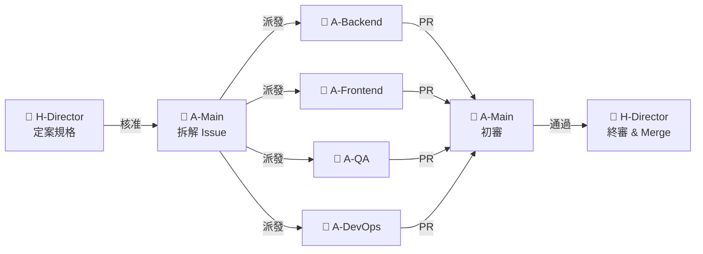
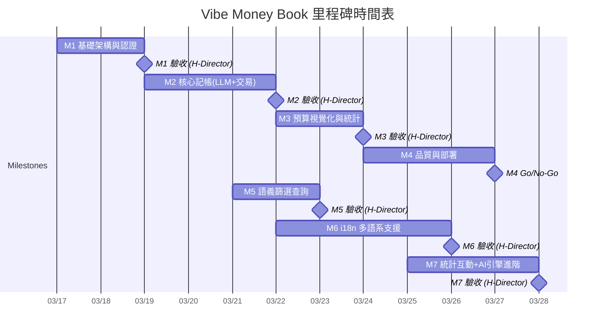
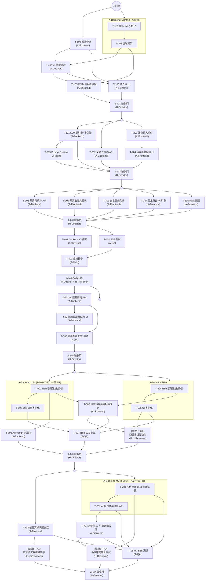
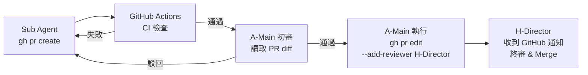
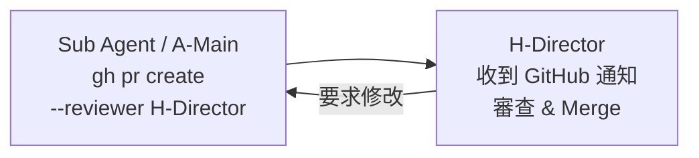

# 02 開發計畫 (AI Agentic Coding 版)

> **專案名稱**：Vibe Money Book — 語音記帳應用
> **版本**：v1.7 (Vibe-Coding / 基於 AI Agentic 架構)
> **開發周期**：1-2 周
> **開發模式**：Main Agent 統籌 + Sub Agents 並行開發
> **最後更新**：2026-03-27

---

## 目錄

1. [角色定義 (Role Registry)](#1-角色定義-role-registry)
2. [項目概況與時間表](#2-項目概況與時間表)
3. [里程碑定義](#3-里程碑定義)
4. [任務清單 (Sub Agents 協作)](#4-任務清單-sub-agents-協作)
5. [技術實施方案](#5-技術實施方案)
6. [風險識別與應對 (AI 開發視角)](#6-風險識別與應對-ai-開發視角)
7. [質量保證計畫 (Vibe Check)](#7-質量保證計畫-vibe-check)
8. [溝通與協作](#8-溝通與協作)

---

## 1. 角色定義 (Role Registry)

> **本節為全文唯一角色定義來源。** 後續所有章節引用角色時，必須使用下表中的 **角色代號**，不得自行新增或變體。

### 1.1 角色一覽

| 角色代號 | 角色名稱 | 類別 | 說明 |
|---------|---------|------|------|
| **H-Director** | 導演 (Director) | 🧑 人類 | 專案最高決策者。負責規格審查、PR 合併、Milestone 驗收、方向調整。 |
| **H-Reviewer** | 審查員 (Reviewer) | 🧑 人類 | 特定領域審查（安全/合規性），可由 Director 兼任。 |
| **H-UxReviewer** | UX 審查員 (UX Reviewer) | 🧑 人類 | UX 相關審查（視覺效果、互動體驗、裝置相容性），可由 Director 兼任或由具備 UX 能力的 AI Agent 代理執行。 |
| **A-Main** | 主代理 (Main Agent) | 🤖 AI | 統籌全局。負責拆解 Issue、協調 Sub Agents、整合驗證。 |
| **A-Backend** | 後端子代理 | 🤖 AI | 專注 `/backend/**`。負責 API、DB、LLM 整合、後端單元測試。 |
| **A-Frontend** | 前端子代理 | 🤖 AI | 專注 `/frontend/**`。負責 UI 組件、頁面、語音輸入、圖表、狀態管理。 |
| **A-QA** | 測試子代理 | 🤖 AI | 專注 `/tests/**`。負責 E2E 測試腳本。 |
| **A-DevOps** | 部署子代理 | 🤖 AI | 專注 `.github/**`、`docker/**`。負責 CI/CD、容器化。 |

### 1.2 人類角色職責詳述

| 階段 | H-Director 職責 | H-Reviewer 職責 | H-UxReviewer 職責 |
|------|-----------------|-----------------|-------------------|
| **規格定義** | 撰寫/定案 PRD、SRD、API Spec | 交叉審查規格一致性 | — |
| **任務分派** | 核准 A-Main 產出的 Issue 清單與優先級 | — | — |
| **開發進行中** | 監控進度、處理 AI 無法解決的環境/依賴問題 | Review 特定領域 PR (安全性) | — |
| **Milestone 驗收** | **唯一有權決定是否進入下一個 Milestone** | 協助驗收安全/合規性、LLM 整合測試 | 驗收 UI 視覺效果、互動體驗、裝置相容性 |
| **上線決策** | 最終 Go/No-Go 決策 | 確認上線安全檢查清單 | 確認 UX 品質達標 |

### 1.3 AI 角色職責詳述

| 角色代號 | 操作範圍 | 輸入依據 | 產出物 |
|---------|---------|---------|--------|
| **A-Main** | 全專案讀寫 | `/docs` 規格文件全集 | GitHub Issues、PR 初審結果、整合報告、Vibe Check |
| **A-Backend** | `/backend/**` | `01-2-SRD.md` + `API_Spec.yaml` | API 端點、DB Migrations、Seed Data、LLM 整合、單元測試 |
| **A-Frontend** | `/frontend/**` | `01-1-PRD.md` + `01-4-UI_UX_Design.md` + `API_Spec.yaml` | UI 頁面、組件、狀態管理、語音輸入、圖表 |
| **A-QA** | `/tests/**` | 全部規格 + 已完成程式碼 | E2E 測試腳本、測試報告 |
| **A-DevOps** | `.github/**`, `docker/**` | `04-CI_CD_Spec.md` + 專案結構 | CI/CD Workflows、Dockerfile、docker-compose |

### 1.4 任務分發流程



---

## 2. 項目概況與時間表

### 2.1 項目基本資訊

| 項目 | 說明 |
|------|------|
| **專案名稱** | Vibe Money Book（語音記帳應用） |
| **開發周期** | 1-2 周（AI 高度並行開發） |
| **總工作量** | H-Director ~20-30 HRH / AI Agents ~100-120 AI Sessions |
| **核心團隊** | 3 人類角色 + 5 AI 角色 |
| **開發範式** | API First 契約驅動，前後端並行開發 |

### 2.2 里程碑時間表



| 里程碑 | 名稱 | 周期 | 主要交付物 | 驗收者 |
|--------|------|------|-----------|--------|
| **M1** | 基礎架構與認證 | 2 天 | DB Schema、前後端骨架、CI Pipeline、Auth API + 登入頁 | H-Director |
| **M2** | 核心記帳 (LLM + 交易) | 3 天 | LLM 雙引擎、儀表板式記帳 UI、交易 CRUD | H-Director |
| **M3** | 預算視覺化與統計 | 2 天 | 預算血條、圓餅圖、記錄列表、設定頁、PWA 配置 | H-Director |
| **M4** | 品質與部署 | 3 天 | E2E 測試、Docker 容器化 | H-Director, H-Reviewer |
| **M5** | 語音/自然語義篩選查詢 | 2 天 | AI 查詢 API、記錄頁語義查詢 UI、E2E 測試更新 | H-Director |
| **M6** | i18n 多語系支援 | 4 天 | i18n 基礎建設、前端 UI 多語化、後端訊息多語化、AI Prompt 多語化、E2E 測試更新 | H-Director |
| **M7** | 統計頁互動 + AI 引擎進階設定 | 3 天 | 統計頁條狀圖展開/收合、多供應商 LLM 架構、模型選擇、API Key 管理 | H-Director |

### 2.3 工作量估算

| 角色代號 | 工作量 | 說明 |
|---------|--------|------|
| **H-Director** | ~20-30 HRH | 規格審查、PR Review、Milestone 驗收 |
| **A-Main** | ~30 AI Sessions | Issue 拆解、整合驗證、Vibe Check |
| **A-Backend** | ~40 AI Sessions | API 開發、LLM 整合、DB 操作 |
| **A-Frontend** | ~40 AI Sessions | UI 組件、語音輸入、圖表、狀態管理 |
| **A-QA** | ~10 AI Sessions | E2E 測試 |
| **A-DevOps** | ~4 AI Sessions | CI（M1）、Docker（M4） |

---

## 3. 里程碑定義

### 3.1 Milestone 1：基礎架構與認證（Day 1-2）

**目標**：建立前後端基礎框架、CI Pipeline，完成認證機制，確保前後端連通。

**AI 執行策略**：
- **A-Backend**：初始化 Express + TypeScript + Prisma，建立 DB Schema（T-101 + T-102 合併為一個 PR）
- **A-Frontend**：初始化 Vite + React + TypeScript + Tailwind（T-103 獨立 PR）
- **A-DevOps**：建立 GitHub Actions CI Workflow（T-104）
- T-101 + T-102（A-Backend）與 T-103（A-Frontend）**跨 Agent 並行**；T-101 + T-102 為同一 Agent 內部依序執行，合併為一個 PR 提交
- T-104 待 T-102、T-103 就緒後開始；T-105、T-106 在 T-104（CI）就緒後開始，確保功能 PR 皆經過 CI 檢查

> **Bootstrap 說明**：T-101 ~ T-104 屬於專案初始化階段，此時 CI Pipeline 尚未建立，PR 直接由 H-Director 審查合併（不經過 CI 閘門）。T-104 合併後，後續所有 PR（T-105 起）必須通過 CI 檢查。

**交付物**：
- 完整 DB Schema 及 Migration
- GitHub Actions CI Workflow（Gate 1-4，詳見 [`04-CI_CD_Spec.md`](./04-CI_CD_Spec.md)）
- Auth API（註冊/登入）+ JWT 中間件
- 前端登入/註冊頁面 + Auth Context + Protected Route
- 前後端可獨立啟動

**Human Gate**：H-Director 驗收架構、CI Pipeline 與認證流程。

---

### 3.2 Milestone 2：核心記帳 — LLM 雙引擎 + 交易（Day 3-5）

**目標**：實作核心記帳流程：語音/文字輸入 → LLM 解析 → 確認 → 儲存。

**AI 執行策略**：
- **A-Backend**：實作 LLM 雙引擎（資料萃取 + 人設回饋）、交易 CRUD API
- **A-Frontend**：實作語音輸入組件（Web Speech API）、儀表板式首頁介面、解析結果確認卡片
- **A-Main**：Review LLM Prompt 設計品質

**交付物**：
- LLM 資料萃取引擎 + 人設回饋引擎（含新類別偵測 PRD-F-012、多引擎支援 PRD-F-013）
- 交易 CRUD API（含 AI 回饋儲存）
- 語音輸入組件（含動態視覺回饋）
- 儀表板式記帳介面（預算卡片、AI 回饋卡片、最近帳目列表、確認卡片、新類別確認對話框）

**Human Gate**：H-Director 驗收完整記帳流程（語音/文字 → 解析 → 確認 → 儲存 + AI 評論），**含新類別偵測流程驗收**。

---

### 3.3 Milestone 3：預算視覺化與統計（Day 6-7）

**目標**：實作預算管理、消費視覺化與設定功能，配置 PWA。

**AI 執行策略**：
- **A-Backend**：實作預算摘要 API、統計分佈 API、類別預算 CRUD
- **A-Frontend**：實作預算血條（含警告特效）、Recharts 圓餅圖、交易記錄列表、設定頁、PWA 配置

**交付物**：
- 預算摘要與類別分佈 API
- 預算血條組件（顏色漸變 + 呼吸燈特效）
- 消費分佈圓餅圖
- 交易記錄列表（篩選、刪除）
- 設定頁面（人設切換、預算管理）
- PWA manifest + Service Worker + icons（可安裝至手機桌面）

**Human Gate**：H-Director 驗收視覺效果與數據正確性。

---

### 3.4 Milestone 4：品質與部署（Day 8-10）

**目標**：自動化 E2E 測試、容器化部署、全域品質驗證。

**AI 執行策略**：
- **A-QA**：Playwright E2E 測試（記帳流程、預算顯示）
- **A-DevOps**：Dockerfile、docker-compose、CI 補充 E2E 測試 Job（詳見 [`04-CI_CD_Spec.md` §2.2](./04-CI_CD_Spec.md#22-e2e-jobm4-擴充)）
- **A-Main**：全域整合與 Vibe Check

**Human Gate**：H-Director 最終 Go/No-Go 決策。

---

### 3.5 Milestone 5：語音/自然語義篩選查詢（迭代功能）

**目標**：在記錄頁面實作自然語言篩選查詢功能，使用者可透過語音或文字輸入模糊查詢條件，AI 分析交易記錄後回傳匹配結果與總結評語。

**AI 執行策略**：
- **A-Backend**：實作 `POST /ai/query` 端點，含兩階段 LLM 呼叫（時間範圍解析 + 交易匹配分析）、Prompt 設計
- **A-Frontend**：在記錄頁面新增語音/文字查詢輸入框與 AI 教練回饋區塊，實作篩選模式互斥邏輯
- **A-QA**：更新 E2E 測試覆蓋語義查詢流程

**交付物**：
- `POST /ai/query` API 端點（含 Prompt 模板）
- 記錄頁面底部語音/文字查詢輸入框
- AI 教練回饋區塊（僅有查詢結果時顯示）
- 篩選模式互斥邏輯（手動篩選 ↔ 自然語言查詢互斥）
- E2E 測試更新

**Human Gate**：H-Director 驗收語義查詢流程（輸入 → AI 分析 → 匹配結果 → 總結評語），確認篩選互斥邏輯正確。

### 3.6 Milestone 6：i18n 多語系支援（迭代功能）

**目標**：為應用程式提供完整的國際化（i18n）支援，涵蓋 UI 介面、系統訊息、預設類別名稱與 AI 互動四大範圍。支援繁體中文（預設）、英文、簡體中文、越南文。

**AI 執行策略**：
- **A-Backend**：安裝 i18next、建立後端翻譯資源檔（錯誤訊息）、實作 Accept-Language middleware、更新 User model 新增 language 欄位、更新 AI Prompt 支援多語回覆
- **A-Frontend**：安裝 react-i18next、建立前端翻譯資源檔（所有 UI 文字與類別名稱）、抽取所有硬編碼字串、實作語言切換 UI、更新數字/日期/貨幣格式化、語音辨識語言連動
- **A-QA**：更新 E2E 測試覆蓋多語切換流程

**交付物**：
- i18n 基礎架構（前後端 i18next 初始化 + 翻譯資源檔）
- 所有 UI 頁面/元件的多語化
- 後端錯誤訊息多語化（Accept-Language middleware）
- AI Prompt 多語化（人設回饋、聊天、語義查詢依語言生成）
- 設定頁語言選擇器 + 語言偏好持久化（DB + localStorage + 瀏覽器偵測）
- E2E 測試更新

**Human Gate**：H-Director 驗收四種語言的切換效果（UI 文字、錯誤訊息、類別名稱、AI 回饋），確認語言偏好持久化與語音辨識連動正確。

---

### 3.7 Milestone 7：統計頁互動 + AI 引擎進階設定（迭代功能）

**目標**：實作統計頁面條狀圖交互展開功能，並將 AI 引擎設定從雙引擎架構擴展為多供應商 + 模型選擇架構。

**AI 執行策略**：
- **A-Backend**：擴展 LLM 引擎架構（新增 Anthropic / xAI Provider）、新增 `GET /ai/providers` API、更新 `POST /ai/validate-key`、DB Migration 新增 `ai_model` 欄位與 `ai_engine` Enum 擴展
- **A-Frontend**：實作統計頁條狀圖展開/收合交互、重構設定頁 AI 引擎區塊（多供應商 + 模型選擇 + API Key 測試）
- **A-QA**：更新 E2E 測試覆蓋新功能

**交付物**：
- 統計頁條狀圖展開/收合交互（含交易記錄列表與記錄明細）
- Anthropic Provider + xAI Provider 實作
- `GET /ai/providers` API 端點
- 設定頁 AI 引擎區塊重構（供應商選擇 → 模型選擇 → API Key 設定 → 測試連線）
- DB Migration（`ai_model` 欄位、`ai_engine` Enum 擴展）
- E2E 測試更新

**Human Gate**：H-Director 驗收統計頁交互體驗（展開/收合流暢度、記錄明細正確性）、多供應商切換與模型選擇（需真實 API Key 測試至少 2 個供應商）。

---

## 4. 任務清單 (Sub Agents 協作)

### 4.1 任務總覽

| 任務編號 | 任務名稱 | 優先級 | 負責角色 | 前置任務 | PR 策略 | 預估耗時 |
|----|---------|-------|---------|---------|--------|----------|
| T-101 | Schema 與 DB 初始化 | P0 | A-Backend | — | 與 T-102 合併為一個 PR | ~2 Sessions |
| T-102 | 後端骨架與中間件 | P0 | A-Backend | — | 與 T-101 合併為一個 PR | ~3 Sessions |
| T-103 | 前端骨架與路由 | P0 | A-Frontend | — | 獨立 PR | ~3 Sessions |
| T-104 | CI 基礎建設 (GitHub Actions) | P0 | A-DevOps | T-102, T-103 | 獨立 PR | ~2 Sessions |
| T-105 | 認證與使用者模組 API 開發 | P0 | A-Backend | T-101, T-102, T-104 | 獨立 PR | ~4 Sessions |
| T-106 | 登入/註冊頁面與 Auth | P0 | A-Frontend | T-103, T-104 | 獨立 PR | ~3 Sessions |
| ⛳ M1 | M1 驗收門 | P0 | H-Director | T-105, T-106 | — | ~2 HRH |
| T-201 | LLM 雙引擎（含新類別偵測 + 多引擎） | P0 | A-Backend | T-105 | 獨立 PR | ~12 Sessions |
| T-202 | 交易 CRUD API | P0 | A-Backend | T-105 | 獨立 PR | ~4 Sessions |
| T-203 | 語音輸入組件 | P0 | A-Frontend | T-106 | 獨立 PR | ~5 Sessions |
| T-204 | 儀表板式記帳介面（含新類別確認） | P0 | A-Frontend | T-203; T-201, T-202 (串接) | 獨立 PR | ~10 Sessions |
| T-205 | LLM Prompt Review | P1 | A-Main | T-201 | — | ~2 Sessions |
| ⛳ M2 | M2 驗收門 | P0 | H-Director | T-201~T-205 | — | ~3 HRH |
| T-301 | 預算與統計 API（含類別 CRUD） | P0 | A-Backend | T-202 | 獨立 PR | ~6 Sessions |
| T-302 | 預算血條與圖表 UI | P0 | A-Frontend | T-204 | 獨立 PR | ~5 Sessions |
| T-303 | 交易記錄列表 | P1 | A-Frontend | T-204 | 獨立 PR | ~3 Sessions |
| T-304 | 設定頁面（含類別管理 + AI 引擎選擇） | P1 | A-Frontend | T-204 | 獨立 PR | ~6 Sessions |
| T-305 | PWA 配置 | P1 | A-Frontend | T-103 | 獨立 PR | ~2 Sessions |
| ⛳ M3 | M3 驗收門 | P0 | H-Director | T-301~T-305 | — | ~2 HRH |
| T-401 | Docker 容器化與 CI 擴充 | P0 | A-DevOps | T-301~T-305 | 獨立 PR | ~2 Sessions |
| T-402 | E2E 測試 | P0 | A-QA | T-301~T-304 | 獨立 PR | ~5 Sessions |
| T-403 | 全域整合與 Vibe Check | P0 | A-Main | T-401, T-402 | 獨立 PR | ~5 Sessions |
| ⛳ M4 | M4 Go/No-Go | P0 | H-Director, H-Reviewer | T-403 | — | ~3 HRH |
| T-501 | AI 語義查詢 API（含 Prompt 設計） | P0 | A-Backend | T-201, T-202 | 獨立 PR | ~6 Sessions |
| T-502 | 記錄頁語義查詢 UI | P0 | A-Frontend | T-303, T-501 | 獨立 PR | ~5 Sessions |
| T-503 | 語義查詢 E2E 測試更新 | P1 | A-QA | T-501, T-502 | 獨立 PR | ~2 Sessions |
| ⛳ M5 | M5 驗收門 | P0 | H-Director | T-501, T-502, T-503 | — | ~2 HRH |
| T-601 | i18n 基礎建設（後端） | P0 | A-Backend | T-105 | 與 T-602 合併為一個 PR | ~3 Sessions |
| T-602 | 後端錯誤訊息多語化 | P0 | A-Backend | T-601 | 與 T-601 合併為一個 PR | ~3 Sessions |
| T-603 | AI Prompt 多語化 | P0 | A-Backend | T-601 | 獨立 PR | ~4 Sessions |
| T-604 | i18n 基礎建設（前端） | P0 | A-Frontend | T-103 | 獨立 PR | ~3 Sessions |
| T-605 | 前端 UI 多語化 | P0 | A-Frontend | T-604 | 獨立 PR | ~6 Sessions |
| T-606 | 語言設定與偏好持久化 | P0 | A-Frontend | T-604, T-601 | 獨立 PR | ~3 Sessions |
| T-607 | i18n E2E 測試 | P1 | A-QA | T-602, T-605, T-606 | 獨立 PR | ~3 Sessions |
| [驗證] T-605 | 四語言 UI 切換視覺驗收 | P0 | H-UxReviewer | T-605, T-606 | — | ~2 HRH |
| ⛳ M6 | M6 驗收門 | P0 | H-Director | T-601~T-607, [驗證] T-605 | — | ~3 HRH |
| T-701 | 多供應商 LLM 引擎擴展 | P0 | A-Backend | T-201 | 與 T-702 合併為一個 PR | ~8 Sessions |
| T-702 | AI 供應商與模型 API | P0 | A-Backend | T-701 | 與 T-701 合併為一個 PR | ~4 Sessions |
| T-703 | 統計頁條狀圖交互展開 | P0 | A-Frontend | T-302 | 獨立 PR | ~5 Sessions |
| T-704 | 設定頁 AI 引擎進階設定 UI | P0 | A-Frontend | T-304, T-702 | 獨立 PR | ~6 Sessions |
| T-705 | M7 E2E 測試更新 | P1 | A-QA | T-701~T-704 | 獨立 PR | ~3 Sessions |
| [驗證] T-703 | 統計頁交互展開視覺驗收 | P0 | H-UxReviewer | T-703 | — | ~1 HRH |
| [驗證] T-704 | 多供應商 AI 引擎整合測試 | P0 | H-Reviewer | T-701, T-704 | — | ~2 HRH |
| ⛳ M7 | M7 驗收門 | P0 | H-Director | T-701~T-705, [驗證] T-703, [驗證] T-704 | — | ~2 HRH |

### 4.2 任務詳細描述

#### Milestone 1：基礎架構與認證

**T-101：Schema 與 DB 初始化**
- **任務描述**：依據 SRD 建立 Prisma Schema，定義四張核心表及其關聯，建立 Migration 與 Seed Script。
- **主要步驟**：
  1. 定義 Prisma Schema：`Users`（含 `ai_engine` 欄位，PRD-F-013）、`CategoryBudgets`（含 `is_custom` 欄位）、`Transactions`、`AIFeedbacks`
  2. 設定表間關聯（User → Transactions → AIFeedbacks、User → CategoryBudgets）
  3. 建立 Migration 檔案
  4. 撰寫 Seed Script：建立測試使用者、寫入預設類別預算（`is_custom = false`）
- **前置任務**：（無）
- **輸入**：`01-2-SRD.md` (§3 數據模型)
- **產出**：`prisma/schema.prisma`、`prisma/migrations/`、`prisma/seed.ts`
- **驗證**：
  - ✅ 自動：`npx prisma migrate dev` 成功執行
  - ✅ 自動：`npx prisma db seed` 成功寫入測試資料
- **優先級**：P0

**T-102：後端骨架與中間件**
- **任務描述**：初始化 Express + TypeScript 後端專案，配置全域中間件，建立基礎路由結構。
- **主要步驟**：
  1. 初始化專案：`npm init`、安裝 Express + TypeScript + ts-node-dev
  2. 配置 `tsconfig.json`、ESLint、Vitest
  3. 建立目錄結構：`src/controllers/`、`src/services/`、`src/middlewares/`、`src/routes/`
  4. 實作全域中間件：Error Handler、CORS、Request Logger、Rate Limiter (express-rate-limit)
  5. 建立路由結構與 `GET /health` 端點
  6. 配置 `npm run dev`、`npm run build`、`npm run lint`、`npm test` scripts
- **前置任務**：（無）
- **輸入**：`01-2-SRD.md` (§2 架構設計)
- **產出**：`/backend` 完整目錄結構、健康檢查端點
- **驗證**：
  - ✅ 自動：`npm run dev` 啟動成功
  - ✅ 自動：`curl localhost:3000/health` 回傳 HTTP 200
  - ✅ 自動：`npm run lint` 與 `npx tsc --noEmit` 通過
- **優先級**：P0

**T-103：前端骨架與路由**
- **任務描述**：初始化 Vite + React + TypeScript 前端專案，配置樣式系統、路由、狀態管理骨架與基礎 Layout。
- **主要步驟**：
  1. 初始化專案：`npm create vite@latest` (React + TypeScript 模板)
  2. 安裝並配置 Tailwind CSS
  3. 配置 ESLint、Vitest（含 `@testing-library/react`）
  4. 設定 Design Tokens（色彩、字體、間距、圓角、陰影、動畫）為 Tailwind 擴展
  5. 配置 React Router：`/`、`/stats`、`/history`、`/settings`、`/login`、`/register`
  6. 建立 Zustand Store 骨架
  7. 實作基礎 Layout 組件（底部導航列 Tab Bar）
  8. 配置 `npm run dev`、`npm run build`、`npm run lint`、`npm test` scripts
- **前置任務**：（無）
- **輸入**：`01-1-PRD.md` (§5 頁面結構)、`01-4-UI_UX_Design.md` (§2 Design Tokens、§3.5 底部 Tab Bar、§6 響應式設計)
- **產出**：`/frontend` 完整目錄結構、Layout 組件、路由配置
- **驗證**：
  - ✅ 自動：`npm run dev` 啟動成功
  - ✅ 自動：`npm run lint` 與 `npx tsc --noEmit` 通過
  - ✅ 自動：`npm run build` 成功產出靜態檔案
- **優先級**：P0

**T-104：CI 基礎建設 (GitHub Actions)**
- **任務描述**：建立 GitHub Actions CI Workflow，實作自動品質閘門（Gate 1-4），確保後續所有 PR 皆有自動檢查。詳細 Workflow 規格見 [`04-CI_CD_Spec.md`](./04-CI_CD_Spec.md)。
- **主要步驟**：
  1. 建立 `.github/workflows/ci.yml`
  2. 配置觸發條件：PR → main、push → main
  3. 實作 `ci-backend` Job：Checkout → Setup Node 20 → npm ci → ESLint → tsc --noEmit → Vitest → Build
  4. 實作 `ci-frontend` Job：同上結構（前後端並行執行）
  5. 配置 npm cache 以加速 CI 執行
  6. 推送後驗證 Workflow 正常觸發
- **前置任務**：T-102, T-103（需前後端骨架的 package.json 與 scripts 存在）
- **輸入**：[`04-CI_CD_Spec.md`](./04-CI_CD_Spec.md) (§2.1)、專案結構
- **產出**：`.github/workflows/ci.yml`
- **驗證**：
  - ✅ 自動：推送至 GitHub 後 Actions 正常觸發
  - ✅ 自動：`ci-backend` 與 `ci-frontend` 兩個 Job 皆通過
- **優先級**：P0

**T-105：認證與使用者模組 API 開發**
- **任務描述**：實作後端認證模組（註冊、登入、JWT 中間件）與使用者 Profile 模組（取得/更新個人資料），撰寫單元測試。
- **主要步驟**：
  1. 安裝依賴：`bcrypt`、`jsonwebtoken`、`zod`
  2. 實作 Auth Service：`register()`（bcrypt 密碼加密、**自動初始化 8 個預設類別預算**，見 SRD §3.4）、`login()`（密碼驗證 + JWT 生成）
  3. 實作 Auth Controller：`POST /auth/register`、`POST /auth/login`
  4. 實作 Auth Middleware：驗證 Bearer Token、注入 `req.userId`
  5. 實作 User Controller：`GET /users/profile`、`PUT /users/profile`（含人設、預算、AI 引擎偏好更新）
  6. 使用 Zod 定義請求驗證 Schema（email 格式、密碼長度、persona enum、ai_engine enum 等）
  7. 撰寫單元測試：註冊成功/重複 email、登入成功/密碼錯誤、Token 驗證/過期、Profile 取得/更新
- **前置任務**：T-101（DB Schema）、T-102（後端骨架）、T-104（CI 就緒，PR 需通過 CI）
- **輸入**：`API_Spec.yaml` (Auth + User 端點)
- **產出**：`src/controllers/authController.ts`、`src/controllers/userController.ts`、`src/services/authService.ts`、`src/services/userService.ts`、`src/middlewares/auth.ts`、單元測試
- **驗證**：
  - ✅ 自動：單元測試全數通過（Vitest）
  - ✅ 自動：CI Pipeline 通過
- **優先級**：P0

**T-106：登入/註冊頁面與 Auth**
- **任務描述**：實作前端認證相關頁面、全域認證狀態管理與路由保護機制。
- **主要步驟**：
  1. 實作 API Client：建立 Axios 實例，配置 Base URL 與 Auth 攔截器（自動附加 Bearer Token）
  2. 實作 Auth Store (Zustand)：管理 token、user 狀態、login/logout/register actions
  3. 實作 Login 頁面：email + 密碼表單、表單驗證、錯誤提示、登入後跳轉首頁
  4. 實作 Register 頁面：email + 密碼 + 確認密碼、註冊後自動登入
  5. 實作 Protected Route：未認證使用者自動導向 `/login`
  6. 實作 Token 持久化：存儲至 localStorage、頁面重整後自動恢復登入狀態
  7. 撰寫單元測試：Auth Store 狀態管理、Protected Route 重導向邏輯
- **前置任務**：T-103（前端骨架）、T-104（CI 就緒，PR 需通過 CI）
- **輸入**：`01-1-PRD.md`、`01-4-UI_UX_Design.md` (§3.6 登入/註冊頁)、`API_Spec.yaml` (Auth API)
- **產出**：`LoginPage.tsx`、`RegisterPage.tsx`、`authStore.ts`、`ProtectedRoute.tsx`、`apiClient.ts`、單元測試
- **驗證**：
  - ✅ 自動：單元測試通過（Auth Store、Protected Route）
  - ✅ 自動：CI Pipeline 通過
  - ✅ 自動：`npm run build` 成功
- **優先級**：P0

---

#### Milestone 2：核心記帳 — LLM 雙引擎 + 交易

**T-201：LLM 雙引擎實作（含新類別偵測 + 多引擎支援）**
- **任務描述**：實作 LLM 整合服務，包含資料萃取引擎與人設回饋引擎，支援多 LLM 引擎切換與新類別偵測。
- **主要步驟**：
  1. 定義 `LLMProvider` 抽象介面：`parseTransaction()`、`generateFeedback()`
  2. 實作 `GeminiProvider`：整合 `@google/generative-ai` SDK
  3. 實作 `OpenAIProvider`：整合 `@openai/openai` SDK
  4. 實作引擎工廠：根據使用者 `ai_engine` 偏好動態選擇 Provider
  5. 設計資料萃取 Prompt 模板：輸入自然語言，輸出 `{amount, category, merchant, date, is_new_category, suggested_category}` JSON
  6. 注入使用者現有類別清單至 Prompt，支援新類別偵測（PRD-F-012）與相似名稱比對
  7. 設計人設回饋 Prompt 模板：毒舌/溫柔/情勒三種風格，注入預算狀態
  8. 實作 `POST /ai/validate-key` 端點：驗證使用者提供的 LLM API Key 有效性（最小化測試請求）
  9. 實作 `POST /ai/parse` 端點：從 `X-LLM-API-Key` Header 取得 API Key（用後即棄）
  10. 實作錯誤處理：API 呼叫 timeout（3s）、重試機制（最多 2 次）、降級回應
  11. 撰寫單元測試：使用 Mock Provider 測試引擎切換邏輯、Prompt 組裝、錯誤處理
  12. 準備至少 10 組測試案例（含邊界情境：無金額、多筆消費、模糊類別）
- **前置任務**：T-105（Auth API，需認證中間件）
- **輸入**：`01-2-SRD.md` (§4 LLM 整合設計、§3.5 自訂類別機制、§4.3 多引擎抽象架構)、`API_Spec.yaml` (AI 端點)
- **產出**：`llmService.ts`、`llmProvider.ts` (介面)、`geminiProvider.ts`、`openaiProvider.ts`、`/prompts/*.ts`、`aiController.ts`、單元測試
- **驗證**：
  - ✅ 自動：單元測試通過 — Mock Provider 驗證引擎切換、Prompt 組裝、10 組固定輸入/輸出案例、錯誤處理與重試
  - ✅ 自動：CI Pipeline 通過
  - 👁️ 手動：使用真實 API Key 驗證 Gemini / OpenAI 引擎回傳結果品質（需 staging 環境）
- **優先級**：P0

**T-202：交易 CRUD API**
- **任務描述**：實作交易模組完整 RESTful API，含 AI 回饋關聯儲存。
- **主要步驟**：
  1. 實作 Transaction Service：CRUD 邏輯、分頁/篩選（按類別、日期範圍）
  2. 實作 `POST /transactions`：建立交易 + 同時建立關聯 AIFeedback 記錄
  3. 實作 `GET /transactions`：分頁列表（offset/limit）、支援類別與日期篩選
  4. 實作 `GET /transactions/:id`：單筆詳情含 AI 回饋內容
  5. 實作 `DELETE /transactions/:id`：硬刪除（DB 設定 `ON DELETE CASCADE`，級聯刪除關聯 AI 回饋）
  6. 使用 Zod 定義請求/回應 Schema
  7. 撰寫單元測試：CRUD 完整路徑、分頁邊界、權限驗證（不可刪他人交易）
- **前置任務**：T-105（Auth API，需認證中間件）
- **輸入**：`API_Spec.yaml` (Transaction 端點)
- **產出**：`transactionController.ts`、`transactionService.ts`、單元測試
- **驗證**：
  - ✅ 自動：所有 CRUD 單元測試通過
  - ✅ 自動：分頁/篩選邏輯正確（邊界值：空結果、超出範圍 offset）
  - ✅ 自動：CI Pipeline 通過
- **優先級**：P0

**T-203：語音輸入組件**
- **任務描述**：實作語音輸入 React 組件，整合 Web Speech API，含視覺回饋與瀏覽器相容性處理。
- **主要步驟**：
  1. 實作 `useVoiceRecognition` Hook：封裝 `SpeechRecognition` API、管理錄音狀態
  2. 實作瀏覽器相容性偵測（Feature Detection）：不支援時隱藏語音按鈕
  3. 實作 VoiceInput 組件 UI：按住說話按鈕、脈衝/聲波 CSS 動畫
  4. 處理語音辨識結果：中間結果顯示、最終結果回傳給父組件
  5. 撰寫單元測試：組件渲染、Feature Detection 邏輯、fallback 行為
- **前置任務**：T-106（前端登入頁，需 Auth 與 API Client 就緒）
- **輸入**：`01-1-PRD.md` (PRD-F-001)、`01-4-UI_UX_Design.md` (§4.1 語音錄音中)
- **產出**：`VoiceInput.tsx`、`useVoiceRecognition.ts`、單元測試
- **驗證**：
  - ✅ 自動：組件渲染測試通過、Feature Detection 邏輯測試通過
  - ✅ 自動：CI Pipeline 通過
  - 👁️ 手動：Chrome 上按住說話可辨識中文；Safari/Firefox 不支援時 graceful 隱藏按鈕
- **優先級**：P0

**T-204：儀表板式記帳介面（含新類別確認流程）**
- **任務描述**：實作主頁面儀表板式記帳 UI，串接後端 API，實作新類別確認對話框。
- **主要步驟**：
  1. 實作 DashboardPage 頁面佈局：頂部預算卡片區、中間 AI 回饋區、底部最近帳目列表
  2. 實作 BudgetCard 組件：顯示本月已用/總預算概要
  3. 實作 AIFeedbackCard 組件：顯示最近一筆 AI 人設評論
  4. 實作底部固定輸入區：文字輸入框 + VoiceInput 語音按鈕
  5. 實作 ParsedResultCard 組件：AI 解析結果確認卡片（金額、類別、商家），含確認/修改按鈕
  6. 實作 NewCategoryDialog 組件（PRD-F-012）：當 `is_new_category: true` 時彈出，支援「確認新增 / 修改名稱 / 選擇現有類別」三種操作
  7. 串接 `POST /ai/parse`：送出文字/語音輸入 → 顯示解析結果
  8. 串接 `POST /transactions`：使用者確認後儲存交易
  9. 串接 `POST /budget/categories`：新類別確認後先建立類別再記帳
  10. 實作 Dashboard Store (Zustand)：管理解析狀態、確認流程、最近帳目快取
  11. 實作 RecentTransactions 組件：顯示最近 5 筆交易
- **前置任務**：T-203（VoiceInput 組件）；T-201、T-202（API 串接測試時需要）
- **輸入**：`01-1-PRD.md` (PRD-F-002~004, PRD-F-012)、`01-4-UI_UX_Design.md` (§3.1、§4.2、§4.3、§5)、`API_Spec.yaml`
- **產出**：`DashboardPage.tsx`、`BudgetCard.tsx`、`AIFeedbackCard.tsx`、`ParsedResultCard.tsx`、`RecentTransactions.tsx`、`NewCategoryDialog.tsx`、`dashboardStore.ts`
- **驗證**：
  - ✅ 自動：組件渲染測試通過、Store 狀態管理測試通過
  - ✅ 自動：CI Pipeline 通過
  - 👁️ 手動：完整記帳流程可操作（輸入 → 解析 → 確認 → 儲存）
  - 👁️ 手動：新類別偵測時正確顯示確認對話框並完成新增類別 + 記帳
- **優先級**：P0

**T-205：LLM Prompt Review**
- **任務描述**：A-Main 審查 T-201 的 Prompt 模板品質，確保萃取準確度與人設風格一致性。
- **主要步驟**：
  1. 審查資料萃取 Prompt：確認 JSON Schema 約束、temperature 設定、邊界輸入處理
  2. 審查人設回饋 Prompt：確認三種風格（毒舌/溫柔/情勒）一致性
  3. 驗證 Few-shot examples 品質與覆蓋度
  4. 提出改進建議（Issue Comments）
- **前置任務**：T-201
- **輸入**：T-201 產出的 Prompt 模板
- **產出**：Review 意見（Issue Comments）
- **驗證**：
  - ✅ Review 通過，無重大問題
- **優先級**：P1

---

#### Milestone 3：預算視覺化與統計

**T-301：預算與統計 API（含類別 CRUD）**
- **任務描述**：實作預算摘要、消費分佈統計與自訂類別管理 API。
- **主要步驟**：
  1. 實作 `GET /budget/summary`：月度預算摘要（總預算、已消費、剩餘），含各類別明細
  2. 實作 `GET /budget/categories`：取得使用者所有類別（含預設 + 自訂標識）
  3. 實作 `PUT /budget/categories`：批次更新類別預算限額
  4. 實作 `POST /budget/categories`（PRD-F-012）：新增自訂類別，驗證名稱不重複、總數上限 50
  5. 實作 `DELETE /budget/categories/:category`（PRD-F-012）：刪除自訂類別，將關聯交易重新歸類至「其他」
  6. 實作 `GET /stats/distribution`：消費分佈比例（各類別佔總消費百分比）
  7. 撰寫單元測試：摘要計算、分佈比例加總驗證、類別上限檢查、刪除後歸類邏輯
- **前置任務**：T-202（Transaction API，需交易資料基礎）
- **輸入**：`API_Spec.yaml` (Budget/Stats 端點)、`01-2-SRD.md` (§3.5 自訂類別機制)
- **產出**：`budgetController.ts`、`budgetService.ts`、`statsController.ts`、`statsService.ts`、單元測試
- **驗證**：
  - ✅ 自動：單元測試通過 — 摘要數據正確計算、分佈比例加總為 1.0
  - ✅ 自動：新增類別驗證（名稱重複拒絕、超過上限 50 拒絕）
  - ✅ 自動：刪除自訂類別後關聯交易 category 更新為「其他」
  - ✅ 自動：CI Pipeline 通過
- **優先級**：P0

**T-302：預算血條與圖表 UI**
- **任務描述**：實作預算血條組件與消費分佈圓餅圖，串接 Budget Summary API。
- **主要步驟**：
  1. 實作 BudgetBar 組件：根據消費比例渲染進度條、CSS 顏色漸變（綠 → 黃 → 紅）
  2. 實作 < 20% 剩餘預算動畫：呼吸燈 / 閃爍 CSS animation
  3. 安裝並整合 Recharts：實作 DistributionChart 圓餅圖組件
  4. 實作 Stats 頁面：組合 BudgetBar + DistributionChart
  5. 串接 `GET /budget/summary` 與 `GET /stats/distribution` API
  6. 撰寫單元測試：組件在不同百分比下渲染正確 CSS class
- **前置任務**：T-204（儀表板頁面基礎）
- **輸入**：`01-1-PRD.md` (PRD-F-007, PRD-F-008)、`01-4-UI_UX_Design.md` (§3.1.2、§3.2、§4.4)
- **產出**：`BudgetBar.tsx`、`DistributionChart.tsx`、`StatsPage.tsx`、單元測試
- **驗證**：
  - ✅ 自動：組件在 80%/50%/20%/10% 情境下渲染正確 CSS class（對應綠/黃/紅/閃爍）
  - ✅ 自動：CI Pipeline 通過
  - 👁️ 手動：視覺效果符合設計稿 — 顏色漸變流暢、< 20% 呼吸燈動畫觸發、圓餅圖正確渲染
- **優先級**：P0

**T-303：交易記錄列表**
- **任務描述**：實作交易記錄頁面，含篩選、刪除與詳情查看功能。
- **主要步驟**：
  1. 實作 HistoryPage 頁面：按日期倒序顯示交易列表
  2. 實作 TransactionItem 組件：類別圖標、金額、商家、日期
  3. 實作篩選功能：按類別下拉選單、按日期範圍篩選
  4. 實作刪除功能：滑動刪除或刪除按鈕，含二次確認 Dialog
  5. 實作 TransactionDetail 組件：點擊展開詳情（含 AI 評論回顯）
  6. 串接 `GET /transactions`（分頁）、`DELETE /transactions/:id`
- **前置任務**：T-204（儀表板頁面基礎）
- **輸入**：`01-1-PRD.md` (PRD-F-009)、`01-4-UI_UX_Design.md` (§3.3、§4.5)
- **產出**：`HistoryPage.tsx`、`TransactionItem.tsx`、`TransactionDetail.tsx`、單元測試
- **驗證**：
  - ✅ 自動：組件渲染測試通過、篩選邏輯測試通過
  - ✅ 自動：CI Pipeline 通過
  - 👁️ 手動：列表正確顯示；篩選功能正常；刪除後列表即時更新
- **優先級**：P1

**T-304：設定頁面（含類別管理 + AI 引擎選擇）**
- **任務描述**：實作設定頁面，包含人設選擇、預算管理、自訂類別管理與 AI 引擎切換。
- **主要步驟**：
  1. 實作 SettingsPage 頁面佈局：區段式排列（人設、預算、類別、AI 引擎）
  2. 實作 PersonaSelector 組件：毒舌/溫柔/情勒三選一，附預覽文案
  3. 實作 BudgetEditor 組件：月總預算設定 + 各類別預算限額列表編輯
  4. 實作 CategoryManager 組件（PRD-F-012）：顯示預設/自訂類別標識、刪除自訂類別（二次確認）、新增類別可設定預算
  5. 實作 AIEngineSelector 組件（PRD-F-013）：Gemini/OpenAI 切換卡片
  6. 實作 APIKeyInput 組件：密碼型態輸入框（附顯示/隱藏切換）、Key 儲存至 localStorage（不上傳伺服器）
  7. 串接 `PUT /users/profile`、`POST /ai/validate-key`、`PUT /budget/categories`、`POST /budget/categories`、`DELETE /budget/categories/:category`
- **前置任務**：T-204（儀表板頁面基礎）
- **輸入**：`01-1-PRD.md` (PRD-F-005, 010, 011, 012, 013)、`01-4-UI_UX_Design.md` (§3.4、§6)
- **產出**：`SettingsPage.tsx`、`PersonaSelector.tsx`、`BudgetEditor.tsx`、`CategoryManager.tsx`、`AIEngineSelector.tsx`、`APIKeyInput.tsx`、單元測試
- **驗證**：
  - ✅ 自動：組件渲染測試通過、Store 狀態測試通過
  - ✅ 自動：API Key 儲存於 localStorage（不透過網路傳輸至後端持久化）
  - ✅ 自動：CI Pipeline 通過
  - 👁️ 手動：人設切換即時生效；預算修改成功儲存；自訂類別可刪除且交易正確重新歸類；AI 引擎切換即時生效
- **優先級**：P1

**T-305：PWA 配置**
- **任務描述**：配置 PWA 支援，確保應用可安裝至手機桌面。
- **主要步驟**：
  1. 安裝 `vite-plugin-pwa`
  2. 配置 Web App Manifest：應用名稱、圖標（192x192、512x512）、主題色、背景色
  3. 配置 Service Worker：預快取策略（App Shell）
  4. 準備應用圖標（多尺寸 PNG）
  5. 配置 `<meta>` 標籤：viewport、theme-color、apple-mobile-web-app-capable
- **前置任務**：T-103（前端骨架）
- **輸入**：`01-1-PRD.md` (PRD-NF-007)
- **產出**：PWA manifest 配置、Service Worker 配置、應用圖標
- **驗證**：
  - ✅ 自動：`npm run build` 成功產出 manifest.json 與 sw.js
  - ✅ 自動：CI Pipeline 通過
  - 👁️ 手動：`npx lighthouse` PWA 審計分數 ≥ 80
  - 👁️ 手動：行動裝置瀏覽器可出現「加到主畫面」提示
- **優先級**：P1

---

#### Milestone 4：品質與部署

**T-401：Docker 容器化與 CI 擴充**
- **任務描述**：建立 Docker 容器化部署配置，並擴充 CI Workflow 加入 E2E 測試 Job。
- **主要步驟**：
  1. 撰寫後端 Dockerfile（多階段建構：build stage → production stage）
  2. 撰寫前端 Dockerfile（build stage → Nginx 靜態服務）
  3. 撰寫 `docker-compose.yml`：前端 + 後端 + PostgreSQL 三服務、network 與 volume 配置
  4. 配置環境變數模板（`.env.example`）
  5. 更新 `.github/workflows/ci.yml`：加入 `e2e` Job（詳見 [`04-CI_CD_Spec.md` §2.2](./04-CI_CD_Spec.md#22-e2e-jobm4-擴充)）
- **前置任務**：T-301 ~ T-305（所有功能完成）
- **輸入**：[`04-CI_CD_Spec.md`](./04-CI_CD_Spec.md) (§2.2)、專案結構
- **產出**：`Dockerfile`（前端/後端）、`docker-compose.yml`、`.env.example`、更新後的 `ci.yml`
- **驗證**：
  - ✅ 自動：`docker-compose up --build` 成功啟動三服務
  - ✅ 自動：容器內 `curl localhost:3000/health` 回傳 200
  - ✅ 自動：CI Pipeline（含 E2E Job）全綠
- **優先級**：P0

**T-402：E2E 測試**
- **任務描述**：使用 Playwright 撰寫端對端測試，覆蓋核心使用者流程。
- **主要步驟**：
  1. 初始化 Playwright 專案（`/tests/`）
  2. 撰寫測試：註冊 → 登入流程
  3. 撰寫測試：文字記帳流程（輸入 → LLM 解析 → 確認 → 儲存），使用 Mock LLM API 回應
  4. 撰寫測試：預算血條顯示（驗證不同預算比例下的正確渲染）
  5. 撰寫測試：交易記錄列表（篩選、刪除）
  6. 配置 Playwright config：baseURL、timeout、screenshot on failure
- **前置任務**：T-301 ~ T-304（前後端功能皆完成）
- **輸入**：`01-1-PRD.md`、已完成的前後端源碼
- **產出**：`/tests/e2e/*.spec.ts`、`playwright.config.ts`
- **驗證**：
  - ✅ 自動：所有 E2E 測試通過（`npx playwright test`）
  - ✅ 自動：CI Pipeline E2E Job 通過
- **優先級**：P0

**T-403：全域整合與 Vibe Check**
- **任務描述**：A-Main 執行全專案品質驗證，修復遺留問題，確保發佈就緒。
- **主要步驟**：
  1. 執行 `npx tsc --noEmit`（前端 + 後端）：清除所有 TypeScript 型別錯誤
  2. 執行 `npm run lint`（前端 + 後端）：清除所有 ESLint 警告
  3. 驗證前後端 API 串接一致性：比對實際端點與 `API_Spec.yaml` 定義
  4. 執行 `npm run build`（前端 + 後端）：確認 build 成功
  5. 確認 CI Pipeline 全綠（含 E2E）
  6. 確認 LLM 呼叫已配置 timeout（3s）與重試機制
  7. 產出 Vibe Check 報告，列出修復項目
- **前置任務**：T-401, T-402
- **輸入**：全專案源碼、CI 報告
- **產出**：Vibe Check 報告、修復 Commits
- **驗證**：
  - ✅ 自動：`tsc --noEmit` 零錯誤（前端 + 後端）
  - ✅ 自動：`npm run build` 前後端皆成功
  - ✅ 自動：CI Pipeline 全綠
- **優先級**：P0

---

#### Milestone 5：語音/自然語義篩選查詢

**T-501：AI 語義查詢 API（含 Prompt 設計）**
- **任務描述**：實作 `POST /ai/query` 端點，透過兩階段 LLM 呼叫處理自然語言篩選查詢，回傳匹配的交易 ID 與 AI 總結評語。
- **主要步驟**：
  1. 設計時間範圍解析 Prompt：接收使用者查詢文字 + 當前時間/時區，輸出 `{ start_date, end_date }` JSON；無法解析時預設為當月
  2. 實作交易記錄查詢邏輯：依解析出的時間範圍查詢使用者的交易記錄（需包含 `note` 備註欄位），組裝為交易記錄集
  3. 設計交易匹配分析 Prompt：接收使用者原始查詢 + 交易記錄集，輸出匹配的交易 ID 列表、金額總和、匹配筆數、依人設風格的總結評語
  4. 實作 `POST /ai/query` 端點：整合兩階段 LLM 呼叫流程
  5. 實作路由與 Zod 請求驗證 Schema（`query_text` 必填，1-500 字元）
  6. 複用現有 LLM Provider 介面（`generateText`），支援 Gemini / OpenAI 雙引擎
  7. 實作錯誤處理：LLM 呼叫失敗時回傳友善錯誤訊息
  8. 撰寫單元測試：使用 Mock Provider 驗證兩階段流程、時間範圍解析、交易匹配邏輯
- **前置任務**：T-201（LLM 服務層）、T-202（交易查詢邏輯）
- **輸入**：`API_Spec.yaml` (POST /ai/query)、`01-1-PRD.md` (PRD-F-014)
- **產出**：`queryPrompt.ts`（時間範圍解析 + 交易匹配分析 Prompt）、`llmService.ts` 新增 `queryTransactions()` 方法、`aiController.ts` 新增 `aiQuery()` handler、`aiRoutes.ts` 新增路由、單元測試
- **驗證**：
  - ✅ 自動：單元測試通過 — Mock Provider 驗證兩階段 LLM 呼叫、時間範圍解析（含預設當月 fallback）、交易 ID 匹配正確性
  - ✅ 自動：CI Pipeline 通過
  - 👁️ 手動：使用真實 API Key 驗證各種自然語言查詢的匹配準確度
- **優先級**：P0

**T-502：記錄頁語義查詢 UI**
- **任務描述**：在記錄頁面新增語音/文字查詢輸入框與 AI 教練回饋區塊，實作篩選模式互斥邏輯。
- **主要步驟**：
  1. 在 HistoryPage 底部新增 VoiceInput 組件（複用首頁的語音輸入組件），placeholder 提示如「問問 AI 教練...」
  2. 新增 AI 教練回饋區塊（複用 AIFeedbackCard 組件），位於篩選器與交易列表之間，僅在有查詢結果時顯示
  3. 實作篩選模式互斥邏輯：
     - 當使用者在 VoiceInput 輸入/語音查詢時，自動清除日期範圍與類別篩選器
     - 當使用者操作日期範圍或類別篩選器時，自動清除 VoiceInput 的內容與 AI 查詢結果
     - 「清除篩選」按鈕一次清除所有篩選條件（含手動與自然語言查詢）
  4. 擴充 History Store：新增 `aiQueryResult`、`isQuerying` 狀態、`queryTransactions(queryText)` action
  5. 串接 `POST /ai/query` API：送出查詢文字 → 接收匹配 ID 列表 + AI 總結
  6. 實作前端篩選邏輯：根據 `matched_transaction_ids` 過濾交易列表（需先載入時間範圍內的所有交易）
  7. 撰寫單元測試：篩選互斥邏輯、Store 狀態管理、AI 查詢結果篩選
- **前置任務**：T-303（記錄頁面基礎）、T-501（AI 查詢 API）
- **輸入**：`01-1-PRD.md` (PRD-F-014)、`API_Spec.yaml` (POST /ai/query)
- **產出**：更新 `HistoryPage.tsx`、更新 `historyStore.ts`、單元測試
- **驗證**：
  - ✅ 自動：篩選互斥邏輯測試通過（操作一方自動清除另一方）
  - ✅ 自動：Store 狀態管理測試通過
  - ✅ 自動：CI Pipeline 通過
  - 👁️ 手動：完整查詢流程可操作（輸入 → AI 分析 → 上方顯示總結 → 下方列出匹配帳目）
  - 👁️ 手動：篩選互斥行為符合預期
- **優先級**：P0

**T-503：語義查詢 E2E 測試更新**
- **任務描述**：擴充 Playwright E2E 測試，覆蓋語義查詢功能的核心流程。
- **主要步驟**：
  1. 撰寫測試：記錄頁面語義查詢流程（輸入查詢文字 → AI 回傳結果 → 列表篩選顯示），使用 Mock LLM API 回應
  2. 撰寫測試：篩選互斥行為（輸入 AI 查詢後手動篩選器清除、反之亦然）
  3. 撰寫測試：清除篩選按鈕一次清除所有條件
- **前置任務**：T-501、T-502
- **輸入**：`01-1-PRD.md` (PRD-F-014)、已完成的前後端源碼
- **產出**：`/tests/e2e/ai-query.spec.ts`
- **驗證**：
  - ✅ 自動：所有 E2E 測試通過
  - ✅ 自動：CI Pipeline E2E Job 通過
- **優先級**：P1

#### Milestone 6：i18n 多語系支援

**T-601：i18n 基礎建設（後端）**
- **任務描述**：在後端安裝 i18next 並建立國際化基礎架構，包含語言偵測 middleware、翻譯資源檔結構、User model 新增 language 欄位。
- **主要步驟**：
  1. 安裝 `i18next` 與 `i18next-fs-backend`
  2. 建立 `backend/src/i18n/` 目錄結構：`index.ts`（初始化）、`locales/{zh-TW,en,zh-CN,vi}/errors.json`
  3. 實作 `Accept-Language` 解析 middleware：從 Header 取得語言，注入 `req.locale`（fallback 至 `zh-TW`）
  4. 更新 Prisma Schema：User model 新增 `language` 欄位（`String @default("zh-TW")`）
  5. 建立 migration 並更新 seed.ts
  6. 更新 `PUT /users/profile` 與 `GET /users/profile` 支援 `language` 欄位
  7. 更新 Zod validator：`language` 驗證 enum `['zh-TW', 'en', 'zh-CN', 'vi']`
- **前置任務**：T-105（認證與使用者模組）
- **輸入**：`01-2-SRD.md` (§5 國際化架構)、`API_Spec.yaml`
- **產出**：`backend/src/i18n/`（初始化與翻譯資源）、migration、更新 `userController.ts`、更新 validators
- **驗證**：
  - ✅ 自動：單元測試 — Accept-Language middleware 解析正確、User profile CRUD 含 language 欄位
  - ✅ 自動：CI Pipeline 通過
- **優先級**：P0

**T-602：後端錯誤訊息多語化**
- **任務描述**：將所有後端錯誤訊息從硬編碼中文改為使用 i18next 翻譯 key，依 `req.locale` 回傳對應語言的錯誤訊息。
- **主要步驟**：
  1. 盤點所有 Controller、Middleware、Service 中的硬編碼錯誤訊息字串
  2. 為每個錯誤訊息定義翻譯 key（如 `errors.validation_failed`、`errors.user_not_found`）
  3. 完成四種語言的 `errors.json` 翻譯檔
  4. 更新 `AppError` class：支援傳入翻譯 key（可同時接受 key 或直接字串，向後相容）
  5. 更新 `errorHandler` middleware：使用 `req.locale` + i18next 翻譯 key 產出回應訊息
  6. 更新各 Controller 中的 `AppError` 呼叫，改用翻譯 key
  7. 撰寫單元測試：驗證不同語言設定下錯誤訊息的語言正確性
- **前置任務**：T-601
- **輸入**：現有 Controller 與 Middleware 源碼
- **產出**：更新 `errorHandler.ts`、各 Controller、四語言 `errors.json` 翻譯檔
- **驗證**：
  - ✅ 自動：單元測試 — 不同 Accept-Language 回傳對應語言錯誤訊息
  - ✅ 自動：既有測試不因重構而失敗（regression）
  - ✅ 自動：CI Pipeline 通過
- **優先級**：P0

**T-603：AI Prompt 多語化**
- **任務描述**：更新 AI Prompt 模板，使人設回饋、聊天回覆、語義查詢總結依使用者語言生成對應語言的回覆。資料萃取與意圖偵測保持語言無關。
- **主要步驟**：
  1. 更新 `personaFeedbackPrompt.ts`：System Prompt 加入 `targetLanguage` 參數，指示 LLM 以指定語言生成回饋
  2. 更新 `chatReplyPrompt.ts`：同上，Chat 回覆跟隨使用者語言
  3. 更新 `queryPrompt.ts`（階段 2 匹配分析）：`summary_text` 與 `emotion_tag` 以使用者語言生成
  4. 更新 `dataExtractorPrompt.ts`：System Prompt 擴充，指示理解多語言輸入（不限中文）
  5. 更新 `intentDetectorPrompt.ts`：System Prompt 擴充，支援辨識各語言的記帳意圖
  6. 更新 `llmService.ts`：各 Prompt Builder 呼叫時傳入使用者的 `language` 設定
  7. 撰寫單元測試：使用 Mock Provider 驗證 Prompt 中包含正確的 `targetLanguage` 指令
- **前置任務**：T-601
- **輸入**：`01-2-SRD.md` (§5.5 AI Prompt 多語化策略)、現有 Prompt 源碼
- **產出**：更新 `backend/src/prompts/` 下 5 個 Prompt 檔案、更新 `llmService.ts`
- **驗證**：
  - ✅ 自動：單元測試 — Prompt 包含正確語言指令
  - ✅ 自動：CI Pipeline 通過
  - 👁️ 手動：使用真實 API Key 驗證英文/越南文的 AI 回饋品質
- **優先級**：P0

**T-604：i18n 基礎建設（前端）**
- **任務描述**：在前端安裝 react-i18next 並建立國際化基礎架構，包含 i18next 初始化、瀏覽器語言偵測、翻譯資源檔結構。
- **主要步驟**：
  1. 安裝 `react-i18next`、`i18next`、`i18next-browser-languagedetector`
  2. 建立 `frontend/src/i18n/` 目錄結構：`index.ts`（初始化）、`locales/{zh-TW,en,zh-CN,vi}/` 各 namespace JSON 檔
  3. 定義翻譯 namespace：`common`、`dashboard`、`stats`、`history`、`settings`、`auth`、`categories`、`validation`
  4. 初始化 i18next：設定語言偵測順序（localStorage → navigator.language → fallback `zh-TW`）
  5. 在 App 根組件包裹 `I18nextProvider`
  6. 建立繁體中文（zh-TW）翻譯檔作為基準（從現有硬編碼字串提取）
  7. 建立 `useLocaleFormatter` hook：封裝 `Intl.NumberFormat`、`Intl.DateTimeFormat` 依語言格式化數字、日期、貨幣
  8. 更新 Axios interceptor：自動在所有請求 Header 附加 `Accept-Language`
- **前置任務**：T-103（前端骨架）
- **輸入**：`01-2-SRD.md` (§5 國際化架構)
- **產出**：`frontend/src/i18n/`（初始化與翻譯資源）、`useLocaleFormatter` hook、更新 Axios interceptor
- **驗證**：
  - ✅ 自動：單元測試 — i18next 初始化成功、翻譯 key 正確解析、格式化 hook 輸出正確
  - ✅ 自動：CI Pipeline 通過
- **優先級**：P0

**T-605：前端 UI 多語化**
- **任務描述**：將所有前端頁面與元件中的硬編碼中文字串替換為 i18next 翻譯 key，並完成四種語言的翻譯檔。
- **主要步驟**：
  1. 盤點所有元件/頁面中的硬編碼字串（約 15 個檔案）
  2. 逐一將字串替換為 `t('namespace.key')` 呼叫
  3. 替換所有 `toLocaleString('zh-TW')` 為 `useLocaleFormatter` hook
  4. 更新 `categoryUtils.ts` 中的 `CATEGORY_NAMES`：改為使用 i18next 翻譯 key（`t('categories.food')` 等）
  5. 完成英文（en）翻譯檔
  6. 完成簡體中文（zh-CN）翻譯檔
  7. 完成越南文（vi）翻譯檔
  8. 更新語音辨識 hook（`useVoiceRecognition.ts`）：`recognition.lang` 跟隨 i18next 當前語言設定
- **前置任務**：T-604
- **輸入**：`01-1-PRD.md` (PRD-F-015)、現有前端源碼
- **產出**：更新所有頁面/元件、四語言翻譯檔（所有 namespace）、更新 `categoryUtils.ts`
- **驗證**：
  - ✅ 自動：build 成功（無遺漏的翻譯 key 導致的 type 錯誤）
  - ✅ 自動：既有單元測試通過（regression）
  - ✅ 自動：CI Pipeline 通過
  - 👁️ 手動：四種語言切換後所有頁面文字正確顯示、無未翻譯殘留、數字/日期格式正確
- **優先級**：P0

**T-606：語言設定與偏好持久化**
- **任務描述**：實作設定頁的語言選擇器，以及語言偏好的三層持久化（DB → localStorage → 瀏覽器偵測）。
- **主要步驟**：
  1. 在設定頁（SettingsPage）新增「語言」選擇區塊，提供四種語言選項
  2. 選擇語言後：
     - 即時呼叫 `i18n.changeLanguage()` 切換 UI
     - 寫入 `localStorage`（供未登入時使用）
     - 若已登入，呼叫 `PUT /users/profile` 同步至 DB
  3. 擴充 `settingsStore.ts`：新增 `language` 狀態與 `setLanguage()` action
  4. 登入流程更新：登入成功後，從 user profile 取得 `language` 並呼叫 `i18n.changeLanguage()` 同步
  5. App 初始化流程更新：先檢查 localStorage，再 fallback 至瀏覽器偵測
- **前置任務**：T-604（前端 i18n 基礎）、T-601（後端 language 欄位）
- **輸入**：`01-1-PRD.md` (PRD-F-015 語言偏好設定機制)、`01-2-SRD.md` (§5.3 判斷優先順序)
- **產出**：更新 `SettingsPage.tsx`、更新 `settingsStore.ts`、更新 `authStore.ts`
- **驗證**：
  - ✅ 自動：單元測試 — 語言切換流程、localStorage 讀寫、登入同步邏輯
  - ✅ 自動：CI Pipeline 通過
  - 👁️ 手動：跨裝置語言偏好同步驗證（登入後語言設定一致）
- **優先級**：P0

**[驗證] T-605：四語言 UI 切換視覺驗收**
- **任務描述**：手動驗證四種語言在所有頁面的 UI 顯示效果，確認翻譯完整、佈局不破版、格式化正確。
- **主要步驟**：
  1. 逐一切換四種語言（zh-TW、en、zh-CN、vi），檢查所有 6 個頁面的文字正確性
  2. 確認數字/日期/貨幣格式跟隨語言設定
  3. 確認語音辨識語言跟隨 UI 語言
  4. 確認預設類別名稱依語言顯示
  5. 確認 AI 回饋/聊天/查詢以使用者語言回覆
  6. 確認越南文長文字不會導致佈局破版
- **前置任務**：T-605、T-606
- **輸入**：完成的前後端源碼
- **產出**：驗收結果報告
- **驗證**：
  - 👁️ 手動：H-UxReviewer 逐頁確認
- **優先級**：P0

**T-607：i18n E2E 測試**
- **任務描述**：擴充 Playwright E2E 測試，覆蓋多語系切換的核心流程。
- **主要步驟**：
  1. 撰寫測試：設定頁語言切換（切換後 UI 文字驗證）
  2. 撰寫測試：語言偏好持久化（切換語言 → 重新整理 → 仍為切換後語言）
  3. 撰寫測試：後端錯誤訊息語言（以英文發送無效請求 → 驗證回傳英文錯誤訊息）
  4. 撰寫測試：預設類別名稱語言切換
- **前置任務**：T-602、T-605、T-606
- **輸入**：`01-1-PRD.md` (PRD-F-015)、已完成的前後端源碼
- **產出**：`/tests/e2e/i18n.spec.ts`
- **驗證**：
  - ✅ 自動：所有 E2E 測試通過
  - ✅ 自動：CI Pipeline E2E Job 通過
- **優先級**：P1

#### Milestone 7：統計頁互動 + AI 引擎進階設定

**T-701：多供應商 LLM 引擎擴展**
- **任務描述**：擴展現有 LLM 抽象層，新增 Anthropic 與 xAI Provider，更新 DB Schema 支援新供應商與模型選擇。
- **主要步驟**：
  1. 安裝 `@anthropic-ai/sdk` 依賴
  2. 實作 `AnthropicProvider`：整合 Anthropic SDK，實作 `LLMProvider` 介面（extractData、generateFeedback、generateText、validateKey）
  3. 實作 `XAIProvider`：使用 OpenAI SDK 搭配自訂 `baseURL`（`https://api.x.ai/v1`），實作 `LLMProvider` 介面
  4. 更新 `LLMProvider` 介面：新增 `providerCode`、`displayName`、`getAvailableModels()`、`validateKey()` 方法，所有方法新增可選 `model` 參數
  5. 更新引擎工廠（`llmFactory.ts`）：註冊新 Provider，支援四種供應商路由
  6. 建立 Prisma Migration：`ai_engine` Enum 新增 `anthropic`、`xai` 值；新增 `ai_model` 欄位（VARCHAR(100), nullable）
  7. 更新 `llmService.ts`：傳遞 `user.ai_model` 至 Provider，未指定時使用供應商預設模型
  8. 更新環境變數：新增 `ANTHROPIC_MODEL`、`XAI_MODEL`、`DEFAULT_ANTHROPIC_API_KEY`、`DEFAULT_XAI_API_KEY`
  9. 撰寫單元測試：使用 Mock Provider 測試四供應商引擎切換、模型傳遞、預設 Key fallback 邏輯
- **前置任務**：T-201（現有 LLM 雙引擎基礎）
- **輸入**：`01-2-SRD.md` (§4.3 多引擎抽象架構)、`API_Spec.yaml`
- **產出**：`anthropicProvider.ts`、`xaiProvider.ts`、更新 `llmFactory.ts`、`llmService.ts`、`LLMProvider` 介面、Migration、單元測試
- **驗證**：
  - ✅ 自動：單元測試通過 — Mock Provider 驗證四供應商切換、模型選擇、預設 Key fallback
  - ✅ 自動：CI Pipeline 通過
  - 👁️ 手動：使用真實 API Key 驗證 Anthropic / xAI 引擎回傳結果品質
- **優先級**：P0

**T-702：AI 供應商與模型 API**
- **任務描述**：實作 AI 供應商與模型列表 API，更新 validate-key 端點支援指定供應商與模型，更新 ai/config 回傳四供應商狀態。
- **主要步驟**：
  1. 實作 `GET /ai/providers` 端點：回傳所有支援的供應商及其可用模型列表（從各 Provider 的 `getAvailableModels()` 組裝）
  2. 更新 `POST /ai/validate-key`：支援 Body 中的 `engine` 和 `model` 參數，指定驗證的供應商與模型
  3. 更新 `GET /ai/config`：回傳四供應商的預設 Key 可用狀態
  4. 更新 `PUT /users/profile`：`ai_engine` 驗證擴展為四選項、新增 `ai_model` 可選參數
  5. 撰寫單元測試：providers 列表回傳、validate-key 指定引擎、config 四供應商狀態
- **前置任務**：T-701
- **輸入**：`01-3-API_Spec.md` (AI 模組端點)
- **產出**：更新 `aiController.ts`、`userController.ts`、單元測試
- **驗證**：
  - ✅ 自動：單元測試通過
  - ✅ 自動：CI Pipeline 通過
- **優先級**：P0

**T-703：統計頁條狀圖交互展開**
- **任務描述**：在統計頁面實作條狀圖點擊展開/收合交互，展開後顯示該類別的交易記錄列表，點擊記錄可查看明細。
- **主要步驟**：
  1. 更新 StatsPage：在類別消費條狀圖區域加入點擊事件監聽
  2. 實作展開/收合狀態管理：追蹤當前展開的類別（同一時間僅一個）
  3. 實作 CategoryTransactionList 組件：展開後顯示該類別的交易記錄列表（按日期倒序）
  4. 串接 `GET /transactions?category=X&start_date=Y&end_date=Z`：根據統計頁當前篩選的時間範圍查詢
  5. 實作 TransactionDetailInline 組件：點擊記錄展開行內明細（金額、商家、日期、備註、AI 評論）。AI 評論透過 `GET /transactions/:id` 逐筆取得（僅在展開時呼叫，避免批量請求）
  6. 實作展開/收合 CSS 動畫（transition 或 framer-motion）
  7. 撰寫單元測試：展開/收合狀態、僅一個類別展開、記錄明細渲染
- **前置任務**：T-302（預算血條與圖表 UI）
- **輸入**：`01-1-PRD.md` (PRD-F-016)
- **產出**：更新 `StatsPage.tsx`、`CategoryTransactionList.tsx`、`TransactionDetailInline.tsx`、單元測試
- **驗證**：
  - ✅ 自動：組件渲染測試通過、展開/收合邏輯測試通過
  - ✅ 自動：CI Pipeline 通過
  - 👁️ 手動：展開/收合動畫流暢、交易記錄正確顯示、記錄明細內容完整
- **優先級**：P0

**T-704：設定頁 AI 引擎進階設定 UI**
- **任務描述**：重構設定頁的 AI 引擎區塊，支援多供應商選擇、模型選擇、API Key 設定與測試連線。
- **主要步驟**：
  1. 呼叫 `GET /ai/providers` 取得供應商與模型列表
  2. 重構 AIEngineSelector 組件：從雙引擎卡片改為供應商列表選擇（Gemini / OpenAI / Anthropic / xAI）
  3. 實作 ModelSelector 組件：根據所選供應商顯示可用模型列表，標示預設推薦模型
  4. 更新 APIKeyInput 組件：按供應商分別儲存 API Key 至 localStorage（key 格式：`llm_api_key_{provider}`）
  5. 實作「測試連線」按鈕：呼叫 `POST /ai/validate-key`（帶 engine 和 model 參數），顯示成功/失敗回饋
  6. 呼叫 `GET /ai/config` 顯示伺服器預設 Key 可用狀態：若有預設 Key 則顯示「使用預設引擎」提示
  7. 串接 `PUT /users/profile` 儲存 `ai_engine` 與 `ai_model` 偏好
  8. 更新 i18n 翻譯檔：新增供應商名稱、模型描述、測試連線等翻譯 key（四語言）
  9. 撰寫單元測試：供應商切換、模型選擇、API Key 儲存、測試連線邏輯
- **前置任務**：T-304（現有設定頁基礎）、T-702（API 端點就緒）
- **輸入**：`01-1-PRD.md` (PRD-F-017)、`API_Spec.yaml`
- **產出**：更新 `SettingsPage.tsx`、`AIEngineSelector.tsx`、`ModelSelector.tsx`（新增）、`APIKeyInput.tsx`、i18n 翻譯檔、單元測試
- **驗證**：
  - ✅ 自動：組件渲染測試通過、供應商/模型切換邏輯測試通過
  - ✅ 自動：API Key 按供應商儲存於 localStorage
  - ✅ 自動：CI Pipeline 通過
  - 👁️ 手動：完整 AI 引擎設定流程可操作（選擇供應商 → 選擇模型 → 輸入 Key → 測試 → 儲存）
- **優先級**：P0

**T-705：M7 E2E 測試更新**
- **任務描述**：擴充 Playwright E2E 測試，覆蓋統計頁交互展開與 AI 引擎進階設定流程。
- **主要步驟**：
  1. 撰寫測試：統計頁條狀圖點擊展開交易記錄列表
  2. 撰寫測試：展開後點擊記錄查看明細
  3. 撰寫測試：再次點擊條狀圖收合列表
  4. 撰寫測試：設定頁 AI 供應商切換、模型選擇
  5. 撰寫測試：API Key 輸入與測試連線（使用 mock 或預設 Key）
- **前置任務**：T-701~T-704
- **輸入**：`01-1-PRD.md` (PRD-F-016, PRD-F-017)、已完成的前後端源碼
- **產出**：`/tests/e2e/stats-drilldown.spec.ts`、`/tests/e2e/ai-engine-settings.spec.ts`
- **驗證**：
  - ✅ 自動：所有 E2E 測試通過
  - ✅ 自動：CI Pipeline E2E Job 通過
- **優先級**：P1

**[驗證] T-703：統計頁交互展開視覺驗收**
- **任務描述**：手動驗收統計頁條狀圖展開/收合的交互體驗。
- **主要步驟**：
  1. 測試各類別條狀圖點擊展開交易記錄
  2. 確認展開/收合動畫流暢
  3. 確認交易記錄列表按日期倒序排列
  4. 確認記錄明細顯示完整（含 AI 評論）
  5. 確認同時只展開一個類別
- **前置任務**：T-703
- **產出**：驗收結果
- **驗證**：
  - 👁️ 手動：H-UxReviewer 確認
- **優先級**：P0

**[驗證] T-704：多供應商 AI 引擎整合測試**
- **任務描述**：使用真實 API Key 測試至少 2 個供應商的記帳流程。
- **主要步驟**：
  1. 使用 Gemini API Key 執行完整記帳流程
  2. 切換至另一供應商（如 Anthropic），測試記帳流程
  3. 確認模型選擇後 AI 回饋品質正常
  4. 測試 API Key 驗證功能（有效/無效 Key）
  5. 測試預設 Key 後備機制（若有配置）
- **前置任務**：T-701, T-704
- **產出**：驗收結果
- **驗證**：
  - 👁️ 手動：H-Reviewer 確認
- **優先級**：P0

---

### 4.3 並行群組視覺化



---

## 5. 技術實施方案

### 5.1 前端架構

- **框架**：React 18 + Vite + TypeScript
- **樣式**：Tailwind CSS（利於 AI 單檔生成）
- **狀態管理**：Zustand（輕量、樣板少）
- **圖表**：Recharts（React 原生圖表庫）
- **語音**：Web Speech API (SpeechRecognition)
- **PWA**：vite-plugin-pwa

### 5.2 後端架構

- **框架**：Express.js + TypeScript
- **ORM**：Prisma（聲明式 Schema，適合 AI 操作）
- **驗證**：Zod（與 TypeScript 完美整合）
- **LLM**：OpenAI SDK (`@openai/openai`) + Google Generative AI SDK (`@google/generative-ai`)，統一抽象層支援引擎切換（PRD-F-013）
- **認證**：jsonwebtoken + bcrypt

### 5.3 資料庫與部署

- **資料庫**：PostgreSQL（開發可用 SQLite 簡化）
- **容器化**：Docker + docker-compose
- **CI/CD**：GitHub Actions（詳見 [`04-CI_CD_Spec.md`](./04-CI_CD_Spec.md)）

---

## 6. 風險識別與應對 (AI 開發視角)

| 風險 ID | 風險描述 | 概率 | 應對措施 | 負責 |
|--------|---------|------|---------|------|
| **VIBR-01** | LLM 解析結果不穩定 | 高 | 嚴格 JSON Schema 約束 + temperature=0 + 前端確認機制 | A-Backend |
| **VIBR-02** | Web Speech API 瀏覽器相容性問題 | 中 | Feature detection + 文字輸入 fallback | A-Frontend |
| **VIBR-03** | AI 破壞已完成功能 (Regression) | 高 | 每個 Milestone 完整單元測試 + CI 攔截 | A-Main |
| **VIBR-04** | LLM API 費用失控 | 中 | 嚴格速率限制 + gpt-4o-mini（低成本模型） | A-Backend |
| **VIBR-05** | Sub Agents 上下文不同步 | 中 | 以 `/docs` 規格為唯一真理源 | A-Main |
| **VIBR-06** | 人設回饋生成品質不穩 | 中 | Few-shot examples 在 Prompt 中 + Review | A-Main |

---

## 7. 質量保證計畫 (Vibe Check)

> CI/CD 閘口詳細規格見 [`04-CI_CD_Spec.md`](./04-CI_CD_Spec.md)。

### 7.1 CI/CD 閘口

| Gate | 檢查項目 | 觸發時機 | 生效時間 |
|------|---------|---------|---------|
| **Gate 1** | ESLint 靜態分析 | 每次 PR | M1 起 |
| **Gate 2** | TypeScript Type Check | 每次 PR | M1 起 |
| **Gate 3** | Unit Test (Vitest) | 每次 PR | M1 起 |
| **Gate 4** | Build Check | 每次 PR | M1 起 |
| **Gate 5** | E2E Test (Playwright) | 每次 PR | M4 起 |

### 7.2 Human-in-the-Loop 審查

| 項目 | 負責 | 時機 |
|------|------|------|
| LLM Prompt 品質 | H-Director | M2 驗收 |
| LLM 引擎整合測試（需真實 API Key） | H-Reviewer | M2 驗收 |
| UI/UX 是否符合 PRD | H-UxReviewer | M3 驗收 |
| 預算血條視覺效果 | H-UxReviewer | M3 驗收 |
| PWA 行動裝置安裝體驗 | H-UxReviewer | M3 驗收 |
| 語音辨識瀏覽器相容性 | H-UxReviewer | M2 驗收 |
| 安全性審計 | H-Reviewer | M4 上線前 |

---

## 8. 溝通與協作

### 8.1 文件存取約定 (Single Source of Truth)

| 文件 | 主要消費者 | 用途 |
|------|-----------|------|
| `01-1-PRD.md` | A-Frontend | 產品行為、UI 互動 |
| `01-2-SRD.md` | A-Backend | 系統架構、LLM 整合、DB Schema |
| `01-4-UI_UX_Design.md` | A-Frontend | UI 元件規格、Design Tokens、互動動畫、響應式設計 |
| `API_Spec.yaml` | A-Backend, A-Frontend | API 契約（不可擅自修改） |
| `02-Dev_Plan.md` | A-Main | 任務拆解與進度追蹤 |
| `04-CI_CD_Spec.md` | A-DevOps | CI/CD Workflow 詳細規格 |

### 8.2 Git 協作策略

#### 分支命名

```
feat/<agent>/<issue-N>-<簡述>
```

範例：
- `feat/backend/issue-5-auth-api`
- `feat/frontend/issue-8-chat-ui`
- `feat/devops/issue-15-docker`

#### Worktree 配置

```bash
git worktree add ../worktree-backend feat/backend/issue-5-auth-api
git worktree add ../worktree-frontend feat/frontend/issue-8-chat-ui
```

#### PR 審查流程（標準流程，T-105 起適用）



#### PR 審查流程（Bootstrap 階段，T-101 ~ T-104 適用）

CI Pipeline 尚未建立，PR 直接由 H-Director 審查：



**Bootstrap PR 合併規則**：
- T-101 + T-102（A-Backend）：合併為**一個 PR**，因為同一 Agent 且修改同一目錄（`/backend/**`）
- T-103（A-Frontend）：獨立 PR，與上述 PR **並行提交、無衝突**（不同目錄）
- T-104（A-DevOps）：獨立 PR，待 T-102、T-103 合併後提交

#### H-Director 通知機制

| 場景 | 通知方式 |
|------|---------|
| **標準流程** | A-Main 初審通過後執行 `gh pr edit --add-reviewer <H-Director-username>`，GitHub 自動發送 Review Request 通知（Email / Web / Mobile） |
| **Bootstrap 階段** | Sub Agent 建立 PR 時直接指定 `gh pr create --reviewer <H-Director-username>` |
| **Milestone 驗收** | A-Main 在 GitHub Issue 中 `@H-Director` 並附上驗收檢查清單 |

#### PR 範圍限制

| Agent 角色 | 允許修改路徑 |
|-----------|-------------|
| A-Backend | `/backend/**` |
| A-Frontend | `/frontend/**` |
| A-QA | `/tests/**` |
| A-DevOps | `.github/**`, `docker/**`, `Dockerfile`, `docker-compose.yml` |
| A-Main | 全專案（整合與修復用） |

### 8.3 規格變更流程

```text
任何角色發現規格問題 → A-Main 提報 → H-Director 審查 → 核准後更新 /docs → 通知所有相關 Sub Agents
```

**禁止事項**：任何 AI 角色不得在未經 H-Director 核准的情況下修改 `/docs` 下的規格文件。

### 8.4 Sub Agent Session 隔離

#### 核心原則

> **每個 Sub Agent = 一個獨立的 Claude Code terminal session（獨立 context window）。**
>
> Sub Agents 之間不直接共享 context，跨代理的溝通媒介為 **GitHub Issues 與 PR Comments**，而非 session 內的對話記憶。

**理由**：
- 避免不同角色的程式碼知識互相污染（A-Frontend 不需要知道 A-Backend 的內部實作）
- 各 session 的 context token 消耗彼此獨立，不互相搶佔
- 與 Worktree 一一對應，概念清晰、邊界明確

#### Session 與 Worktree 對應表

| Agent 角色 | Claude Code Session | Git Worktree 路徑 |
|-----------|--------------------|--------------------|
| **A-Main** | 主 session（專案根目錄） | `./`（主 worktree） |
| **A-Backend** | 獨立 session | `../worktree-backend` |
| **A-Frontend** | 獨立 session | `../worktree-frontend` |
| **A-QA** | 獨立 session | `../worktree-qa` |
| **A-DevOps** | 獨立 session | `../worktree-devops` |

#### Sub Agent 啟動規範（Context 初始化）

每個 Sub Agent session 啟動時，**必須**依序執行以下初始化，確保 context 正確載入：

```
1. 進入對應的 Worktree 目錄
2. 讀取角色對應的規格文件（見下表）
3. 讀取 H-Director 指派的 GitHub Issue
4. 確認理解任務範圍後，開始實作
```

| Agent 角色 | 必讀規格文件 | 不需讀取 |
|-----------|------------|---------|
| **A-Backend** | `01-2-SRD.md`、`API_Spec.yaml` | `/frontend/**` 程式碼 |
| **A-Frontend** | `01-1-PRD.md`、`01-4-UI_UX_Design.md`、`API_Spec.yaml` | `/backend/**` 程式碼 |
| **A-QA** | 全部規格文件 + 已完成程式碼 | — |
| **A-DevOps** | `04-CI_CD_Spec.md`、`01-2-SRD.md`（部署需求章節） | `/frontend/**`、`/backend/**` 程式碼 |
| **A-Main** | 全部規格文件 + `02-Dev_Plan.md` | — |

> **原則**：Sub Agent 只需載入「完成自身任務所需的最小 context」。讀取無關的大量程式碼只會消耗 context 且引入雜訊。

#### A-Main 的協調機制

A-Main 不直接存取或「注入」Sub Agent 的 session context，而是透過以下方式協調：

```
派發任務：A-Main 建立/更新 GitHub Issue → Sub Agent 讀取 Issue 開始工作
收集成果：Sub Agent 提交 PR → A-Main 讀取 PR diff 進行初審
問題回報：Sub Agent 在 PR Comments 提問 → A-Main 回覆 → Sub Agent 讀取回覆繼續工作
```

#### Session 終止與清理

- 任務完成、PR 合併後，Sub Agent session 可關閉（context 無需保留）。
- 若同一 Agent 需執行下一個 Issue，**建議開啟新的 session**（而非在舊 context 上繼續），以避免前次任務的程式碼細節干擾新任務的判斷。
- A-Main session 可跨里程碑持續使用，因其需要全局視角。

---

## 附錄：任務執行狀態追蹤

### Milestone 1：基礎架構與認證

- [x] T-101 (A-Backend) Schema 與 DB 初始化 — PR #33 merged 2026-03-17
- [x] T-102 (A-Backend) 後端骨架與中間件 — PR #33 merged 2026-03-17
- [x] T-103 (A-Frontend) 前端骨架與路由 — PR #34 merged 2026-03-17
- [x] T-104 (A-DevOps) CI 基礎建設 (GitHub Actions) — PR #35 merged 2026-03-18
- [x] T-105 (A-Backend) 認證與使用者模組 API 開發 — PR #36 merged 2026-03-17
- [x] T-106 (A-Frontend) 登入/註冊頁面與 Auth — PR #37 merged 2026-03-17
- [x] ⛳ M1 驗收門 — Issue #20 closed 2026-03-18

### Milestone 2：核心記帳

- [x] T-201 (A-Backend) LLM 雙引擎實作（含新類別偵測 + 多引擎支援） — PR #38 merged 2026-03-17
- [x] T-202 (A-Backend) 交易 CRUD API — PR #40 merged 2026-03-17
- [x] T-203 (A-Frontend) 語音輸入組件 — PR #39 merged 2026-03-17
- [x] T-204 (A-Frontend) 儀表板式記帳介面（含新類別確認流程） — PR #41 merged 2026-03-17
- [x] T-205 (A-Main) LLM Prompt Review — PR #43 merged 2026-03-18
- [x] ⛳ M2 驗收門 — Issue #21 closed 2026-03-19

### Milestone 3：預算視覺化與統計

- [x] T-301 (A-Backend) 預算與統計 API（含類別 CRUD） — PR #49 merged 2026-03-18
- [x] T-302 (A-Frontend) 預算血條與圖表 — PR #51 merged 2026-03-19
- [x] T-303 (A-Frontend) 交易記錄列表 — PR #52 merged 2026-03-19
- [x] T-304 (A-Frontend) 設定頁面（含類別管理 + AI 引擎選擇） — PR #50 merged 2026-03-18
- [x] T-305 (A-Frontend) PWA 配置 — PR #51 merged 2026-03-19
- [x] ⛳ M3 驗收門 — Issue #22 closed 2026-03-19

### Milestone 4：品質與部署

- [x] T-401 (A-DevOps) Docker 容器化與 CI 擴充 — PR #55 merged 2026-03-19
- [x] T-402 (A-QA) E2E 測試 — PR #56 merged 2026-03-19
- [x] T-403 (A-Main) 全域整合與 Vibe Check — PR #57 merged 2026-03-19
- [x] ⛳ M4 Go/No-Go — Issue #23 closed 2026-03-20

### Milestone 5：語音/自然語義篩選查詢

- [x] T-501 (A-Backend) AI 語義查詢 API（含 Prompt 設計） — PR #131 merged 2026-03-21
- [x] T-502 (A-Frontend) 記錄頁語義查詢 UI — PR #132 merged 2026-03-21
- [x] T-503 (A-QA) 語義查詢 E2E 測試更新 — PR #133 merged 2026-03-21
- [x] ⛳ M5 驗收門 — Issue #130 closed 2026-03-21

### Milestone 6：i18n 多語系支援

- [x] T-601 (A-Backend) i18n 基礎建設（後端） — PR #148 merged 2026-03-22
- [x] T-602 (A-Backend) 後端錯誤訊息多語化 — PR #150 merged
- [x] T-603 (A-Backend) AI Prompt 多語化 — PR #150 merged
- [x] T-604 (A-Frontend) i18n 基礎建設（前端） — PR #149 merged 2026-03-22
- [x] T-605 (A-Frontend) 前端 UI 多語化 — PR #151 merged
- [x] T-606 (A-Frontend) 語言設定與偏好持久化 — PR #151 merged
- [x] T-607 (A-QA) i18n E2E 測試 — PR #152 merged
- [x] [驗證] T-605 四語言 UI 切換視覺驗收 (H-UxReviewer) — 已驗收
- [x] ⛳ M6 驗收門 — 已完成

### Milestone 7：統計頁互動 + AI 引擎進階設定

- [x] T-701 (A-Backend) 多供應商 LLM 引擎擴展 — PR #176 merged 2026-03-25
- [x] T-702 (A-Backend) AI 供應商與模型 API — PR #178 merged 2026-03-25
- [x] T-703 (A-Frontend) 統計頁條狀圖交互展開 — PR #180 merged 2026-03-25
- [x] T-704 (A-Frontend) 設定頁 AI 引擎進階設定 UI — PR #184 merged 2026-03-25
- [x] T-705 (A-QA) M7 E2E 測試更新 — PR #185 merged 2026-03-25
- [x] [驗證] T-703 統計頁交互展開視覺驗收 (H-UxReviewer)
- [x] [驗證] T-704 多供應商 AI 引擎整合測試 (H-Reviewer)
- [x] ⛳ M7 驗收門

### 迭代修正（非里程碑任務）

- [x] Issue #135 — 支援 .env 預設 API Key 後備機制 — PR #136 merged 2026-03-21
- [x] Issue #137 — 統計頁面「自訂」時段新增日期選擇器 — PR #138 merged 2026-03-21
- [x] Issue #186 — 動態模型清單：從供應商 API 獲取可用模型 — PR #187 merged 2026-03-26
- [x] Issue #188 — 切換模型時區分 Key/Model 錯誤訊息 — PR #187 merged 2026-03-26
- [x] Issue #189/#190 — Anthropic 模型擴充 + 模型排除清單 — PR #191 merged 2026-03-26
- [x] Issue #193 — .env 覆寫 MODEL_INCLUDE/EXCLUDE — PR #194 merged 2026-03-26
- [x] Issue #195 — 語意查詢空結果友善提示 — PR #197 merged 2026-03-27
- [x] Issue #196 — AI 引擎順序調整 + 預設改 OpenAI — PR #197 merged 2026-03-27

---

**修訂與維護者**：A-Main 代 H-Director 修訂
**開發範式**：Vibe-SDLC / Agentic Coding
**下次計畫重估**：Milestone 7 結束時

---

## 版本修訂說明

| 版本 | 日期 | 修訂內容 |
|------|------|---------|
| v1.0 | 2026-03-17 | 初版定稿（M1-M4） |
| v1.1 | 2026-03-21 | 配合 PRD-F-014（語義篩選查詢）新增：M5 里程碑定義（語音/自然語義篩選查詢）；新增 T-501（AI 語義查詢 API + Prompt 設計）、T-502（記錄頁語義查詢 UI + 篩選互斥邏輯）、T-503（E2E 測試更新）；更新 Gantt 時間表與並行群組視覺化圖 |
| v1.2 | 2026-03-22 | P5 Release 規格同步：補充迭代修正追蹤（#135 預設 API Key 後備機制、#137 統計頁自訂日期選擇器） |
| v1.3 | 2026-03-22 | 配合 PRD-F-015（i18n 多語系支援）新增：M6 里程碑定義（i18n 四語言支援）；新增 T-601（後端 i18n 基礎建設）、T-602（錯誤訊息多語化）、T-603（AI Prompt 多語化）、T-604（前端 i18n 基礎建設）、T-605（UI 多語化）、T-606（語言設定與偏好持久化）、T-607（i18n E2E 測試）；新增 [驗證] T-605 視覺驗收；更新 Gantt 時間表與並行群組視覺化圖 |
| v1.4 | 2026-03-25 | M7 新增功能：PRD-F-016（統計頁條狀圖交互展開）+ PRD-F-017（AI 引擎進階設定）。新增 M7 里程碑定義；新增 T-701（多供應商 LLM 引擎擴展）、T-702（AI 供應商與模型 API）、T-703（統計頁條狀圖交互展開）、T-704（設定頁 AI 引擎進階設定 UI）、T-705（M7 E2E 測試更新）；新增 [驗證] T-703、[驗證] T-704；更新 Gantt 時間表與並行群組視覺化圖 |
| v1.5 | 2026-03-27 | M7 全部任務完成；新增 #186 動態模型清單、#188 Key/Model 驗證區分、#189 Anthropic 模型擴充、#190 模型過濾排除清單、#192 驗證 Issue |
| v1.6 | 2026-03-27 | 迭代修正追蹤：#193 .env 覆寫模型過濾、#195 語意查詢空結果友善提示、#196 預設引擎改 OpenAI + 卡片順序調整；同步 M6 任務狀態 |
| v1.7 | 2026-03-27 | M7 Release 規格同步：補充 T-701~T-705 PR 編號、#188 PR 編號、更新下次計畫重估里程碑 |
