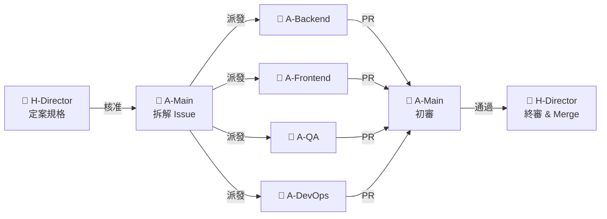
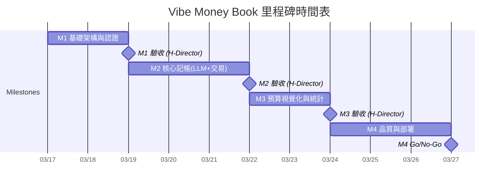
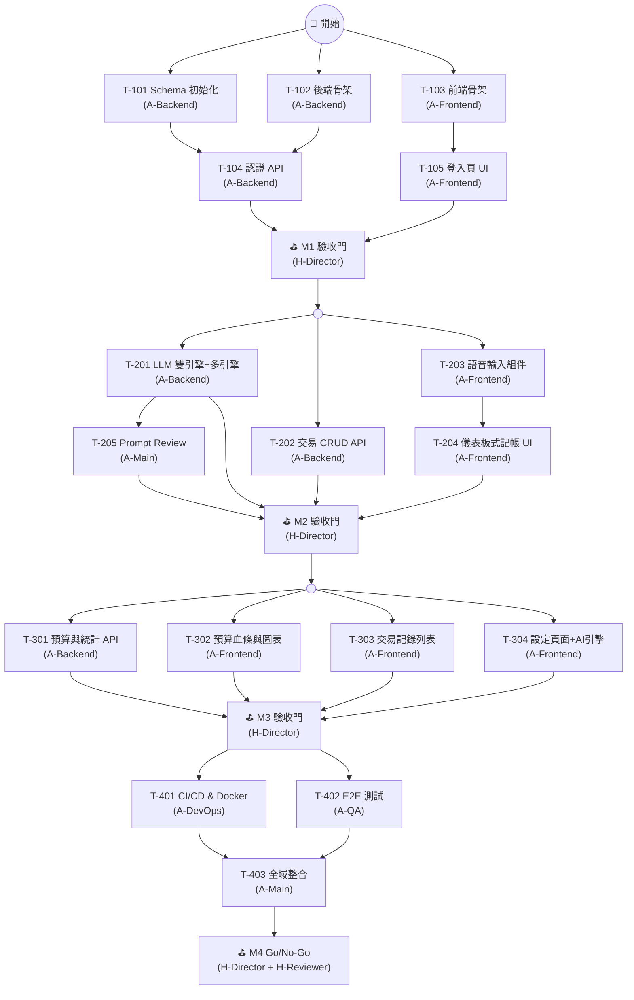
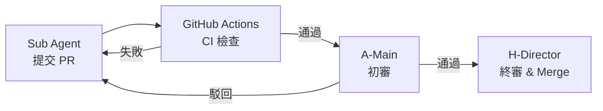

# 02 開發計畫 (AI Agentic Coding 版)

> **專案名稱**：Vibe Money Book — 語音記帳應用
> **版本**：v1.0 (Vibe-Coding / 基於 AI Agentic 架構)
> **開發周期**：1-2 周
> **開發模式**：Main Agent 統籌 + Sub Agents 並行開發
> **最後更新**：2026-03-17

---

## 目錄

1. [角色定義 (Role Registry)](#1-角色定義-role-registry)
2. [項目概況與時間表](#2-項目概況與時間表)
3. [里程碑定義](#3-里程碑定義)
4. [任務清單 (Sub Agents 協作)](#4-任務清單-sub-agents-協作)
5. [技術實施方案](#5-技術實施方案)
6. [風險識別與應對 (AI 開發視角)](#6-風險識別與應對-ai-開發視角)
7. [質量保證計畫 (Vibe Check)](#7-質量保證計畫-vibe-check)
8. [溝通與協作](#8-溝通與協作)

---

## 1. 角色定義 (Role Registry)

> **本節為全文唯一角色定義來源。** 後續所有章節引用角色時，必須使用下表中的 **角色代號**，不得自行新增或變體。

### 1.1 角色一覽

| 角色代號 | 角色名稱 | 類別 | 說明 |
|---------|---------|------|------|
| **H-Director** | 導演 (Director) | 🧑 人類 | 專案最高決策者。負責規格審查、PR 合併、Milestone 驗收、方向調整。 |
| **H-Reviewer** | 審查員 (Reviewer) | 🧑 人類 | 特定領域審查（UX/安全），可由 Director 兼任。 |
| **A-Main** | 主代理 (Main Agent) | 🤖 AI | 統籌全局。負責拆解 Issue、協調 Sub Agents、整合驗證。 |
| **A-Backend** | 後端子代理 | 🤖 AI | 專注 `/backend/**`。負責 API、DB、LLM 整合、後端單元測試。 |
| **A-Frontend** | 前端子代理 | 🤖 AI | 專注 `/frontend/**`。負責 UI 組件、頁面、語音輸入、圖表、狀態管理。 |
| **A-QA** | 測試子代理 | 🤖 AI | 專注 `/tests/**`。負責 E2E 測試腳本。 |
| **A-DevOps** | 部署子代理 | 🤖 AI | 專注 `.github/**`、`docker/**`。負責 CI/CD、容器化。 |

### 1.2 任務分發流程



---

## 2. 項目概況與時間表

### 2.1 項目基本資訊

| 項目 | 說明 |
|------|------|
| **專案名稱** | Vibe Money Book（語音記帳應用） |
| **開發周期** | 1-2 周（AI 高度並行開發） |
| **總工作量** | H-Director ~20-30 HRH / AI Agents ~100-120 AI Sessions |
| **核心團隊** | 2 人類角色 + 5 AI 角色 |
| **開發範式** | API First 契約驅動，前後端並行開發 |

### 2.2 里程碑時間表



| 里程碑 | 名稱 | 周期 | 主要交付物 | 驗收者 |
|--------|------|------|-----------|--------|
| **M1** | 基礎架構與認證 | 2 天 | DB Schema、前後端骨架、Auth API + 登入頁 | H-Director |
| **M2** | 核心記帳 (LLM + 交易) | 3 天 | LLM 雙引擎、儀表板式記帳 UI、交易 CRUD | H-Director |
| **M3** | 預算視覺化與統計 | 2 天 | 預算血條、圓餅圖、記錄列表、設定頁 | H-Director |
| **M4** | 品質與部署 | 3 天 | E2E 測試、CI/CD、Docker 化 | H-Director, H-Reviewer |

### 2.3 工作量估算

| 角色代號 | 工作量 | 說明 |
|---------|--------|------|
| **H-Director** | ~20-30 HRH | 規格審查、PR Review、Milestone 驗收 |
| **A-Main** | ~30 AI Sessions | Issue 拆解、整合驗證、Vibe Check |
| **A-Backend** | ~40 AI Sessions | API 開發、LLM 整合、DB 操作 |
| **A-Frontend** | ~40 AI Sessions | UI 組件、語音輸入、圖表、狀態管理 |
| **A-QA** | ~10 AI Sessions | E2E 測試 |
| **A-DevOps** | ~5 AI Sessions | CI/CD、Docker |

---

## 3. 里程碑定義

### 3.1 Milestone 1：基礎架構與認證（Day 1-2）

**目標**：建立前後端基礎框架，完成認證機制，確保前後端連通。

**AI 執行策略**：
- **A-Backend**：初始化 Express + TypeScript + Prisma，建立 DB Schema，實作 Auth API
- **A-Frontend**：初始化 Vite + React + TypeScript + Tailwind，實作 Login/Register 頁面
- 以上兩者**完全並行**

**交付物**：
- 完整 DB Schema 及 Migration
- Auth API（註冊/登入）+ JWT 中間件
- 前端登入/註冊頁面 + Auth Context + Protected Route
- 前後端可獨立啟動

**Human Gate**：H-Director 驗收架構與認證流程。

---

### 3.2 Milestone 2：核心記帳 — LLM 雙引擎 + 交易（Day 3-5）

**目標**：實作核心記帳流程：語音/文字輸入 → LLM 解析 → 確認 → 儲存。

**AI 執行策略**：
- **A-Backend**：實作 LLM 雙引擎（資料萃取 + 人設回饋）、交易 CRUD API
- **A-Frontend**：實作語音輸入組件（Web Speech API）、儀表板式首頁介面、解析結果確認卡片
- **A-Main**：Review LLM Prompt 設計品質

**交付物**：
- LLM 資料萃取引擎 + 人設回饋引擎（含新類別偵測 PRD-F-012、多引擎支援 PRD-F-013）
- 交易 CRUD API（含 AI 回饋儲存）
- 語音輸入組件（含動態視覺回饋）
- 儀表板式記帳介面（預算卡片、AI 回饋卡片、最近帳目列表、確認卡片、新類別確認對話框）

**Human Gate**：H-Director 驗收完整記帳流程（語音/文字 → 解析 → 確認 → 儲存 + AI 評論），**含新類別偵測流程驗收**。

---

### 3.3 Milestone 3：預算視覺化與統計（Day 6-7）

**目標**：實作預算管理、消費視覺化與設定功能。

**AI 執行策略**：
- **A-Backend**：實作預算摘要 API、統計分佈 API、類別預算 CRUD
- **A-Frontend**：實作預算血條（含警告特效）、Recharts 圓餅圖、交易記錄列表、設定頁

**交付物**：
- 預算摘要與類別分佈 API
- 預算血條組件（顏色漸變 + 呼吸燈特效）
- 消費分佈圓餅圖
- 交易記錄列表（篩選、刪除）
- 設定頁面（人設切換、預算管理）

**Human Gate**：H-Director 驗收視覺效果與數據正確性。

---

### 3.4 Milestone 4：品質與部署（Day 8-10）

**目標**：自動化測試、CI/CD 配置、容器化部署。

**AI 執行策略**：
- **A-QA**：Playwright E2E 測試（記帳流程、預算顯示）
- **A-DevOps**：Dockerfile、docker-compose、GitHub Actions
- **A-Main**：全域整合與 Vibe Check

**Human Gate**：H-Director 最終 Go/No-Go 決策。

---

## 4. 任務清單 (Sub Agents 協作)

### 4.1 任務總覽

| ID | 任務名稱 | 優先級 | 負責角色 | 預估耗時 |
|----|---------|-------|---------|----------|
| T-101 | Schema 與 DB 初始化 | P0 | A-Backend | ~2 AI Sessions |
| T-102 | 後端骨架與中間件 | P0 | A-Backend | ~3 AI Sessions |
| T-103 | 前端骨架與路由 | P0 | A-Frontend | ~3 AI Sessions |
| T-104 | 認證 API 開發 | P0 | A-Backend | ~3 AI Sessions |
| T-105 | 登入/註冊頁面與 Auth | P0 | A-Frontend | ~3 AI Sessions |
| ⛳ M1 | M1 驗收門 | P0 | H-Director | ~2 HRH |
| T-201 | LLM 雙引擎實作（含新類別偵測 + 多引擎支援） | P0 | A-Backend | ~12 AI Sessions |
| T-202 | 交易 CRUD API | P0 | A-Backend | ~4 AI Sessions |
| T-203 | 語音輸入組件 | P0 | A-Frontend | ~5 AI Sessions |
| T-204 | 儀表板式記帳介面（含新類別確認流程） | P0 | A-Frontend | ~10 AI Sessions |
| T-205 | LLM Prompt Review | P1 | A-Main | ~2 AI Sessions |
| ⛳ M2 | M2 驗收門 | P0 | H-Director | ~3 HRH |
| T-301 | 預算與統計 API（含類別 CRUD） | P0 | A-Backend | ~6 AI Sessions |
| T-302 | 預算血條與圖表 UI | P0 | A-Frontend | ~5 AI Sessions |
| T-303 | 交易記錄列表 | P1 | A-Frontend | ~3 AI Sessions |
| T-304 | 設定頁面（含類別管理 + AI 引擎選擇） | P1 | A-Frontend | ~6 AI Sessions |
| ⛳ M3 | M3 驗收門 | P0 | H-Director | ~2 HRH |
| T-401 | CI/CD 與 Docker 配置 | P0 | A-DevOps | ~3 AI Sessions |
| T-402 | E2E 測試 | P0 | A-QA | ~5 AI Sessions |
| T-403 | 全域整合與 Vibe Check | P0 | A-Main | ~5 AI Sessions |
| ⛳ M4 | M4 Go/No-Go | P0 | H-Director, H-Reviewer | ~3 HRH |

### 4.2 任務詳細描述

#### Milestone 1：基礎架構與認證

**T-101：Schema 與 DB 初始化**
- **任務描述**：依據 SRD 建立 Prisma Schema，定義 Users（含 `ai_engine` 欄位，PRD-F-013）、CategoryBudgets（含 `is_custom` 欄位）、Transactions、AIFeedbacks 四張表及其關聯。建立 Migration 檔案與 Seed Script（建立測試使用者與預設類別預算，預設類別 `is_custom = false`）。
- **前置任務**：(無)
- **輸入**：`01-2-SRD.md` (§3 數據模型)
- **產出**：`prisma/schema.prisma`、`prisma/migrations/`、`prisma/seed.ts`
- **驗證**：`npx prisma migrate dev` 成功；Seed 資料可正確寫入。
- **優先級**：P0

**T-102：後端骨架與中間件**
- **任務描述**：初始化 Express + TypeScript 專案。配置全域中間件：Error Handler、CORS、Request Logger、Rate Limiter (express-rate-limit)。建立路由結構與 `GET /health` 端點。
- **前置任務**：(無)
- **輸入**：`01-2-SRD.md` (§2 架構設計)
- **產出**：`/backend` 完整目錄結構、健康檢查端點
- **驗證**：`npm run dev` 啟動成功；`curl localhost:3000/health` 回傳 200。
- **優先級**：P0

**T-103：前端骨架與路由**
- **任務描述**：初始化 Vite + React + TypeScript 專案。配置 Tailwind CSS、React Router (含 `/`, `/stats`, `/history`, `/settings`, `/login`, `/register` 路由)、Zustand Store 骨架、基礎 Layout 組件（底部導航列）。配置 Design Tokens（色彩、字體、間距、圓角、陰影、動畫）為 CSS 變數或 Tailwind 擴展。
- **前置任務**：(無)
- **輸入**：`01-1-PRD.md` (§5 頁面結構)、`01-4-UI_UX_Design.md` (§2 Design Tokens、§3.5 底部 Tab Bar、§6 響應式設計)
- **產出**：`/frontend` 完整目錄結構、Layout 組件、路由配置
- **驗證**：`npm run dev` 啟動成功；瀏覽器可訪問各路由頁面無錯誤。
- **優先級**：P0

**T-104：認證 API 開發**
- **任務描述**：實作 Auth 模組：POST /auth/register、POST /auth/login。包含 bcrypt 密碼加密、JWT Token 生成、Auth 中間件（驗證 Bearer Token）。撰寫單元測試。
- **前置任務**：T-101, T-102
- **輸入**：`API_Spec.yaml` (Auth 端點)
- **產出**：Auth Controller/Service/Middleware 源碼、單元測試
- **驗證**：單元測試通過；可透過 API 註冊/登入並取得有效 Token。
- **優先級**：P0

**T-105：登入/註冊頁面與 Auth**
- **任務描述**：實作登入與註冊頁面 UI、Auth Context (全域認證狀態)、Token 存儲 (LocalStorage)、Protected Route、API Client Auth 攔截器。
- **前置任務**：T-103
- **輸入**：`01-1-PRD.md`、`01-4-UI_UX_Design.md` (§3.6 登入/註冊頁)、`API_Spec.yaml` (Auth API)
- **產出**：Login/Register 頁面組件、Auth Context、Protected Route、API Client
- **驗證**：登入/註冊 UI 正常渲染；Mock API 模擬登入成功；未登入自動導向登入頁。
- **優先級**：P0

---

#### Milestone 2：核心記帳 — LLM 雙引擎 + 交易

**T-201：LLM 雙引擎實作（含新類別偵測 + 多引擎支援）**
- **任務描述**：實作 LLM 整合服務，包含：(1) 資料萃取引擎 — 將自然語言轉為 `{amount, category, merchant, date, is_new_category, suggested_category}` JSON；(2) 人設回饋引擎 — 根據人設與預算狀態生成評論。設計並調校 Prompt 模板。實作 `POST /ai/parse` 端點。包含 LLM 呼叫錯誤處理與重試機制。**資料萃取引擎須支援 PRD-F-012 新類別偵測**：將使用者現有類別清單注入 Prompt，LLM 判斷是否需建議新類別，並偵測相似類別名稱避免重複建立。**須實作 PRD-F-013 多引擎抽象層**：建立統一的 `LLMProvider` 介面，分別實作 `GeminiProvider` 與 `OpenAIProvider`；根據使用者的 `ai_engine` 偏好動態選擇引擎；從 `X-LLM-API-Key` Header 取得使用者自行提供的 API Key（用後即棄，不持久化）。
- **前置任務**：T-104
- **輸入**：`01-2-SRD.md` (§4 LLM 整合設計、§3.4 自訂類別機制、§4.3 多引擎抽象架構)、`API_Spec.yaml` (AI 端點)
- **產出**：LLM Service (`llmService.ts`)、LLMProvider 介面與實作 (`geminiProvider.ts`, `openaiProvider.ts`)、Prompt 模板 (`/prompts/`)、AI Controller、單元測試
- **驗證**：單元測試通過；手動測試多種自然語言輸入可正確解析；人設回饋符合風格；新類別偵測情境可正確回傳 `is_new_category: true`；Gemini 與 OpenAI 引擎皆可正常切換並回傳結果。
- **優先級**：P0

**T-202：交易 CRUD API**
- **任務描述**：實作交易模組完整 API：POST（建立交易+AI回饋）、GET list（分頁/篩選）、GET detail（含回饋）、DELETE。
- **前置任務**：T-104
- **輸入**：`API_Spec.yaml` (Transaction 端點)
- **產出**：Transaction Controller/Service/Repository、單元測試
- **驗證**：所有 CRUD 單元測試通過；分頁/篩選邏輯正確。
- **優先級**：P0

**T-203：語音輸入組件**
- **任務描述**：實作語音輸入 React 組件：整合 Web Speech API (SpeechRecognition)、按住說話按鈕（含脈衝/聲波動畫）、語音轉文字、瀏覽器相容性偵測（不支援時隱藏按鈕）。
- **前置任務**：T-105
- **輸入**：`01-1-PRD.md` (PRD-F-001)、`01-4-UI_UX_Design.md` (§4.1 語音錄音中)
- **產出**：VoiceInput 組件、useVoiceRecognition Hook
- **驗證**：Chrome 上可正常按住說話並辨識中文；不支援的瀏覽器 graceful fallback。
- **優先級**：P0

**T-204：儀表板式記帳介面（含新類別確認流程）**
- **任務描述**：實作主頁面儀表板式記帳 UI：預算卡片、AI 回饋卡片、AI 解析結果確認卡片（確認/修改按鈕）、最近帳目列表、底部固定輸入區（文字輸入框 + 整合語音輸入組件）。串接 `POST /ai/parse` 與 `POST /transactions` API。**須實作 PRD-F-012 新類別確認流程**：當 `/ai/parse` 回傳 `is_new_category: true` 時，顯示新類別確認對話框（確認新增 / 修改名稱 / 選擇現有類別），確認後串接 `POST /budget/categories` 建立新類別再記帳。
- **前置任務**：T-203（UI 開發）；T-201、T-202（API 串接整合測試時需要）
- **輸入**：`01-1-PRD.md` (PRD-F-002~004, PRD-F-012)、`01-4-UI_UX_Design.md` (§3.1 首頁佈局、§4.2 確認卡片、§4.3 AI 處理中、§5 新類別對話流)、`API_Spec.yaml`
- **產出**：DashboardPage 頁面、BudgetCard 組件、AIFeedbackCard 組件、ParsedResultCard 組件、RecentTransactions 組件、NewCategoryDialog 組件、Dashboard Store
- **驗證**：完整記帳流程可操作（輸入 → 解析 → 確認 → 儲存）；新類別偵測時可正確顯示確認對話框並完成新增類別 + 記帳；儀表板各區塊正確顯示。
- **優先級**：P0

**T-205：LLM Prompt Review**
- **任務描述**：A-Main 審查 T-201 的 Prompt 模板品質：確認資料萃取準確度、人設風格一致性、邊界輸入處理。
- **前置任務**：T-201
- **輸入**：T-201 產出的 Prompt 模板
- **產出**：Review 意見（Issue Comments）
- **驗證**：Review 通過。
- **優先級**：P1

---

#### Milestone 3：預算視覺化與統計

**T-301：預算與統計 API（含類別 CRUD）**
- **任務描述**：實作 GET /budget/summary（月度摘要含類別明細）、GET /budget/categories + PUT（類別預算管理）、**POST /budget/categories（新增自訂類別，PRD-F-012）**、**DELETE /budget/categories/:category（刪除自訂類別，PRD-F-012）**、GET /stats/distribution（消費分佈）。新增類別時需驗證名稱不重複、數量未達上限（20）。刪除類別時需將關聯交易重新歸類至「其他」。
- **前置任務**：T-202
- **輸入**：`API_Spec.yaml` (Budget/Stats 端點)、`01-2-SRD.md` (§3.4 自訂類別機制)
- **產出**：Budget/Stats Controller/Service、單元測試
- **驗證**：摘要數據正確計算；分佈比例加總為 1.0；新增類別驗證與上限檢查正確；刪除類別後交易重新歸類正確。
- **優先級**：P0

**T-302：預算血條與圖表 UI**
- **任務描述**：實作預算血條組件（顏色漸變：綠→黃→紅，< 20% 觸發呼吸燈/閃爍 CSS 動畫）。整合 Recharts 圓餅圖顯示消費分佈。串接 Budget Summary API。
- **前置任務**：T-204
- **輸入**：`01-1-PRD.md` (PRD-F-007, PRD-F-008)、`01-4-UI_UX_Design.md` (§3.1.2 預算卡片、§3.2 統計頁、§4.4 預算警示)
- **產出**：BudgetBar 組件、DistributionChart 組件、Stats 頁面
- **驗證**：血條顏色正確變化；< 20% 動畫觸發；圓餅圖正確渲染。
- **優先級**：P0

**T-303：交易記錄列表**
- **任務描述**：實作交易記錄頁面：按日期倒序顯示、類別圖標、按類別/日期篩選、刪除功能、點擊查看詳情（含 AI 評論）。
- **前置任務**：T-204
- **輸入**：`01-1-PRD.md` (PRD-F-009)、`01-4-UI_UX_Design.md` (§3.3 記錄頁、§4.5 刪除操作)
- **產出**：HistoryPage、TransactionItem 組件、TransactionDetail 組件
- **驗證**：列表正確顯示；篩選功能正常；刪除後列表即時更新。
- **優先級**：P1

**T-304：設定頁面（含類別管理 + AI 引擎選擇）**
- **任務描述**：實作設定頁面：人設選擇（三選一，附預覽文案）、月總預算設定、類別預算管理（列表編輯）、**自訂類別管理（PRD-F-012）**：顯示預設/自訂類別標識、允許刪除自訂類別（需二次確認）、新增的類別可設定預算限額。**AI 引擎選擇（PRD-F-013）**：引擎切換卡片（Gemini/OpenAI）、API Key 輸入框（密碼型態，附顯示/隱藏切換）、Key 儲存至 localStorage（不上傳伺服器）、即時驗證 Key 有效性並顯示狀態、切換引擎即時生效。串接 Profile、Budget API（含 POST/DELETE /budget/categories）。
- **前置任務**：T-204
- **輸入**：`01-1-PRD.md` (PRD-F-005, 010, 011, 012, 013)、`01-4-UI_UX_Design.md` (§3.4 設定頁、§6 PRD-F-013 AI 引擎選擇 UI)
- **產出**：SettingsPage、PersonaSelector 組件、BudgetEditor 組件、CategoryManager 組件、**AIEngineSelector 組件、APIKeyInput 組件**
- **驗證**：人設切換即時生效；預算修改成功儲存；自訂類別可刪除且關聯交易正確重新歸類；**AI 引擎切換即時生效；API Key 儲存於 localStorage 並可正確傳遞至後端；Key 驗證狀態正確顯示**。
- **優先級**：P1

---

#### Milestone 4：品質與部署

**T-401：CI/CD、Docker 與 PWA 配置**
- **任務描述**：建立多階段 Dockerfile（前端+後端）、`docker-compose.yml`（含 PostgreSQL）、GitHub Actions Workflow（Lint → Type Check → Test → Build）。配置 vite-plugin-pwa（manifest、Service Worker、icons），確保 PWA 可安裝於手機桌面（對應 PRD-NF-007）。
- **前置任務**：T-301~T-304
- **輸入**：專案結構
- **產出**：`Dockerfile`、`docker-compose.yml`、`.github/workflows/ci.yml`、PWA manifest + icons
- **驗證**：`docker-compose up` 啟動完整服務；CI Pipeline 全綠；PWA 可通過 Lighthouse PWA 檢查。
- **優先級**：P0

**T-402：E2E 測試**
- **任務描述**：使用 Playwright 撰寫 E2E 測試：(1) 註冊/登入流程、(2) 文字記帳流程（輸入→解析→確認→儲存）、(3) 預算血條顯示、(4) 交易記錄列表。
- **前置任務**：T-301~T-304
- **輸入**：`01-1-PRD.md`、已完成的前後端源碼
- **產出**：`/tests/e2e/*.spec.ts`
- **驗證**：所有 E2E 測試通過。
- **優先級**：P0

**T-403：全域整合與 Vibe Check**
- **任務描述**：A-Main 執行全專案品質驗證：TypeScript 型別錯誤清除、ESLint 警告清除、前後端 API 串接一致性驗證、Build 確認。
- **前置任務**：T-401, T-402
- **輸入**：全專案源碼、CI 報告
- **產出**：Vibe Check 報告、修復 Commits
- **驗證**：`tsc --noEmit` 零錯誤；`npm run build` 前後端皆成功；CI 全綠；LLM API 回應延遲 < 3s（對應 SRD §1.1 性能需求）。
- **優先級**：P0

### 4.3 並行群組視覺化



---

## 5. 技術實施方案

### 5.1 前端架構

- **框架**：React 18 + Vite + TypeScript
- **樣式**：Tailwind CSS（利於 AI 單檔生成）
- **狀態管理**：Zustand（輕量、樣板少）
- **圖表**：Recharts（React 原生圖表庫）
- **語音**：Web Speech API (SpeechRecognition)
- **PWA**：vite-plugin-pwa

### 5.2 後端架構

- **框架**：Express.js + TypeScript
- **ORM**：Prisma（聲明式 Schema，適合 AI 操作）
- **驗證**：Zod（與 TypeScript 完美整合）
- **LLM**：OpenAI SDK (`@openai/openai`) + Google Generative AI SDK (`@google/generative-ai`)，統一抽象層支援引擎切換（PRD-F-013）
- **認證**：jsonwebtoken + bcrypt

### 5.3 資料庫與部署

- **資料庫**：PostgreSQL（開發可用 SQLite 簡化）
- **容器化**：Docker + docker-compose
- **CI/CD**：GitHub Actions

---

## 6. 風險識別與應對 (AI 開發視角)

| 風險 ID | 風險描述 | 概率 | 應對措施 | 負責 |
|--------|---------|------|---------|------|
| **VIBR-01** | LLM 解析結果不穩定 | 高 | 嚴格 JSON Schema 約束 + temperature=0 + 前端確認機制 | A-Backend |
| **VIBR-02** | Web Speech API 瀏覽器相容性問題 | 中 | Feature detection + 文字輸入 fallback | A-Frontend |
| **VIBR-03** | AI 破壞已完成功能 (Regression) | 高 | 每個 Milestone 完整單元測試 + CI 攔截 | A-Main |
| **VIBR-04** | LLM API 費用失控 | 中 | 嚴格速率限制 + gpt-4o-mini（低成本模型） | A-Backend |
| **VIBR-05** | Sub Agents 上下文不同步 | 中 | 以 `/docs` 規格為唯一真理源 | A-Main |
| **VIBR-06** | 人設回饋生成品質不穩 | 中 | Few-shot examples 在 Prompt 中 + Review | A-Main |

---

## 7. 質量保證計畫 (Vibe Check)

### 7.1 CI/CD 閘口

| Gate | 檢查項目 | 執行者 | 觸發時機 |
|------|---------|--------|---------|
| **Gate 1** | ESLint + TypeScript Check | A-Main | 每次 PR |
| **Gate 2** | Unit Test (Vitest/Jest) | A-Backend / A-Frontend | 每次 PR |
| **Gate 3** | Build Check | A-Main | 每次 PR |
| **Gate 4** | E2E Test (Playwright) | A-QA | Milestone 驗收前 |

### 7.2 Human-in-the-Loop 審查

| 項目 | 負責 | 時機 |
|------|------|------|
| LLM Prompt 品質 | H-Director | M2 驗收 |
| UI/UX 是否符合 PRD | H-Reviewer | M3 驗收 |
| 預算血條視覺效果 | H-Director | M3 驗收 |
| 安全性審計 | H-Reviewer | M4 上線前 |

---

## 8. 溝通與協作

### 8.1 文件存取約定 (Single Source of Truth)

| 文件 | 主要消費者 | 用途 |
|------|-----------|------|
| `01-1-PRD.md` | A-Frontend | 產品行為、UI 互動 |
| `01-2-SRD.md` | A-Backend | 系統架構、LLM 整合、DB Schema |
| `01-4-UI_UX_Design.md` | A-Frontend | UI 元件規格、Design Tokens、互動動畫、響應式設計 |
| `API_Spec.yaml` | A-Backend, A-Frontend | API 契約（不可擅自修改） |
| `02-Dev_Plan.md` | A-Main | 任務拆解與進度追蹤 |

### 8.2 Git 協作策略

#### 分支命名

```
feat/<agent>/<issue-N>-<簡述>
```

範例：
- `feat/backend/issue-5-auth-api`
- `feat/frontend/issue-8-chat-ui`
- `feat/devops/issue-15-docker`

#### Worktree 配置

```bash
git worktree add ../worktree-backend feat/backend/issue-5-auth-api
git worktree add ../worktree-frontend feat/frontend/issue-8-chat-ui
```

#### PR 審查流程



#### PR 範圍限制

| Agent 角色 | 允許修改路徑 |
|-----------|-------------|
| A-Backend | `/backend/**` |
| A-Frontend | `/frontend/**` |
| A-QA | `/tests/**` |
| A-DevOps | `.github/**`, `docker/**`, `Dockerfile`, `docker-compose.yml` |
| A-Main | 全專案（整合與修復用） |

---

## 附錄：任務執行狀態追蹤

### Milestone 1：基礎架構與認證

- [ ] T-101 (A-Backend) Schema 與 DB 初始化
- [ ] T-102 (A-Backend) 後端骨架與中間件
- [ ] T-103 (A-Frontend) 前端骨架與路由
- [ ] T-104 (A-Backend) 認證 API 開發
- [ ] T-105 (A-Frontend) 登入/註冊頁面
- [ ] ⛳ M1 驗收門

### Milestone 2：核心記帳

- [ ] T-201 (A-Backend) LLM 雙引擎實作（含新類別偵測 + 多引擎支援）
- [ ] T-202 (A-Backend) 交易 CRUD API
- [ ] T-203 (A-Frontend) 語音輸入組件
- [ ] T-204 (A-Frontend) 儀表板式記帳介面（含新類別確認流程）
- [ ] T-205 (A-Main) LLM Prompt Review
- [ ] ⛳ M2 驗收門

### Milestone 3：預算視覺化與統計

- [ ] T-301 (A-Backend) 預算與統計 API（含類別 CRUD）
- [ ] T-302 (A-Frontend) 預算血條與圖表
- [ ] T-303 (A-Frontend) 交易記錄列表
- [ ] T-304 (A-Frontend) 設定頁面（含類別管理 + AI 引擎選擇）
- [ ] ⛳ M3 驗收門

### Milestone 4：品質與部署

- [ ] T-401 (A-DevOps) CI/CD 與 Docker
- [ ] T-402 (A-QA) E2E 測試
- [ ] T-403 (A-Main) 全域整合與 Vibe Check
- [ ] ⛳ M4 Go/No-Go

---

**修訂與維護者**：A-Main 代 H-Director 修訂
**開發範式**：Vibe-SDLC / Agentic Coding
