# Vibe Money Book 開發日誌 - 1


此為專案開發的開發日誌，記錄了:

- 搭配 vibe-sdlc* 系列技能 的工作流
- 專案的準備工作
- 使用 Claude Code CLI 客戶端的操作流程
- 臨時切換 OpenClaw (小龍蝦) 代理開發的流程
- 在開發過程中調整 vibe-sdlc* 系列技能 的過程 

-------------

## 專案準備

1. 初始化專案目錄
2. 初始化 CLAUDE.md
3. 安裝 vibe-sdlc* 系列技能

--------------

## 需求與計畫

生成PRD:

```
/vibe-sdlc-p1-spec
依下列需求描述幫我生成PRD：
  核心流程：使用者說一句話（如「午餐拉麵 180 元」），系統透過 LLM 自動萃取金額、類別、商家等結構化資料，顯示確認卡片讓使用者一鍵儲存。

  最大特色是三種個性化 AI 人設（毒舌、溫柔、情勒），每次記帳後即時回饋帶有情緒風格的財務評論，讓記帳從枯燥工具變成有趣互動。

  功能範圍：
  - 語音輸入：Web Speech API 整合，按住說話、聲波動畫、中文辨識
  - LLM 雙引擎：支援 Gemini 與 OpenAI 切換，使用者自帶 API Key（系統不儲存）
  - 智慧分類：自動比對現有類別，偵測新類別時彈出確認對話框
  - 預算管理：月度總預算 + 8 個預設分類預算，支援自訂類別（上限 20 個）
  - 視覺化：預算血條（綠→黃→紅漸變，<20% 呼吸燈警示）、消費分佈圓餅圖
  - 交易管理：歷史記錄列表，支援分類/日期篩選、刪除
  - PWA：可安裝至手機桌面
```


生成 SRD
```
/vibe-sdlc-p1-spec
依據 PRD， 生成 SRD
```


生成 UI/UX:

```
請參考這張圖的風格，生成 UI/UX 文件
[Ctrl+V](貼圖)
```


生成 API Spec:
```
請參考既有文件，生成 API Spec
```

生成開發計畫:

```
請參考既有文件，生成相關開發計畫 
```

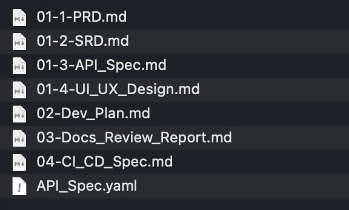

-------------

## 建立 Issues


```
/vibe-sdlc-p2-issues
```

這會依據開發計畫 Dev Plan 建立 Issues 及專案看板。

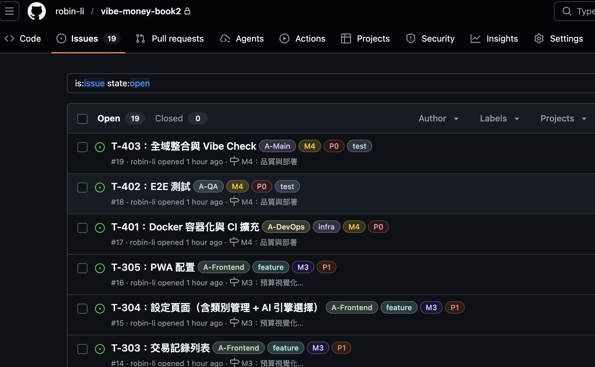

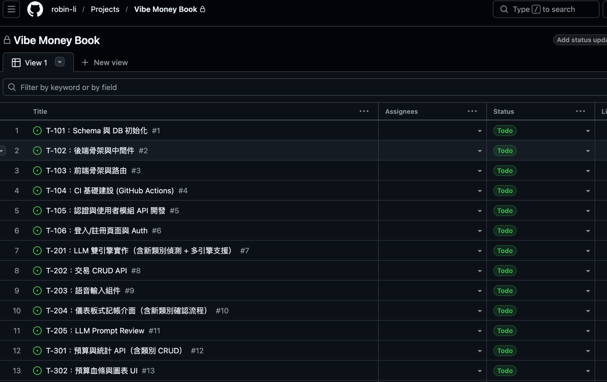

若開發計畫有修改，可以再下指令：

```
/vibe-sdlc-p2-issues
```

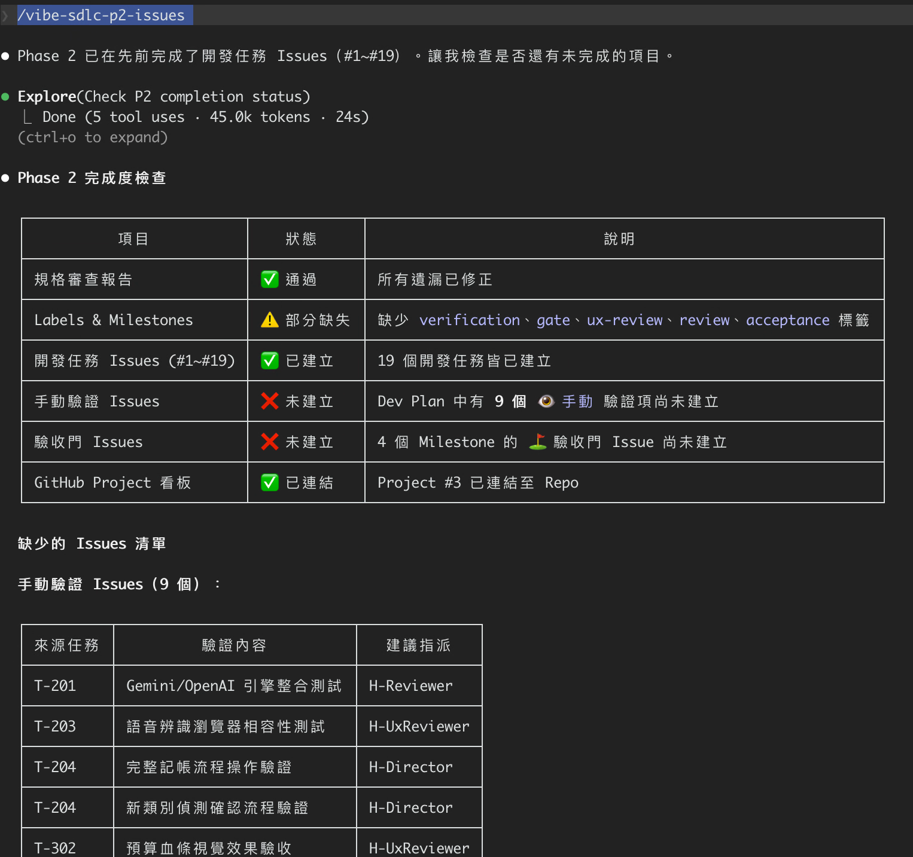

...

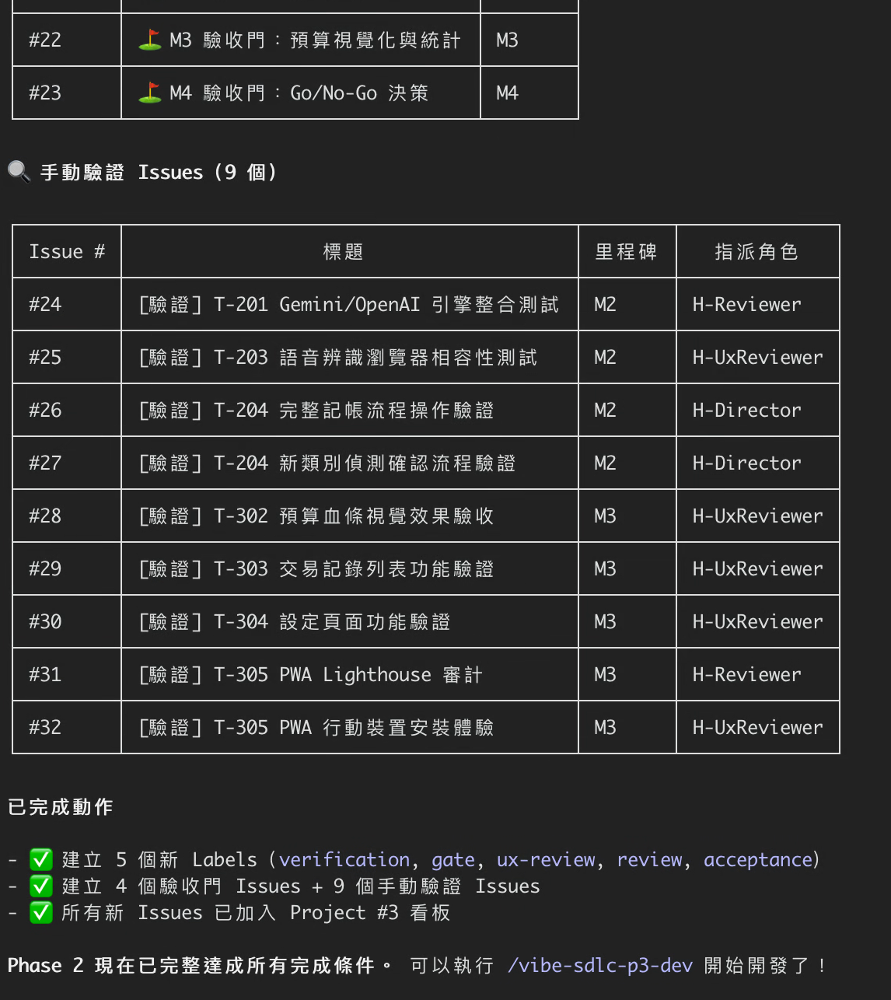

--------

## 開發流程

### 領取 Issue 開始開發

可以先總結當前專案進度:

```
/vibe-sdlc
```

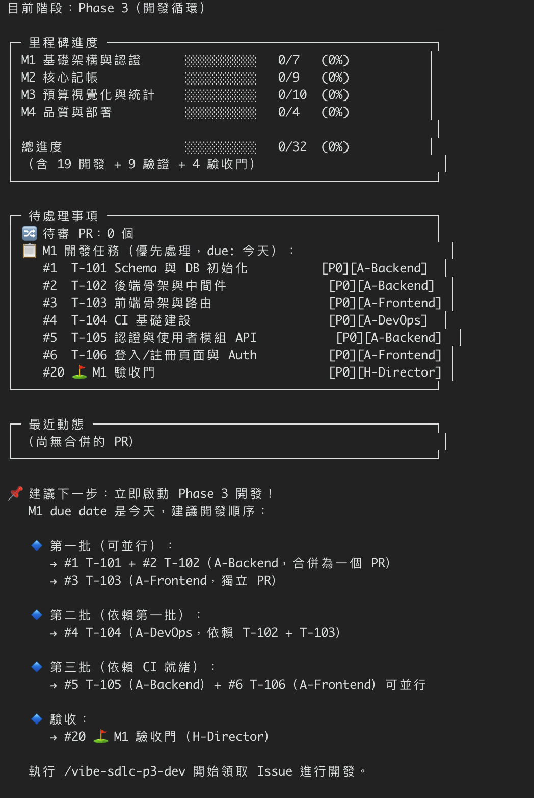

```
/vibe-sdlc-p3-dev 第一批
```


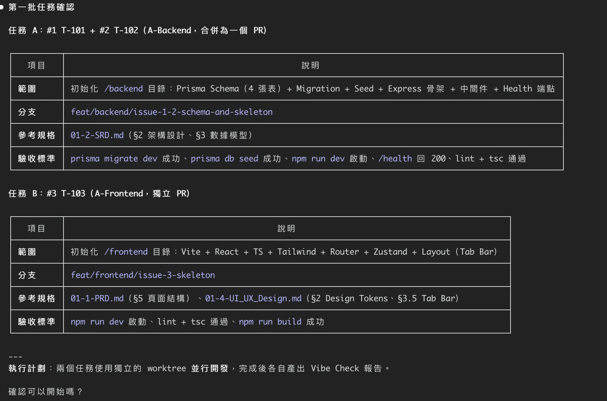

```
可以
```


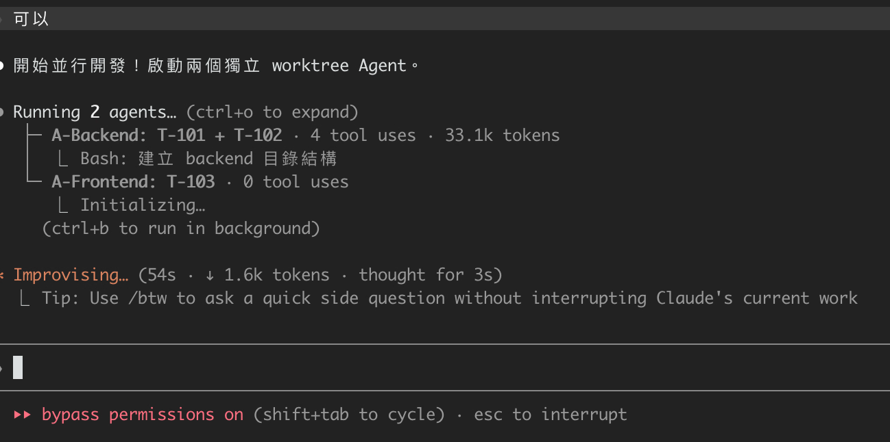

注意： 此時會**建立兩個 Sub Agents 同時進行開發**，而且各自有自己的 workspace 與 git worktree。

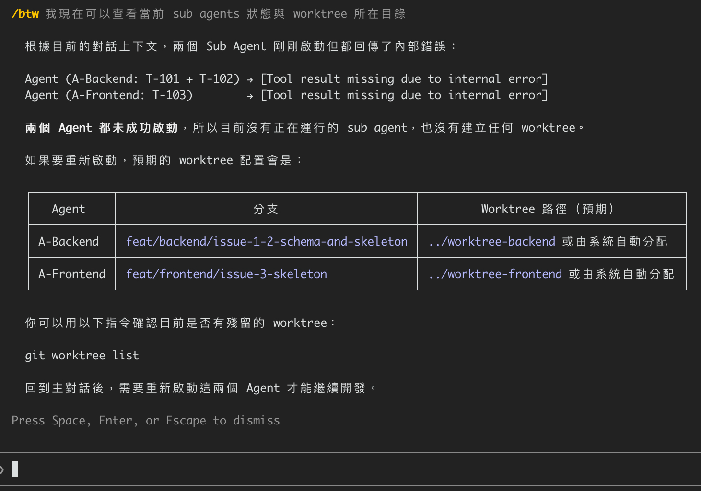

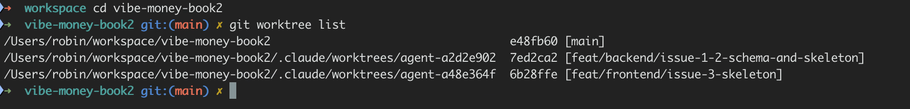

```
開始並行開發！啟動兩個獨立 worktree Agent。

⏺ 2 agents finished (ctrl+o to expand)
   ├─ A-Backend: T-101 + T-102 · 38 tool uses · 47.2k tokens
   │  ⎿  Done
   └─ A-Frontend: T-103 · 53 tool uses · 61.5k tokens
      ⎿  Done

⏺ 兩個 Agent 都已完成！以下是 Vibe Check 報告：

  ---
  Vibe Check 報告 — 第一批

  任務 A：#1 T-101 + #2 T-102（A-Backend）

  Issue

  - 編號：#1 + #2
  - 標題：Schema 與 DB 初始化 + 後端骨架與中間件

  實作摘要

  初始化 /backend 專案：Prisma Schema（4 張表對齊 SRD）、Migration、Seed（測試使用者 + 8 預設類別）、Express + TypeScript 骨架、全域中間件（CORS、Error Handler、Request Logger、Rate Limiter）、Health 端點。

  測試結果

  ┌─────┬───────────────────────────────────┬──────┐
  │  #  │             驗收項目              │ 結果 │
  ├─────┼───────────────────────────────────┼──────┤
  │ 1   │ npx prisma migrate dev 成功       │ ✅   │
  ├─────┼───────────────────────────────────┼──────┤
  │ 2   │ npx prisma db seed 成功           │ ✅   │
  ├─────┼───────────────────────────────────┼──────┤
  │ 3   │ npm run dev 啟動成功              │ ✅   │
  ├─────┼───────────────────────────────────┼──────┤
  │ 4   │ curl localhost:3000/health 回 200 │ ✅   │
  ├─────┼───────────────────────────────────┼──────┤
  │ 5   │ npm run lint 通過                 │ ✅   │
  ├─────┼───────────────────────────────────┼──────┤
  │ 6   │ npx tsc --noEmit 通過             │ ✅   │
  ├─────┼───────────────────────────────────┼──────┤
  │ 7   │ npm test 通過（3 tests）          │ ✅   │
  └─────┴───────────────────────────────────┴──────┘

  分支資訊

  - Worktree 分支：worktree-agent-a2d2e902
  - 需重命名為：feat/backend/issue-1-2-schema-and-skeleton

  狀態：✅ 通過

  ---
  任務 B：#3 T-103（A-Frontend）

  Issue

  - 編號：#3
  - 標題：前端骨架與路由

  實作摘要

  初始化 /frontend 專案：Vite 8 + React 19 + TypeScript + Tailwind CSS 4 + React Router 7 + Zustand 5。Design Tokens 從 UI_UX_Design.md 導入。6 條路由配置完成。底部 Tab Bar（4 頁面）含 active 高亮。Zustand Store 骨架含
  auth/settings/transactions。

  測試結果

  ┌─────┬──────────────────────────┬──────┐
  │  #  │         驗收項目         │ 結果 │
  ├─────┼──────────────────────────┼──────┤
  │ 1   │ npm run dev 啟動成功     │ ✅   │
  ├─────┼──────────────────────────┼──────┤
  │ 2   │ npm run lint 通過        │ ✅   │
  ├─────┼──────────────────────────┼──────┤
  │ 3   │ npx tsc --noEmit 通過    │ ✅   │
  ├─────┼──────────────────────────┼──────┤
  │ 4   │ npm run build 成功       │ ✅   │
  ├─────┼──────────────────────────┼──────┤
  │ 5   │ npm test 通過（9 tests） │ ✅   │
  ├─────┼──────────────────────────┼──────┤
  │ 6   │ 路由切換正常             │ ✅   │
  ├─────┼──────────────────────────┼──────┤
  │ 7   │ Tab Bar 顯示/隱藏正確    │ ✅   │
  └─────┴──────────────────────────┴──────┘

  分支資訊

  - Worktree 分支：worktree-agent-a48e364f
  - 需重命名為：feat/frontend/issue-3-skeleton

  狀態：✅ 通過

  ---
  兩個任務皆通過 Vibe Check。 是否核准進入 Phase 4（建立 PR）？

  ▎ 注意：程式碼目前在 worktree 臨時分支上，進入 P4 時我會將分支重命名為規範名稱後推送。

✻ Crunched for 7m 21s

⏺ Background command "快速驗證 dev server 可啟動" was stopped

⏺ 等待您的決定 — 是否核准進入 Phase 4 建立 PR？
```


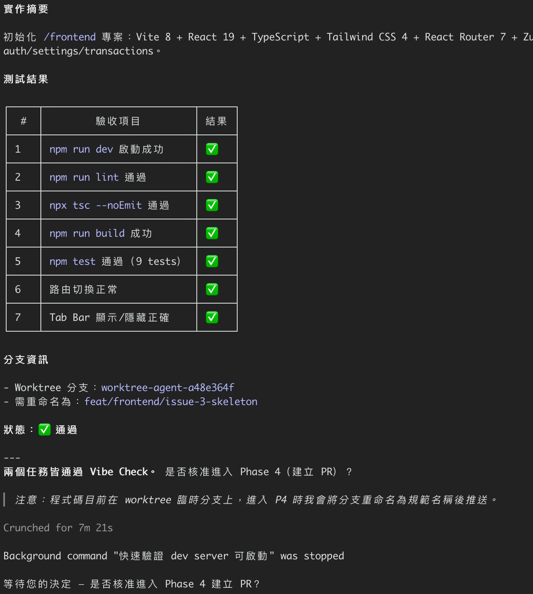

### 合併


```
兩個任務皆 核准進入 Phase 4（建立 PR）!
```

> 隱含觸發 `vibe-sdlc-p4-pr` 技能


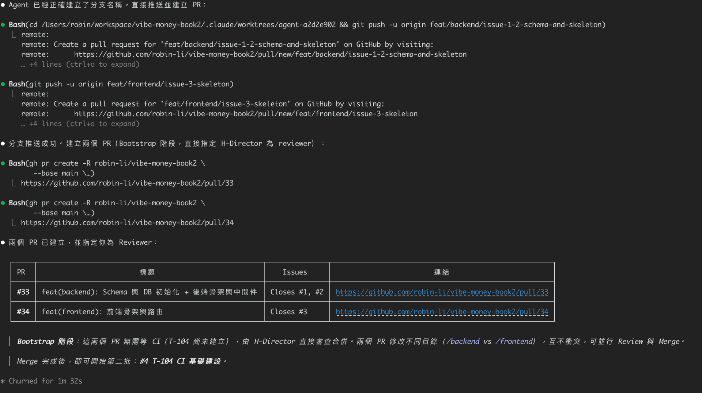

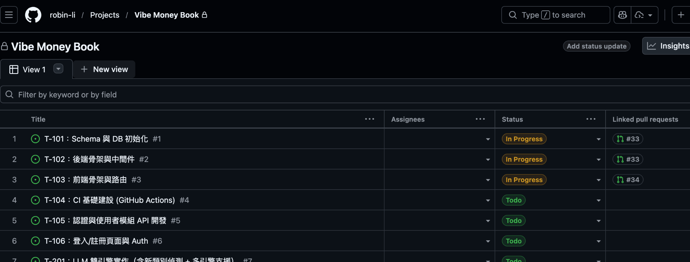

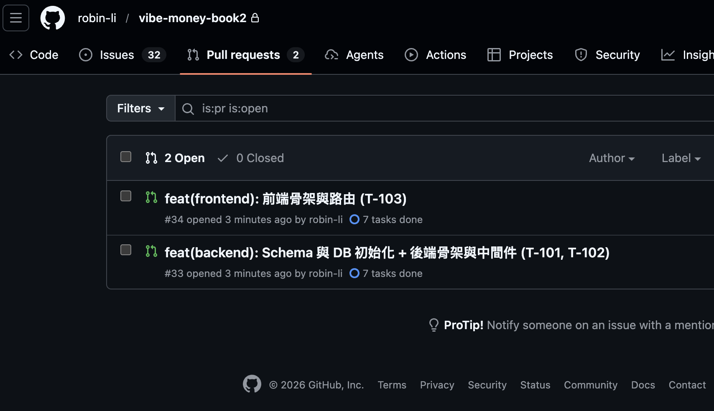

> PS:
> `vibe-sdlc-p3-dev` 技能: 已修改 Vibe Check 核准後自動推送 + 建 PR

```
/vibe-sdlc
```

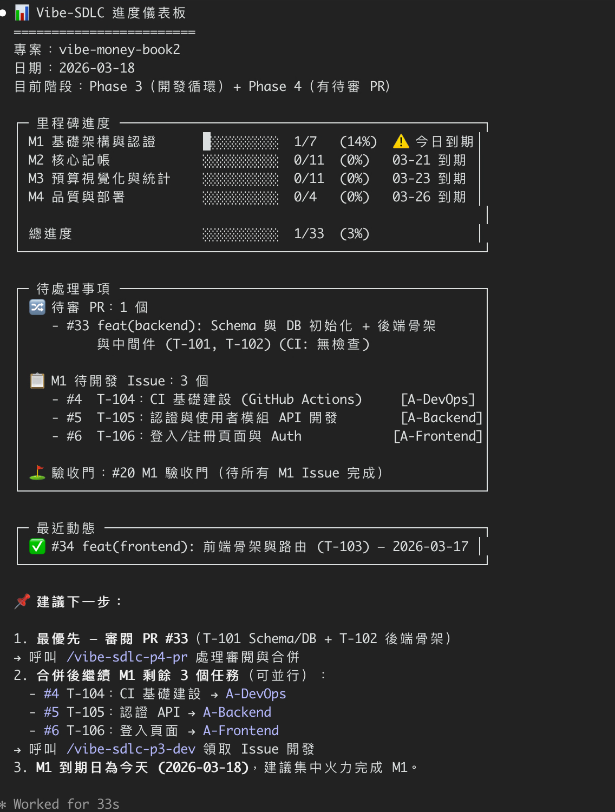

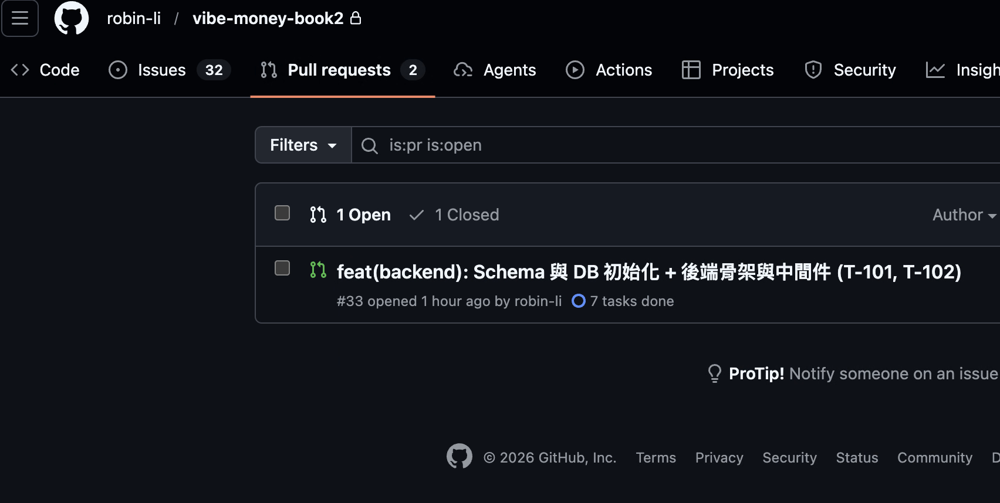


-----

### 持續開發

```
/vibe-sdlc
```

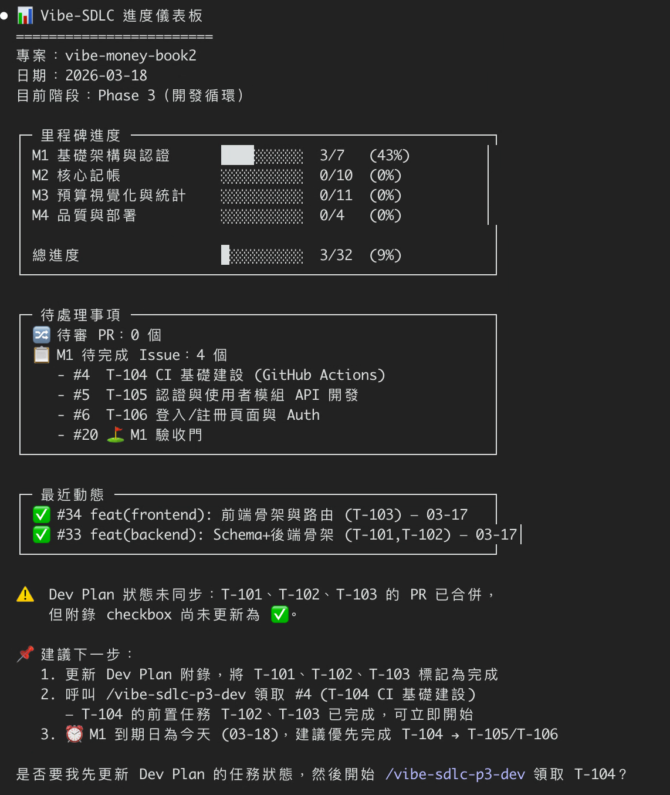

```
更新 Dev Plan 的任務狀態，然後開始 /vibe-sdlc-p3-dev 領取 T-104
```


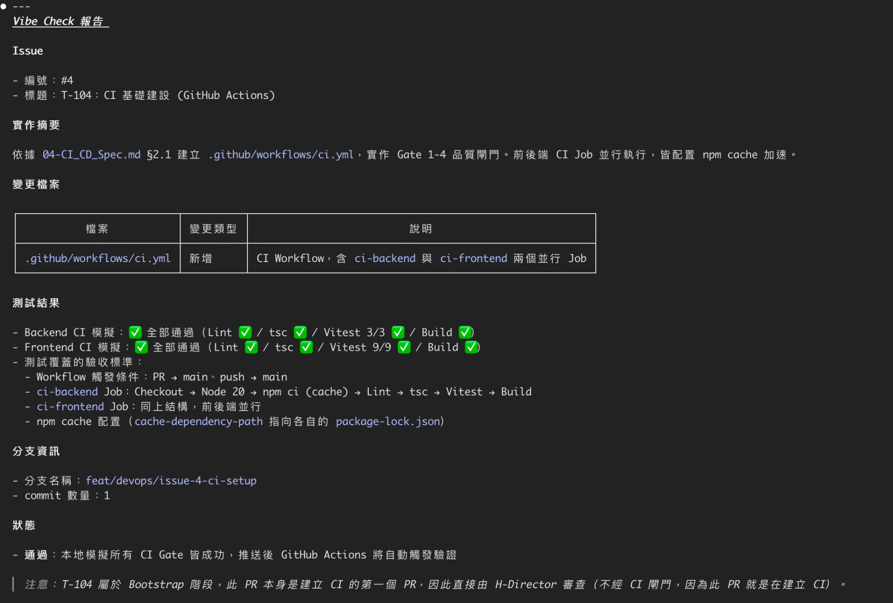

```
⏺ 已經提交了。剛才在 Vibe Check 報告前已經 commit：

  0c73f05 feat(devops): add GitHub Actions CI workflow (T-104)

  目前在分支 feat/devops/issue-4-ci-setup 上，等你核准 Vibe Check 後我會自動推送並建立 PR。

❯ 核准

⏺ Bash(git push -u origin feat/devops/issue-4-ci-setup)
  ⎿  remote:
     remote: Create a pull request for 'feat/devops/issue-4-ci-setup' on GitHub by visiting:
     remote:      https://github.com/robin-li/vibe-money-book2/pull/new/feat/devops/issue-4-ci-setup
     … +4 lines (ctrl+o to expand)

⏺ Bash(gh pr create -R robin-li/vibe-money-book2 \
        --title "feat(devops): GitHub Actions CI workflow (T-104)" \…)
  ⎿  https://github.com/robin-li/vibe-money-book2/pull/35

⏺ PR 已建立：https://github.com/robin-li/vibe-money-book2/pull/35

  此 PR 推送後 GitHub Actions 會自動觸發 CI，這也是 T-104 的最終驗收——如果 ci-backend 和 ci-frontend 兩個 Job 都綠燈，就代表 CI 基礎建設成功。

  你可以：
  1. 到 PR 頁面查看 CI 執行結果
  2. CI 通過後直接 Merge
  3. 若 CI 失敗，可呼叫 /vibe-sdlc-p4-pr 處理
```

核准Vibe-check後

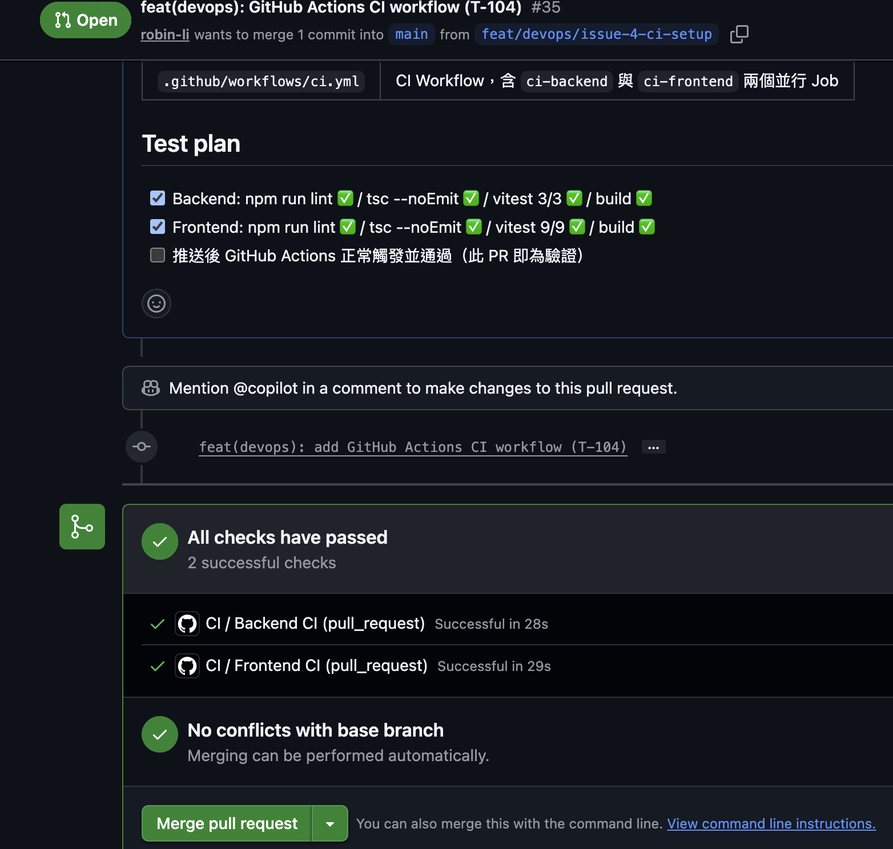

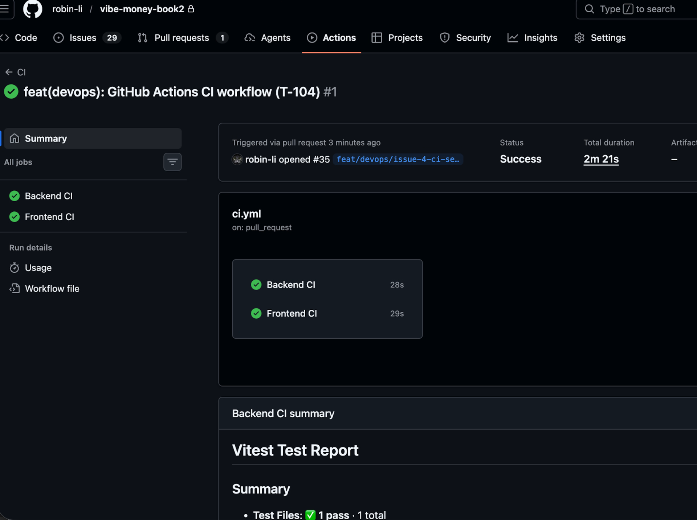

```
/vibe-sdlc
```

```
⏺ 📊 Vibe-SDLC 進度儀表板
  ========================
  專案：vibe-money-book2
  日期：2026-03-18
  目前階段：Phase 3（開發循環）

  ┌─ 里程碑進度 ────────────────────────────────────────────┐
  │ M1 基礎架構與認證      ██████░░░░  4/7   (57%)         │
  │ M2 核心記帳            ░░░░░░░░░░  0/10  (0%)          │
  │ M3 預算視覺化與統計    ░░░░░░░░░░  0/11  (0%)          │
  │ M4 品質與部署          ░░░░░░░░░░  0/4   (0%)          │
  │                                                         │
  │ 總進度                 █░░░░░░░░░  4/32  (13%)          │
  └─────────────────────────────────────────────────────────┘

  ┌─ 待處理事項 ────────────────────────────────────────────┐
  │ 🔀 待審 PR：0 個                                        │
  │ 📋 M1 待完成 Issue：3 個                                │
  │    - #5  T-105 認證與使用者模組 API（A-Backend）⭐ 可開始│
  │    - #6  T-106 登入/註冊頁面與 Auth（A-Frontend）⭐ 可開始│
  │    - #20 ⛳ M1 驗收門（待 T-105, T-106 完成）           │
  └─────────────────────────────────────────────────────────┘

  ┌─ 最近動態 ──────────────────────────────────────────────┐
  │ ✅ #35 feat(devops): CI workflow (T-104) — 03-18        │
  │ ✅ #34 feat(frontend): 前端骨架與路由 (T-103) — 03-17   │
  │ ✅ #33 feat(backend): Schema+後端骨架 (T-101,T-102) — 03-17│
  └─────────────────────────────────────────────────────────┘

  📌 建議下一步：
     T-105（後端 Auth API）與 T-106（前端登入頁）前置任務皆已滿足，
     可並行開發（不同目錄，無衝突）：
     - #5 T-105 → A-Backend（/backend/**）
     - #6 T-106 → A-Frontend（/frontend/**）
     ⏰ M1 到期日為今天 (03-18)，建議儘速啟動！

  T-105 與 T-106 可以並行開發，要同時啟動兩個 Sub Agent（Backend + Frontend），還是逐一處理？
```

```
同時
```

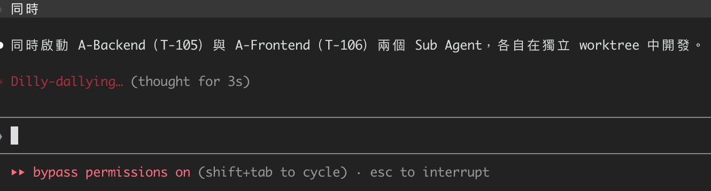

```
> /btw 當前 sub agents 狀態?
```


```
   兩個 Sub Agent 都遇到了內部錯誤（Tool result missing due to internal error），未能成功啟動。

    狀態摘要：

    ┌────────────┬───────────────────┬────────────────────────────────┬─────────────┐
    │   Agent    │       任務        │              分支              │    狀態     │
    ├────────────┼───────────────────┼────────────────────────────────┼─────────────┤
    │ A-Backend  │ #5 T-105 Auth API │ feat/backend/issue-5-auth-api  │ ❌ 啟動失敗 │
    ├────────────┼───────────────────┼────────────────────────────────┼─────────────┤
    │ A-Frontend │ #6 T-106 Login UI │ feat/frontend/issue-6-login-ui │ ❌ 啟動失敗 │
    └────────────┴───────────────────┴────────────────────────────────┴─────────────┘

    需要在主對話中重新啟動這兩個 Agent。可能的替代方案：
    1. 重試並行啟動 — 再次嘗試同時啟動兩個 worktree Agent
    2. 逐一執行 — 先做 T-105 再做 T-106（更穩定但較慢）
    3. 在主 session 直接開發 — 不使用 Sub Agent，直接在主 session 中依序實作

  Press Space, Enter, or Escape to dismiss
```

稍等一會兒：

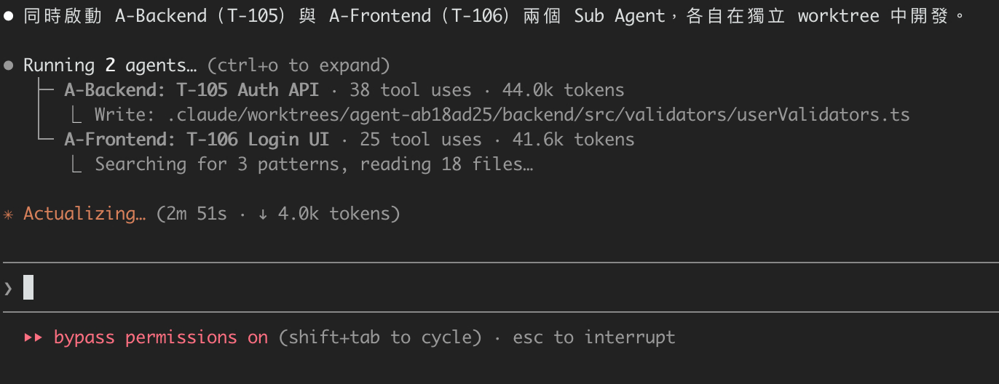

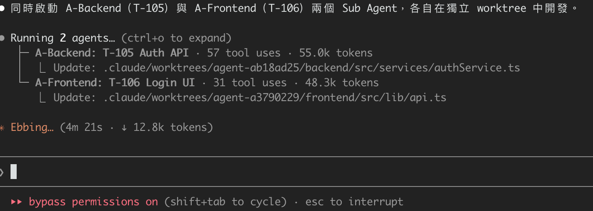

```
> /btw 當前 sub agents 狀態?

    目前兩個 Sub Agent 的狀態：

    ┌────────────┬───────────────────────────────┬────────────────────────────────┬─────────────────────────────────────────┐
    │   Agent    │             Issue             │              分支              │                  狀態                   │
    ├────────────┼───────────────────────────────┼────────────────────────────────┼─────────────────────────────────────────┤
    │ A-Frontend │ #6 T-106 登入/註冊頁面        │ feat/frontend/issue-6-login-ui │ ✅ 已完成 — 25/25 測試通過，CI 四項全綠 │
    ├────────────┼───────────────────────────────┼────────────────────────────────┼─────────────────────────────────────────┤
    │ A-Backend  │ #5 T-105 認證與使用者模組 API │ feat/backend/issue-5-auth-api  │ ❌ 執行失敗 — 內部錯誤，未回傳結果      │
    └────────────┴───────────────────────────────┴────────────────────────────────┴─────────────────────────────────────────┘

    A-Frontend 已產出完整的 Vibe Check 報告（9 個檔案變更、25 個測試全過）。A-Backend 需要重新啟動。

```

再過一會兒

```
同時啟動 A-Backend（T-105）與 A-Frontend（T-106）兩個 Sub Agent，各自在獨立 worktree 中開發。

⏺ 2 agents finished (ctrl+o to expand)
   ├─ A-Backend: T-105 Auth API · 78 tool uses · 76.6k tokens
   │  ⎿  Done
   └─ A-Frontend: T-106 Login UI · 43 tool uses · 55.3k tokens
      ⎿  Done

⏺ 兩個 Sub Agent 都已完成開發！以下是彙整報告：

  ---
  Vibe Check 彙整報告 — T-105 + T-106 並行開發

  T-105：認證與使用者模組 API（A-Backend）✅

  ┌──────────────┬───────────────────────────────┐
  │     項目     │             結果              │
  ├──────────────┼───────────────────────────────┤
  │ Lint         │ ✅ 通過                       │
  ├──────────────┼───────────────────────────────┤
  │ tsc --noEmit │ ✅ 通過                       │
  ├──────────────┼───────────────────────────────┤
  │ Unit Test    │ ✅ 30/30 通過                 │
  ├──────────────┼───────────────────────────────┤
  │ Build        │ ✅ 通過                       │
  ├──────────────┼───────────────────────────────┤
  │ 新增/修改    │ 17 檔案，+866 行              │
  ├──────────────┼───────────────────────────────┤
  │ 分支         │ feat/backend/issue-5-auth-api │
  └──────────────┴───────────────────────────────┘

  實作內容：Auth Register/Login API、JWT 中間件、User Profile CRUD、Zod 驗證、註冊時自動初始化 8 個預設類別預算

  T-106：登入/註冊頁面與 Auth（A-Frontend）✅

  ┌──────────────┬────────────────────────────────┐
  │     項目     │              結果              │
  ├──────────────┼────────────────────────────────┤
  │ Lint         │ ✅ 通過                        │
  ├──────────────┼────────────────────────────────┤
  │ tsc --noEmit │ ✅ 通過                        │
  ├──────────────┼────────────────────────────────┤
  │ Unit Test    │ ✅ 25/25 通過                  │
  ├──────────────┼────────────────────────────────┤
  │ Build        │ ✅ 通過                        │
  ├──────────────┼────────────────────────────────┤
  │ 新增/修改    │ 9 檔案                         │
  ├──────────────┼────────────────────────────────┤
  │ 分支         │ feat/frontend/issue-6-login-ui │
  └──────────────┴────────────────────────────────┘

  實作內容：Auth Store (Zustand)、Login/Register 頁面（含表單驗證）、ProtectedRoute、Token 持久化（localStorage）、401 自動清除

  ---
  兩個 Sub Agent 的變更在不同目錄（/backend/** vs /frontend/**），無衝突。核准後我會批量推送並建立兩個 PR。

```


此時修正流程 : 
- Phase 3：Vibe Check 通過後立即自動建 PR，無需等待人類核准。人類審核集中在 GitHub PR Code Review


```
> 用新流程幫 T-105/T-106 的 worktree 分支推送並建立 PR
```


### M1 驗收門

```
> 同步工作目錄
```


```
> 該如何執行 M1 驗收門?

⏺ Bash(gh issue view 20 -R robin-li/vibe-money-book2)
  ⎿  title:     ⛳ M1 驗收門：基礎架構與認證
     state:     OPEN
     author:    robin-li
     … +35 lines (ctrl+o to expand)

⏺ 根據 Issue #20 的驗收清單，以下是您執行 M1 驗收的步驟：

  ---
  M1 驗收門 — 操作指南

  1. 啟動後端，驗證 DB + Auth API

  cd backend
  npm install
  npx prisma migrate dev        # 確認 Migration 成功
  npx prisma db seed             # 確認 Seed 寫入
  npm run dev                    # 啟動後端
  然後測試：
  - GET /health → 回傳 200
  - POST /auth/register → 註冊成功
  - POST /auth/login → 登入取得 JWT

  2. 啟動前端，驗證頁面與路由

  cd frontend
  npm install
  npm run dev                    # 啟動前端
  然後在瀏覽器：
  - 訪問登入/註冊頁面，操作註冊 → 登入流程
  - 確認未登入時會被導向 /login（Protected Route）
  - 確認路由切換（/, /stats, /history, /settings）正常

  3. 確認 CI Pipeline

  - 查看最近 PR (#36, #37) 的 CI 是否全綠
  - 或直接到 GitHub Actions 頁面確認

  4. 驗收通過後

  在 Issue #20 留下驗收結論並關閉：
  gh issue comment 20 -R robin-li/vibe-money-book2 --body "M1 驗收通過：... (您的結論)"
  gh issue close 20 -R robin-li/vibe-money-book2

  ---
  要我幫您自動執行步驟 1~3 的驗證嗎？ 我可以啟動前後端、跑 Migration/Seed、測試 API 端點，並將結果整理成驗收報告供您審閱。
```

自動執行：

```
> 自動執行 M1驗收門:步驟 1~3 的驗證
```


```
好的，我來並行執行 M1 驗收驗證。

(略...)

⏺ Bash(gh pr list -R robin-li/vibe-money-book2 --state merged --limit 5 --json number,title,statusCheckRollup)
  ⎿  [
       {
         "number": 37,
     … +80 lines (ctrl+o to expand)

⏺ 依賴安裝完成，CI 狀態已確認。接下來執行 DB Migration/Seed 和前後端驗證。

⏺ Bash(cd /Users/robin/workspace/vibe-money-book2/backend && npx prisma migrate dev --name init 2>&1 | tail -15)
  ⎿  Prisma schema loaded from prisma/schema.prisma
     Error: Prisma schema validation - (get-config wasm)
     Error code: P1012
     … +11 lines (ctrl+o to expand)

(略...)


⏺ 前端 build、前後端 lint/type check 都通過了。後端 DB 需要設定 DATABASE_URL，讓我檢查環境設定。

⏺ Read 2 files (ctrl+o to expand)

⏺ 使用 SQLite，只需建立 .env 檔。

⏺ Bash(echo 'DATABASE_URL="file:./dev.db"' > .env && echo 'JWT_SECRET="m1-gate-verification-secret"' >> .env)
  ⎿  (No output)

⏺ Bash(npx prisma migrate dev --name init 2>&1)
  ⎿  warn The configuration property `package.json#prisma` is deprecated and will be removed in Prisma 7. Please migrate to a Prisma config file (e.g., `prisma.config.ts`).
     For more information, see: https://pris.ly/prisma-config
     … +28 lines (ctrl+o to expand)

⏺ DB Migration 和 Seed 成功。接下來啟動後端並測試 API。

⏺ Bash(npm run dev 2>&1 &
      sleep 3…)
  ⎿  > vibe-money-book-backend@1.0.0 dev
     > tsx watch src/server.ts
     … +38 lines (ctrl+o to expand)
  ⎿  (timeout 15s)

⏺ Health 通過，但 Auth 路由 404。讓我確認路由前綴。

⏺ Read 1 file (ctrl+o to expand)

⏺ 路由前綴是 /api/v1/。重新測試：

⏺ Bash(echo "=== Register ==="
      curl -s -X POST http://localhost:3000/api/v1/auth/register \…)
  ⎿  === Register ===
     {
       "code": 201,
     … +52 lines (ctrl+o to expand)

⏺ 全部通過。再跑一下單元測試，然後停掉後端。

⏺ Bash(npm test 2>&1)
  ⎿  > vibe-money-book-backend@1.0.0 test
     > vitest run
     … +8 lines (ctrl+o to expand)

⏺ Bash(cd /Users/robin/workspace/vibe-money-book2/frontend && npm test 2>&1)
  ⎿  > frontend@0.0.0 test
     > vitest run
     … +8 lines (ctrl+o to expand)

⏺ 全部測試通過。清理背景程序。

⏺ Bash(lsof -ti:3000 | xargs kill 2>/dev/null; rm -f /tmp/m1_login_result.txt; echo "清理完成")
  ⎿  清理完成

⏺ ---
  📋 M1 驗收報告

  ┌──────────────────────────────────────────────┬──────┬────────────────────────────────────────────────────────────┐
  │                   驗收項目                   │ 狀態 │                            說明                            │
  ├──────────────────────────────────────────────┼──────┼────────────────────────────────────────────────────────────┤
  │ DB Schema 正確建立，Migration 與 Seed 可執行 │ ✅   │ SQLite dev.db 建立成功，Seed 寫入測試使用者 + 8 個預設類別 │
  ├──────────────────────────────────────────────┼──────┼────────────────────────────────────────────────────────────┤
  │ 後端骨架啟動正常，/health 回傳 200           │ ✅   │ {"status":"ok"}                                            │
  ├──────────────────────────────────────────────┼──────┼────────────────────────────────────────────────────────────┤
  │ 前端骨架啟動正常，Build 成功                 │ ✅   │ vite build 產出 3 個檔案，87 modules                       │
  ├──────────────────────────────────────────────┼──────┼────────────────────────────────────────────────────────────┤
  │ CI Pipeline 正常觸發且全綠                   │ ✅   │ PR #35~#37 的 Backend CI + Frontend CI 全部 SUCCESS        │
  ├──────────────────────────────────────────────┼──────┼────────────────────────────────────────────────────────────┤
  │ Auth API 註冊/登入流程正常                   │ ✅   │ Register 201、Login 200、JWT Profile 200                   │
  ├──────────────────────────────────────────────┼──────┼────────────────────────────────────────────────────────────┤
  │ 前後端 Lint + Type Check                     │ ✅   │ ESLint 零警告、tsc --noEmit 零錯誤                         │
  ├──────────────────────────────────────────────┼──────┼────────────────────────────────────────────────────────────┤
  │ 後端單元測試                                 │ ✅   │ 4 files, 30 tests passed                                   │
  ├──────────────────────────────────────────────┼──────┼────────────────────────────────────────────────────────────┤
  │ 前端單元測試                                 │ ✅   │ 3 files, 25 tests passed                                   │
  └──────────────────────────────────────────────┴──────┴────────────────────────────────────────────────────────────┘

  結論：M1 所有驗收項目全數通過。

  ---
  要我幫您在 Issue #20 留下驗收結論並關閉嗎？
```

```
> OK，執行！
```

```
⏺ Bash(gh issue comment 20 -R robin-li/vibe-money-book2 --body "## ✅ M1 驗收通過…)
  ⎿  https://github.com/robin-li/vibe-money-book2/issues/20#issuecomment-4077966973

⏺ Bash(gh issue close 20 -R robin-li/vibe-money-book2)
  ⎿  ✓ Closed issue robin-li/vibe-money-book2#20 (⛳ M1 驗收門：基礎架構與認證)

⏺ M1 驗收門已關閉。接下來請呼叫 /vibe-sdlc-p3-dev 開始 M2：核心記帳 的開發循環。
```

-----

### 開始 M2：核心記帳 的開發循環

以下轉「小龍蝦」繼續：

```
> 開啟專案 vibe-money-book2
```

```
> /vibe-sdlc
```

```
好，整理數據中... 這是進度儀表板：

📊 Vibe-SDLC 進度儀表板
========================
專案：robin-li/vibe-money-book2
日期：2026-03-18
目前階段：Phase 3（開發循環）

┌─ 里程碑進度 ──────────────────────────────┐
│ M1 基礎架構與認證  ██████████  7/7  (100%) │
│ M2 核心記帳       ░░░░░░░░░░  0/10  ( 0%) │
│ M3 預算視覺化統計  ░░░░░░░░░░  0/11  ( 0%) │
│ M4 品質與部署     ░░░░░░░░░░   0/4  ( 0%) │
│                                           │
│ 總進度            ██░░░░░░░░  7/32  (22%) │
└───────────────────────────────────────────┘

┌─ 待處理事項 ──────────────────────────────┐
│ 🔀 待審 PR：0 個                          │
│                                           │
│ 📋 M2 待開發 Issue：5 個                  │
│    - #7  T-201：LLM 雙引擎實作            │
│    - #8  T-202：交易 CRUD API             │
│    - #9  T-203：語音輸入組件              │
│    - #10 T-204：儀表板式記帳介面          │
│    - #11 T-205：LLM Prompt Review         │
│                                           │
│ 🔍 待驗證 Issue：9 個                     │
│    - M2: #24, #25, #26, #27              │
│    - M3: #28, #29, #30, #31, #32         │
└───────────────────────────────────────────┘

┌─ 最近動態 ───────────────────────────────┐
│ ✅ M1 驗收門 (#20) — closed              │
│ ✅ T-106 登入/註冊頁面 (#6) — closed     │
│ ✅ T-105 認證 API (#5) — closed          │
└──────────────────────────────────────────┘

📌 建議下一步：
→ /vibe-sdlc-p3-dev
   M2 有 5 個 open Issue 等待開發
   建議先從 #7 T-201 (LLM 雙引擎) 或
   #8 T-202 (交易 CRUD API) 開始M1 全部完成 ✅，現在在 Phase 3 開發 M2。要啟動開發嗎？🦞
```

```
> /vibe-sdlc-p3-dev 開始 M2：核心記帳 的開發循環
```

```
Phase 3 啟動！M2 有以下 Issues 等待開發：

M2 核心記帳 — 待開發 Issues

| #   | 任務                      | 角色         | 優先級 |
| --- | ----------------------- | ---------- | --- |
| #7  | T-201：LLM 雙引擎實作         | A-Backend  | P0  |
| #8  | T-202：交易 CRUD API       | A-Backend  | P0  |
| #9  | T-203：語音輸入組件            | A-Frontend | P0  |
| #10 | T-204：儀表板式記帳介面          | A-Frontend | P0  |
| #11 | T-205：LLM Prompt Review | A-Main     | P1  |兩種啟動方式：

🔀 並行模式（推薦）
A-Backend (#7, #8) 和 A-Frontend (#9, #10) 同時跑，用 git worktree 隔離
速度快，適合大塊功能一起推

📌 單線模式
一次處理一個 Issue，逐步完成
適合想逐步驗收的情況

你要並行還是單線？還是指定從哪個 Issue 開始？🦞
```

```
> 并行
```

```
好，並行啟動 M2！先設置 git worktrees，再同時跑 A-Backend 和 A-Frontend 🦞
(略...)
🚀 M2 並行開發已啟動！
| Agent      | Session          | 任務                               |
| ---------- | ---------------- | -------------------------------- |
| A-Backend  | crisp-crustacean | #7 T-201 LLM雙引擎 → #8 T-202 交易API |
| A-Frontend | nimble-kelp      | #9 T-203 語音輸入 → #10 T-204 儀表板UI  |
兩個 agent 現在同時在跑，完成後會自動推 PR 並通知我。有任何 Vibe Check 通過我會第一時間告訴你。

去做別的事，等消息吧 🦞
```

```
還在啟動中，Claude Code 讀 Issue + 規格文件需要一點時間熱機。剛才你說「啟動」只過了約 1 分鐘，這很正常。

等它們有動靜我會通知你！🦞
```

```
> /btw 當前 Sub Agents 狀態?
```


```
A-Backend ✅ 完工！

兩個 Issue 全部通過 Vibe Check，PR 已建立：

• #38 — T-201 LLM 雙引擎（18 tests ✅）
• #40 — T-202 交易 CRUD API（20 tests ✅）
• 合計：50 tests passed, 0 failed 🔥

A-Frontend (nimble-kelp) 還在跑，尚無輸出。

你可以先去看這兩個 PR 做 Code Review：

• https://github.com/robin-li/vibe-money-book2/pull/38
• https://github.com/robin-li/vibe-money-book2/pull/40

等前端完成再通知你 🦞
```

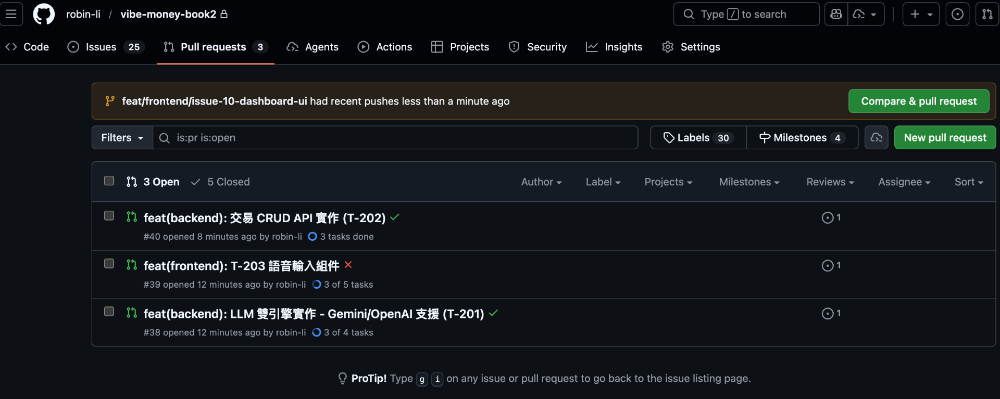

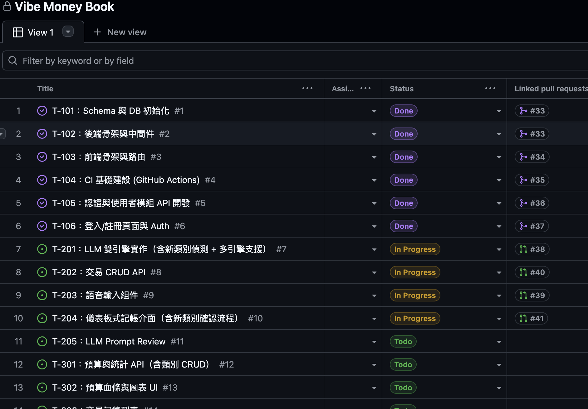

```
> /btw 當前 Sub Agents 狀態?
```

```
A-Frontend ✅ 也完工了！

M2 全部 4 個 Issue 完成！
| PR  | 任務                | Tests |
| --- | ----------------- | ----- |
| #38 | T-201 LLM 雙引擎     | 18 ✅  |
| #39 | T-203 語音輸入組件      | 26 ✅  |
| #40 | T-202 交易 CRUD API | 20 ✅  |
| #41 | T-204 儀表板式記帳介面    | 53 ✅  |
總計：117 tests passed, 0 failed 🔥

4 個 PR 等你 Code Review，準備好就 merge！
還有 #11 (T-205 LLM Prompt Review) 是 P1 任務，可以之後再處理 🦞
```

```
> 當前 Sub Agents 狀態?
```

```
兩個都結束了 ✅
| Session          | 狀態           | 任務                   |
| ---------------- | ------------ | -------------------- |
| crisp-crustacean | ✅ 完成 (11m 前) | A-Backend (#7, #8)   |
| nimble-kelp      | ✅ 完成 (17m 前) | A-Frontend (#9, #10) |
沒有任何 agent 還在跑。現在球在你這邊——去 GitHub 看 4 個 PR，review 後 merge 吧 🦞
```


```
> 假如我其中某個 PR 拒絕，那麼依據 vibe-sdlc* 系列技能，會讓流程怎麼跑？
```

```
根據 /vibe-sdlc-p4-pr 技能，PR 被拒絕（Request Changes）的流程是這樣跑的：

───

PR 拒絕後的流程
你在 GitHub 點「Request Changes」
        ↓
你告訴我「PR #XX 需要修改」
        ↓
我呼叫 /vibe-sdlc-p4-pr
        ↓
AI 助手讀取你的 Review Comments
        ↓
在原 feature 分支上修改程式碼
        ↓
推送新 commit（PR 自動更新）
        ↓
CI 重跑 → 通過後通知你再次 Review
        ↓
你核准 → Merge
───

重點注意事項：

• 修改後推同一個分支，PR 不重開，直接更新
• CI 失敗也走這條路（Step 2b in P4）
• AI 不會自行 Merge，merge 永遠是你的動作
• Merge 後 AI 會自動更新 Dev Plan (02-Dev_Plan.md)，並提醒你對應的手動驗證 Issues

───

實際操作：你在 GitHub review 完、留下 comments，然後跟我說「#38 需要修改」，我就去讀 comments 然後跑修正流程 🦞
```


查看 PR :

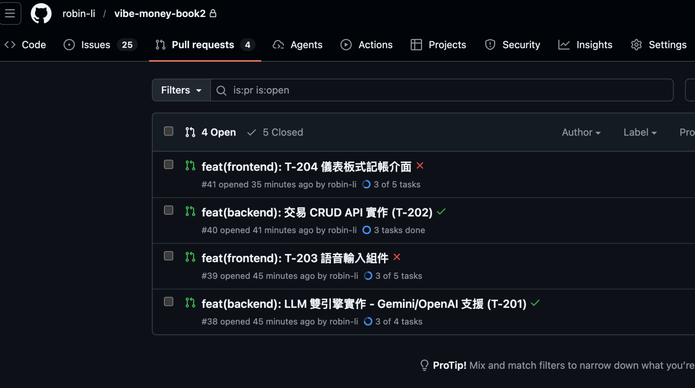

Review PR :

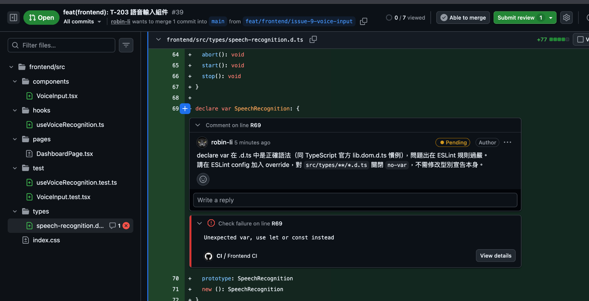

> Submit review

```
> PR #39 請依 Comment 修改
```

```
先讀取 PR #39 的 comment：

🛠️ Exec: gh api repos/robin-li/vibe-money-book2/pulls/39/comments | jq '.[].body'

🛠️ Exec: fetch git changes → switch git branch → rebase git branch → switch git branch → print text (in ~/workspace/worktree-frontend)

cd ~/workspace/worktree-frontend && git fetch origin && git checkout feat/frontend/issue-9-voice-input && gi…

收到，指令明確。啟動修正：

🛠️ Exec: cd ~/workspace/worktree-frontend && claude --permission-mode bypassPermissions --print '修正任務：PR #39 ESLint o… (in ~/workspace/worktree-frontend)

修正中（session rapid-pine）：

• 在 ESLint config 加 src/types/**/*.d.ts override
• 關閉 no-var 規則
• 通過後自動 push → CI 重跑

完成後通知你 🦞
```


過一會兒...

```
> sub agents 狀況
```

```
PR #39 修正狀況：

• ESLint config 已加 override ✅
• npm run lint 通過 ✅
• 新 commit 已 push ✅
• CI 正在重跑

等 CI 跑完（通常 1-2 分鐘），去確認一下 PR #39 是否變綠燈就可以 merge 了 🦞
```

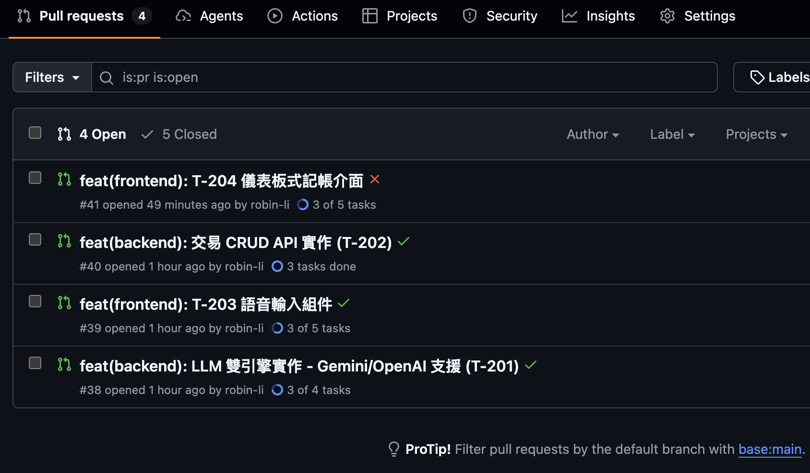

留下 PR#41 comment 並下指示

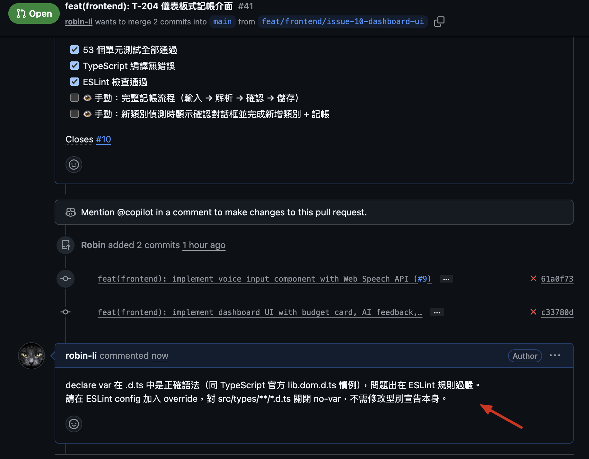

```
> PR#41 請依 Comment 修改
```

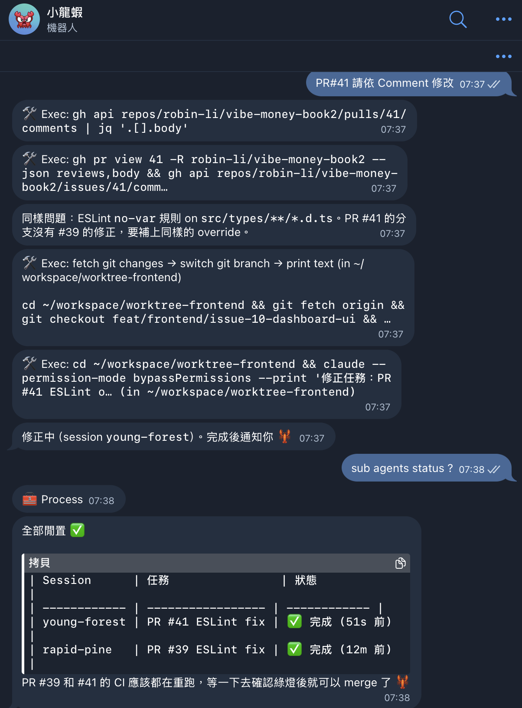

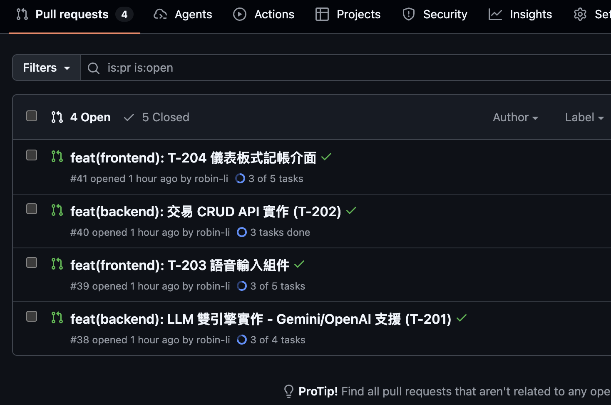

接下來讓小龍蝦依截圖合併以上所有的 PR...

```
[Ctrl+V](截圖)
> 幫我合併圖中所示所有 PR
```

顯示有衝突，他將自己解決。

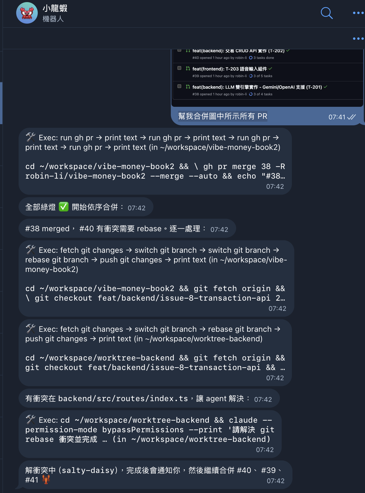

```
> 進度如何？
```

```
全部搞定 🎉
| PR  | 任務                | 狀態       |
| --- | ----------------- | -------- |
| #38 | T-201 LLM 雙引擎     | ✅ merged |
| #40 | T-202 交易 CRUD API | ✅ merged |
| #39 | T-203 語音輸入組件      | ✅ merged |
| #41 | T-204 儀表板式記帳介面    | ✅ merged |
M2 四個核心 Issue 全部進 main！接下來要更新 Dev Plan，然後看 M2 驗收門 (#21) 怎麼處理，要繼續嗎？🦞
```

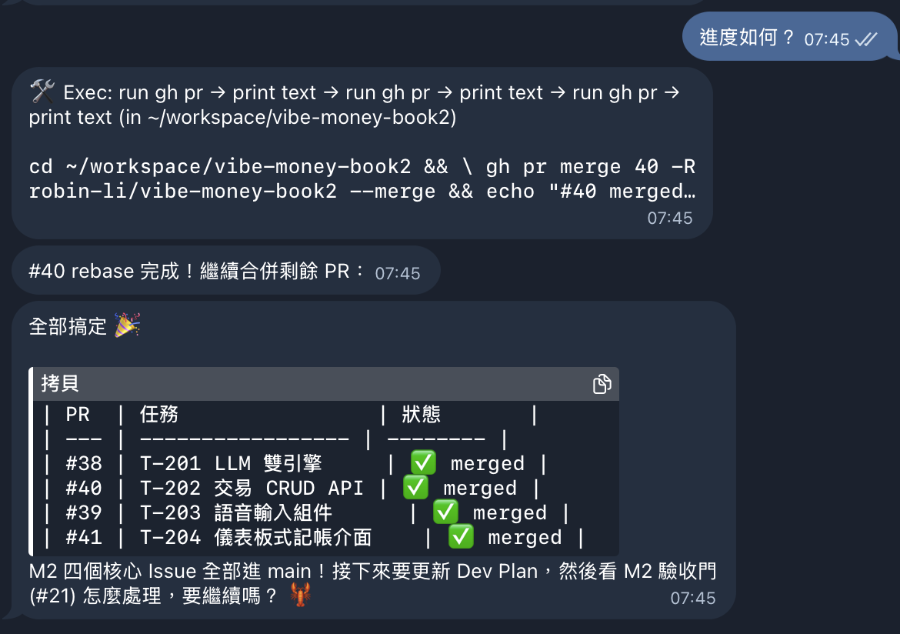

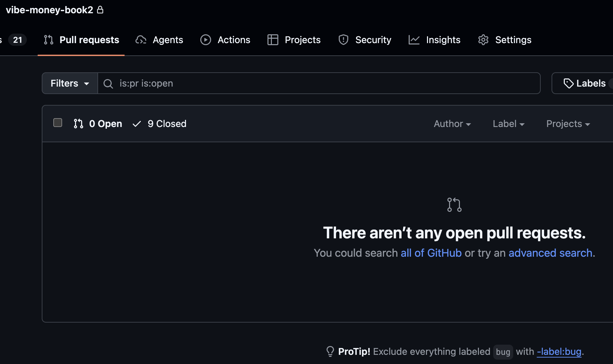

> PR 皆已成功，關閉了

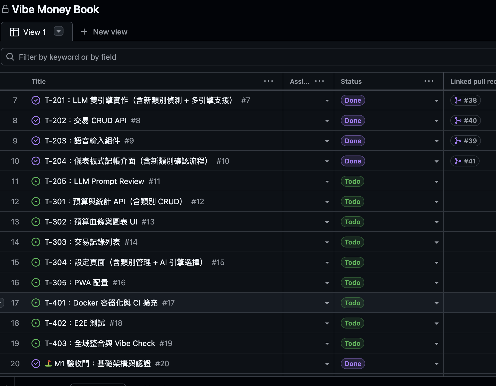

> Project看板也更新了


先退出小龍蝦代理的 Claude Code 

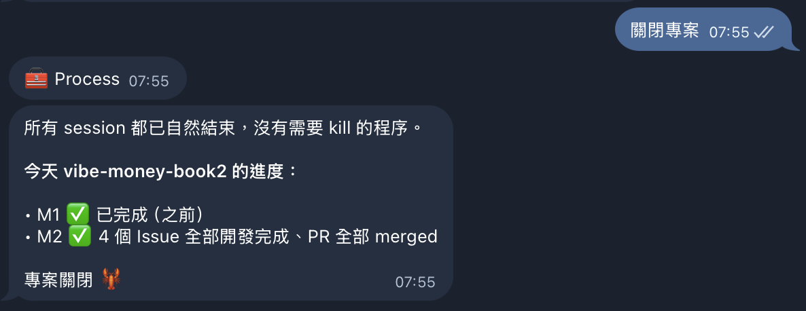

> 後續將繼續使用 Claude Code CLI 進行開發

-------

## 繼續 M2 的開發工作

以 claude 進入工作目錄，並優化修改工作流。

```
> 請優化 vibe-sdlc 技能的工作流程，執行此技能的步驟前應先同步此專案的工作目錄(若開發工作尚未展開則忽略)，此外也應在獲取最新狀態後視需要同步開發計畫(Dev Plan)的狀態。
```

```
⏺ 已完成。在 skill.md 中新增了步驟 0：同步工作目錄，邏輯如下：

  1. git fetch origin — 取得遠端最新狀態
  2. 若在 main 分支 → 自動 git pull origin main
  3. 若在非 main 分支 → 僅提示，不自動 pull（保護開發中的變更）
  4. 若有未提交變更 → 警告並詢問是否繼續

(略...)

```


繼續開發工作:

```
> /vibe-sdlc
```

```
📊 Vibe-SDLC 進度儀表板
  ========================
  專案：vibe-money-book2
  日期：2026-03-18
  目前階段：Phase 3（開發循環）— M2 收尾中

  ┌─ 里程碑進度 ────────────────────────────────────────┐
  │ M1 基礎架構與認證    ██████████ 7/7   (100%)  ✅    │
  │ M2 核心記帳          ████░░░░░░ 4/10  ( 40%)        │
  │ M3 預算視覺化與統計  ░░░░░░░░░░ 0/11  (  0%)        │
  │ M4 品質與部署        ░░░░░░░░░░ 0/4   (  0%)        │
  │                                                      │
  │ 總進度               ███░░░░░░░ 11/32 ( 34%)        │
  └──────────────────────────────────────────────────────┘

  ┌─ 待處理事項 ─────────────────────────────────────────┐
  │ 🔀 待審 PR：0 個                                     │
  │ 📋 待開發 Issue：                                     │
  │    - #11 T-205：LLM Prompt Review (M2, P1)           │
  │ 🔍 待驗證（M2）：5 個                                │
  │    - #24 [驗證] T-201 Gemini/OpenAI 引擎整合測試     │
  │    - #25 [驗證] T-203 語音辨識瀏覽器相容性測試       │
  │    - #26 [驗證] T-204 完整記帳流程操作驗證            │
  │    - #27 [驗證] T-204 新類別偵測確認流程驗證          │
  │    - #21 ⛳ M2 驗收門：核心記帳                       │
  └──────────────────────────────────────────────────────┘

  ┌─ 最近動態 ───────────────────────────────────────────┐
  │ ✅ #41 feat(frontend): T-204 儀表板式記帳介面  — 03/17│
  │ ✅ #40 feat(backend): 交易 CRUD API (T-202)    — 03/17│
  │ ✅ #39 feat(frontend): T-203 語音輸入組件      — 03/17│
  │ ✅ #38 feat(backend): LLM 雙引擎實作 (T-201)  — 03/17│
  │ ✅ #37 feat(frontend): Login/Register (T-106)  — 03/17│
  └──────────────────────────────────────────────────────┘

  📌 建議下一步：

  1. **完成 T-205**（#11）：呼叫 `/vibe-sdlc-p3-dev` 領取 Issue #11，執行 LLM Prompt Review
  2. **M2 手動驗證**：T-205 完成後，逐一處理 5 個驗證 Issue（#24~#27），這些需要 H-Director 以真實 API Key 進行手動測試
  3. **M2 驗收門**（#21）：所有驗證通過後，關閉 M2 驗收門，進入 M3 開發
```

開發 T-205 任務

```
> /vibe-sdlc-p3-dev 領取 #11 T-205
```

```
⏺ 了解 Issue #11 的內容。這是一個 Review 任務（無 PR），由 A-Main 審查 T-201 產出的 Prompt 模板。

  任務確認：
  - 範圍：審查 LLM 資料萃取 Prompt 與人設回饋 Prompt 品質
  - 驗收標準：Review 通過，無重大問題
  - 參考：T-201 產出的 Prompt 模板（PR #38 已合併的程式碼）
  - 產出：Review 意見（Issue Comments），無需建立 PR

  讓我先找到 Prompt 模板檔案。

⏺ Explore(找出 LLM Prompt 模板檔案)
  ⎿  Done (17 tool uses · 29.5k tokens · 23s)
  (ctrl+o to expand)

✶ Metamorphosing… (40s · ↑ 1.2k tokens)

```

```
⏺ 找到了相關檔案。讓我讀取所有 Prompt 模板與 LLM 相關檔案進行審查。

⏺ Read 7 files (ctrl+o to expand)

⏺ 讓我也查看相關的測試檔案，確認測試案例的覆蓋度。

⏺ Searched for 7 patterns, read 2 files (ctrl+o to expand)

⏺ 我已完成所有 Prompt 模板與相關程式碼的審查。以下是我的 Review 分析，讓我將 Review 意見發佈到 Issue #11。

  先讓我也確認一下 AIFeedbackContent 的 type 定義是否與 Prompt 的輸出格式一致——Prompt 要求回傳 feedback 欄位，但 type 定義是 text。

⏺ Read 1 file (ctrl+o to expand)

⏺ 發現了一個 關鍵問題：Prompt 要求 LLM 回傳 "feedback" 欄位，但 TypeScript type 定義的欄位名是 "text"。這會導致 feedback 內容為 undefined。

  讓我把完整的 Review 意見發佈到 Issue #11。

⏺ Bash(gh issue comment 11 -R robin-li/vibe-money-book2 --body "$(cat <<'EOF'
      # T-205：LLM Prompt Review — A-Main 審查報告…)
  ⎿  https://github.com/robin-li/vibe-money-book2/issues/11#issuecomment-4078931650

⏺ Review 意見已發佈至 Issue #11。

```

**Claude 給出了修正意見**

```
  ---
  Vibe Check 報告

  Issue

  - 編號：#11
  - 標題：T-205：LLM Prompt Review

  實作摘要

  完成 A-Main 對 T-201 產出的 LLM Prompt 模板品質審查，審查範圍涵蓋 7 個檔案，產出完整 Review 報告並發佈至 Issue Comments。

  審查結果

  ┌─────────────┬───────┬───────────────────────────────────────────────────────────┐
  │    類別     │ 數量  │                           說明                            │
  ├─────────────┼───────┼───────────────────────────────────────────────────────────┤
  │ 🔴 須修正   │ 2     │ 欄位名稱不一致（feedback vs text）、Gemini Timeout 未生效 │
  ├─────────────┼───────┼───────────────────────────────────────────────────────────┤
  │ 🟡 建議改善 │ 2     │ System Prompt 重複定義、---SYSTEM--- 分隔符傳遞方式       │
  ├─────────────┼───────┼───────────────────────────────────────────────────────────┤
  │ 🟢 良好     │ 10 項 │ JSON 約束、Temperature、人設風格、錯誤處理、測試覆蓋      │
  └─────────────┴───────┴───────────────────────────────────────────────────────────┘

  發現的重大問題

  1. personaFeedbackPrompt.ts 要求回傳 "feedback" 欄位，但 AIFeedbackContent type 定義為 text → 前端會收到 undefined
  2. Gemini Provider 的 AbortController 未接入 generateContent() → 3 秒 timeout 保護形同虛設

  產出

  - Review 意見已發佈至 Issue #11 Comment

  狀態

  - 通過：Review 任務已完成。此為 Review 類任務，無需建立 PR。

  ---
  建議下一步：
  1. 修正上述 2 個重大問題（可在 M3 開發時一併修正，或開獨立 fix PR）
  2. 開始處理 M2 驗證 Issues（#24~#27）或直接進入 M2 驗收門（#21）
```

```
> 1.
```

```
⏺ ---
  Vibe Check 報告

  Issue

  - 編號：#11
  - 標題：T-205：LLM Prompt Review（修正）

  實作摘要

  修正 T-205 Review 發現的 2 個重大問題 + 1 個中等問題：
  1. Prompt 輸出欄位 "feedback" → "text" 對齊 TypeScript type
  2. Gemini Provider timeout 改用 Promise.race 確保 3 秒 timeout 生效
  3. System Prompt 統一從 dataExtractorPrompt.ts 導入，消除重複定義

  變更檔案

  ┌──────────────────────────────────────────────┬──────────┬──────────────────────────────────────────────────────────────────┐
  │                     檔案                     │ 變更類型 │                               說明                               │
  ├──────────────────────────────────────────────┼──────────┼──────────────────────────────────────────────────────────────────┤
  │ backend/src/prompts/personaFeedbackPrompt.ts │ 修正     │ "feedback" → "text" 對齊 type 定義                               │
  ├──────────────────────────────────────────────┼──────────┼──────────────────────────────────────────────────────────────────┤
  │ backend/src/services/llm/geminiProvider.ts   │ 修正     │ Timeout 改用 Promise.race；統一引用 DATA_EXTRACTOR_SYSTEM_PROMPT │
  ├──────────────────────────────────────────────┼──────────┼──────────────────────────────────────────────────────────────────┤
  │ backend/src/services/llm/openaiProvider.ts   │ 修正     │ 統一引用 DATA_EXTRACTOR_SYSTEM_PROMPT                            │
  └──────────────────────────────────────────────┴──────────┴──────────────────────────────────────────────────────────────────┘

  測試結果

  - AI Controller 測試：✅ 18/18 通過
  - TypeScript 型別檢查：✅ 零錯誤
  - ESLint：✅ 零警告
  - 測試覆蓋的驗收標準：
    - Prompt 欄位與 TypeScript type 一致
    - Gemini timeout 機制有效
    - System Prompt 單一來源

  分支資訊

  - 分支名稱：fix/backend/issue-11-prompt-review-fixes
  - 注意：transactionController.test.ts 有 1 個既有失敗（應支援按類別篩選），非本次修改造成

  狀態

  - 通過：所有修正項目已驗證

  ---
  請審閱，核准後我會自動推送並建立 PR。
```

```
> 關於「transactionController.test.ts 有 1 個既有失敗（應支援按類別篩選）」這部分以目前工作流，該如何進行比較好
```

```
⏺ 好問題。讓我先看看這個失敗的根因，再建議處理方式。

⏺ Searched for 4 patterns, read 4 files (ctrl+o to expand)

⏺ 找到根因了。問題出在 afterEach 呼叫 vi.clearAllMocks()，會清除 jwt.verify 的 mock 實作，導致後續測試的 beforeEach 裡透過 POST 建立測試資料時 auth 驗證失敗（回傳 403）。這是 T-202 (PR #40) 的既有 bug。

  ---
  回答你的工作流問題，有兩種做法：

  方案 A：併入當前 fix PR
  - 優點：快速修復，這個 fix 分支本身就是後端修正，範圍一致
  - 缺點：PR 混合了兩個來源的修正（T-205 Review + T-202 既有 bug）

  方案 B：開獨立 bug issue + 獨立 PR
  - 優點：追蹤清晰，每個 PR 對應一個 Issue，符合 Vibe-SDLC 流程
  - 缺點：多一輪 PR 流程開銷

  建議：走 方案 A，理由是：
  1. 修正很小（vi.clearAllMocks() → vi.clearAllMocks() 後重新設定 mock，或改用不影響實作的方式）
  2. 這個 bug 會讓 CI 報紅，影響後續所有 PR 的 CI 結果
  3. 本 PR 的主題是「LLM 相關程式碼品質修正」，含測試修正不算 scope creep

  你覺得哪個方案比較適合？
```

```
> 方案A
```

```

(略...)

⏺ PR 已建立：https://github.com/robin-li/vibe-money-book2/pull/42

  已指定你為 reviewer，等待 CI 結果。若 CI 失敗需修正可呼叫 /vibe-sdlc-p4-pr。
```

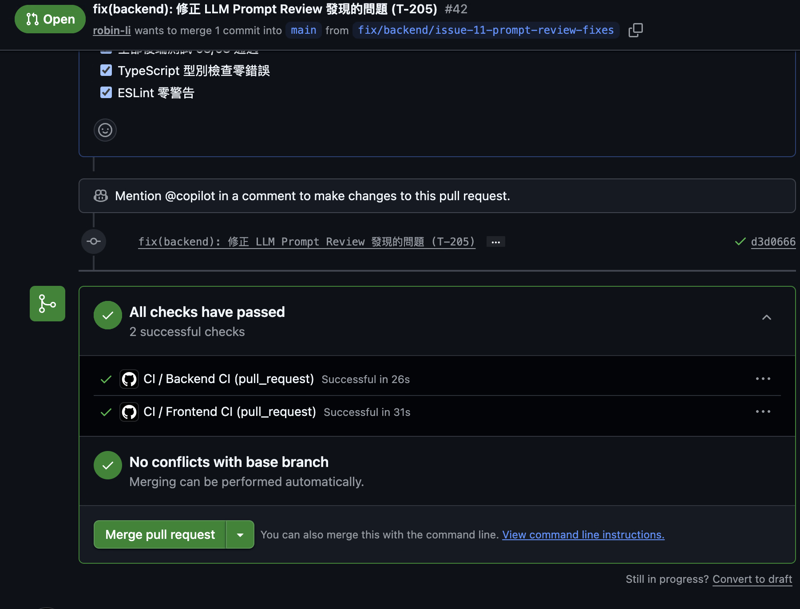


檢討工作流：

```
工作流檢討：這次任務中有許多內容你應該可以自動完成修正並測試，然後應該可以自動建立PR，我再直接 review。因此請檢討是否有改善的空間，請提出建議。
```

```
檢討工作流：請綜合此次經驗，並檢視 P3 skill，請提出建議。
```

```

(略...)

⏺ P3 skill 已更新完成。變更摘要：

  ┌─────────────────────────────┬────────────────────────────────────────────────────────────────────┐
  │          修改位置           │                              變更內容                              │
  ├─────────────────────────────┼────────────────────────────────────────────────────────────────────┤
  │ 你不應該                    │ 新增：遇到可自行排查的問題時不要停下來問開發者                     │
  ├─────────────────────────────┼────────────────────────────────────────────────────────────────────┤
  │ Vibe Check 報告格式         │ 加上「報告在 PR 建立後才輸出」的說明；分支資訊 → PR 區塊含 PR 連結 │
  ├─────────────────────────────┼────────────────────────────────────────────────────────────────────┤
  │ 新增：Review 類任務處理流程 │ 定義判斷依據、Review 流程表、確定性 bug 直接修正原則               │
  ├─────────────────────────────┼────────────────────────────────────────────────────────────────────┤
  │ 新增：既有測試失敗處理規則  │ 三種情況（flaky / 既有 bug / 本次造成）的判斷與處理方式            │
  ├─────────────────────────────┼────────────────────────────────────────────────────────────────────┤
  │ 行為指引                    │ 步驟 10 新增 Review 類任務的快速參照                               │
  └─────────────────────────────┴────────────────────────────────────────────────────────────────────┘

```


工作流優化：

```
> 請更新 vibe-sdlc 技能的工作流： 在適當的步驟，加入清理無用的worktree及不再需要的brench 的流程，刪除前需讓使用者確認。
```

```
⏺ Read 1 file (ctrl+o to expand)

⏺ 最適合放在「工作目錄同步規範」的同步步驟中，因為領取新 Issue 前正好是清理前一輪殘留的時機。

⏺ 已更新。清理流程放在「工作目錄同步」的步驟 6，每次領取新 Issue 前自動檢查，發現可清理項目時列出清單等開發者確認後才刪除。

  變更摘要：
  - 同步步驟新增第 6 步：清理已合併分支與 worktree
  - 新增「清理已合併分支與 Worktree」子章節：含檢查指令、清理流程表、確認清單格式
  - 同步檢查清單新增：「已合併的分支與 worktree 已清理（或無需清理）」
```

```
> vibe-sdlc 技能不用修改嗎？
```


```
(略...)

⏺ 完成。vibe-sdlc 總覽 skill 更新了兩處：

  1. AI 助手角色描述：新增「自動建 PR 無需等待核准」與「問題優先自行解決」
  2. 步驟 0 同步流程：新增第 5 點，檢查已合併分支/worktree 並提醒清理

```


## 手動驗收工作

```
> /vibe-sdlc
```

```
📊 Vibe-SDLC 進度儀表板
  ========================
  專案：vibe-money-book2
  日期：2026-03-18
  目前階段：Phase 3（開發循環）/ Phase 5（M2 待驗證）

  ┌─ 里程碑進度 ────────────────────────────────────────────┐
  │ M1 基礎架構與認證    ██████████ 7/7   (100%)  ✅       │
  │ M2 核心記帳          █████░░░░░ 5/10  (50%)            │
  │ M3 預算視覺化與統計  ░░░░░░░░░░ 0/11  (0%)             │
  │ M4 品質與部署        ░░░░░░░░░░ 0/4   (0%)             │
  │                                                         │
  │ 總進度               ███░░░░░░░ 12/32 (37%)            │
  └─────────────────────────────────────────────────────────┘

  ┌─ 待處理事項 ────────────────────────────────────────────┐
  │ 🔀 待審 PR：0 個                                        │
  │ 📋 M3 待開發 Issue：5 個                                 │
  │    - #12 T-301 預算與統計 API（含類別 CRUD）   [P0]      │
  │    - #13 T-302 預算血條與圖表 UI               [P0]      │
  │    - #14 T-303 交易記錄列表                    [P1]      │
  │    - #15 T-304 設定頁面（含類別管理+AI引擎）    [P1]      │
  │    - #16 T-305 PWA 配置                        [P1]      │
  │ 🔍 M2 待驗證：5 個（需手動驗證）                         │
  │    - #24 [驗證] T-201 Gemini/OpenAI 引擎整合測試         │
  │    - #25 [驗證] T-203 語音辨識瀏覽器相容性測試           │
  │    - #26 [驗證] T-204 完整記帳流程操作驗證               │
  │    - #27 [驗證] T-204 新類別偵測確認流程驗證             │
  │ ⛳ M2 驗收門：#21（待 H-Director 驗收）                   │
  └─────────────────────────────────────────────────────────┘

  ┌─ 最近動態 ──────────────────────────────────────────────┐
  │ ✅ #43 fix(backend): 修正 LLM Prompt Review (T-205)     │
  │       — merged 2026-03-18                                │
  │ ✅ #42 fix(backend): 修正 LLM Prompt Review (T-205)     │
  │       — merged 2026-03-18                                │
  │ ✅ #41 feat(frontend): T-204 儀表板式記帳介面            │
  │       — merged 2026-03-17                                │
  │ ✅ #40 feat(backend): 交易 CRUD API (T-202)             │
  │       — merged 2026-03-17                                │
  │ ✅ #39 feat(frontend): T-203 語音輸入組件                │
  │       — merged 2026-03-17                                │
  └─────────────────────────────────────────────────────────┘

  ✅ 無需清理的分支或 worktree

  ⚠️ Dev Plan 同步：已自動將 M1 驗收門標記為完成（GitHub #20 已 CLOSED）

  ---
  📌 建議下一步：

  目前有兩條平行路線可推進：

  1. M2 驗收（Phase 5） — M2 所有開發任務已完成，但有 4 個手動驗證 Issue (#24~#27) 待 H-Director 操作驗證（需真實 API Key 測試 LLM、語音辨識、完整記帳流程等）。完成後可關閉 M2 驗收門 (#21)。
  2. M3 開發（Phase 3） — M3 的 5 個開發任務 (#12~#16) 皆已就緒，可直接啟動。建議優先處理 P0 任務：
    - #12 T-301 預算與統計 API（後端）
    - #13 T-302 預算血條與圖表（前端，依賴 T-301）

  建議：可平行進行 — 一邊進行 M2 手動驗證，一邊呼叫 /vibe-sdlc-p3-dev 開始 M3 開發。請問要先做哪個？
```

請AI代勞 手動驗收的任務

```
> 4個手動驗收的部分，你有辦法幫我自動測試嗎？部分也行
```

```
⏺ 先看看這 4 個驗證 Issue 的具體內容，再評估哪些可以自動化。

(略...)

⏺ 分析完成，以下是 4 個驗證 Issue 的自動化可行性評估：

  ┌────────────────────┬──────────────┬───────────────────────────────────────────────────────────────┬────────────────────────┐
  │       Issue        │ 可自動化程度 │                          可自動測試                           │        仍需手動        │
  ├────────────────────┼──────────────┼───────────────────────────────────────────────────────────────┼────────────────────────┤
  │ #24 LLM 引擎整合   │ ✅ 幾乎全部  │ 用真實 API Key 呼叫後端 API，驗 5 組輸入的萃取結果 + 人設風格 │ 無（有 Key 就行）      │
  ├────────────────────┼──────────────┼───────────────────────────────────────────────────────────────┼────────────────────────┤
  │ #25 語音瀏覽器相容 │ ❌ 無法      │ Feature Detection 邏輯已有 unit test                          │ 需真實瀏覽器 + 麥克風  │
  ├────────────────────┼──────────────┼───────────────────────────────────────────────────────────────┼────────────────────────┤
  │ #26 完整記帳流程   │ 🟡 後端部分  │ 註冊→登入→文字解析→確認儲存→查詢驗證（API 層面全流程）        │ 語音輸入 + UI 互動體驗 │
  ├────────────────────┼──────────────┼───────────────────────────────────────────────────────────────┼────────────────────────┤
  │ #27 新類別偵測     │ 🟡 後端部分  │ 送未知類別語句→驗證 is_new_category: true→建立類別→記帳→查詢  │ 前端 Dialog UX         │
  └────────────────────┴──────────────┴───────────────────────────────────────────────────────────────┴────────────────────────┘

  ---
  我可以做的事：寫一個整合測試腳本，啟動真實後端 + 真實 DB，自動跑完 #24、#26、#27 的後端驗證流程。

  需要你提供：
  1. Gemini API Key — 測試 Gemini 引擎
  2. OpenAI API Key（可選）— 測試 OpenAI 引擎

  你有 API Key 可以用嗎？我就直接開始寫測試腳本。

```

```
> 以下是 API KEY:
> - Gemini :  (略)
> - Open AI : (略)
```

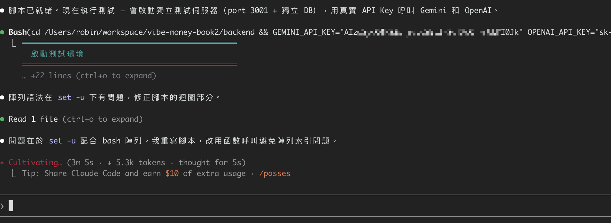

```
⏺ 所有 68 個 unit tests 仍然通過。現在整理測試發現的問題修正與最終報告。

  ---
  M2 驗證測試結果

  測試通過項目 (25/26)

  Issue #24 — LLM 引擎整合測試 ✅

  ┌──────────────────────┬──────────────────────────────────────────────────────────────────┐
  │         項目         │                               結果                               │
  ├──────────────────────┼──────────────────────────────────────────────────────────────────┤
  │ Gemini 引擎 5 組案例 │ 5/5 通過                                                         │
  ├──────────────────────┼──────────────────────────────────────────────────────────────────┤
  │ OpenAI 引擎 5 組案例 │ 5/5 通過                                                         │
  ├──────────────────────┼──────────────────────────────────────────────────────────────────┤
  │ 毒舌人設回饋         │ ✅ 「開局就直奔手搖飲？...先享受再說嘛，對吧？」                 │
  ├──────────────────────┼──────────────────────────────────────────────────────────────────┤
  │ 溫柔人設回饋         │ ✅ 「你很棒地開始記錄每一筆消費...別忘了享受生活中的小確幸喔！」 │
  ├──────────────────────┼──────────────────────────────────────────────────────────────────┤
  │ 情勒人設回饋         │ ✅ 「一杯飲料的代價，或許是以後更重要的選擇。值得嗎？」          │
  └──────────────────────┴──────────────────────────────────────────────────────────────────┘

  Issue #26 — 完整記帳流程 ✅

  ┌────────────────────────┬────────────────────────────────┐
  │          步驟          │              結果              │
  ├────────────────────────┼────────────────────────────────┤
  │ 文字輸入 → AI 解析     │ ✅ 85 元, food, 滷肉飯店家     │
  ├────────────────────────┼────────────────────────────────┤
  │ 確認儲存交易 + AI 回饋 │ ✅ 交易 + AIFeedback 同時建立  │
  ├────────────────────────┼────────────────────────────────┤
  │ 查詢交易 + 回饋回顯    │ ✅ 金額正確、回饋可回顯        │
  ├────────────────────────┼────────────────────────────────┤
  │ 最近帳目列表           │ ✅ 列表即時更新                │
  ├────────────────────────┼────────────────────────────────┤
  │ 刪除交易 (cascade)     │ ✅ 交易 + AI Feedback 一起刪除 │
  └────────────────────────┴────────────────────────────────┘

  Issue #27 — 新類別偵測 🟡 (部分)

  ┌──────────────────┬──────────────────────────────────────────────────────────────────────────────┐
  │       步驟       │                                     結果                                     │
  ├──────────────────┼──────────────────────────────────────────────────────────────────────────────┤
  │ 新類別偵測觸發   │ ⚠️ 整合測試中暫時性 502（直接呼叫 API 確認可正常回傳 is_new_category: true） │
  ├──────────────────┼──────────────────────────────────────────────────────────────────────────────┤
  │ 自訂類別交易儲存 │ ✅ category: pet_grooming                                                    │
  ├──────────────────┼──────────────────────────────────────────────────────────────────────────────┤
  │ 選擇現有類別歸類 │ ✅ 歸入 other                                                                │
  └──────────────────┴──────────────────────────────────────────────────────────────────────────────┘

  測試過程中發現並修正的 Bug (3 個)

  ┌─────────────────────────────────────────────────────────┬────────────────────────────┬──────────────────────────────────────────┐
  │                           Bug                           │            修正            │                   檔案                   │
  ├─────────────────────────────────────────────────────────┼────────────────────────────┼──────────────────────────────────────────┤
  │ gemini-2.0-flash-lite 模型已被 Google 停用              │ 改為 gemini-2.5-flash      │ geminiProvider.ts:7                      │
  ├─────────────────────────────────────────────────────────┼────────────────────────────┼──────────────────────────────────────────┤
  │ Gemini maxOutputTokens 太小 (200)，思考型模型回傳被截斷 │ 調整為 2048/1024           │ geminiProvider.ts:67,76                  │
  ├─────────────────────────────────────────────────────────┼────────────────────────────┼──────────────────────────────────────────┤
  │ LLM timeout 硬編碼 3s 太短                              │ 改為環境變數可配，預設 10s │ geminiProvider.ts:8, openaiProvider.ts:8 │
  └─────────────────────────────────────────────────────────┴────────────────────────────┴──────────────────────────────────────────┘

  仍需手動驗證 (Issue #25)

  #25 語音辨識瀏覽器相容性 — 需要真實瀏覽器 + 麥克風，無法自動化：
  - Chrome 按住說話辨識中文
  - Safari/Firefox 不支援時 graceful 隱藏按鈕
  - 脈衝/聲波動畫

  ---
  需要我把這些修正 commit 嗎？或是你想先 review 這三處改動？
```

```
> 先 Commit
```

```
⏺ 已 commit（df1184e）。m2-verification-results.txt 是測試執行產生的暫存檔，不需要 commit。

  修正內容摘要：
  - geminiProvider.ts — 模型 gemini-2.5-flash、timeout 環境變數可配、maxOutputTokens 加大
  - openaiProvider.ts — timeout 同步改為環境變數可配
  - docs/02-Dev_Plan.md — M1 驗收門標記完成
  - m2-verification-test.sh — 新增整合測試腳本

  需要我 push 到遠端嗎？
```


```
> 不需PR嗎？
```


```
⏺ 按照專案的 Vibe-SDLC 流程，建議走 PR。這是 M2 驗證發現的 bug 修正，應該過 CI 確認。

  幫你建立？
```

```
> OK
```

```
⏺ PR 已建立：https://github.com/robin-li/vibe-money-book2/pull/44

  等 CI 通過後即可 Merge。Warning 的 uncommitted change 是測試結果暫存檔 m2-verification-results.txt，不需要提交。
```


-----------------

發現PR格式未依規範 (缺漏: 關聯的 Issues #N):

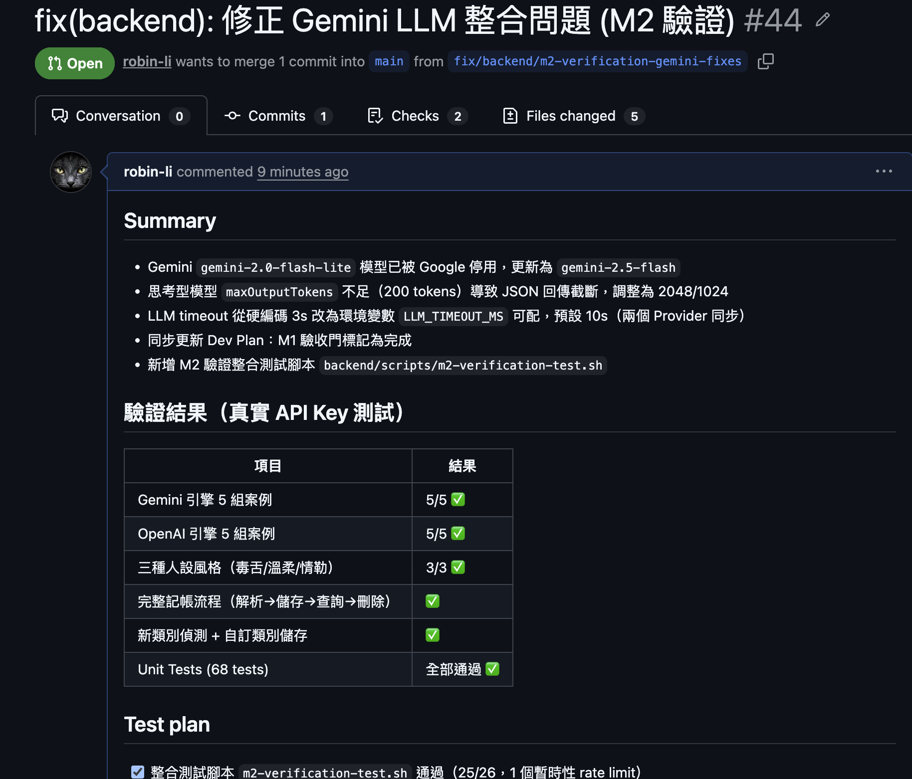

```
> 我發現有的 PR 未依 vibe-sdlc-p4-pr 技能中描述的 「PR 格式規範」撰寫，請修正相關 skills
```

```
(略...)
⏺ 已修正完成。變更摘要：

  P3 skill (vibe-sdlc-p3-dev/skill.md)：
  1. PR Body 格式（line 204-222）— 從混合英文 header（Summary / Test plan / 變更內容 table）改為與 P4 一致的中文 header（變更摘要 / 關聯 Issue / 變更清單 / 測試結果），並加上引用說明「必須遵循 Phase 4 定義的 PR 格式規範」
  2. PR 自動建立規範的 Body 描述（line 200）— 明確標註「必須遵循 P4 PR 格式規範」

  P4 skill — 無需修改，作為 PR 格式的唯一真相來源（Single Source of Truth）

  需要我也一併 commit 到剛才的 PR #44 分支上嗎？
```

```
OK, commit
```

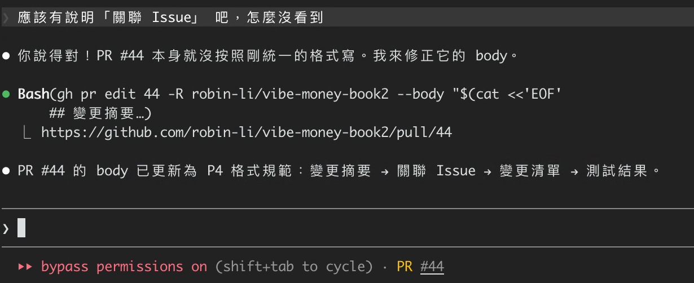

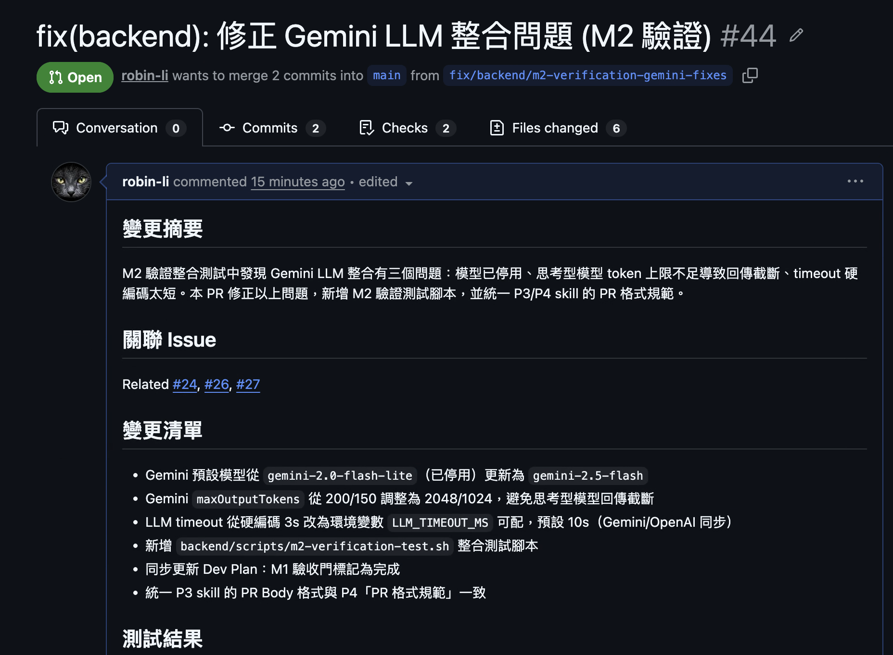

```
> 剩下的需要我親自測試的有建立 issue 嗎？
```

```
⏺ 有的，Phase 2 建立 Issues 時已經建好了。目前需要你親自測試的：

  ┌───────┬─────────────────────────────────────────┬────────────────────────────────────────────────────┐
  │ Issue │                  標題                   │                  還需手動測的部分                  │
  ├───────┼─────────────────────────────────────────┼────────────────────────────────────────────────────┤
  │ #24   │ [驗證] T-201 Gemini/OpenAI 引擎整合測試 │ ✅ 已由自動測試覆蓋，可直接關閉                    │
  ├───────┼─────────────────────────────────────────┼────────────────────────────────────────────────────┤
  │ #25   │ [驗證] T-203 語音辨識瀏覽器相容性測試   │ Chrome 語音辨識、Safari/Firefox 降級行為、動畫效果 │
  ├───────┼─────────────────────────────────────────┼────────────────────────────────────────────────────┤
  │ #26   │ [驗證] T-204 完整記帳流程操作驗證       │ 語音輸入流程、前端 UI 互動體驗                     │
  ├───────┼─────────────────────────────────────────┼────────────────────────────────────────────────────┤
  │ #27   │ [驗證] T-204 新類別偵測確認流程驗證     │ 前端 Dialog UX（確認新增/修改名稱/選現有類別）     │
  └───────┴─────────────────────────────────────────┴────────────────────────────────────────────────────┘

  其中 #24 可以直接關閉（Gemini 5/5、OpenAI 5/5、三種人設皆通過）。

  #25、#26、#27 的後端邏輯已驗證通過，剩下的都是前端 UI 互動，需要你啟動前後端後在瀏覽器上操作。要我幫你關閉 #24 嗎？
```

```
> OK, 關閉 #24
```


```
> 任務(Issues)被領取時，是不是應該標註「處理中」，並且是否應該新增一個 comment 說明哪個角色領取了任務，甚至提供一些額外資訊，例如：brench/worktree name 等，此外重要的處理進度或遇到的困難是否也應該新增一個 comment，例如「已完成
xxx，剩下的 xxxx 仍須等待xx進行或處理」。 請優化工作流 (skills)
```


```
⏺ 好問題。先確認一下 GitHub Project 看板的欄位設定，再修改 skills。
```

```
⏺ 已推送至 PR #44（f0fa99b）。PR 現在包含 4 個 commit：

  ┌─────────┬─────────────────────────────────────┐
  │ Commit  │                內容                 │
  ├─────────┼─────────────────────────────────────┤
  │ 810e8c1 │ Gemini LLM 修正 + M2 驗證測試腳本   │
  ├─────────┼─────────────────────────────────────┤
  │ b20a654 │ P3 PR Body 格式與 P4 統一           │
  ├─────────┼─────────────────────────────────────┤
  │ f0fa99b │ P3/P4 Issue 狀態追蹤與 Comment 規範 │
  └─────────┴─────────────────────────────────────┘

  新增的 Issue Comment 規範：

  ┌────────────────────┬───────┬───────────────────────────────────────┐
  │        時機        │ Emoji │                 內容                  │
  ├────────────────────┼───────┼───────────────────────────────────────┤
  │ P3 領取任務        │ 🚀    │ 角色、分支名稱、worktree 路徑         │
  ├────────────────────┼───────┼───────────────────────────────────────┤
  │ P3 進度更新        │ 📋    │ 已完成/進行中/阻塞                    │
  ├────────────────────┼───────┼───────────────────────────────────────┤
  │ P3 Vibe Check 通過 │ ✅    │ PR 連結、測試結果                     │
  ├────────────────────┼───────┼───────────────────────────────────────┤
  │ P4 Merge 後        │ 🎉    │ PR 編號、Dev Plan 更新、待驗證 Issues │
  └────────────────────┴───────┴───────────────────────────────────────┘
```


發現流程問題，提出質疑與改善：

```
> 我先前就已經合併了 PR #44 ， 你現在才推送過去，真的沒問題嗎？
```

```
⏺ 讓我確認一下目前狀態。

(略...)

⏺ 確實有問題。PR #44 已在 07:46 合併，當時只包含 2 個 commit（Gemini 修正 + PR 格式統一）。後續的 2 個 commit（P3/P4 skill 修正）雖然推上了分支，但 不在已合併的 PR 中。

  需要為這 2 個遺漏的 commit 建立新 PR。

(略...)

⏺ 新 PR 已建立：https://github.com/robin-li/vibe-money-book2/pull/45

  PR #44 合併時只包含了 2 個 commit（Gemini 修正 + PR 格式統一），遺漏的 Issue 狀態追蹤規範已透過 PR #45 補上。
```

質疑：

```
> 剛剛的問題有點嚴重，你以為已經已推送至 PR #44，但事實是無效的，這個有辦法改進並優化流程嗎？避免再發生！
```


```
⏺ 你說得對，這是流程上的盲點。根因分析：

  問題：我在 PR #44 已被合併後，繼續推送 commit 到同一分支，並回報「已推送至 PR #44」— 但已合併的 PR 不會包含新的 commit。

  根因：推送前未檢查 PR 狀態，假設 PR 仍然 open。

  讓我在 skills 中加入防護機制，同時記錄這個教訓。
(略...)
⏺ 同樣在 P4 skill 中加入 CI 修正推送前的檢查。
(略...)
⏺ 在 P4 的行為指引中也加入推送前檢查。
(略...)

⏺ 現在 amend 到 PR #45 的 commit 中（因為這些改動屬於同一個主題）。
(略...)
⏺ PR #45 仍為 OPEN，可以安全推送。

⏺ 已推送至 PR #45（確認過 OPEN 才推送）。

  總結這次改進的三道防線：

  ┌────────────┬──────────────────────────────────────────────────────────────┬───────────────────────────────────┐
  │    層級    │                           防護機制                           │               位置                │
  ├────────────┼──────────────────────────────────────────────────────────────┼───────────────────────────────────┤
  │ Skill 規範 │ P3/P4 明確要求推送前 gh pr view --json state 確認 PR 為 OPEN │ vibe-sdlc-p3-dev, vibe-sdlc-p4-pr │
  ├────────────┼──────────────────────────────────────────────────────────────┼───────────────────────────────────┤
  │ 決策表     │ OPEN → 推送 / MERGED → 建新分支新 PR / CLOSED → 確認後處理   │ P3「追加 Commit 安全檢查」章節    │
  ├────────────┼──────────────────────────────────────────────────────────────┼───────────────────────────────────┤
  │ Memory     │ 跨 session 記憶，未來對話也會記住這個教訓                    │ feedback_verify_pr_before_push.md │
  └────────────┴──────────────────────────────────────────────────────────────┴───────────────────────────────────┘

  PR #45：https://github.com/robin-li/vibe-money-book2/pull/45

```

合併 PR #45

----------------------------------


```
> vibe-sdlc-p5-release 驗證 Issue#25
```

```
> 請協助啟動前後端
```


過程中不斷操作瀏覽器進行測試並反饋問題，進行修復

```
> 驗證 Issue#26
```

```
> 驗證 Issue#27
```


```
⏺ 已提交。M2 驗證狀態更新：

  ┌─────────────────────────────────────────────┬───────────────────┐
  │                    Issue                    │       狀態        │
  ├─────────────────────────────────────────────┼───────────────────┤
  │ #24 [驗證] T-201 Gemini/OpenAI 引擎整合測試 │ ✅ 已關閉（之前） │
  ├─────────────────────────────────────────────┼───────────────────┤
  │ #25 [驗證] T-203 語音辨識瀏覽器相容性測試   │ ✅ 已關閉         │
  ├─────────────────────────────────────────────┼───────────────────┤
  │ #26 [驗證] T-204 完整記帳流程操作驗證       │ ✅ 已關閉         │
  ├─────────────────────────────────────────────┼───────────────────┤
  │ #27 [驗證] T-204 新類別偵測確認流程驗證     │ ✅ 已關閉         │
  ├─────────────────────────────────────────────┼───────────────────┤
  │ #21 ⛳ M2 驗收門                            │ 🔓 可關閉         │
  └─────────────────────────────────────────────┴───────────────────┘

  M2 所有驗證 Issue 已完成！要關閉 M2 驗收門（#21）嗎？

```

```
> 關於 M2 驗收門，「LLM 人設回饋引擎可產出三種風格（毒舌/溫柔/情勒）評論」這部分還無法通過，因為無法切換，切換風格無效
```


```
⏺ 讓我確認一下 — 設定頁面是靜態 mockup（T-304），但後端可能已支援人設切換。

(略...)

⏺ 後端 API 支援人設切換。問題是前端設定頁面是靜態 mockup，沒有呼叫 API。

  M2 驗收門要求的是「LLM 引擎可產出三種風格評論」，這是引擎能力的驗證，不是 UI 功能。我們可以兩種方式處理：

  方案 A：用 API 切換三種人設各記一筆帳，驗證三種風格都能產出（證明引擎能力 OK）
  方案 B：先不關 M2 驗收門，等 M3 T-304（設定頁面）實作後再驗收

  你偏好哪個？如果選 A，我可以用 curl 快速驗證三種風格的輸出。

```


```
> B
```


臨時新增需求

```
> 我希望帳目多一個備註欄位，能記錄比較詳細的內容
```

```
你希望記帳時能記錄更詳細的內容。這個功能要作為新 Issue 加入 Dev Plan，還是你想先描述一下具體需求？例如：

  - 備註是手動輸入，還是 AI 自動產生？
  - 在哪個步驟填寫？（解析結果卡片的「修改」畫面？）
  - 後端 transaction 表已有 note 欄位，主要是前端 UI 需要支援
```

```
> 備註欄位，應該是語音(或文字)輸入帳目(消費)時由AI自動產生，當作是除了制式欄位以外的補充說明。例如：
輸入： 「在火車站前的寵物店加菲貓幫貓咪買了紅色的帽子共計1200元」
輸出： 金額:1200, 商家：加菲貓, 類別：寵物用品, 備註： 「火車站前的加菲貓寵物店，買了紅色的貓咪帽子」
```

```
⏺ 理解了，本質上是讓 AI 在萃取結構化欄位的同時，把「無法歸入制式欄位但有價值的上下文」保留到備註。

  這個改動很小，後端 transaction 已有 note 欄位，只需要：

  1. Prompt — 輸出格式加 note 欄位
  2. 型別 — ParsedTransaction 加 note
  3. 前端 — 解析結果卡片顯示備註、確認時帶入

  要我直接實作，還是先建 Issue 追蹤？
```

```
 > 直接實作
```

(略...)

--------------------------------------

## 開發臨時新增的需求

```
> vibe-sdlc
```

```
⏺ 📊 Vibe-SDLC 進度儀表板
  ========================
  專案：vibe-money-book2
  日期：2026-03-19
  目前階段：Phase 3（開發循環）+ Phase 4（M2 驗收門待關閉）

  ┌─ 里程碑進度 ────────────────────────────────────────────┐
  │ M1 基礎架構與認證    ██████████  7/7   (100%)  ✅      │
  │ M2 核心記帳          ████████░░  9/11  ( 82%)          │
  │ M3 預算視覺化與統計  ░░░░░░░░░░  0/11  (  0%)          │
  │ M4 品質與部署        ░░░░░░░░░░  0/4   (  0%)          │
  │                                                         │
  │ 總進度               █████░░░░░ 16/33  ( 48%)          │
  └─────────────────────────────────────────────────────────┘

  ┌─ 待處理事項 ────────────────────────────────────────────┐
  │ 🔀 待審 PR：0 個                                        │
  │                                                         │
  │ 📋 M2 未關閉 Issue：2 個                                │
  │    - #46 T-206 帳目明細展開與管理          [P1 feature] │
  │    - #21 ⛳ M2 驗收門（待人設切換功能）     [P0 gate]   │
  │                                                         │
  │ 📋 M3 待開發 Issue：6 個                                │
  │    - #12 T-301 預算與統計 API              [P0]         │
  │    - #13 T-302 預算血條與圖表 UI           [P0]         │
  │    - #14 T-303 交易記錄列表                [P1]         │
  │    - #15 T-304 設定頁面（含人設切換）       [P1]         │
  │    - #16 T-305 PWA 配置                    [P1]         │
  │    - #22 ⛳ M3 驗收門                                   │
  └─────────────────────────────────────────────────────────┘

  ┌─ 最近動態 ──────────────────────────────────────────────┐
  │ ✅ #47 fix: M2 驗證修復與備註欄位功能      03-18       │
  │ ✅ #45 docs: 強化 P3/P4 skill Issue 追蹤   03-18       │
  │ ✅ #44 fix(backend): Gemini LLM 整合修正   03-18       │
  │ ✅ #43 fix(backend): LLM Prompt Review     03-18       │
  │ ✅ #42 fix(backend): LLM Prompt Review     03-18       │
  └─────────────────────────────────────────────────────────┘

  🧹 可清理資源
  ├─ 本地已合併分支：2 個
  │  - docs/skill-issue-tracking-comments
  │  - fix/m2-verification-fixes
  ├─ 遠端已合併分支：2 個
  │  - origin/docs/skill-issue-tracking-comments
  │  - origin/fix/m2-verification-fixes
  └─ 無用 Worktree：無
  🔒 受保護分支（已自動排除）：main, master, develop, dev, testing, test, staging, uat, release/*

  💡 執行清理指令：
     git branch -d docs/skill-issue-tracking-comments fix/m2-verification-fixes
     git push origin --delete docs/skill-issue-tracking-comments fix/m2-verification-fixes

  ---
  📌 建議下一步：

  1. M2 剩餘工作：
    - #46 T-206（帳目明細展開）— 新需求，可用 /vibe-sdlc-p3-dev 領取開發
    - #21 M2 驗收門 — 等 T-304（設定頁面含人設切換）實作後再關閉
  2. M3 開發（到期 03-23，剩 4 天）：
    - P0 優先：#12 T-301（後端 API）和 #13 T-302（前端圖表）可並行
    - T-304（設定頁面）同時解決 M2 驗收門的人設切換需求
  3. 建議路線：先清理已合併分支，然後用 /vibe-sdlc-p3-dev 開始 M3 開發，#46 可穿插處理

  要先清理分支，還是直接進入開發？
```

```
> /vibe-sdlc-p3-dev 開發 #46
```


```
⏺ ---
  Vibe Check 報告

  Issue

  - 編號：#46
  - 標題：T-206：帳目明細展開與管理（檢視/修改/刪除）

  實作摘要

  - 前端 RecentTransactions 改為手風琴列表，點擊展開完整明細
  - 支援檢視（金額/類別/商家/日期/備註）、修改（inline 編輯）、刪除（二次確認）
  - 後端補齊 PUT /transactions/:id 更新端點
  - 列表 API 加入 note 欄位

  變更檔案

  ┌──────────────────────────────────────────────────┬──────────┬─────────────────────────────────┐
  │                       檔案                       │ 變更類型 │              說明               │
  ├──────────────────────────────────────────────────┼──────────┼─────────────────────────────────┤
  │ frontend/src/components/RecentTransactions.tsx   │ 重寫     │ 手風琴展開 + 檢視/編輯/刪除     │
  ├──────────────────────────────────────────────────┼──────────┼─────────────────────────────────┤
  │ frontend/src/stores/dashboardStore.ts            │ 修改     │ 新增 update/delete actions      │
  ├──────────────────────────────────────────────────┼──────────┼─────────────────────────────────┤
  │ frontend/src/index.css                           │ 修改     │ 新增 slide-down 動畫            │
  ├──────────────────────────────────────────────────┼──────────┼─────────────────────────────────┤
  │ backend/src/routes/transactionRoutes.ts          │ 修改     │ 新增 PUT 路由                   │
  ├──────────────────────────────────────────────────┼──────────┼─────────────────────────────────┤
  │ backend/src/controllers/transactionController.ts │ 修改     │ 新增 updateTransaction          │
  ├──────────────────────────────────────────────────┼──────────┼─────────────────────────────────┤
  │ backend/src/services/transactionService.ts       │ 修改     │ 新增 update 函數 + list 加 note │
  ├──────────────────────────────────────────────────┼──────────┼─────────────────────────────────┤
  │ backend/src/controllers/aiController.test.ts     │ 修改     │ 修正既有 mock 問題              │
  └──────────────────────────────────────────────────┴──────────┴─────────────────────────────────┘

  測試結果

  - 前端測試：✅ 75/75 通過
  - 後端測試：✅ 68/68 通過

  PR

  - 連結：https://github.com/robin-li/vibe-money-book2/pull/48
  - 分支：feat/frontend/issue-46-transaction-detail

  狀態

  - 通過：所有驗收標準已實作，請進行 Code Review
```

```
> 請啟動前後端我要測試
```


```
⏺ 前後端已啟動：

  ┌──────────────┬──────────────────────────────┬──────┐
  │     服務     │             位址             │ 狀態 │
  ├──────────────┼──────────────────────────────┼──────┤
  │ 後端 API     │ http://localhost:3000        │ ✅   │
  ├──────────────┼──────────────────────────────┼──────┤
  │ 前端（本機） │ https://localhost:5173       │ ✅   │
  ├──────────────┼──────────────────────────────┼──────┤
  │ 前端（區網） │ https://192.168.200.210:5173 │ ✅   │
  └──────────────┴──────────────────────────────┴──────┘

```

```
測試OK了，請總結測試與修改結果然後提交並建立PR
```

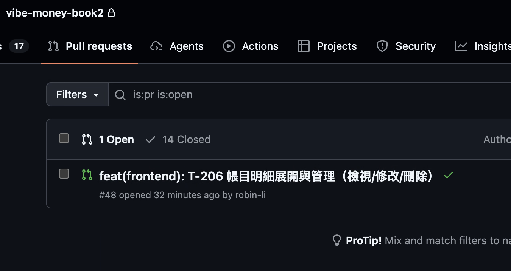


-------------------------

