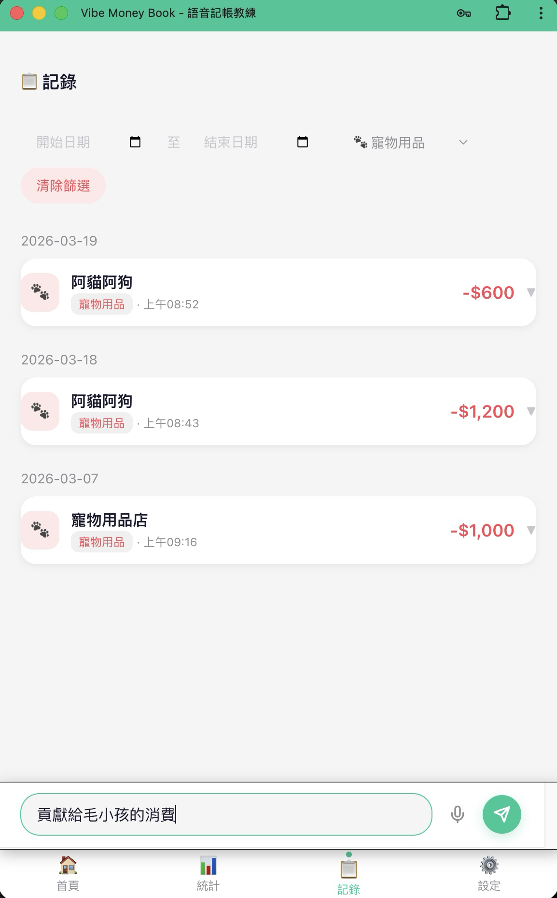
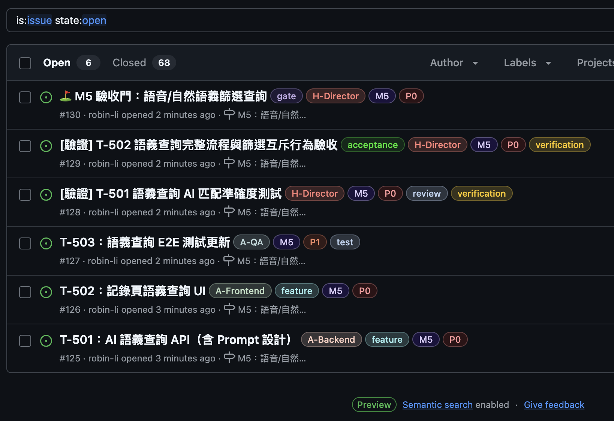
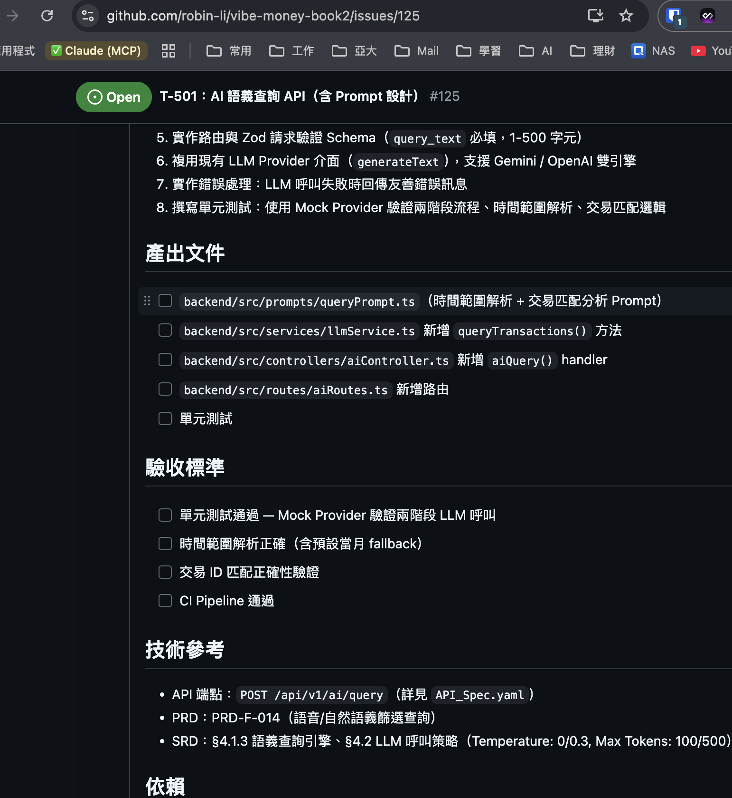
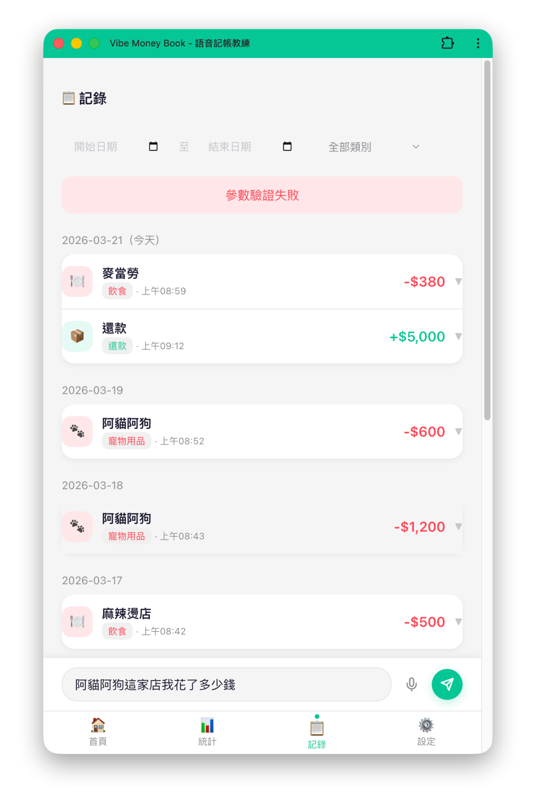

# Vibe Money Book 開發日誌 - 3


```
/vibe-sdlc
```

```
⏺ 好的，讓我開始執行 Vibe-SDLC 儀表板流程。

  步驟 0：同步工作目錄

(略 ...)

⏺ ✅ 工作目錄已同步，無需清理的分支或 worktree。

  步驟 1 & 2：收集數據

(略 ...)

⏺ 所有里程碑都已完成！讓我看看 Dev Plan 的任務狀態。

  Searched for 1 pattern (ctrl+o to expand)

⏺ 📊 Vibe-SDLC 進度儀表板
  ========================
  專案：vibe-money-book2 (Vibe Money Book)
  日期：2026-03-21
  目前階段：Phase 5（交付與迭代）

  ┌─ 里程碑進度 ──────────────────────────────────────────┐
  │ M1 基礎架構與認證       ██████████  7/7   (100%)      │
  │ M2 核心記帳             ██████████ 11/11  (100%)      │
  │ M3 預算視覺化與統計     ██████████ 11/11  (100%)      │
  │ M4 品質與部署           ██████████  4/4   (100%)      │
  │                                                       │
  │ 總進度                  ██████████ 33/33  (100%)      │
  └───────────────────────────────────────────────────────┘

  ┌─ Dev Plan 任務狀態 ───────────────────────────────────┐
  │ ✅ 已完成：23/23（100%）                               │
  │ ⬜ 未完成：0                                           │
  └───────────────────────────────────────────────────────┘

  ┌─ 待處理事項 ──────────────────────────────────────────┐
  │ 🔀 待審 PR：0 個                                      │
  │ 📋 進行中 Issue：0 個                                  │
  │ 🐛 額外修復 Issue（無里程碑）：35 個（全部已關閉）      │
  └───────────────────────────────────────────────────────┘

  ┌─ 最近動態 ────────────────────────────────────────────┐
  │ ✅ #124 fix: LLM Prompt 調優、類別匹配改善     — 3/20 │
  │ ✅ #123 fix: LLM feedback 容錯 fallback         — 3/20 │
  │ ✅ #122 fix: 記錄頁面日期篩選加 placeholder     — 3/20 │
  │ ✅ #119 fix: 相對日期辨識與 AI 指示注入修正     — 3/20 │
  │ ✅ #117 fix: AI 指示未正確注入 LLM Prompt       — 3/20 │
  └───────────────────────────────────────────────────────┘

  🎉 所有里程碑與 Dev Plan 任務皆已完成！
  ✅ 無需清理的分支或 worktree

  ---
  📌 建議下一步：

  所有 4 個里程碑的 33 個 Issues 全部 closed，Dev Plan 23 項任務也全部完成，專案已進入 Phase 5（交付與迭代） 階段。建議：

  1. 執行 /vibe-sdlc-p5-release — 進行部署驗收、收集回饋、更新規格文件
  2. 若已有部署環境，可進行最終的手動驗證與使用者測試
  3. 近期修復了不少 Bug（35 個額外 Issue），可考慮整理 Release Notes

  需要我執行 /vibe-sdlc-p5-release 嗎？
```

* * *

## 加入新的需求

```
> /vibe-sdlc-p1-spec 我將新增/調整需求，請與我討論後調整相關文件與計畫：
請參考附圖(示意圖)，加入語音/自然語義篩選查詢功能：
1. 在記錄頁面下方新增語音/輸入的輸入框，用以輸入自然語言的篩選條件
2. 查詢輸入範例：
  - 「最近一個月毛小孩的開銷」
  - 「在買衣服的事上面花了多少」
  - 「阿貓阿狗這家店我花了多少錢」
  - 「潛水總共花了多少錢」
3. 送給AI的提示詞：
  - 3.1 提示詞附加： 現在時間及時區
  - 3.2 使用AI解析用戶原始提示詞中的時間範圍，若無法正常解析則默認為當月的時間範圍。
  - 3.3 依3.3分析的時間範圍查詢完整交易記錄(含 note 備註欄)，組裝成交易記錄集
  - 3.4 將 3.3 的交易記錄集 附加到用戶提示詞，再次送給AI分析、查詢並回覆。
  - 3.5 回覆內容包含：
    - 一句總結，用Chat方式呈現(參考首頁的AI教練區塊)。
    - 可以作為篩選條件的查詢語句，用來篩選記錄頁面數據集並呈現。
  - 3.6 範例:
    - 輸入「阿貓阿狗這家店我花了多少錢」
    - 輸出：
      - 上方AI教練區塊「你這個月大手大腳地在毛孩子身上花了 2800 元，是愛心氾濫了，還是你被毛孩子威脅了？」
      - 下方列出所有符合的帳目。
```



```
⏺ 收到！這是一個很棒的功能需求。讓我先讀取現有規格文件，了解目前的架構與 API 設計，再來跟你討論實作細節。

  Read 3 files (ctrl+o to expand)

⏺ 好，我已經讀完了 PRD、API Spec 和 OpenAPI 合約。讓我也快速看一下目前後端的 AI parse 實作和前端記錄頁的結構。

⏺ Explore(探索後端 AI parse 與前端記錄頁)
  ⎿  Done (38 tool uses · 60.4k tokens · 1m 34s)
  (ctrl+o to expand)

⏺ 我已經完整了解現有架構了。以下是我對這個功能的設計分析，想跟你討論幾個關鍵決策點：

  ---
  功能設計分析：語音/自然語義篩選查詢

  整體架構方案

  根據你的需求，這是一個 兩階段 AI 呼叫 的流程：

  使用者輸入「阿貓阿狗這家店我花了多少錢」
      ↓
  ① AI 解析時間範圍（「阿貓阿狗」無時間詞 → 預設當月）
      ↓
  ② 後端以時間範圍查 DB，取得交易記錄集（含 note）
      ↓
  ③ 將交易記錄集 + 原始查詢 → 送 AI 分析
      ↓
  ④ AI 回傳：
     - summary：「你這個月在毛孩子身上花了 2800 元...」
     - matched_transaction_ids：[uuid-1, uuid-2, uuid-3]
      ↓
  ⑤ 前端：上方顯示 AI 教練評語，下方篩選出匹配的帳目

  需要討論的設計決策

  1. 新增 API 端點 vs 擴充 /ai/parse

  現有 /ai/parse 已有 transaction / chat 兩種 intent。這次的「查詢」流程完全不同（需要先查 DB 再送 AI），我建議 新增獨立端點 POST /ai/query，理由：

  - /ai/parse 的職責是「解析記帳輸入」，查詢是另一個場景
  - 查詢流程需要兩次 LLM 呼叫 + 一次 DB 查詢，邏輯獨立性強
  - 避免 /ai/parse 變得過於臃腫

  2. AI 回傳「篩選條件」的方式

  你提到 AI 回傳「可以作為篩選條件的查詢語句」，有兩種方案：

  ┌───────────────────────────┬──────────────────────────────────────────────────────────────────────────────┬─────────────────────────────────────┬──────────────────────────┐
  │           方案            │                                     說明                                     │                優點                 │           缺點           │
  ├───────────────────────────┼──────────────────────────────────────────────────────────────────────────────┼─────────────────────────────────────┼──────────────────────────┤
  │ A. 回傳匹配的交易 ID 列表 │ AI 分析後直接標記哪些交易匹配                                                │ 最精準（AI 可模糊匹配商家名、備註） │ 前端需用 ID 過濾         │
  ├───────────────────────────┼──────────────────────────────────────────────────────────────────────────────┼─────────────────────────────────────┼──────────────────────────┤
  │ B. 回傳結構化篩選參數     │ 如 { category: "寵物用品", merchant_keyword: "阿貓阿狗", date_range: [...] } │ 可復用已有的篩選 UI                 │ 無法處理跨欄位的模糊查詢 │
  └───────────────────────────┴──────────────────────────────────────────────────────────────────────────────┴─────────────────────────────────────┴──────────────────────────┘

  我偏向 方案 A，因為像「潛水總共花了多少錢」這類查詢，可能橫跨多個類別（娛樂、運動）、多個商家名稱，只有 AI 看過完整交易記錄後才能準確判斷。

  3. 前端 UI 配置

  參考你的示意圖，我理解的佈局是：

  ┌─────────────────────────────┐
  │ 📋 記錄                     │
  │ [開始日期] 至 [結束日期] [類別▼] │
  │ [清除篩選]                   │
  │                             │
  │ ┌─ AI 教練回饋 ───────────┐ │  ← 新增：查詢後顯示
  │ │ 💬 你這個月大手大腳地... │ │
  │ └─────────────────────────┘ │
  │                             │
  │ 2026-03-19                  │
  │ [阿貓阿狗 -$600]            │  ← 僅顯示匹配的帳目
  │ 2026-03-18                  │
  │ [阿貓阿狗 -$1,200]          │
  │ ...                         │
  │                             │
  │ ┌───────────────────┐🎤 ➤  │  ← 新增：語音/文字查詢輸入
  └─────────────────────────────┘

  問題：
  1. 查詢後，上方的日期/類別篩選器是否仍然可用？（我建議查詢結果可與手動篩選共存，用「清除篩選」一次清除所有）
  2. AI 教練區塊是否只在有查詢結果時才顯示？還是常駐？

  ---
  你覺得以上方案如何？ 有什麼需要調整的嗎？確認後我就開始修改 PRD、API Spec、Dev Plan 等規格文件。
```

```
>
1. 關於API部分： 請新增獨立端點
2. AI 回傳「篩選條件」的方式：請使用方案 A. 回傳匹配的交易 ID 列表
3.1. 上方的日期/類別篩選器：查詢結果可與手動篩選共存，用「清除篩選」一次清除所有，若設定篩選器，則清除「語音/文字查詢輸入項」，表示只使用篩選器的條件。若 「語音/文字查詢輸入項」有任何輸入則也自動清除篩選器，表示僅使用語音/文字查詢的條件。
3.2. AI 教練區塊是否只在有查詢結果時才顯示
```

```
(中間步驟省略...)

⏺ 所有規格文件更新完成。讓我做一個總結。

  ---
  更新摘要

  已修改的文件

  ┌──────────────────┬──────────────────────────────────────────────────────────────────────────────────────────────────────────────┐
  │       文件       │                                                   修改內容                                                   │
  ├──────────────────┼──────────────────────────────────────────────────────────────────────────────────────────────────────────────┤
  │ 01-1-PRD.md      │ 新增 PRD-F-014（語音/自然語義篩選查詢）功能需求、更新 PRD-F-009 增加交叉參考、新增 US-013 使用者故事         │
  ├──────────────────┼──────────────────────────────────────────────────────────────────────────────────────────────────────────────┤
  │ 01-3-API_Spec.md │ 新增 POST /ai/query 端點清單與詳細規範（含請求/響應格式、處理流程）                                          │
  ├──────────────────┼──────────────────────────────────────────────────────────────────────────────────────────────────────────────┤
  │ API_Spec.yaml    │ 新增 /ai/query path 定義與 AIQueryResult schema                                                              │
  ├──────────────────┼──────────────────────────────────────────────────────────────────────────────────────────────────────────────┤
  │ 02-Dev_Plan.md   │ 新增 M5 里程碑（語義篩選查詢）、新增 T-501/T-502/T-503 三個任務（含詳細描述）、更新 Gantt 圖與並行群組視覺化 │
  └──────────────────┴──────────────────────────────────────────────────────────────────────────────────────────────────────────────┘

  新增任務一覽

  ┌───────┬──────────────────────────────────────────────────┬────────────┬─────────────┐
  │ 任務  │                       說明                       │    負責    │    預估     │
  ├───────┼──────────────────────────────────────────────────┼────────────┼─────────────┤
  │ T-501 │ AI 語義查詢 API + Prompt 設計（兩階段 LLM 呼叫） │ A-Backend  │ ~6 Sessions │
  ├───────┼──────────────────────────────────────────────────┼────────────┼─────────────┤
  │ T-502 │ 記錄頁語義查詢 UI + 篩選互斥邏輯                 │ A-Frontend │ ~5 Sessions │
  ├───────┼──────────────────────────────────────────────────┼────────────┼─────────────┤
  │ T-503 │ E2E 測試更新                                     │ A-QA       │ ~2 Sessions │
  └───────┴──────────────────────────────────────────────────┴────────────┴─────────────┘

  待確認

  你覺得以上修改是否 OK？確認後可以：
  1. 進入 /vibe-sdlc-p2-issues 將 M5 的任務建立為 GitHub Issues
  2. 或者先進行交叉比對審查確保文件一致性
```

```
> 2

⏺ 好，我來執行交叉比對審查。讓我讀取所有相關文件進行系統性檢查。

  Read 2 files (ctrl+o to expand)

⏺ 交叉比對完成。我發現以下不一致與遺漏項目：

  ---
  審查發現

  不一致 / 遺漏項目

  ┌─────┬──────────┬─────────────────────────────────────────────────────────────────────────────────────────────────────────┬────────┐
  │  #  │   文件   │                                                  問題                                                   │ 嚴重度 │
  ├─────┼──────────┼─────────────────────────────────────────────────────────────────────────────────────────────────────────┼────────┤
  │ 1   │ SRD §4   │ LLM 整合設計章節未提及 AI Query 的兩階段 LLM 呼叫架構（時間解析 + 交易匹配分析）                        │ 高     │
  ├─────┼──────────┼─────────────────────────────────────────────────────────────────────────────────────────────────────────┼────────┤
  │ 2   │ SRD §4.3 │ LLMProvider 介面定義僅有 extractData + generateFeedback，缺少 generateText（實際已存在且為 query 所需） │ 高     │
  ├─────┼──────────┼─────────────────────────────────────────────────────────────────────────────────────────────────────────┼────────┤
  │ 3   │ SRD §2.2 │ 系統架構圖未顯示 HistoryPage → AI Query API 的資料流                                                    │ 中     │
  ├─────┼──────────┼─────────────────────────────────────────────────────────────────────────────────────────────────────────┼────────┤
  │ 4   │ SRD §1.1 │ 性能需求未定義 AI Query 的延遲目標（兩次 LLM 呼叫 + DB 查詢，預計 5-6s）                                │ 中     │
  ├─────┼──────────┼─────────────────────────────────────────────────────────────────────────────────────────────────────────┼────────┤
  │ 5   │ PRD §5   │ 頁面結構表中 /history 的說明未更新為含 AI 查詢功能                                                      │ 低     │
  ├─────┼──────────┼─────────────────────────────────────────────────────────────────────────────────────────────────────────┼────────┤
  │ 6   │ SRD §4.2 │ LLM 呼叫策略表未定義 AI Query 各階段的 Temperature / Max Tokens                                         │ 中     │
  └─────┴──────────┴─────────────────────────────────────────────────────────────────────────────────────────────────────────┴────────┘

  要我現在修正這些問題嗎？
```

```
> 修正

(略...)

⏺ 全部 6 項修正完成。整理如下：

  ┌─────┬──────────┬────────────────────────────────────────────────────────────────────────────────────────┐
  │  #  │   文件   │                                        修正內容                                        │
  ├─────┼──────────┼────────────────────────────────────────────────────────────────────────────────────────┤
  │ 1   │ SRD §4   │ 新增 §4.1.3 語義查詢引擎（兩階段 LLM 呼叫架構 + Prompt 設計原則 + 交易記錄集大小限制） │
  ├─────┼──────────┼────────────────────────────────────────────────────────────────────────────────────────┤
  │ 2   │ SRD §4.3 │ LLMProvider 介面新增 generateText 方法，加註用途說明                                   │
  ├─────┼──────────┼────────────────────────────────────────────────────────────────────────────────────────┤
  │ 3   │ SRD §2.2 │ 系統架構圖新增 HistoryPage 節點，顯示語義查詢 → LLMAPI 與交易查詢資料流                │
  ├─────┼──────────┼────────────────────────────────────────────────────────────────────────────────────────┤
  │ 4   │ SRD §1.1 │ 性能需求新增「LLM 語義查詢延遲 < 6s」（兩次 LLM + DB 查詢）                            │
  ├─────┼──────────┼────────────────────────────────────────────────────────────────────────────────────────┤
  │ 5   │ PRD §5   │ 頁面結構表 /history 說明更新為含語音/自然語義 AI 查詢                                  │
  ├─────┼──────────┼────────────────────────────────────────────────────────────────────────────────────────┤
  │ 6   │ SRD §4.2 │ LLM 呼叫策略表新增語義查詢各階段的 Temperature（0 / 0.3）與 Max Tokens（100 / 500）    │
  └─────┴──────────┴────────────────────────────────────────────────────────────────────────────────────────┘

  規格文件已全部一致。可以進入 /vibe-sdlc-p2-issues 將 M5 任務建立為 GitHub Issues 了。

```

```
> 請將各個文件修改的摘要，加到文件後面的「版本修訂說明」

⏺ 現在逐一在各文件結尾加入版本修訂說明。

(略...)

⏺ 同時更新各文件開頭的版本號與最後更新日期。

(略...)

⏺ 完成。5 份文件的版本號、最後更新日期、版本修訂說明皆已更新：

  ┌──────────────────┬─────────────────┬──────────────────────────────────────────────────────────┐
  │       文件       │      版本       │                         修訂摘要                         │
  ├──────────────────┼─────────────────┼──────────────────────────────────────────────────────────┤
  │ 01-1-PRD.md      │ v1.0 → v1.1     │ 新增 PRD-F-014、US-013、更新頁面結構表                   │
  ├──────────────────┼─────────────────┼──────────────────────────────────────────────────────────┤
  │ 01-2-SRD.md      │ v1.0 → v1.1     │ 新增語義查詢引擎架構、性能指標、架構圖、LLMProvider 介面 │
  ├──────────────────┼─────────────────┼──────────────────────────────────────────────────────────┤
  │ 01-3-API_Spec.md │ v1.0 → v1.1     │ 新增 POST /ai/query 端點規範                             │
  ├──────────────────┼─────────────────┼──────────────────────────────────────────────────────────┤
  │ API_Spec.yaml    │ v1.0.0 → v1.1.0 │ 新增 /ai/query path 與 AIQueryResult schema              │
  ├──────────────────┼─────────────────┼──────────────────────────────────────────────────────────┤
  │ 02-Dev_Plan.md   │ v1.0 → v1.1     │ 新增 M5 里程碑、T-501/T-502/T-503 任務                   │
  └──────────────────┴─────────────────┴──────────────────────────────────────────────────────────┘


```

```
> /vibe-sdlc

⏺ 📊 Vibe-SDLC 進度儀表板
  ========================
  專案：vibe-money-book2
  日期：2026-03-21
  目前階段：Phase 2（任務掛載 — M5 待建立 Issues）

  ┌─ 里程碑進度 ────────────────────────────────┐
  │ M1 基礎架構與認證    ██████████  7/7  (100%) │
  │ M2 核心記帳          ██████████ 11/11 (100%) │
  │ M3 預算視覺化與統計  ██████████ 11/11 (100%) │
  │ M4 品質與部署        ██████████  4/4  (100%) │
  │ M5 語義篩選查詢      ░░░░░░░░░░  0/0  (—)   │
  │                                              │
  │ 總進度               ██████████ 68/68 (100%) │
  └──────────────────────────────────────────────┘

  ┌─ 待處理事項 ─────────────────────────────────┐
  │ 🔀 待審 PR：0 個                             │
  │ 📋 進行中 Issue：0 個                        │
  │ 🔍 待驗證：0 個                              │
  │ 📝 M5 待掛載：3 個任務（T-501/T-502/T-503） │
  └──────────────────────────────────────────────┘

  ┌─ 部署現況 ───────────────────────────────────┐
  │ 🐳 Docker：🟢 運行中                        │
  │    - backend:  running (port: 3000) ✅ 健康  │
  │    - frontend: running (port: 80)   ✅ 健康  │
  │ 🔗 Tunnel：🟢 連線中 (PID: 51094)           │
  │ 🌐 公網端點：                                │
  │    - https://moneybook.smart-codings.com → 200 ✅ │
  └──────────────────────────────────────────────┘

  ┌─ 最近動態 ───────────────────────────────────┐
  │ ✅ #124 fix: LLM Prompt 調優、類別匹配改善   — merged 2026-03-20 │
  │ ✅ #123 fix(backend): LLM feedback 容錯      — merged 2026-03-20 │
  │ ✅ #122 fix(frontend): 日期篩選加 placeholder — merged 2026-03-20 │
  │ ✅ #119 fix(backend): 相對日期辨識與 AI 指示  — merged 2026-03-20 │
  │ ✅ #117 fix: AI 指示未正確注入 LLM Prompt    — merged 2026-03-20 │
  └──────────────────────────────────────────────┘

  ✅ 無需清理的分支或 worktree

  📌 建議下一步：

  M1-M4 已全部完成，M5（語音/自然語義篩選查詢）的規格文件已定稿但 尚未建立 GitHub Issues。

  建議執行 /vibe-sdlc-p2-issues 將 M5 的 3 個任務（T-501、T-502、T-503）掛載為 GitHub Issues，然後進入 Phase 3 開發。

```

```
> /vibe-sdlc-p2-issues

(略...)

⏺ 完成！以下是 M5 任務掛載總覽：

  ---
  M5 Issue 總覽

  ┌───────┬─────────────────────────────────────────────┬──────┬────────────────┬────────────┐
  │ Issue │                    標題                     │ 類型 │      標籤      │    依賴    │
  ├───────┼─────────────────────────────────────────────┼──────┼────────────────┼────────────┤
  │ #125  │ T-501：AI 語義查詢 API（含 Prompt 設計）    │ 開發 │ P0, A-Backend  │ —          │
  ├───────┼─────────────────────────────────────────────┼──────┼────────────────┼────────────┤
  │ #126  │ T-502：記錄頁語義查詢 UI                    │ 開發 │ P0, A-Frontend │ #125       │
  ├───────┼─────────────────────────────────────────────┼──────┼────────────────┼────────────┤
  │ #127  │ T-503：語義查詢 E2E 測試更新                │ 測試 │ P1, A-QA       │ #125, #126 │
  ├───────┼─────────────────────────────────────────────┼──────┼────────────────┼────────────┤
  │ #128  │ [驗證] T-501 語義查詢 AI 匹配準確度測試     │ 驗證 │ P0, review     │ #125       │
  ├───────┼─────────────────────────────────────────────┼──────┼────────────────┼────────────┤
  │ #129  │ [驗證] T-502 語義查詢完整流程與篩選互斥行為 │ 驗證 │ P0, acceptance │ #126       │
  ├───────┼─────────────────────────────────────────────┼──────┼────────────────┼────────────┤
  │ #130  │ ⛳ M5 驗收門                                │ Gate │ P0, H-Director │ 全部       │
  └───────┴─────────────────────────────────────────────┴──────┴────────────────┴────────────┘

  已建立資源：
  - M5 Label (#5319E7)
  - M5 Milestone（due: 2026-03-23）
  - 6 個 Issues 已加入 Project #3 看板

  📌 建議下一步：執行 /vibe-sdlc-p3-dev 開始領取 #125 (T-501) 進行開發。

```



```
> /vibe-sdlc-p3-dev

⏺ 好，讓我領取 #125 (T-501) 開始開發。先讀取 Issue 內容確認任務範圍。

(略...)

⏺ 任務確認：#125 T-501 — AI 語義查詢 API（含 Prompt 設計）

  - 範圍：實作 POST /ai/query 端點，兩階段 LLM 呼叫（時間範圍解析 → 交易匹配分析）
  - 驗收標準：
    - 單元測試通過（Mock Provider 驗證兩階段流程）
    - 時間範圍解析正確（含 fallback 當月）
    - 交易 ID 匹配正確
    - CI 通過
  - 參考：API_Spec.yaml POST /ai/query、SRD §4.1.3、PRD-F-014
  - 產出：queryPrompt.ts、llmService.ts 新增方法、aiController.ts 新增 handler、路由、單元測試
  - PR 策略：獨立 PR

  確認開始？還是有需要調整的地方？
```

```
> 開始
```



```
(略...)

⏺ ---
  Vibe Check 報告

  Issue

  - 編號：#125
  - 標題：T-501：AI 語義查詢 API（含 Prompt 設計）

  實作摘要

  實作 POST /ai/query 端點，採用兩階段 LLM 呼叫架構：
  1. 時間範圍解析：AI 從查詢文字提取日期範圍，無法解析時 fallback 至當月
  2. 交易匹配分析：將時間範圍內的交易記錄（含 note）送入 AI，模糊匹配並生成人設風格總結

  變更檔案

  ┌─────────────────────────────┬──────────┬─────────────────────────────────────────────────────────────────┐
  │            檔案             │ 變更類型 │                              說明                               │
  ├─────────────────────────────┼──────────┼─────────────────────────────────────────────────────────────────┤
  │ prompts/queryPrompt.ts      │ 新增     │ 兩階段 Prompt 模板（時間解析 + 交易匹配）                       │
  ├─────────────────────────────┼──────────┼─────────────────────────────────────────────────────────────────┤
  │ services/llmService.ts      │ 修改     │ 新增 queryTransactions()、parseTimeRange()、matchTransactions() │
  ├─────────────────────────────┼──────────┼─────────────────────────────────────────────────────────────────┤
  │ controllers/aiController.ts │ 修改     │ 新增 aiQuery() handler                                          │
  ├─────────────────────────────┼──────────┼─────────────────────────────────────────────────────────────────┤
  │ routes/aiRoutes.ts          │ 修改     │ 新增 POST /query 路由                                           │
  ├─────────────────────────────┼──────────┼─────────────────────────────────────────────────────────────────┤
  │ validators/aiValidators.ts  │ 修改     │ 新增 aiQuerySchema                                              │
  ├─────────────────────────────┼──────────┼─────────────────────────────────────────────────────────────────┤
  │ types/llm.ts                │ 修改     │ 新增 4 個類型定義                                               │
  ├─────────────────────────────┼──────────┼─────────────────────────────────────────────────────────────────┤
  │ __tests__/aiQuery.test.ts   │ 新增     │ 16 個單元測試                                                   │
  └─────────────────────────────┴──────────┴─────────────────────────────────────────────────────────────────┘

  測試結果

  - 單元測試：✅ 115/115 通過
  - 測試覆蓋的驗收標準：
    - Mock Provider 驗證兩階段 LLM 呼叫
    - 時間範圍解析正確（含預設當月 fallback）
    - 交易 ID 匹配正確性（含無效 ID 過濾）
    - CI Pipeline 通過（本地驗證）

  PR

  - 連結：https://github.com/robin-li/vibe-money-book2/pull/131
  - 分支：feat/backend/issue-125-ai-query

  狀態

  - 通過：請進行 Code Review

```

```
> 監控CI，自動PR

⏺ E2E 仍在跑。背景任務會在完成時通知我。目前狀態：

  ┌─────────────┬────────────────────────────────┐
  │    Check    │              狀態              │
  ├─────────────┼────────────────────────────────┤
  │ Backend CI  │ ✅ pass (25s)                  │
  ├─────────────┼────────────────────────────────┤
  │ Frontend CI │ ✅ pass (31s)                  │
  ├─────────────┼────────────────────────────────┤
  │ E2E Tests   │ ⏳ pending (Playwright 執行中) │
  └─────────────┴────────────────────────────────┘

  PR #131 連結：https://github.com/robin-li/vibe-money-book2/pull/131

  E2E 完成後我會立即回報。你也可以先去 PR 頁面做 Code Review，不需要等 E2E。

(略...)

⏺ 確認：main 分支上 E2E 同樣失敗，這是既有的環境問題（CI 上的 Docker 登入流程超時），非本次變更造成。

  CI 結果摘要：

  ┌─────────────┬─────────┬─────────────────────────────────────────────────┐
  │    Check    │  狀態   │                      說明                       │
  ├─────────────┼─────────┼─────────────────────────────────────────────────┤
  │ Backend CI  │ ✅ pass │                                                 │
  ├─────────────┼─────────┼─────────────────────────────────────────────────┤
  │ Frontend CI │ ✅ pass │                                                 │
  ├─────────────┼─────────┼─────────────────────────────────────────────────┤
  │ E2E Tests   │ ❌ fail │ 既有問題 — main 分支上同樣失敗，loginViaUI 超時 │
  └─────────────┴─────────┴─────────────────────────────────────────────────┘

  PR #131 已就緒，可以進行 Code Review 與 Merge：https://github.com/robin-li/vibe-money-book2/pull/131

```

```
> 先合併

⏺ 合併後作業完成：

  - ✅ PR #131 已合併
  - ✅ Issue #125 自動關閉（Closes #125）
  - ✅ Dev Plan 已更新 T-501 為 [x] Completed
  - ✅ 本地分支已清理

  下一步：領取 #126 T-502（記錄頁語義查詢 UI） 繼續開發？

> 繼續

⏺ PR #132 合併完成。M5 進度：

  ┌─────────────────────────┬────────────────┐
  │          任務           │      狀態      │
  ├─────────────────────────┼────────────────┤
  │ T-501 AI 語義查詢 API   │ ✅ #131 merged │
  ├─────────────────────────┼────────────────┤
  │ T-502 記錄頁語義查詢 UI │ ✅ #132 merged │
  ├─────────────────────────┼────────────────┤
  │ T-503 E2E 測試更新      │ ⬜ 待開發      │
  ├─────────────────────────┼────────────────┤
  │ ⛳ M5 驗收門            │ ⬜ 待驗收      │
  └─────────────────────────┴────────────────┘

  要繼續領取 **#127 T-503（E2E 測試更新）**嗎？

> 繼續

⏺ M5 所有開發任務完成！

  ┌───────────────────────────┬────────────────┬──────┐
  │           任務            │      狀態      │  PR  │
  ├───────────────────────────┼────────────────┼──────┤
  │ T-501 AI 語義查詢 API     │ ✅             │ #131 │
  ├───────────────────────────┼────────────────┼──────┤
  │ T-502 記錄頁語義查詢 UI   │ ✅             │ #132 │
  ├───────────────────────────┼────────────────┼──────┤
  │ T-503 E2E 測試更新        │ ✅             │ #133 │
  ├───────────────────────────┼────────────────┼──────┤
  │ [驗證] T-501 匹配準確度   │ ⬜ #128 待驗證 │      │
  ├───────────────────────────┼────────────────┼──────┤
  │ [驗證] T-502 完整流程驗收 │ ⬜ #129 待驗證 │      │
  ├───────────────────────────┼────────────────┼──────┤
  │ ⛳ M5 驗收門              │ ⬜ #130 待關閉 │      │
  └───────────────────────────┴────────────────┴──────┘

  下一步：需要進行手動驗證（#128、#129），建議重新部署 Docker 後執行 /vibe-sdlc-p5-release 進入驗收流程。

```

```
❯ 請列出驗證項目

(略...)

⏺ M5 手動驗證項目

  #128 — AI 匹配準確度測試

  ┌─────┬─────────────────┬──────────────────────────────────────────────────────────────────────────────────────────────────────────────────────┐
  │  #  │    驗證項目     │                                                       操作方式                                                       │
  ├─────┼─────────────────┼──────────────────────────────────────────────────────────────────────────────────────────────────────────────────────┤
  │ 1   │ 準備測試資料    │ 建立多筆不同商家、類別、備註的交易記錄                                                                               │
  ├─────┼─────────────────┼──────────────────────────────────────────────────────────────────────────────────────────────────────────────────────┤
  │ 2   │ Gemini 引擎測試 │ 依序查詢：「最近一個月毛小孩的開銷」「在買衣服的事上面花了多少」「阿貓阿狗這家店我花了多少錢」「潛水總共花了多少錢」 │
  ├─────┼─────────────────┼──────────────────────────────────────────────────────────────────────────────────────────────────────────────────────┤
  │ 3   │ OpenAI 引擎測試 │ 切換至 OpenAI 引擎，重複上述 4 組查詢                                                                                │
  └─────┴─────────────────┴──────────────────────────────────────────────────────────────────────────────────────────────────────────────────────┘

  通過標準：
  - Gemini 引擎匹配準確率 ≥ 80%
  - OpenAI 引擎匹配準確率 ≥ 80%
  - 無法解析時間時正確 fallback 至當月
  - 總結評語符合當前人設風格

  ---
  #129 — 完整流程與篩選互斥行為驗收

  ┌─────┬──────────────────────────────────────────────┬───────────────────────────────┐
  │  #  │                   驗證項目                   │           預期結果            │
  ├─────┼──────────────────────────────────────────────┼───────────────────────────────┤
  │ 1   │ 記錄頁底部輸入「阿貓阿狗這家店我花了多少錢」 │ 上方出現 AI 教練回饋區塊      │
  ├─────┼──────────────────────────────────────────────┼───────────────────────────────┤
  │ 2   │ 確認回饋區塊內容                             │ 顯示總結評語（含金額）        │
  ├─────┼──────────────────────────────────────────────┼───────────────────────────────┤
  │ 3   │ 確認交易列表                                 │ 僅顯示匹配的帳目              │
  ├─────┼──────────────────────────────────────────────┼───────────────────────────────┤
  │ 4   │ 操作日期範圍篩選器                           │ AI 查詢結果清除、回饋區塊消失 │
  ├─────┼──────────────────────────────────────────────┼───────────────────────────────┤
  │ 5   │ 重新在 AI 輸入框輸入查詢                     │ 日期/類別篩選器自動清除       │
  ├─────┼──────────────────────────────────────────────┼───────────────────────────────┤
  │ 6   │ 點擊「清除篩選」                             │ 所有條件一次清除              │
  ├─────┼──────────────────────────────────────────────┼───────────────────────────────┤
  │ 7   │ 語音輸入查詢（若瀏覽器支援）                 │ 語音辨識後送出查詢            │
  └─────┴──────────────────────────────────────────────┴───────────────────────────────┘

  通過標準：
  - 查詢後 AI 教練回饋區塊正確顯示總結評語
  - 交易列表正確篩選出匹配帳目
  - 操作手動篩選器時自動清除 AI 查詢
  - 輸入 AI 查詢時自動清除手動篩選器
  - 「清除篩選」一次清除所有條件
  - AI 回饋區塊僅在有查詢結果時顯示

  ---
  可以開始在 https://moneybook.smart-codings.com 或 http://localhost:80 進行驗證。
```

* * *

### 開始聯調

https://moneybook.smart-codings.com/history



```
> 報錯如圖

⏺ 底部輸入框出現了！但顯示「參數驗證失敗」— 後端收到的請求格式不對。讓我檢查前端發送的欄位名稱是否與後端 validator 一致。

(略...)

⏺ 有趣 — 有些 200 成功、有些 400 失敗。看起來第一次呼叫 /ai/query 成功（200），但後續的 GET /transactions 請求可能因為 query_text 被當作了 /ai/query 的第二次呼叫。讓我檢查前端 store 的邏輯 — queryTransactions 裡呼叫 /ai/query 後又呼叫了
  GET /transactions，但 fetchTransactions 可能也被觸發了。

  等等，日誌顯示 400「參數驗證失敗」— 這是第二次 /ai/query 被呼叫時沒帶 query_text。讓我查看是否有重複呼叫。

(略...)

⏺ 模式很清楚：每次都是先 /ai/query 200 成功，然後緊接著一個 400 驗證失敗。第二個 400 不是 /ai/query — 是 queryTransactions 裡面呼叫 GET /transactions 時拼錯了什麼。

  讓我看完整的請求日誌：

(略...)

⏺ 全部通過。重建 Docker 並推送修正。

(略...)

⏺ 部署完成。請再次硬刷新（Cmd + Shift + R）清除 Service Worker 快取，然後在記錄頁底部輸入框測試「阿貓阿狗這家店我花了多少錢」。

```

經過數次來回交互，所有BUG皆完成修正...

```
> 測試完畢，沒問題了!

⏺ M5 里程碑完成！ 🎉

  ┌──────────────────────────┬─────────┐
  │          里程碑          │  狀態   │
  ├──────────────────────────┼─────────┤
  │ M1 基礎架構與認證        │ ✅ 100% │
  ├──────────────────────────┼─────────┤
  │ M2 核心記帳              │ ✅ 100% │
  ├──────────────────────────┼─────────┤
  │ M3 預算視覺化與統計      │ ✅ 100% │
  ├──────────────────────────┼─────────┤
  │ M4 品質與部署            │ ✅ 100% │
  ├──────────────────────────┼─────────┤
  │ M5 語音/自然語義篩選查詢 │ ✅ 100% │
  └──────────────────────────┴─────────┘

```


⏺ Claude Code 的 sandbox 仍綁定在舊路徑 /Users/robin/workspace/vibe-money-book2，無法在當前 session 執行目錄改名。

  請你在終端機中手動執行以下指令：

  ! cd /Users/robin/workspace && mv vibe-money-book2 vibe-money-book

  改名後需要重新啟動 Claude Code session（在新目錄 cd vibe-money-book 後執行 claude），因為當前 session 綁定的工作目錄路徑已失效。

  Memory 遷移方面，新 session 啟動後會自動建立新路徑，舊的 memory 在 ~/.claude/projects/-Users-robin-workspace-vibe-money-book2/memory/，屆時我可以幫你遷移過去。

